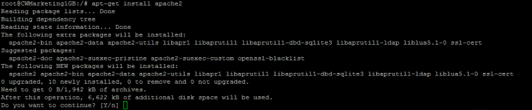
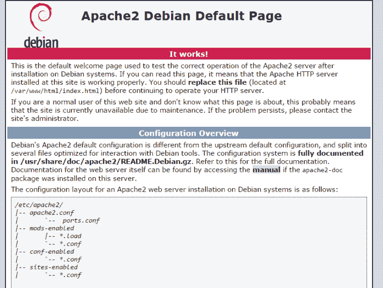
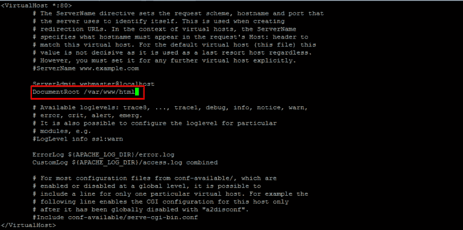
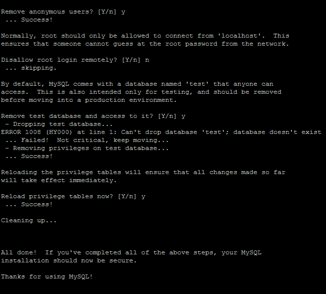
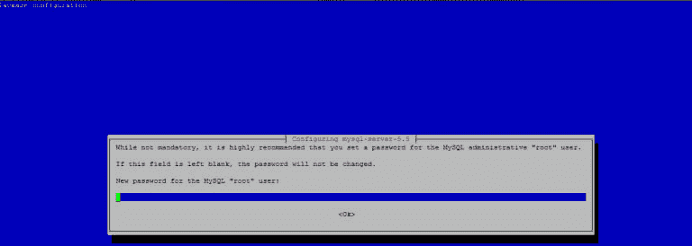
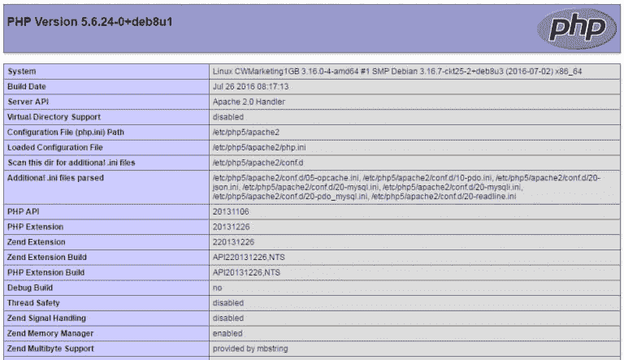

# 在 Debian 服务器上设置 Lamp 堆栈

> 原文：<https://dev.to/_shahroznawaz/setting-up-a-lamp-stack-on-debian-server>

我们现在有许多 web 栈来在不同的操作系统上快速开发 web 应用程序。例如，我们有 wamp、xamp 和 Lamp 栈。所有这些堆栈都包含一些技术。本文的重点是 Lamp stack，它是一个流行的开源 web 平台，被数百万开发人员用来在 Linux 服务器上开发动态 web 应用程序。Lamp 是一组四种开源技术，它们是:

1.  Linux 操作系统
2.  Apache web 服务器
3.  MySQL 关系数据库
4.  PHP 脚本语言

在本教程中，我将在 Debian 服务器上设置 Lamp 堆栈。如果您是一名系统管理员，并且您对如何设置 Lamp stack 感到困惑，那么您可以遵循本教程中的步骤。我假设你有一个空的 Debian 服务器，并且有根权限。

注意:如果你不知道 sysadmin 进程和创建 LAMP 堆栈，你可以使用 Cloudways [**托管 PHP**](https://www.cloudways.com/en/php-cloud-hosting.php)。包含 Lamp 堆栈和 PHP 应用程序的完整服务器将在几分钟内构建完成，您无需担心。

让我们深入研究一下，开始在 Debian 服务器上设置 Lamp stack。

但是首先，您需要通过在终端
中运行以下命令来更新服务器上的所有包

```
$ apt-get update 
```

Enter fullscreen mode Exit fullscreen mode

该命令将更新所有现有的包。您还需要知道服务器的 IP 地址。在终端中运行以下命令，找出您的服务器 IP 地址

```
$ ifconfig eth0 | grep inet | awk '{ print $2 }' 
```

Enter fullscreen mode Exit fullscreen mode

耶！你可以在屏幕上看到你的 IP 地址。记下来。您将在后续安装步骤中需要它。所以忍者！我们准备安装其他分组技术，即 Apache，MySQL 和 PHP。先说阿帕奇。

## 在 Debian 服务器上安装 Apache

Apache 是一个开源的 HTTP 服务器。大约 50%的 web 应用程序运行在 Apache 上，目的是为 web 应用程序提供高质量的配置。您可以通过运行下面的终端命令
在 Debian 上安装 Apache

```
$ apt-get install apache2 
```

Enter fullscreen mode Exit fullscreen mode

当您运行此程序时，您将看到一条要求额外空间的消息。只需键入“y”并按回车键。

[T2】](https://res.cloudinary.com/practicaldev/image/fetch/s--ChEKc-F0--/c_limit%2Cf_auto%2Cfl_progressive%2Cq_auto%2Cw_880/https://www.cloudways.com/blog/wp-content/uploads/image04-32-768x160.png)

安装完成后，在您之前提到的浏览器中运行服务器 IP 地址。

[T2】](https://res.cloudinary.com/practicaldev/image/fetch/s--apoef3Kn--/c_limit%2Cf_auto%2Cfl_progressive%2Cq_auto%2Cw_880/https://www.cloudways.com/blog/wp-content/uploads/image00-49-768x577.png)

我们的第一次安装已经完成。现在，您可以访问您的服务器并在`var/www/html`文件夹中添加文件，但是许多开发人员都熟悉 public_html 文件夹——所以您可能希望将该文件夹更改为`public_html`。您需要编辑 000-default.conf 文件存在于 apache2/sites-enabled 中。通过运行下面的命令
移动到文件夹

```
$ cd /etc/apache2/sites-enabled 
```

Enter fullscreen mode Exit fullscreen mode

接下来，运行带有文件名的 vim 命令，在终端
中查看该文件

```
$ vim 000-default.conf 
```

Enter fullscreen mode Exit fullscreen mode

找到“文档根目录”并按“I”键编辑其路径。移除 html，替换为 public_html。按下 ESC 键，然后键入:wq 以保存终端中的更改。

[T2】](https://res.cloudinary.com/practicaldev/image/fetch/s--Ur5wNEZN--/c_limit%2Cf_auto%2Cfl_progressive%2Cq_auto%2Cw_880/https://www.cloudways.com/blog/wp-content/uploads/image03-37-768x383.png)

我们还需要将文件夹名称从 html 更改为 public_html。为此，移动到文件夹并使用移动命令更改文件夹名称。

```
$ cd /var/www
$ mv html public_html 
```

Enter fullscreen mode Exit fullscreen mode

通过键入以下命令
重新启动您的 web 服务器

```
$ service apache2 restart 
```

Enter fullscreen mode Exit fullscreen mode

所以现在我们已经在 Debian 服务器上安装了 Apache。在浏览器中输入您的 IP 地址并检查它。

## 在 Debian 上安装 MySQL

这个堆栈中的第二个主要安装是 MySQL 关系数据库。要安装 MySQL，请在终端
中运行以下命令

```
$ apt-get install mysql-server 
```

Enter fullscreen mode Exit fullscreen mode

安装完成后，将出现设置 root 密码的提示

输入密码并选择确定。现在，通过键入以下命令
完成安装的剩余部分

```
$ mysql_secure_installation 
```

Enter fullscreen mode Exit fullscreen mode

按回车键。您将被要求输入您刚刚设置的 root 密码。键入密码并按回车键。

-键入“n”以不更改 root 密码，并按 enter
-键入“y”以删除匿名用户，并按 enter
-如果您想禁止 root 远程登录，请键入“n”并按 enter
-现在键入“y”以删除测试表和数据库并按 enter，然后再次键入“y”并按 enter

[T2】](https://res.cloudinary.com/practicaldev/image/fetch/s--WBtQTrhL--/c_limit%2Cf_auto%2Cfl_progressive%2Cq_auto%2Cw_880/https://www.cloudways.com/blog/wp-content/uploads/image05-24.png)

您可能还需要安装您最喜欢的 MySQL GUI 客户端 PHPMyAdmin。

PHPMyAdmin 是一个帮助管理 MySQL 数据库的开源 GUI。让我们首先用 Apache 设置一个 SSL，这样我们的密码就不会以纯文本的形式发送。键入以下命令来安装带有 Apache 的 SSL:

```
$ apt-get install mcrypt 
```

Enter fullscreen mode Exit fullscreen mode

通过 service 命令重新启动 Apache 服务器，并键入以下命令来安装 PHPMyAdmin。

```
$ apt-get install phpmyadmin 
```

Enter fullscreen mode Exit fullscreen mode

在安装过程中，会出现一个提示，询问您正在使用的 web 服务器。因为我们已经安装了 Apache，所以选择 Apache 并按回车键。之后，它会询问根用户密码。

[T2】](https://res.cloudinary.com/practicaldev/image/fetch/s--LxK1UNOU--/c_limit%2Cf_auto%2Cfl_progressive%2Cq_auto%2Cw_880/https://www.cloudways.com/blog/wp-content/uploads/image01-46-768x274.png)

输入密码，然后按回车键。

PHPMyAdmin 将安装在`/usr/share/phpmyadmin`中。我们将在 public_html 文件夹中创建它的符号链接。键入以下命令以路由到 public_html 文件夹并创建一个符号链接:

```
$ cd /var/www/public_html
$ ln -s /usr/share/phpmyadmin 
```

Enter fullscreen mode Exit fullscreen mode

现在键入`ls`来验证符号链接是否已经创建。通过[服务器 ip 地址]/phpmyadmin 在浏览器中打开它。您将看到它已安装。现在让我们保护它。在 PHPMyAdmin 文件夹中使用 vim 创建一个. htaccess 文件，并且只允许您的服务器 IP 访问它。

```
order allow,deny
allow from <your server ip> 
```

Enter fullscreen mode Exit fullscreen mode

## 在 Debian 上安装 PHP

我们在 Linux 上设置了 Apache 和 MySQL。现在下一个也是最后一个栈成员是 PHP 语言写 web 应用。PHP 可以通过运行下面的命令
来安装

```
$ apt-get install php5 php-pear php5-mysql 
```

Enter fullscreen mode Exit fullscreen mode

PHP 安装完成后，通过运行
重启 Apache 服务器

```
$ service apache2 restart 
```

Enter fullscreen mode Exit fullscreen mode

通过键入
移动到您的 public_html 文件夹

```
$ cd /var/www/public_html 
```

Enter fullscreen mode Exit fullscreen mode

通过输入下面的命令
在这个文件夹中创建一个 PHP 文件

```
$ vim index.php 
```

Enter fullscreen mode Exit fullscreen mode

在其中添加以下代码行

```
<?php echo phpinfo();?> 
```

Enter fullscreen mode Exit fullscreen mode

按 ESC 保存文件，然后按:wq。在浏览器中运行你的 IP 地址，你会看到 PHP 信息页面，这意味着服务器上安装了 PHP。

[T2】](https://res.cloudinary.com/practicaldev/image/fetch/s--GFKcNmPR--/c_limit%2Cf_auto%2Cfl_progressive%2Cq_auto%2Cw_880/https://www.cloudways.com/blog/wp-content/uploads/image02-39-768x443.png)

## 最后的话

在本教程中，我们已经成功地在我们的服务器上设置了 Lamp stack，并准备开发应用程序。如果您是 SysAdmin 或服务器端开发人员，您可以按照教程一步一步地轻松设置 LAMP stack。这不是结局。您还可以按照相同的路线图，根据需要进行更多的配置和安装。