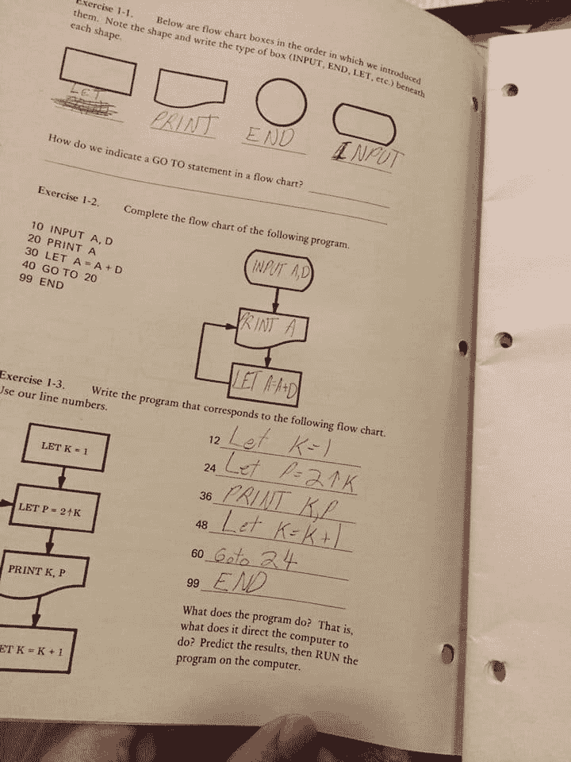

# 嗨，我是杰夫·林赛

> 原文：<https://dev.to/progrium/hi-im-jeff-lindsay>

嗨，大家好，我是杰夫。我经常在网上使用 progrium 这个名字。我住在德克萨斯州的奥斯汀，但我来自旧金山湾区。从那以后我就开始编程了...我不太确定。我找到了一本 80 年代的基础学习手册，那是我 8、9 岁时填写的:

[T2】](https://res.cloudinary.com/practicaldev/image/fetch/s--LVkkcy3y--/c_limit%2Cf_auto%2Cfl_progressive%2Cq_auto%2Cw_880/https://thepracticaldev.s3.amazonaws.com/i/sp8jnwe69fu4slkxi6bw.jpg)

1999 年，当我 14 岁的时候，我开始“专业地”编程，为我父亲在 1994 年创办的虚拟主机公司工作。在那之前，我真的只知道各种形式的 BASIC 和 Visual Basic。很快我就拿起了 PHP。我开始为我的父亲做兼职项目，甚至在我的高中找到一些孩子一起做项目。虽然不多。

当我找到一些当地的局域网聚会时，事情开始有了起色。他们都是像我一样精通技术的孩子，虽然年龄稍大一些。有些人甚至热衷于 PHP 编程。

我开始举办自己的局域网聚会，除了专注于编程和制作东西。在一两次之后，我和我的朋友们开始了一个更大的版本，叫做 SuperHappyDevHouse。实际上，这是事情真正开始的地方。在接下来的 5 年里，我们举办了 50 多场，通常观众有 100-400 人。这本身就是一个完整的故事，但除此之外，这些事件直接激发了脸书的内部黑客马拉松。

作为硅谷最受欢迎的地下科技活动之一的创造者和组织者，我拥有了一个相当大的网络，因此找到自由职业者的工作变得非常容易。更重要的是，SuperHappyDevHouse 相当于我的大学。我甚至无法解释它有多神奇。你可以在那里学习和探索所有的东西，和了不起的人在一起。

不要低估所有其他与会的牛人，但是你有像道格·恩格尔巴特这样的计算远见者，像凯文·罗斯这样的当时“著名”的企业家，以及来自所有热门创业公司的工程师。卡尔·亨德森会炫耀他在 Flickr 幕后所做的有影响力的工作，这将有助于启动后来的 DevOps。布莱德·纽伯格会过来，告诉我们合作的想法。他和“标签之父”克里斯·梅西纳以及其他 DevHouse 的常客发起了合作运动。很多其他的故事。Twitter 的工程师们，当他们为数不多的时候，会来听我在 webhooks 上的第一次灯光演讲。

哦，我创造了 webhooks，并向它传播福音。有趣的故事，下次再说吧。与此相关的是一些已经被遗忘的项目，比如最初的 Localtunnel、RequestBin 和 PubSubHubbub。和一堆未发布的项目，我现在已经开始回来了。

在那里的某个地方，我从 PHP 转向了 Ruby。我承认这与 Ruby on Rails 有关。但最终我转向了 Python，并坚持了很长一段时间。

我们一群开发人员最终在美国宇航局艾姆斯工作，这演变成了一个名为美国宇航局星云的项目。这成为了与 Rackspace 合作的计算方面，后来变成了 OpenStack。

那真是太酷了。所以后来我决定尝试全职工作。但是我在哪里工作呢？我在 Twitter 上发帖说，我正在寻找我的“梦想工作”。Twilio 首席执行官杰夫·劳森回应道。当时他们也只是少数人，所以这让我成为了一名早期的工程师。我最近反思了我在 Twilio 的两年工作，并不奇怪是因为他们的首次公开募股。

到 Twilio 结束时，我对围棋产生了好奇，因为我已经从 Twisted Python 到 Eventlet 再到 Gevent，我真的很兴奋围棋能为像我这样的人提供什么。我想，那时我更多的是一个系统程序员。

我还开始了一个高级容器引擎的原型开发，但是在离开 Twilio 之后，我暂停了这个工作。直到几个月后，当我遇到所罗门·海克斯，他说他们有一个搁置的集装箱引擎原型。所以我开始和他们一起做 Docker。最终他们把公司转向 it，我不想再做全职，所以我做了一些其他项目。

这开始进入我的整个理想基础设施愿景，我不会在这里讨论，但它是我参与 [Flynn](https://flynn.io/) 的一部分，在此之前，一个名为 [Dokku](https://github.com/dokku/dokku) 的项目。Dokku 相当受欢迎，因为它是 Docker 的第一款杀手级应用。在大多数人甚至还不知道 Docker 是什么之前，Dokku 就给了你一台主机 Heroku，它具有极强的可攻击性和可扩展性。本来只有 100 行的 Bash。

在这一点上，我很喜欢 Go，也很喜欢因为 Docker 而发生的云基础设施小革命。我决定和一个在兰聚会时认识的朋友一起开一家咨询公司。我们称之为滑翔机实验室。

通过 Glider Labs，我们帮助许多公司在生产中部署 Docker，用极其简单、健壮的构建模块填充了许多缺失的部分。其中一些在 Docker 世界中仍然非常受欢迎，比如 [Registrator](https://github.com/gliderlabs/registrator) 和 [Logspout](https://github.com/gliderlabs/logspout) 。我们还发现了 Alpine Linux，并将其引入 Docker 生态系统。

这一切都很好，除了我对未来有一个越来越清晰的愿景，但它不断受到风投资助的初创公司的阻挠，用这么多话说就是做错了。这也是一场建立开源和做咨询的斗争。最终我的搭档离开了。

我休息了一段时间，重新评估我想做的事情。我又开始做游戏和音乐了。是的，我从高中就开始做游戏了。大约在超级快乐屋成立的时候，我遇到了德里克·于，我们一起经营虎源。因此，我把《我的世界》和 maaaaaany 以及其他独立游戏的来源放在了论坛上。我一只脚还在游戏世界里，特别是这新一代的独立游戏，每年都参加 GDC，并运行像 TIGJam 这样的游戏。我甚至是《T2》独立游戏电影《T3》的执行制片人。；)

我的假期在 18 个月前结束了。在 Twilio IPO 之后，我决定继续发展 Glider Labs，但要重启它。我有一个模糊的想法，我试着给巨石命名为[巨石](https://www.youtube.com/watch?v=xFG7xqCVFjw)，我一直在滑翔机实验室中沿着这条路走下去。我将不得不在另一篇文章中讨论这个问题，但简而言之，我在 Go 中编写了许多开源构建模块。

与此同时，我偶尔会制作音乐并努力完成我的第一张专辑《T2》。我应该注意到，这个专辑项目本应该花两个月的时间，但是已经一年多了。幸运的是，我即将发布一个演示版本。

还有，我在做游戏。就在几天前，我完成了我的第一个完整游戏项目的测试版。

这就是我。我希望用这个网站来记录我的工作，寻求帮助，分享想法等等。这似乎是一个好地方，我可以进入我的软件工作的一些本质细节。

很快再聊！