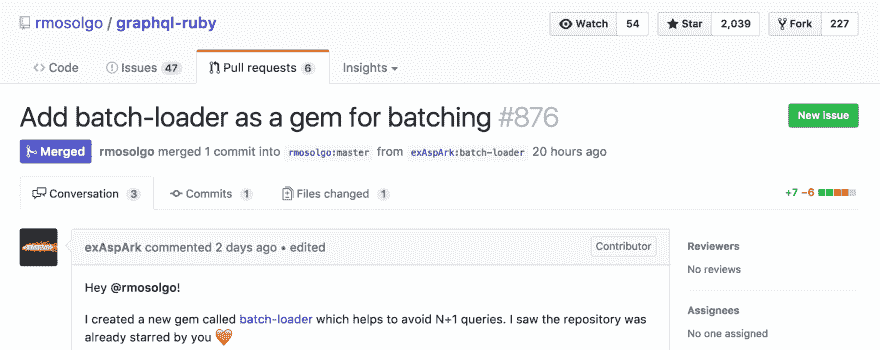

# 批处理——每个 ruby 爱好者都应该知道的解决 N+1 查询的强大方法

> 原文:[https://dev.to/exaspark/batching——一个解决每一个 rubyist 都应该知道的 n1 个问题的强大方法](https://dev.to/exaspark/batching--a-powerful-way-to-solve-n1-queries-every-rubyist-should-know)

在这篇文章中，我将告诉你批处理作为一种帮助避免 N+1 查询的技术，现有的经过实战检验的工具，如 Haskell Haxl 和 JavaScript DataLoader，以及如何在任何 Ruby 程序中使用类似的方法。

## 什么是 N+1 查询？

首先，让我们看看什么是 N+1 查询，以及为什么这样称呼它们。想象一下，我们有 2 个 SQL 表:`users`和`posts`。如果我们使用 ActiveRecord 模型运行以下代码:

```
posts = Post.where(id: [1, 2, 3])
# SELECT * FROM posts WHERE id IN (1, 2, 3)

users = posts.map { |post| post.user }
# SELECT * FROM users WHERE id = 1
# SELECT * FROM users WHERE id = 2
# SELECT * FROM users WHERE id = 3 
```

这使得`1`查询选择所有帖子，然后`N`查询选择每个帖子的用户。因此，代码产生 1+N 个查询。因为改变加数的顺序不会改变总和，所以通常称之为 N+1 查询。

## 人们通常如何解决 N+1 个查询？

通常，在 Ruby 世界中有两种流行的方法来解决 N+1 查询的问题:

*   **急切加载模型中的数据**

```
posts = Post.where(id: [1, 2, 3]).includes(:user)
# SELECT * FROM posts WHERE id IN (1, 2, 3)
# SELECT * FROM users WHERE id IN (1, 2, 3)

users = posts.map { |post| post.user } 
```

它预先加载了指定的关联，这使得它很容易使用。但是 ORM 并不总是能帮上忙。例如，当我们需要从不同的数据源(如另一个数据库)加载数据时。

*   **预加载数据并通过参数传递数据**

```
class Post < ApplicationRecord
  def rating(like_count, angry_count)
    like_count * 2 - angry_count
  end
end

posts = Post.where(id: [1, 2, 3])
# SELECT * FROM posts WHERE id IN (1, 2, 3)

post_emoticons = Emoticon.where(post_id: posts.map(&:id))

like_count_by_post_id = post_emoticons.like.group(:post_id).count
angry_count_by_post_id = post_emoticons.angry.group(:post_id).count
# SELECT COUNT(*) FROM emoticons WHERE name = 'like' AND post_id IN (1, 2, 3) GROUP BY post_id
# SELECT COUNT(*) FROM emoticons WHERE name = 'angry' AND post_id IN (1, 2, 3) GROUP BY post_id

posts.map do |post|
  post.rating(
    like_count_by_post_id[post.id],
    angry_count_by_post_id[post.id]
  )
end 
```

这种方法非常灵活，当使用`includes`的简单方法不能工作时，它可以工作。这也可能更节省内存——在我们上面的例子中，我们没有加载所有表情来计算每个帖子的评分。相反，我们的数据库可以完成所有困难的工作，并返回每个帖子的计数，该计数作为参数传递。然而，通过参数传递数据可能很复杂，尤其是当下面有几层时(例如，加载表情符号，通过用户传递帖子)。

这两种方法都可以帮助我们避免 N+1 查询。但问题是，我们应该在顶层预先知道需要预加载哪些数据。我们每次都会预加载它，即使没有必要。例如，对于 GraphQL，这些方法不起作用，因为对于 GraphQL，我们无法预测用户将在查询中询问哪些字段。**有没有其他方法可以避免 N+1 查询？对，这叫分批。**

## 什么是批处理？

[T2】](https://res.cloudinary.com/practicaldev/image/fetch/s--1g54j1am--/c_limit%2Cf_auto%2Cfl_progressive%2Cq_auto%2Cw_880/https://cdn-images-1.medium.com/max/8000/1%2Ag3WjikcHIkon-5lAjCKQRw.jpeg)

批处理并不是解决 N+1 查询的新方法。脸书[在 2014 年发布了 Haskel Haxl](https://code.facebook.com/posts/302060973291128/open-sourcing-haxl-a-library-for-haskell/) 库，但是这项技术很久以前就已经被使用了。它使用了诸如单子、应用和函子等概念。我不会解释这些想法，因为它值得另发一篇文章(你有兴趣学习更多关于 Ruby 函数式编程的知识吗？).

批处理的思想也在其他编程语言中实现。最著名的库之一是 [JavaScript DataLoader](https://github.com/facebook/dataloader) ，它随着 GraphQL 的兴起而变得非常流行。这里有一个关于源代码的[视频](https://www.youtube.com/watch?v=OQTnXNCDywA)，作者是脸书的工程师李·拜伦。代码非常简单，只有 300 行。

**批处理的一般步骤如下**:

1.  传递一个项目以加载到应用程序的任何部分。
2.  批量加载和缓存传递项的值。
3.  获取该项传递到的加载值。

使用这种技术的主要优点是批处理是独立的。它允许在需要时随时随地加载数据。

下面是一个使用 JavaScript 数据加载器的基本示例:

```
var batch = (userIds) => ...;
var loader = new DataLoader(userIds => batch(userIds));

// “load” schedules a job to dispatch a queue with
// Node.js “process.nextTick” and returns a promise

loader.load(userId1).then(user1 => console.log(user1));
loader.load(userId2).then(user2 => console.log(user2));
loader.load(userId3).then(user3 => console.log(user3)); 
```

首先，我们创建一个带有函数的`loader`，该函数接受所有收集到的条目进行加载(`userIds`)。这些条目被传递给我们的`batch`函数，该函数一次加载所有用户。然后我们可以调用`loader.load`函数，该函数返回一个带有加载值的承诺(`user`)。好吧，但是露比怎么办？

## 在 Ruby 中批处理

在 Universe，我们每月都有黑客马拉松，每个人都可以自由尝试任何想法和技术，如以太坊、仙丹、渐进式网络应用等。在我的上一次黑客马拉松中，我赢得了一次提名，我学习了现有的技术来避免 GraphQL 中的 N+1 查询，并构建了一个工具来将 GraphQL 查询转换为 MongoDB 聚合管道以进行批处理。查看我们的[上一篇文章](https://engineering.universe.com/mongo-aggregations-in-5-minutes-b8e1d9c274bb)，它描述了如何使用聚合管道来“连接”不同的集合、过滤它们、序列化等等。

同时，当[我们迁移到 GraphQL](https://engineering.universe.com/why-were-betting-on-graphql-233ddf1a0779) 时，我们仍然支持我们的 RESTful APIs。通常，当我们继续扩展平台时，N+1 DB 查询和 HTTP 请求是导致应用程序瓶颈的主要问题。

这就是为什么我们决定创建一个新工具，它将允许我们在现有的 RESTful APIs 和 GraphQL 中解决 N+1 查询。每个 Ruby 开发者都能理解和使用的简单工具。它叫做 [BatchLoader](https://github.com/exAspArk/batch-loader) 。

[](img/27aaf31d8bae749fc27c34c718031bbf.png)T2】](https://res.cloudinary.com/practicaldev/image/fetch/s--Pcy9fewu--/c_limit%2Cf_auto%2Cfl_progressive%2Cq_auto%2Cw_880/https://cdn-images-1.medium.com/max/3752/1%2Abb8bLX7LscBiAyfzQrKRMQ.png)

### **懒惰**

```
class Post < ApplicationRecord
  belongs_to :user

  def user_lazy
    # something cool with BatchLoader
  end
end

posts = Post.where(id: [1, 2, 3])
# SELECT * FROM posts WHERE id IN (1, 2, 3)

users_lazy = posts.map { |post| post.user_lazy }

BatchLoader.sync!(users_lazy)
# SELECT * FROM users WHERE id IN (1, 2, 3) 
```

BatchLoader 并不试图模仿其他具有异步特性的编程语言的实现。所以，它不使用任何额外的原语，如承诺。没有理由在 Ruby 中使用它们，除非你使用的是 EventMachine 之类的东西。

相反，它使用了 Ruby 标准库中使用的“懒惰对象”的思想。例如，“惰性数组”——它们允许对元素进行操作，并在必要时最终解析它们:

```
range = 1..Float::INFINITY

values_lazy = range.lazy.map { |i| i * i }.take(10)

values_lazy.force
# => [1, 4, 9, 16, 25, 36, 49, 64, 81, 100] 
```

如您所见，上面的两个代码块具有相同的模式:

1.  收集懒惰的对象。
2.  在最后解决它们。

### **配料**

现在让我们仔细看看`Post#user_lazy`，它返回一个懒惰的`BatchLoader`实例:

```
# app/models/post.rb
def user_lazy
  BatchLoader.for(user_id).batch do |user_ids|
    User.where(id: user_ids)
  end
end 
```

`BatchLoader.for`接受一个项目(`user_id`)，该项目应被收集并用于以后的批处理。然后我们调用`batch`方法，在这里我们传递一个将使用所有收集的项目的块(`user_ids`)。在这个块中，我们对我们的项目执行一个批处理查询(`User.where`)。

JavaScript DataLoader 隐式映射传递的项和加载的值。但是它依赖于这两个约束:

*   传递项数组(`user_ids`)的长度必须与加载值数组(`users`)的长度相同。这通常意味着我们必须在数组中为缺失的值添加`nil`。
*   传递项数组中的每个索引必须对应于加载值数组中的相同索引。这通常意味着我们应该对加载的值进行排序。

在这种情况下，BatchLoader 提供了一个`load`方法，可以简单地调用该方法将传递的项目(`user_id`)映射到加载的值(`user`):

```
# app/models/post.rb
def user_lazy
  BatchLoader.for(user_id).batch do |user_ids, batch_loader|
    User.where(id: user_ids).each { |u| batch_loader.load(u.id, u) }
  end
end 
```

### **RESTful API 示例**

现在假设我们有一个常规的 Rails 应用程序，它有 N+1 个 HTTP 请求:

```
# app/models/post.rb
class Post < ApplicationRecord
  def rating
    HttpClient.request(:get, "https://example.com/ratings/#{id}")
  end
end

# app/controllers/posts_controller.rb
class PostsController < ApplicationController
  def index
    posts = Post.limit(10)
    serialized_posts = posts.map do |post| 
      {id: post.id, rating: post.rating} # <== N+1 HTTP requests
      end

    render json: serialized_posts
  end
end 
```

我们可以用一个名为 [parallel](https://github.com/grosser/parallel) 的 gem 通过在线程中同时执行所有 HTTP 请求来批处理请求。幸运的是，在我们的例子中，当线程遇到阻塞 I/O-HTTP 请求时，MRI 会释放 GIL(全局解释器锁)。

```
# app/models/post.rb
def rating_lazy
  BatchLoader.for(post).batch do |posts, batch_loader|
    Parallel.each(posts, in_threads: 10) do |post|
      batch_loader.load(post, post.rating)
    end
  end
end

# app/controllers/posts_controller.rb
class PostsController < ApplicationController
  def index
    posts = Post.limit(10)
    serialized_posts = posts.map do |post| 
      {id: post.id, rating: post.lazy_rating}
    end

    render json: BatchLoader.sync!(serialized_posts)
  end
end 
```

### **【线程安全】**

只有在`HttpClient`是线程安全的情况下，线程中并发 HTTP 请求的例子才会起作用。`BatchLoader#load`是开箱即用的线程安全，所以它不需要任何额外的依赖。

### **GraphQL 示例**

批处理对 GraphQL 特别有用。使用诸如预先加载数据这样的技术来避免 N+1 查询可能非常复杂，因为用户可以在查询中要求任何可用的字段。让我们来看看简单的 [graphql-ruby](https://github.com/rmosolgo/graphql-ruby) 模式示例:

```
Schema = GraphQL::Schema.define do
  query QueryType
end

QueryType = GraphQL::ObjectType.define do
  name "Query"
  field :posts, !types[PostType], resolve: ->(obj, args, ctx) do
    Post.all
  end
end

PostType = GraphQL::ObjectType.define do
  name "Post"
  field :user, !UserType, resolve: ->(post, args, ctx) do
    post.user # <== N+1 queries
  end
end

UserType = GraphQL::ObjectType.define do
  name "User"
  field :name, !types.String
end 
```

如果我们想执行如下的简单查询，我们将为每个`post.user`获得 N+1 个查询:

```
query = "
{
  posts {
    user {
      name
    }
  }
}
"
Schema.execute(query)
# SELECT * FROM posts WHERE id IN (1, 2, 3)
# SELECT * FROM users WHERE id = 1
# SELECT * FROM users WHERE id = 2
# SELECT * FROM users WHERE id = 3 
```

为了避免这个问题，我们所要做的就是将解析器改为使用 BatchLoader:

```
PostType = GraphQL::ObjectType.define do
  name "Post"
  field :user, !UserType, resolve: ->(post, args, ctx) do
    BatchLoader.for(post.user_id).batch do |ids, batch_loader|
      User.where(id: ids).each { |u| batch_loader.load(u.id, u) }
    end
  end
end 
```

并用内置的`lazy_resolve`方法设置 GraphQL:

```
Schema = GraphQL::Schema.define do
  query QueryType
  lazy_resolve BatchLoader, :sync
end 
```

就是这样。GraphQL `lazy_resolve`基本上会在字段上调用一个`resolve` lambda。如果它返回一个懒惰的`BatchLoader`的实例，它将稍后调用`BatchLoader#sync`来自动获取实际加载的值。

[T2】](https://res.cloudinary.com/practicaldev/image/fetch/s--5LVzOSjz--/c_limit%2Cf_auto%2Cfl_progressive%2Cq_auto%2Cw_880/https://cdn-images-1.medium.com/max/4112/1%2A6PVehyXwF0__uUHqTE-q8w.png)

### **缓存**

BatchLoader 还提供了开箱即用的缓存机制。因此，它不会对已经加载的值进行查询。例如:

```
def user_lazy(id)
  BatchLoader.for(id).batch do |ids, batch_loader|
    User.where(id: ids).each { |u| batch_loader.load(u.id, u) }
  end
end

user_lazy(1)      # no request
# => <#BatchLoader>

user_lazy(1).sync # SELECT * FROM users WHERE id IN (1)
# => <#User>

user_lazy(1).sync # no request
# => <#User> 
```

## 结论

总的来说，批处理是一种避免 N+1 查询的强大技术。我相信每个 Ruby 开发者都应该了解它，而不仅仅是使用 GraphQL 或其他编程语言的人。它将允许您解耦应用程序的不相关部分，并在需要的时候随时随地批量加载数据，而不会牺牲性能。

在 Universe，我们通过共享相同的代码，在 RESTful API 和 GraphQL 的生产中使用 BatchLoader。要了解更多信息，请查看[自述文件](https://github.com/exAspArk/batch-loader/blob/master/README.md)和只有 150 行的源代码。

*最初发表于[媒体](https://engineering.universe.com/batching-a-powerful-way-to-solve-n-1-queries-every-rubyist-should-know-24e20c6e7b94)。*