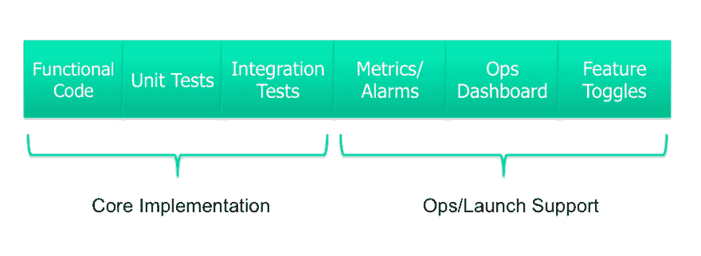

# 计划所有的事情！

> 原文:[https://dev.to/jlhcoder/plan-all-of-the-things](https://dev.to/jlhcoder/plan-all-of-the-things)

*这篇文章最初发表在[我的博客](http://jlhood.com/planning-all-of-the-things/)T3 上*

在我之前的帖子[我们在学校学到的坏习惯](https://dev.to/jlhcoder/bad-habits-we-learn-in-school)中，我提到了一个事实，即软件是出了名的难以准确估计，当我们错了时，我们往往会低估错误(有时会低估 4-6 倍！).这是一个很大的问题，因为严重的低估是走向后期软件的第一步，这会让你走上软件开发的恶性循环的道路。因此，学习如何提高我们评估软件的准确性是一项非常重要的技能。

在这篇文章中，我想解决低估的一个常见根本原因:在规划特性或项目时，简单地忘记考虑关键工作。这听起来很傻，但它发生的次数远比你想象的要多。

## 特征级规划

首先，我们从功能级规划开始。当计划一个特性的实现时，明确地考虑所有可能的方面是很重要的。以下是我对一个特征的剖析图:

[T2】](https://res.cloudinary.com/practicaldev/image/fetch/s--pBQWbqIo--/c_limit%2Cf_auto%2Cfl_progressive%2Cq_auto%2Cw_880/http://jlhood.cimg/feature-anatomy.png)

根据其规模和范围，并非每个功能都需要上述所有部分。然而，我看到团队反复忘记计划上面列出的许多质量度量。随着时间的推移，这种情况会越来越严重，导致质量和技术债务方面的巨大差距，这对于企业来说是一个很难回头解决的问题。因此，预先规划质量可以省去您以后的许多麻烦。

让我们更详细地看看这些作品。

### 核心实现

特性的第一个主要类别是核心实现，由功能代码、单元测试和集成测试组成。

功能代码是实现所需功能行为的代码。单元测试孤立地测试您的功能代码。依赖性被模拟，允许覆盖几个边缘情况。单元测试是你的第一道质量防线，不应该被跳过，因为它们很容易编写。一些团队推动使用[测试驱动开发](https://en.wikipedia.org/wiki/Test-driven_development) (TDD)，这确保单元测试总是被包括在内。我发现有些开发人员真的很抗拒 TDD，所以我回避了这个论点，而是制定了一个规则，即功能代码和单元测试必须总是一起包含在同一个提交中。你可以先写功能代码，然后再写单元测试，或者反过来。只要他们都在，我真的不在乎。

集成测试是更复杂的测试，在这种测试中，您需要根据其他系统依赖项来测试您的功能代码。集成测试有很多种，比如功能测试、系统测试、验收测试等等。在这篇文章中，我只是使用术语集成测试来涵盖所有这些类型的测试。与单元测试不同，随着功能代码的变化，在同一个提交中编写集成测试通常是不实际的。因此，在规划特性时，忘记考虑编写集成测试所花费的时间是一件令人尴尬的事情。

最近几年，我成为了行为驱动开发(BDD)的粉丝，这是解决这个问题的一种方法，至少在验收(面向用户)测试层面是这样。BDD 特性文件是记录特性整体预期行为的好方法，并确保您计划构建的是业务所期望的。由于您在需求澄清过程中预先编写了特性文件，因此更容易记住计划在以后作为自动化验收测试来实际实现全部或部分特性文件。

### 运营/启动支持

功能的第二个主要类别是运营和启动支持，由指标、警报、运营仪表板和功能切换组成。

度量让您可以看到您的代码在生产中是如何工作的。我把它作为一个特性的一个单独的组成部分，但是一般来说，当我构建一个特性的时候，我会试着去考虑并把它插入到功能代码中。自动警报用于通知您代码的行为是否超出了正常的错误或延迟阈值。Ops 仪表板通过显示关键指标，让您对系统的运行状况一目了然。对于主要功能的发布，拥有一个专门的关键指标仪表板来确保功能正常工作是非常有用的。较小的功能可能不需要专用的仪表板，但是您应该考虑该功能是否保证向任何现有的仪表板添加新的图表。

[特性切换](https://martinfowler.com/bliki/FeatureToggle.html)是一种从特性发布中分离代码变更的方法。这些是嵌入在您的功能代码中的标志，允许您悄悄地将您的功能部署到生产中。然后，当您准备好实际启用该特性时，您可以打开该特性(通常通过更新数据库中的切换值)。特性切换是强大的，因为它们允许您几乎即时地启动您的特性，同样重要的是，如果出现问题，可以取消启动您的特性，这比将新代码部署到您的生产系统要快得多。由于您必须编写功能代码，以便在关闭切换时以一种方式工作，在打开切换时以另一种方式工作，因此考虑这对于您的功能是否有必要并提前做好计划是很重要的。

### 别忘了！

我发现有一件事可以帮助规划一个特性，那就是在 backlog 整理/sprint 规划期间使用上述项目的文字清单，以确保您考虑哪些是必要的，然后明确地为它们创建故事/任务。类似地，我见过在他们的 sprint/issue 跟踪系统中利用模板的团队在他们的故事模板中包含这些项目。

## 项目级规划

就像我之前说的，随着时间的推移，经常忘记特性级的东西会导致巨大的质量问题。然而，在项目级别的规划中也可能发生类似的失误。在较大的公司里，项目级的计划对于确定在某个日期之前交付一个项目大概需要多少人来说是非常重要的。这些类型的估计远不准确，因为当试图估计一个需要几个月时间的项目时，会涉及大量的模糊性。总的策略是尽可能多地列举出你能想到的大的部分，然后给它们一个粗略的尺寸。

对项目的这些大部分进行头脑风暴是另一个忘记考虑需要完成的主要工作的机会。在这种情况下，我发现团队通常很好地考虑了组成他们项目的核心面向客户功能的特性。容易被遗忘的是非面向客户的功能。以下是我经常看到的被遗忘的例子:

1.  灾难规划——对于具有高可用性需求的项目，进行一次灾难规划练习是很重要的，在该练习中，您将遍历您的体系结构中的关键依赖项和暴露项，并集体讨论缓解措施。这些缓解措施通常涉及构建一些工具集来帮助灾难恢复场景。
2.  数据备份/恢复-为您的数据存储库设置备份/恢复程序很容易忘记，但是如果您需要它们而它们不在那里，这将非常痛苦...
3.  管理工具——您可能需要为产品所有者或客户服务人员构建特殊的工具，用于处理问题场景(处理退货/退款、禁止/阻止行为不端/欺诈用户等)。

同样，根据项目的规模和范围，上述内容并不总是必需的，但是当您需要它们并意识到您完全忘记了考虑它们，并且现在必须利用您现有的资源来填补空白时，这是非常令人沮丧的。

* * *

由于许多原因，准确的软件评估是困难的，但是希望这些提示可以帮助你通过至少考虑特性和项目的所有方面来对抗低估。你对我的清单还有什么要补充的吗？欢迎在评论中分享！