# Flexbox 的简单备忘单

> 原文:[https://dev . to/a _ reiterer/a-simple-cheat sheet-for-flexbox-76b](https://dev.to/a_reiterer/a-simple-cheatsheet-for-flexbox-76b)

*如何使用柔性框布局的概述(简称:flexbox)*

过去几天，我一直在思考如何正确使用 flexbox。也许你能理解我所说的，理解它到底是如何工作的并不容易，或者为什么一些 CSS 规则在某些情况下不像预期的那样运行。

对我来说，以下文章对理解 flexbox 如何工作以及使用它时需要考虑的事项有很大帮助:

*   [了解 Flexbox:你需要知道的一切](https://medium.freecodecamp.org/understanding-flexbox-everything-you-need-to-know-b4013d4dc9af) ( [奥汉斯·艾曼纽](https://medium.com/@ohansemmanuel)
*   我从阅读 flexbox 说明书中学到的 11 件事 ( [大卫·吉尔伯森](https://medium.com/@david.gilbertson))

在这篇文章中，我只想总结一下我认为重要的知识。所以请记住，这不是对所有可能的 CSS 规则和场景的详尽描述。

### 什么是 flexbox？

> Flexbox 是一种布局模式，设计用于布局更复杂的应用程序和网页。——[w3.org](https://www.w3.org/TR/css-flexbox-1/#intro)

当使用 flexbox 布局模型时，我们区分两个主要元素:flex 容器和 flex 项目。

flex 容器是 flex 项目的父元素。您可以在该元素上设置`display: flex`或`display: inline-flex`来激活 flex 布局模式。

在概述 flex 容器或 flex 项目的细节之前，我想先谈谈 flex box 布局模型的术语，我发现它在开始时有些令人困惑。以下是我在 [flexbox 规范](https://www.w3.org/TR/css-flexbox-1/#box-model)中发现的内容:

[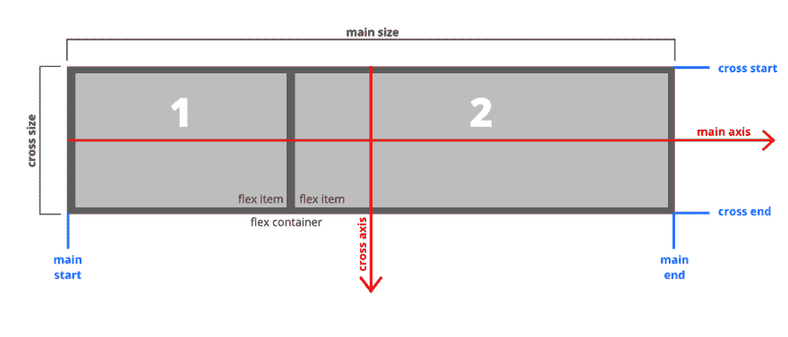](https://res.cloudinary.com/practicaldev/image/fetch/s--l35cM_5y--/c_limit%2Cf_auto%2Cfl_progressive%2Cq_auto%2Cw_880/https://cdn-images-1.medium.com/max/1250/1%2AdH2D2U0yOf4a2Z_OYxRsKg.png) 

<figcaption>应用于“行”伸缩容器的各种方向、大小和定位术语的说明。</figcaption>

首先，在 flexbox 布局中没有*横向*或*纵向*。相反，我们通过一个*主轴*和一个*横轴*来定位自己。

柔性项目总是沿着**主轴**布置。在上图中，您可以看到，*行* flex 容器的主轴从 flex 容器的左端( ***主起点*** )到右端( ***主终点*** )。

> 基本上，一个列伸缩容器只是一个向右倾斜 90 度的行伸缩容器。

[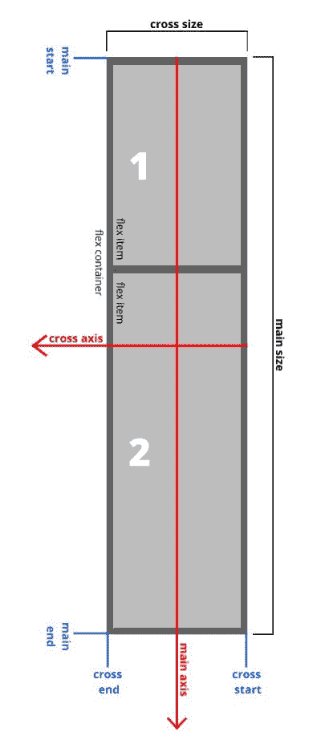](https://res.cloudinary.com/practicaldev/image/fetch/s--MQ1mX_a9--/c_limit%2Cf_auto%2Cfl_progressive%2Cq_auto%2Cw_880/https://cdn-images-1.medium.com/max/750/1%2A_G8vYJ2P_l1CeRETSx43NQ.jpeg) 

<figcaption>应用于“列”伸缩容器的各种方向、大小和定位术语的说明。</figcaption>

对于一个*列* flex 容器，事情看起来会有点不同。

如左图所示，一旦使用`flex-direction: column`，主轴*的*指向屏幕底部，而横轴*的*从 flex 容器的右端指向左端。所以基本上整个画面向右倾斜了 90 度。

这在很大程度上帮助了我在列 flex 容器中定位自己，因为 CSS 属性在 *row_and _column* flex 容器之间改变了它们的有效方向。

这就是我们现在所需要的。在接下来的部分中，我将描述适用于 flex 容器和 flex 项目的不同 CSS 规则。

### Flex 容器 CSS 规则

让我们从 flex 容器上使用的 CSS 规则开始。我附上了一些截图，并把各自的 CSS 设置放入图片的标题中。

#### **伸缩方向**

此规则确定弹性项目是在行中对齐还是在列中对齐。此外，还可以选择以相反的顺序排列它们，即从主端到主端。

[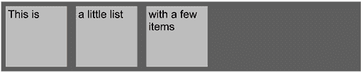](https://res.cloudinary.com/practicaldev/image/fetch/s--48tGTI0E--/c_limit%2Cf_auto%2Cfl_progressive%2Cq_auto%2Cw_880/https://cdn-images-1.medium.com/max/1000/1%2AamKZ2KxBD-1huE56oIHHiQ.png) 

<figcaption>伸缩方向:行；(默认)</figcaption>

[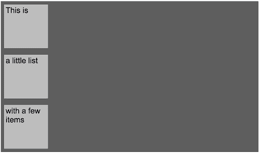](https://res.cloudinary.com/practicaldev/image/fetch/s--Ay1FZ0Vp--/c_limit%2Cf_auto%2Cfl_progressive%2Cq_auto%2Cw_880/https://cdn-images-1.medium.com/max/1000/1%2ALSl2HQ6FcCfqwVTIpHsiHA.png) 

<figcaption>伸缩方向:列；</figcaption>

#### 柔性包装

如果您在一行中添加更多的弹性项目，您将会遇到没有足够空间容纳更多项目的情况。由于默认情况下弹性项目会收缩(请参阅:弹性-收缩弹性项目部分)，所以添加的项目越多，项目就会变得越小。通过使用 flex-wrap，您可以控制这种行为，如果项目应该保持在同一行(这是默认行为；`flex-wrap: nowrap;`)或换到下一行(`flex-wrap: wrap;`或`flex-wrap: wrap-reverse;`)

[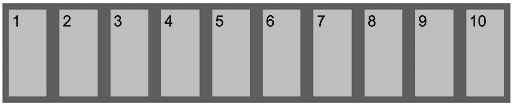](https://res.cloudinary.com/practicaldev/image/fetch/s--apYdokGu--/c_limit%2Cf_auto%2Cfl_progressive%2Cq_auto%2Cw_880/https://cdn-images-1.medium.com/max/1000/1%2AQ2Qc5OiAJrWhgWF6BHYIVQ.png)T3】flex-wrap:nowrap；应用于“行”柔性容器

[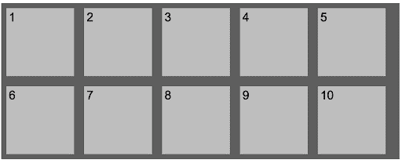](https://res.cloudinary.com/practicaldev/image/fetch/s--iCYKyppB--/c_limit%2Cf_auto%2Cfl_progressive%2Cq_auto%2Cw_880/https://cdn-images-1.medium.com/max/1000/1%2A4mpb0H6Dn2UK5uLFD9_rHg.png)

<figcaption>flex-wrap:wrap；</figcaption>

#### 伸缩流

这是我今天给你们展示的第一个速记。您可以将 CSS 规则 *flex-direction* 和 *flex-wrap* 组合在一个 CSS 规则中。以下列表不言自明:

*   `flex-flow: row wrap;`
*   `flex-flow: row wrap-reverse;`
*   `flex-flow: column wrap;`
*   `flex-flow: column wrap-reverse;`

#### 自圆其说-内容

要在主轴旁边放置伸缩项，您可以使用 *justify-content* :

[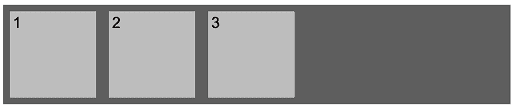](https://res.cloudinary.com/practicaldev/image/fetch/s--fmBe--qv--/c_limit%2Cf_auto%2Cfl_progressive%2Cq_auto%2Cw_880/https://cdn-images-1.medium.com/max/1000/1%2AGoU8Z5Jk0VZvgchlAoFZgQ.png)

<figcaption>justify-content:flex-start；(默认行为)</figcaption>

<figcaption>justify-content:flex-end；</figcaption>

 

<figcaption>自圆其说——内容:居中；</figcaption>

[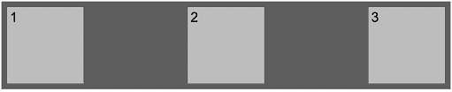](https://res.cloudinary.com/practicaldev/image/fetch/s--l0u0bkVf--/c_limit%2Cf_auto%2Cfl_progressive%2Cq_auto%2Cw_880/https://cdn-images-1.medium.com/max/1000/1%2Axn5xnkoUNMtXcfsIs92JNw.png)

<figcaption>justify-content:space-between；</figcaption>

[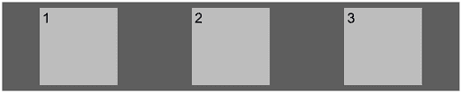](https://res.cloudinary.com/practicaldev/image/fetch/s--4wCKwf7O--/c_limit%2Cf_auto%2Cfl_progressive%2Cq_auto%2Cw_880/https://cdn-images-1.medium.com/max/1000/1%2ADSt6QAuAXPl4EpPKGpR7Gw.png) 

<figcaption>自圆其说——内容；空间环绕；</figcaption>

#### 对齐-项目

既然您已经学习了 justify-content 来沿着主轴布局项目，这是一个更简单的方法。 *align-items* 用于将当前行上的**沿横轴** **对齐。**

[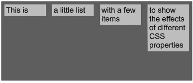](https://res.cloudinary.com/practicaldev/image/fetch/s--8-kGEsn9--/c_limit%2Cf_auto%2Cfl_progressive%2Cq_auto%2Cw_880/https://cdn-images-1.medium.com/max/1000/1%2A_1XwY-xQJU6v82fKGueYwg.png)T3】align-items:flex-start；(默认行为)

[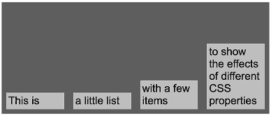](https://res.cloudinary.com/practicaldev/image/fetch/s--34kmyi2a--/c_limit%2Cf_auto%2Cfl_progressive%2Cq_auto%2Cw_880/https://cdn-images-1.medium.com/max/1000/1%2AMQyjqpuA3eIMUJEgUuecCg.png)

<figcaption>align-items:flex-end；</figcaption>

[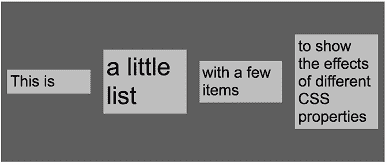](https://res.cloudinary.com/practicaldev/image/fetch/s--W50LS5nS--/c_limit%2Cf_auto%2Cfl_progressive%2Cq_auto%2Cw_880/https://cdn-images-1.medium.com/max/1000/1%2Ai9K2YX_EBDtxxmHP0FT2sg.png) 

<figcaption>对齐-项目:居中；</figcaption>

[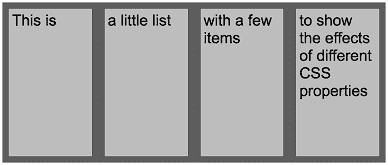](https://res.cloudinary.com/practicaldev/image/fetch/s--mslvk9Er--/c_limit%2Cf_auto%2Cfl_progressive%2Cq_auto%2Cw_880/https://cdn-images-1.medium.com/max/1000/1%2Ad3yXuFZNDYal8GDv_NFUJA.png) 

<figcaption>对齐-项目:拉伸；</figcaption>

[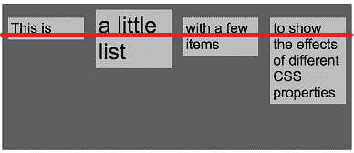](https://res.cloudinary.com/practicaldev/image/fetch/s--sj2jhqH6--/c_limit%2Cf_auto%2Cfl_progressive%2Cq_auto%2Cw_880/https://cdn-images-1.medium.com/max/1000/1%2ADqQEdsCtWhfjWseSz8P_xQ.png) 

<figcaption>对齐-项目:基线；</figcaption>

如你所见， *align-items* 还允许拉伸项目以使用当前行的可用空间，以及`align-items: baseline;`将项目沿其第一行文本的底部对齐。

但是，如果您不想在一行内对齐项目，而是在 flex-container 的可用空间内对齐整批项目，该怎么办呢？这就是 *align-content* 的用途。

#### 对齐-内容

让我们看看如何在我们的 flex 容器中对齐整个 *flex-items* :

[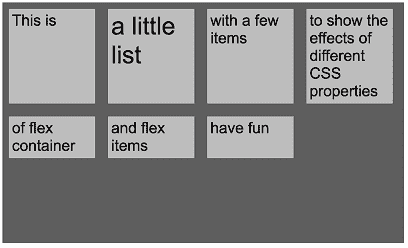](https://res.cloudinary.com/practicaldev/image/fetch/s--zLRXrtmj--/c_limit%2Cf_auto%2Cfl_progressive%2Cq_auto%2Cw_880/https://cdn-images-1.medium.com/max/1000/1%2AaK6Y1x6s6tmNY68wjgEA9w.png)T3】align-content:flex-start；(默认行为)

[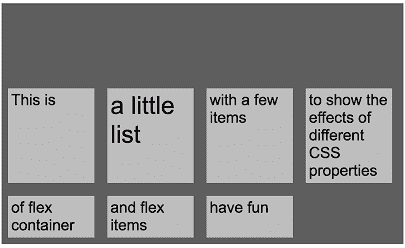](https://res.cloudinary.com/practicaldev/image/fetch/s--8-Buicf9--/c_limit%2Cf_auto%2Cfl_progressive%2Cq_auto%2Cw_880/https://cdn-images-1.medium.com/max/1000/1%2AN3qM1kVTqPyqB6yWzcqPFg.png)

<figcaption>align-content:flex-end；</figcaption>

[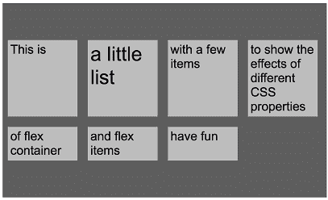](https://res.cloudinary.com/practicaldev/image/fetch/s--LakXxMyy--/c_limit%2Cf_auto%2Cfl_progressive%2Cq_auto%2Cw_880/https://cdn-images-1.medium.com/max/1000/1%2AhX2F70c0MdZf2Xhof6E37g.png) 

<figcaption>对齐-内容:居中；</figcaption>

[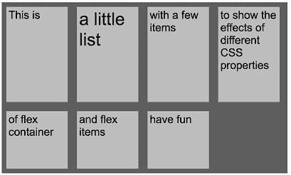](https://res.cloudinary.com/practicaldev/image/fetch/s--pK7g-kCC--/c_limit%2Cf_auto%2Cfl_progressive%2Cq_auto%2Cw_880/https://cdn-images-1.medium.com/max/1000/1%2AiTMcb2NayM5YdDhWYCSEsA.png)

<figcaption>align-content；拉伸；</figcaption>

这是一个非常简短的概述，介绍了您可以使用 flex-container CSS 规则做什么。在下一节中，我将向您展示如何调整弹性项目的行为。

### 灵活项目 CSS 规则

在上一节中，您学习了如何一次对齐所有 flex 项目——在它们的行内或在其 flex 容器的可用空间内。现在是时候看看这三个规则的`flex-grow`、`flex-shrink`、`flex-basis`和`flex`的简写了。

#### 伸缩增长

定义项目是否可以使用主轴上的可用空间。默认值为 0，这意味着弹性项目不会自动增长。在下面的图片中，您可以看到 flex-grow 对“行”和“列”容器中的 flex 项目的影响。

 

<figcaption>伸缩增长:0；(默认行为)在“行”容器中</figcaption>

[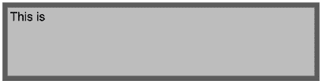](https://res.cloudinary.com/practicaldev/image/fetch/s--7kgC9a9z--/c_limit%2Cf_auto%2Cfl_progressive%2Cq_auto%2Cw_880/https://cdn-images-1.medium.com/max/1000/1%2AlSrfcRMbjsWOzZEmPIG-MQ.png)

<figcaption>flex-grow:1；在一个“行”容器中</figcaption>

[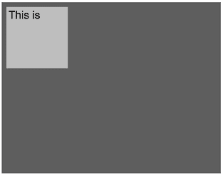](https://res.cloudinary.com/practicaldev/image/fetch/s--F2qeU98W--/c_limit%2Cf_auto%2Cfl_progressive%2Cq_auto%2Cw_880/https://cdn-images-1.medium.com/max/1000/1%2AX0P2Z46934QObV7nskeGCQ.png) 

<figcaption>伸缩增长:0；(默认行为)在“列”容器中</figcaption>

[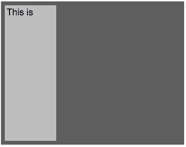](https://res.cloudinary.com/practicaldev/image/fetch/s--UsSN1bqg--/c_limit%2Cf_auto%2Cfl_progressive%2Cq_auto%2Cw_880/https://cdn-images-1.medium.com/max/1000/1%2AAk6iZ36xtiO98loOmWUEfA.png)

<figcaption>flex-grow:1；在一个“列”容器中</figcaption>

使用 *flex-grow* 还可以让某些项目比其他项目增长更多。

例子:我们有三个项目。其中两个将 flex-grow 设置为 1，而其中一个将 flex-grow 设置为 2。

[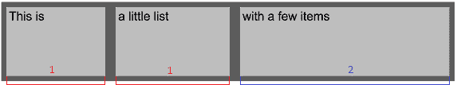T2】](https://res.cloudinary.com/practicaldev/image/fetch/s--rV8kIVlz--/c_limit%2Cf_auto%2Cfl_progressive%2Cq_auto%2Cw_880/https://cdn-images-1.medium.com/max/1000/1%2AWFNQhpqX_7GPh0SD4kJ3Tg.png)

这里发生了什么？首先，将一行的所有 flex-grow 值相加，结果总共为 4，表示 100%的可用空间。

则根据其伸缩设置与所述行的所有伸缩设置之和的关系大小来调整每个项目的大小。根据该计算，前两项获得 25%的可用空间，第三项获得 50%。请注意，我没有考虑图像中设置的填充和边距。

#### **伸缩**

默认情况下，收缩规则设置为 1。这意味着一旦调整了窗口的大小，flex 项将在必要时收缩。可能的值为 0 和 1。

**举例:**下图的 flex 项宽度为 500px。当 flex-shrink 设置为默认值 1 时，调整窗口大小意味着项目将缩小到小于 500 像素的宽度。当将 flex-shrink 设置为 0 时，项目将不会收缩，并且会超出窗口大小，并且会出现滚动条。

[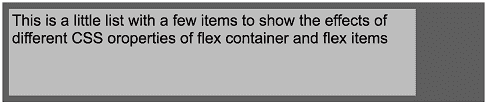](https://res.cloudinary.com/practicaldev/image/fetch/s--JriUYPb5--/c_limit%2Cf_auto%2Cfl_progressive%2Cq_auto%2Cw_880/https://cdn-images-1.medium.com/max/1000/1%2Ay-xL7-dpnWZs7oGwbpUUIQ.png) 

<figcaption>该项的宽度为 500px。(旁注:flex-grow 已关闭)</figcaption>

[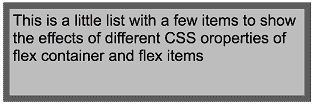](https://res.cloudinary.com/practicaldev/image/fetch/s--HsKjrTzC--/c_limit%2Cf_auto%2Cfl_progressive%2Cq_auto%2Cw_880/https://cdn-images-1.medium.com/max/1000/1%2AyCL3eUCd-KC-emVKyPigJA.png) 

<figcaption>打开伸缩调整窗口大小的同时也会调整项目的大小。</figcaption>

<figcaption>

 

<figcaption>伸缩关闭。项目超出窗口(此图省略滚动条)</figcaption>

</figcaption>

#### 弹性基础

伸缩基准定义了伸缩项目的初始*主尺寸*。在将可用空间分配给 flex-grow 或通过 flex-shrink 调整项目大小之前，将评估此设置。

> 在将可用空间分配给弹性系数之前，弹性项目的初始主要大小。——[w3.org](https://www.w3.org/TR/css-flexbox-1/#flex-basis-property)

flex-basis 接受以`px || em || rem`为单位的长度或百分比，以及`auto`。

如果 flex-basis 设置为`auto`，将根据内容大小计算宽度。因此，flex 项目的内容增加得越多，它就变得越大。

一旦将固定大小设置为 flex-basis，项目的内容将会调整以适合项目。

[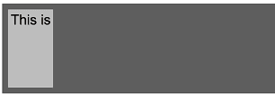](https://res.cloudinary.com/practicaldev/image/fetch/s--tRAlbGzR--/c_limit%2Cf_auto%2Cfl_progressive%2Cq_auto%2Cw_880/https://cdn-images-1.medium.com/max/1000/1%2AjiePFv0eUl_DqRjCiP7Q2Q.png) 

<figcaption>flex-basis:自动；</figcaption>

 

<figcaption>flex-basis:自动；更多内容</figcaption>

<figcaption>flex-basis:100px；</figcaption>

#### flex 简写

因为一次性设置以上所有规则更方便，所以有一种简化方法:默认设置是`flex: 0 1 auto;`

用这个简写法，你可以用第一个**、 ***和第二个**定义 ***伸缩*** ，用第三个**定义 ***伸缩*** 。*********

也可以省略最后一个参数:`flex: 0 1`，它将 flex-basis 默认为零 _。_

下图显示了一些如何使用 flex 速记来排列 flex 项目的示例。

**flex: 0 1 auto(默认行为)**

项目大小由其内容定义。

 

<figcaption>flex: 0 1 自动；(默认行为)</figcaption>

**flex: 1 1 auto**

[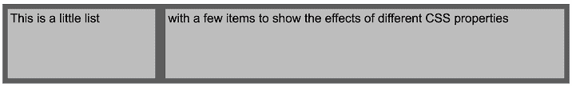](https://res.cloudinary.com/practicaldev/image/fetch/s--FQPSVTbs--/c_limit%2Cf_auto%2Cfl_progressive%2Cq_auto%2Cw_880/https://cdn-images-1.medium.com/max/1000/1%2AdtjRc5zRutFWrHSsvSMugQ.png) 

<figcaption>flex: 1 1 自动；</figcaption>

**flex: 0 0 auto**

这与上一节“伸缩”中的例子相同。缩小已关闭，这将导致项目溢出窗口大小。

[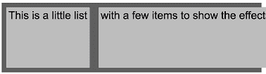](https://res.cloudinary.com/practicaldev/image/fetch/s--84MOIuOi--/c_limit%2Cf_auto%2Cfl_progressive%2Cq_auto%2Cw_880/https://cdn-images-1.medium.com/max/1000/1%2AC0yZxme_Vj0dIZXUtR1GYA.png) 

<figcaption>flex: 0 0 自动；</figcaption>

**flex-items 的相对大小**

要使用我在“flex-grow”一节中描述的“相对”大小调整技术，您必须将 flex-basis 设置为零。在下一张图中，第一个项目有`flex: 2 1 0;`，而第二个项目有`flex: 1 1 0;`

 

<figcaption>第一个项目得到可用大小的 2/3，而第二个项目得到 1/3</figcaption>

### 结论

那篇文章比计划的要长一些，但是最后，我希望你喜欢这本书。如果你想温习知识，这篇文章可以作为查找不同 CSS 规则的便利指南，因为有些东西你可能不会完全记住。

正如我在开始时所说的，这并不意味着可以应用的场景和规则的详尽列表，如果您对这方面的细节感兴趣，我建议您阅读我在文章开始时提到的文章，以及规范的部分内容(如果您不想阅读全部内容)

*   [了解 Flexbox:你需要知道的一切](https://medium.freecodecamp.org/understanding-flexbox-everything-you-need-to-know-b4013d4dc9af) ( [奥汉斯·艾曼纽](https://medium.com/@ohansemmanuel)
*   我从阅读 flexbox 说明书中学到的 11 件事 ( [大卫·吉尔伯森](https://medium.com/@david.gilbertson))
*   [CSS 灵活框布局模块一级](https://www.w3.org/TR/css-flexbox-1/)

起初，我打算把它作为一个方便的备忘单，但是后来我发现了一个非常好的由[克里斯·科伊尔](https://medium.com/@chriscoyier)写的备忘单，我想和你分享一下:

*   [Flexbox 完整指南](https://css-tricks.com/snippets/css/a-guide-to-flexbox/)

### 行动号召

你想学习更多关于 web 开发的知识并成为一名更好的开发人员吗？好消息！订阅我的[每周简讯](www.andreasreiterer.at/weekly-webdev-newsletter/)，我会将关于 web 开发的高质量内容发送到你的收件箱。

*帖子[一张 Flexbox](http://www.andreasreiterer.at/web-development/flexbox-cheatsheet/) 的简单备忘单首先出现在[我的博客](http://www.andreasreiterer.at)上。*