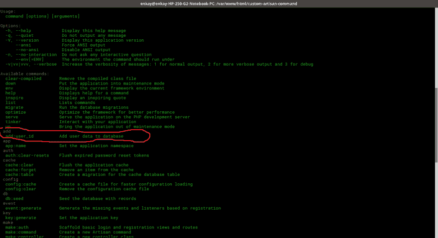

# 在 Laravel 5.4 中创建自定义 Artisan 命令

> 原文:[https://dev . to/enkaypeter/making-a-custom-laravel-artisan-command-in-laravel-54](https://dev.to/enkaypeter/making-a-custom-laravel-artisan-command-in-laravel-54)

laravel 有几个默认的 artisan 命令，常见的有`php artisan serve`、`php artisan migrate`、`php artisan make:migration`等等。

### 简介

应用程序越成长，自动化某些任务就变得越重要。如果您是初级开发人员或实习生，无法访问服务器来运行某些命令，如运行迁移，那么您必须让 devops 工程师来帮助您运行迁移(在您的代码已经被审查并合并到 live branch tho 之后)。自动化这些任务将对您和 devops 工程师大有帮助。也就是说，我们将在接下来的步骤中创建一个定制的 laravel artisan 命令来将数据添加到 DB(数据库)中。

### 步骤:

第一步:安装 Laravel。
第二步:运行`php artisan make:command userData`。
第三步:在`app/Console/Command`中为你的命令创建`signature`和`description`。
第四步:在`handle()`函数中添加你的命令逻辑。

#### 第一步

我假设你已经安装了 Laravel。

#### 第二步

在您的“项目目录”中打开您的终端并运行下面的命令
`php artisan make:command userData`。

这个命令在`app/Console/Commands`目录中创建一个名为`userData.php`的文件，看起来像:

```
<?php
namespace App\Console\Commands;

use Illuminate\Console\Command;

class userData extends Command
{
    /**
     * The name and signature of the console command.
     *
     * @var string
     */
    protected $signature = 'command:name';

    /**
     * The console command description.
     *
     * @var string
     */
    protected $description = 'Command description';

    /**
     * Create a new command instance.
     *
     * @return void
     */
    public function __construct()
    {
        parent::__construct();
    }

    /**
     * Execute the console command.
     *
     * @return mixed
     */
    public function handle()
    {
        //
    }
} 
```

<svg width="20px" height="20px" viewBox="0 0 24 24" class="highlight-action crayons-icon highlight-action--fullscreen-on"><title>Enter fullscreen mode</title></svg> <svg width="20px" height="20px" viewBox="0 0 24 24" class="highlight-action crayons-icon highlight-action--fullscreen-off"><title>Exit fullscreen mode</title></svg>

#### 第三步

现在让我们创建实际的命令，我们将把`$signature`设置为`add:user_id`和`$description = Add user data to database`。

如果你在你的终端上运行`php artisan list`，你会发现我们的命令还不存在，因为它还没有被注册。为了注册这个命令，我们将导航到`app/Console`并打开`Kernel.php`文件，然后我们将把这行代码`Commands\userData::class`添加到`$commands`数组定义中。应该是这样的:

```
<?php

namespace App\Console;

use Illuminate\Console\Scheduling\Schedule;
use Illuminate\Foundation\Console\Kernel as ConsoleKernel;

class Kernel extends ConsoleKernel
{
    /**
     * The Artisan commands provided by your application.
     *
     * @var array
     */
    protected $commands = [
        Commands\userData::class,
    ];

    /**
     * Define the application's command schedule.
     *
     * @param  \Illuminate\Console\Scheduling\Schedule  $schedule
     * @return void
     */
    protected function schedule(Schedule $schedule)
    {
        // $schedule->command('inspire')
        //          ->hourly();
    }

    /**
     * Register the Closure based commands for the application.
     *
     * @return void
     */
    protected function commands()
    {
        require base_path('routes/console.php');
    }
} 
```

<svg width="20px" height="20px" viewBox="0 0 24 24" class="highlight-action crayons-icon highlight-action--fullscreen-on"><title>Enter fullscreen mode</title></svg> <svg width="20px" height="20px" viewBox="0 0 24 24" class="highlight-action crayons-icon highlight-action--fullscreen-off"><title>Exit fullscreen mode</title></svg>

所以现在如果我们运行`php artisan list`，我们应该会看到我们的命令签名和描述:
[](https://res.cloudinary.com/practicaldev/image/fetch/s--JTWSiH9G--/c_limit%2Cf_auto%2Cfl_progressive%2Cq_auto%2Cw_880/https://thepracticaldev.s3.amazonaws.com/i/ag785l940di7hppmwtfm.png)

#### 第四步

现在，为了赋予我们的`php artisan add:user_data`命令生命，我将假设您有一个包含`name`、`email`、`password`列的用户数据库。如果没有，跑`php artisan migrate`就没事了。接下来的事情是将我们的 csv 文件转换成一个数组，并将其添加到数据库中，如:

```
<?php

namespace App\Console\Commands;

use Illuminate\Console\Command;
use App\User;
class userData extends Command
{
    /**
     * The name and signature of the console command.
     *
     * @var string
     */
    protected $signature = 'add:user_data';

    /**
     * The console command description.
     *
     * @var string
     */
    protected $description = 'Add user data to database';

    /**
     * Create a new command instance.
     *
     * @return void
     */
    public function __construct()
    {
        parent::__construct();
    }

    /**
     * Execute the console command.
     *
     * @return mixed
     */
    public function handle(){
        $file = public_path('user_data.csv');
        $delimiter = ',';       
            if(!file_exists($file) || !is_readable($file))
                return false;

            $header = null;
            $data = array();

            if (($handle = fopen($file,'r')) !== false){
                while (($row = fgetcsv($handle, 1000, $delimiter)) !==false){
                    if (!$header)
                        $header = $row;
                    else
                        $data[] = array_combine($header, $row);
                }
                fclose($handle);
            }

            $meta_descArr = $data;
            for ($i = 0; $i < count($meta_descArr); $i ++){
                User::firstOrCreate($meta_descArr[$i]);
            }
            echo "Users data added"."\n";
    }
} 
```

<svg width="20px" height="20px" viewBox="0 0 24 24" class="highlight-action crayons-icon highlight-action--fullscreen-on"><title>Enter fullscreen mode</title></svg> <svg width="20px" height="20px" viewBox="0 0 24 24" class="highlight-action crayons-icon highlight-action--fullscreen-off"><title>Exit fullscreen mode</title></svg>

现在我们一直在等待的时刻，运行`php aritsan add:user_data`。

如果你得到这个回应`Users data added`。能给我一辆 Air five 吗！！？。
[](https://res.cloudinary.com/practicaldev/image/fetch/s--EAfVlxtV--/c_limit%2Cf_auto%2Cfl_progressive%2Cq_auto%2Cw_880/https://cdn-images-1.medium.com/max/800/0%2A0dx_EQZzIPtDClPI.)

### 结论

在不到 20 分钟的时间里，我们已经学会了如何在 laravel 5.4 中创建一个定制的 artisan 命令，这里有一个[源代码](https://github.com/enkaypeter/custom-artisan-command)的链接。这只是你可以用自定义 artisan 命令做的许多很酷的事情之一。您可以创建接受输入的命令。如果你想吸引那个漂亮的 devops 工程师，每次你想在服务器上运行 artisan 命令时，你都得去调试他，这将是非常有用的。你可以做一个聊天机器人，从这里得到输入，然后直接发送到你的邮箱，你回复，她在终端上看到回复。嗯（表示踌躇等）...我想这是改天的话题。就像一个智者曾经说过的`We are gods, Think it, and it shall come alive`。