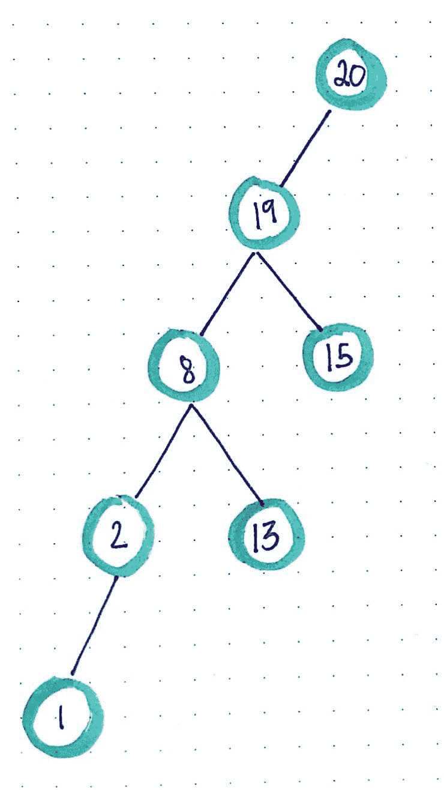
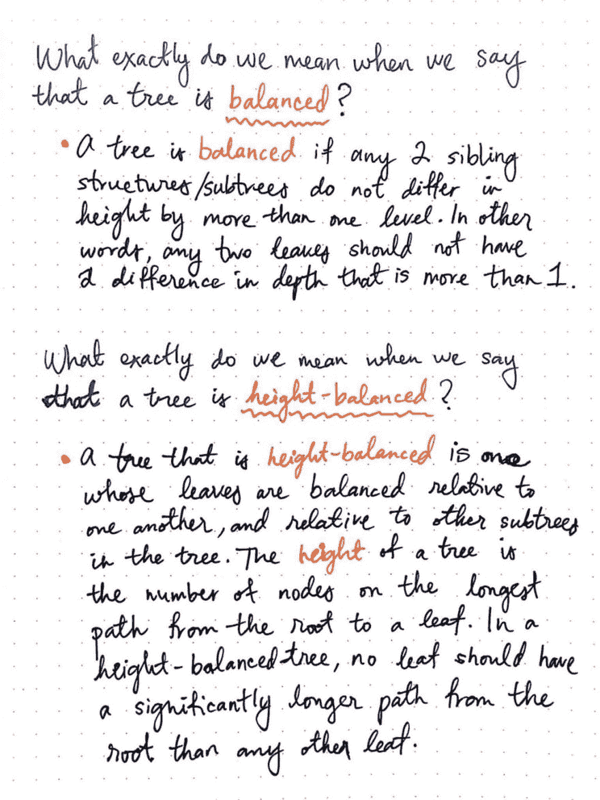
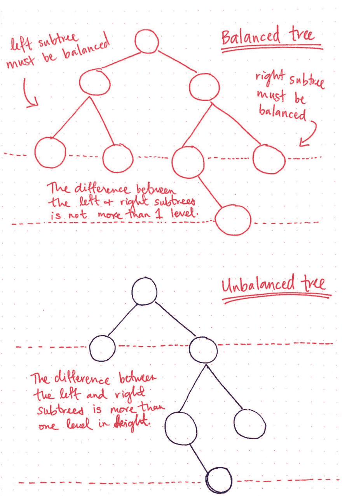
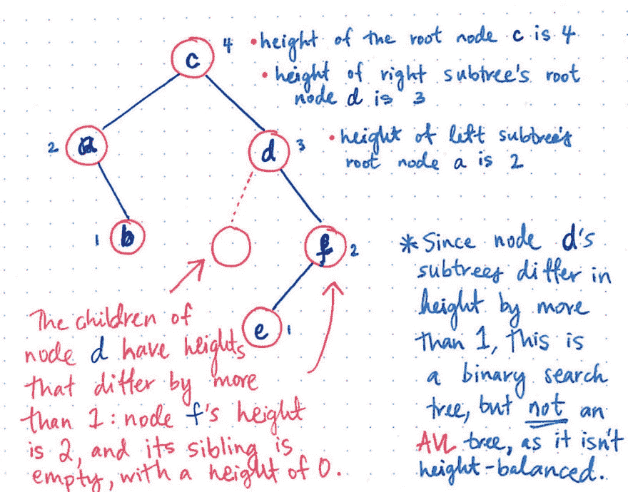
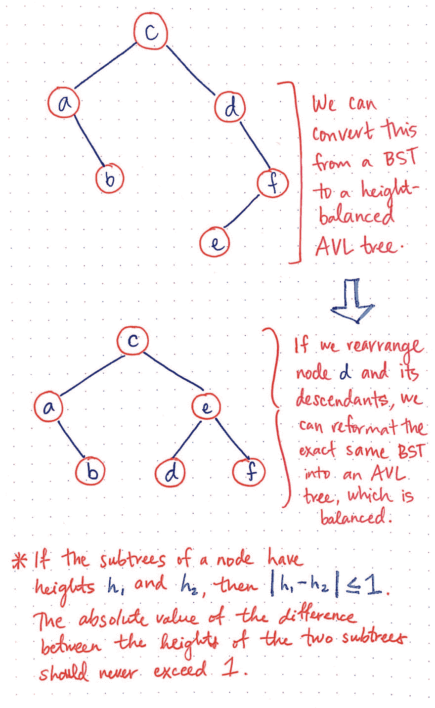
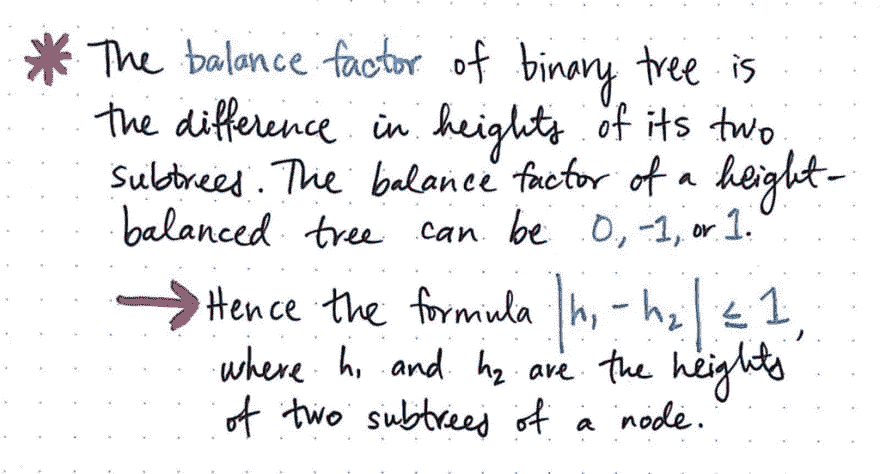
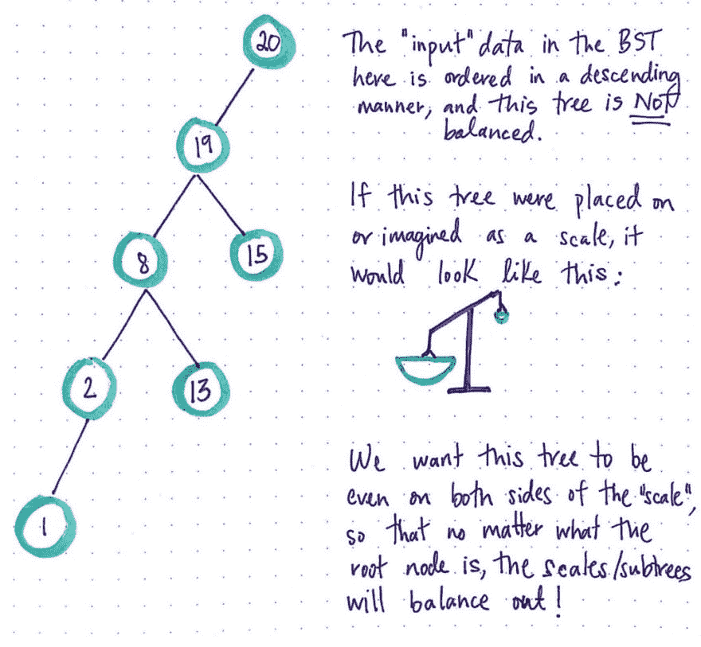
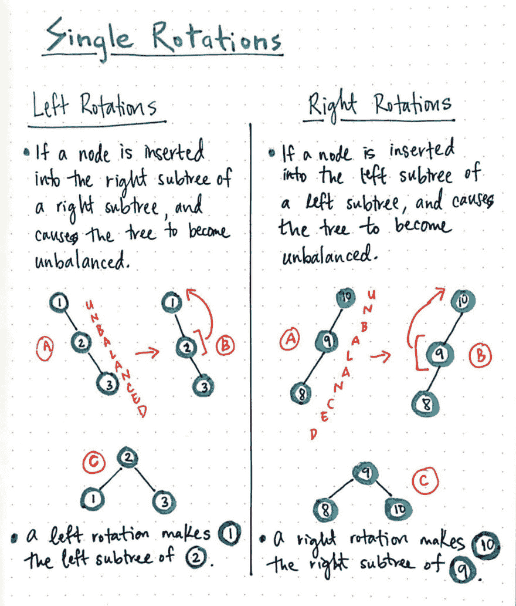
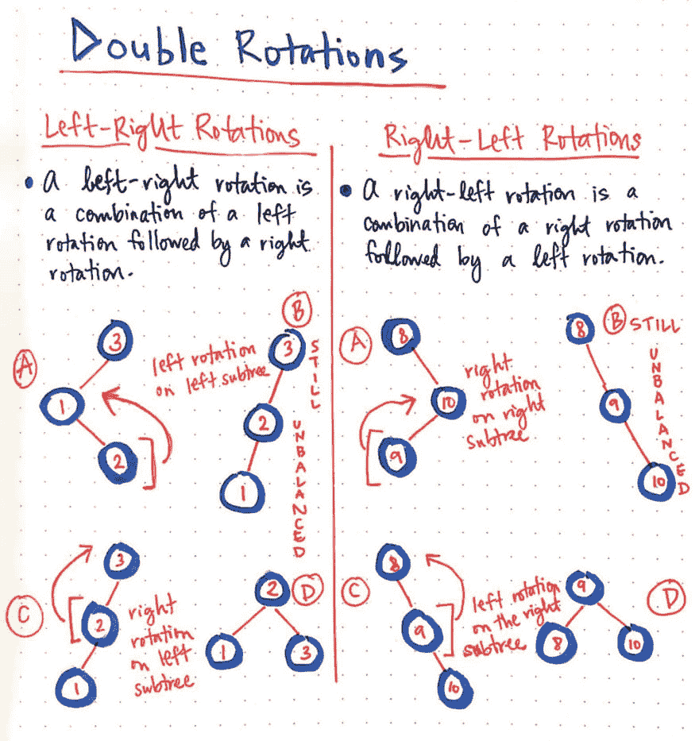

# 小 AVL 树可以

> 原文：<https://dev.to/vaidehijoshi/the-little-avl-tree-that-could>

随着我对计算机科学了解的越来越多，我越来越相信我在这个领域最喜欢的事情是，所有的东西都是建立在更小的部件上的，它们可以一起工作。正如我们在本系列课程中学到的，这适用于数据结构和算法。[队列](https://dev.to/vaidehijoshi/to-queue-or-not-to-queue)和[栈](https://dev.to/vaidehijoshi/stacks-and-overflows)建立在[链表](https://dev.to/vaidehijoshi/whats-a-linked-list-anyway)的基础上。堆建立在更简单的树结构上。树是在[图和图论](https://dev.to/vaidehijoshi/a-gentle-introduction-to-graph-theory)的基础上构建的。

但事实证明，这也适用于计算机科学的历史。如果我们开始查看计算历史中不同结构、算法和概念的年表，我们会开始注意到最近的发现和创造是对我们已经了解的结构的调整和调整。

现在，虽然我不是历史学家，但这让我得出结论，即使是计算和计算机科学领域的最新“发明”，也是“发明于”已经存在的概念。换句话说，它们是建立在小得多的碎片上的想法；这些想法是拼凑起来的，建立在该领域其他人先前创造的想法的基础上。

也许这种模式的最好例子是高度平衡树的概念。高度平衡树背后的想法实际上只是树和二分搜索法树背后更基础的[想法的延伸，我们](https://dev.to/vaidehijoshi/how-to-not-be-stumped-by-trees)[在这个系列的前面已经了解了](https://dev.to/vaidehijoshi/leaf-it-up-to-binary-trees)。它建立在那些核心数据结构之上，以便创建全新的结构！我们将会看到高度平衡树概念的最早版本。事实上，我们将了解第一棵被发明的高度平衡树:***AVL 树*** 。

### 打造智能植物树

事实证明，AVL 树背后的历史就隐藏在它的名字中。AVL 树是由乔治·阿德尔森-维尔斯基和叶夫根尼·兰迪斯两位苏联发明家发明的(并随后以他们的名字命名)。这些结构是相当新的创造；阿德尔森-维尔斯基和兰迪斯在 1962 年首次介绍了他们背后的想法，他们在一篇论文中合著并发表了题为“信息组织的算法”。

AVL 树背后的想法比乍看起来要简单。然而，为了理解这些结构背后的想法，首先理解它们究竟为什么被发明是很重要的！

我们知道 AVL 树是基于标准树结构的基础，所以让我们暂时回到基础。当我们第一次学习树和二分搜索法树的时候，[我们简单地学习了](https://dev.to/vaidehijoshi/how-to-not-be-stumped-by-trees)关于*平衡*树的概念。我们会记住，有些树可以平衡，而有些树可以不平衡。

不平衡树的一个很好的例子是，所有数据要么大于根节点，要么小于根节点。

<figure> 

<figcaption>一棵不平衡的树</figcaption>

</figure>

在这里所示的树中，添加到这个二叉查找树的所有子节点的值都小于根节点 20。然而，这个特定的树仍然是不平衡的，因为树的一侧——在这种情况下，较大的二叉树的左子树——填充有数据/节点，而另一侧，即右子树，是空的。

不平衡树的问题是:二叉树变得不平衡的那一刻，它就失去了效率。基于我们已经知道的关于二分搜索法树的一切，我们知道它们非常强大，因为它们的对数运行时间，这正是它们如此快速和高效的原因。

如果你需要刷新，二分搜索法树，在最好的情况下，运行在 *O(log n)* 时间内，这意味着即使当一棵树增长时，在树中搜索一个特定的节点仍然非常快，因为在每一层，我们在搜索时都截掉了树的一半。这是异人树*的对数*。

这就是问题所在:BST 的对数性质只适用于并且只有在平衡的情况下才能保持。以我们之前看到的不平衡树为例，根节点为 20。假设我们需要从树中找到节点 1。因为 1 是树的最深层次的节点，并且因为没有合适的子树来搜索，所以我们不再“减少”每个层次的搜索时间。相反，当我们实际上找到我们正在寻找的那个节点时，我们实际上必须查看非平衡树中的几乎每一个节点。所以，我们不能在对数时间内搜索，而是在线性时间内搜索。

这看起来很糟糕，对吧？当然，我们肯定不是唯一这样想的人。事实上，我敢肯定这是大约 55 年前阿德尔森-维尔斯基和兰蒂斯对自己说的原话——当然是用俄语说的！为了让 BST 结构真正对我们有用，它们需要在两边/子树上保持平衡。

这个需求的问题是，我们永远无法确定我们的数据看起来会是什么样子。换句话说，我们不知道我们的二分搜索法树最终是否会平衡，因为我们的数据均匀分布在根节点两侧的可能性微乎其微。

相反，我们真正想要的是一种结构，它能让我们始终确信 BST 将是平衡的，甚至在它的两侧。这是阿德尔森-维尔斯基和兰迪斯的创作占据前台和中心舞台的地方。AVL 树是一个自平衡二叉查找树，这意味着每当结构增加时，它会重新排列自己以达到高度平衡。

<figure> 

<figcaption>我们说一棵树是平衡的是什么意思？</figcaption>

</figure>

如果任意两个兄弟子树的高度相差不超过一级，则二叉查找树是平衡的。换句话说，任何两片叶子的深度差都不应该超过一层。我们将记住，每个二叉查找树都递归地包含子树，而子树又包含子树。为了使 BST 真正平衡，它的两个最外层父子树必须平衡，结构中的每个内部子树也应该平衡。

好吧，那么“高度平衡”的树是怎么回事？嗯，树的高度是从根节点到叶子的最长路径上的节点数。根据这个定义，高度平衡的树是这样的树，它的叶子相对于彼此以及相对于更大的树中的其他子树是平衡的。

> 记住什么是高度平衡的树的一个简单方法是这条黄金法则:在高度平衡的树中，没有一片叶子从根节点开始的路径比树上的任何其他叶子都长。

例如，下图中显示的两棵树乍一看非常相似。然而，第一个是平衡的，而第二个则不是。

<figure> 

<figcaption>平衡与不平衡树</figcaption>

</figure>

在第一棵树中，左右子树之间的差异不超过一级。左侧子树的节点延伸到第二层，而右侧子树的节点延伸到第三层。

如果我们将其与底部的树进行比较，我们可以看到一个直接的区别:底部树的子树在高度上相差不止一级。底部树的左子树只延伸到第一层，而它的右子树延伸到第三层。

还记得我们高度平衡树的黄金法则吗？

没有一片叶子从根节点开始的路径比树上的其他叶子长得多。

在顶部(平衡的)树中，最长的路径只比它的比较兄弟子树上的其他节点长一个节点/深一级。但是在底部(不平衡的)树中，最长的路径比它的兄弟子树上的另一个节点深两个节点/两个级别。

### 称量 AVL 的天平

现在我们已经理解了 AVL 树背后的规则和原因，让我们看看我们是否能在需要的时候区分和转换 AVL 树！

在下面画的树中，有 6 个节点(包括根)和一个左右子树。

<figure> 

<figcaption>一个 BST(不是 AVL 树！)</figcaption>

</figure>

整个树的高度是 4，因为从根到最长的叶子 e 的路径是 4 个节点。左子树的高度是 2，因为左子树的根节点 a 只有一片叶子，这意味着从 a 到 b 的最长路径是 2 个节点。类似地，右边子树的高度是 3，因为从右边子树的根 d 到 e 的最长路径是 3 个节点。

节点 d 的子节点的高度相差不止一级；节点 f 的高度是 2，而它的兄弟节点 d 的左子树是空的，高度是 0。由于节点 d 的子树在高度上相差不止一层，这当然不是 AVL 树，因为它违反了 AVL 的一个关键规则。

好的，所以这是一棵 AVL 树。但是，我们知道 AVL 树会非常有用，对吗？那么，如何才能把这棵树变成 AVL 树呢？

好吧，既然我们知道 AVL 树的规则，并且我们知道如何使它成为高度平衡的树，我们可以潜在地尝试以这样一种方式重新排列这些节点，使得当前不平衡的树将很快变得高度平衡。

<figure> 

<figcaption>将 BST 转换成 AVL 树</figcaption>

</figure>

如果我们重新排列节点 d 及其后代，我们可以将刚才处理的完全相同的 BST 重新格式化为 AVL 树，这是平衡的。我们所做的，实际上，是围绕右边的子树移动。右边的子树曾经有一个根节点 d，现在它有一个根节点 e，下面有两个子节点。

我们如何重新排列这些节点的逻辑源于每个 AVL 树都将遵循的平衡公式:如果一个节点的子树具有高度 *h1* 和 *h2* ，那么这两个高度之差的绝对值必须小于或等于(β‰) 1。换句话说，AVL 树中两个子树的高度之差不应超过 1 级。

<figure> 

<figcaption>高度平衡二叉树的平衡因子</figcaption>

</figure>

两个子树之间的高度差“不超过 1 级”的想法也被称为平衡因子。平衡因子是它的两个子树的高度差。在高度平衡的树中，平衡因子可以是 0、-1 或 1，因此需要在到子树之间取绝对值，并检查它们的差的绝对值是否小于 1。平衡因子是 AVL 树如何确定树的任何给定子树是否平衡。

那么，如果 AVL 树发现一棵树不平衡，会发生什么呢？当然，我们知道我们可以把一棵不平衡的树变成一棵合适的，高度平衡的树。但是，如果(以及何时)我们需要这样做，我们又该如何着手呢？

是时候找出答案了！

### 对聪明树的巧妙修饰

我们可以把 AVL 树想象成一套超级聪明的天平，不管你在上面放什么，它都能神奇地保持平衡。此外，无论您选择什么作为数据的中心点，AVL“秤”都会重新配置自身，以便数据重组后尽可能达到平衡。

例如，在我们最初看到的不平衡 BST 中，我们的输入数据是以降序方式排序和插入的，这使得我们的 AVL“标度”看起来非常不平衡。为了像 AVL 树那样自我平衡这棵树，我们需要这棵树在“标度”的两边都是均匀的，这样无论根节点是什么，标度和子树都会正确地平衡。

<figure> 

<figcaption>不平衡二进制搜索树的尺度</figcaption>

</figure>

当然，除了 AVL 树不会神奇地做平衡自己的工作。相反，他们在引擎盖下使用了很多逻辑，这可能使他们看起来*神奇(我承认，有点吓人)！*

那么这到底是什么逻辑呢？嗯，老实说，这真的只不过是一些花哨的节点交换！如果你觉得你以前听过这个，那是因为你听过。我们在[学习堆](https://dev.to/vaidehijoshi/learning-to-love-heaps)的时候处理过节点交换；为了维护堆的结构，我们必须交换节点，以保持正确的节点顺序和正确的堆结构。

在高度平衡树的上下文中，这种“美化的节点交换”的正确术语是“旋转”。说到 AVL 树，为了重新排列树中的节点并完成自平衡的艰苦工作，有两种主要类型的旋转可以使用: ***单旋转*** 和 ***双旋转*** 。

单次旋转是最简单的重新平衡不平衡的树的方法。有两种类型的单旋转:左旋和右旋。如果一个节点被插入到另一个更高节点的右子树的右子树中，并且该插入或删除导致树变得不平衡，则 ***左旋转*** 是有用的。

在此处显示的图像中，对根节点为 1 的非平衡树和节点为 2 的右子树(其自身的右子树/节点为 3)执行左旋转。

<figure> 

<figcaption>单个旋转变换一棵 AVL 树</figcaption>

</figure>

由于这个树目前是不平衡的，我们交换右边的子树，并执行一个左旋转，使节点 1 成为节点 2 的左子树。这不仅保持了元素的数字顺序/结构，就像人们对 BST 的期望一样，而且还平衡了树，使 1 和 3 都处于相对于新根节点 2 的正确位置。

正如你可能已经猜到的，右旋与这种情况正好相反。如果一个节点被插入到另一个子节点的左子树的左子树中(结果树变得不平衡)，那么我们可以对树进行左旋转，使得根节点 10 的前左子树 9 成为新的根节点，8 和 10 成为其各自的左右子树。

然而，有时一次旋转是不够的。在这种情况下，绝望的时刻需要双重旋转:也就是说，要么左右旋转，要么左右旋转。是的，它们可能完全按照你期望的方式实现。

<figure> 

<figcaption>双旋转变换一棵 AVL 树</figcaption>

</figure>

一个 ***左右旋转*** 是先左旋转，后右旋转的组合。在这里显示的例子中，我们对具有根节点 3 的树、具有节点 1 的左子树、具有自己的右子树和节点 2 的树执行了左右双向旋转。一旦我们在左子树上执行了左旋转，我们的树就更容易处理了。我们的树已经从 3–1–2 变成了 3–2–1。我们又回到了一些熟悉的东西:左子树的左子树。因为我们已经知道如何处理这些类型的树，所以我们可以很容易地对左子树执行右旋转，这样 2 现在是新的根节点，1 和 3 是它的子节点。

反之，一个 ***左右旋转*** 是完全一样的东西，但顺序相反。左右旋转是先向右旋转再向左旋转的组合。

因此，通过一些超级花哨的交换，这些聪明的树做了一些非常重要和聪明的工作:它们确保我们可以利用二分搜索法树的强大和它们高效的运行时。AVL 树惊人地有助于确保，无论我们从 AVL 树中添加或删除什么，我们的结构都足够智能和灵活，能够重新平衡自己，并处理我们扔给他们的任何东西！为此，我深感感激的是，半个多世纪前，甚至在你或我能提出这些难题之前，就有人提出了这些难题(并提出了一个优雅的解决方案)。

### 资源

如果你知道在谷歌上搜索什么，AVL 树上有很多资源。高度平衡树在核心计算机科学课程中是一个非常常见的概念，所以它们通常会在 CS 课程中的某个地方出现。如果你正在寻找一些进一步的阅读材料(这还不是太数学)，下面的链接是一个很好的起点。

1.  [AVL 树，AVL 排序](https://www.youtube.com/watch?v=FNeL18KsWPc)，麻省理工学院计算机科学系
2.  [数据结构和算法——AVL 树](https://www.tutorialspoint.com/data_structures_algorithms/avl_tree_algorithm.htm)，教程要点
3.  [AVL 树](http://pages.cs.wisc.edu/~ealexand/cs367/NOTES/AVL-Trees/index.html)，埃里克·亚历山大教授
4.  [如何判断一棵二叉树是否是高度平衡的](http://www.geeksforgeeks.org/how-to-determine-if-a-binary-tree-is-balanced/)，Geeksforgeeks
5.  [平衡二分搜索法树](http://www.cs.ecu.edu/karl/3300/spr16/Notes/DataStructure/Tree/balance.html)，卡尔·r·亚伯拉罕森教授
6.  高度平衡的二分搜索法树，罗伯特·霍尔特教授

* * *

*本帖最初发表于[medium.com](https://medium.com/basecs/the-little-avl-tree-that-could-86a3cae410c7)T3】*