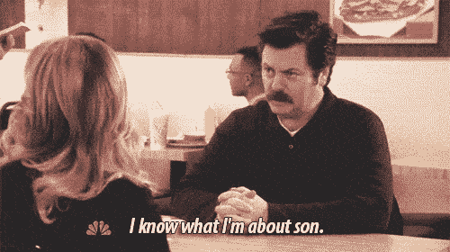
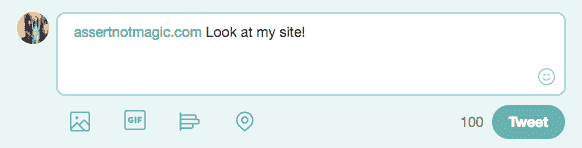
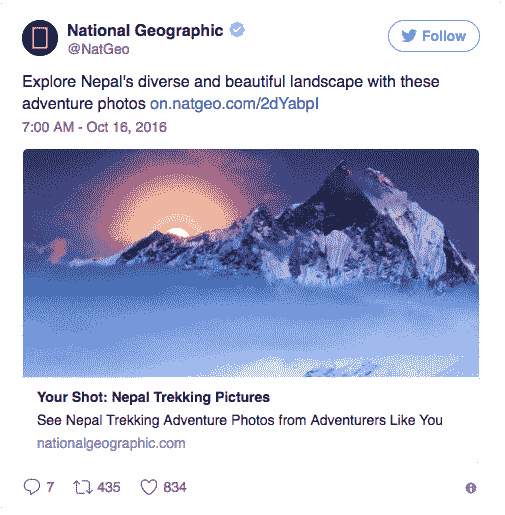
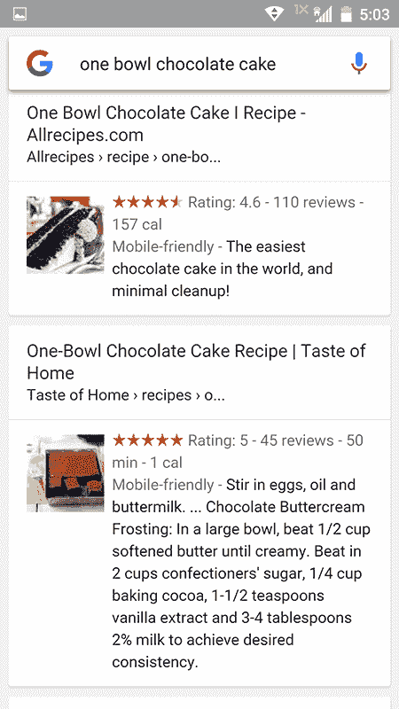

# 加强你的元游戏

> 原文：<https://dev.to/rpalo/step-your-meta-game-up>

元标签。SEO。对我来说，这些是我知道存在的事情，我知道我应该为它们做点什么，但它从来没有排在事情清单的前列——直到我仔细阅读了它们，发现它们可以让你的网站变得多么酷！它们是一些快捷的小东西，可以给你的网站增添一点华丽和自信。

[T2】](https://res.cloudinary.com/practicaldev/image/fetch/s--Bp4wWfNT--/c_limit%2Cf_auto%2Cfl_progressive%2Cq_66%2Cw_880/http://assertnotmagic.com/img/confident-swanson.gif)

我将在这里讨论两种类型的元标签:通用标签和社会标签。

## 效用标签

首先，让我们介绍一些有助于搜索引擎、设备和其他工具在你的网站上正常工作的东西。我刚刚了解到这一点，但似乎这些应该存在于你制作的每一页上。如果我错了，有人纠正我。

```
<head>
    <meta charset="utf-8">
    <meta http-equiv="X-UA-Compatible" content="IE=edge">
    <meta name="viewport" content="width=device-width, initial-scale=1">
    <meta name="ROBOTS" content="INDEX, FOLLOW">
    <meta name="description" content="Ryan's site that extols the values of cheese.">
<!--
    <meta name="keywords" content="cheese, virtues, poetry, spoken word, slam poems about cheese">
-->
</head> 
```

Enter fullscreen mode Exit fullscreen mode

一些解释:

1.  **Charset** :指定网站的字符编码。UTF-8 很好，这是推荐的设置，它有助于使用基本 ASCII 集之外的字符的语言。
2.  IE=Edge :一个 meta 标签，看起来像是用来告诉 Internet Explorer 行为的，但据我所知，微软似乎正在逐步淘汰它。这可能已经没有必要了。不过，我不认为拥有它有什么坏处，而且它可能有助于一些浏览器的兼容性。
3.  **视口**:设置初始视口和缩放比例。根据 [w3](https://www.w3schools.com/TAgs/tag_meta.asp) 的说法，这使得你的网站最初不会在手机上显示得非常小。总是个好主意。
4.  机器人:告诉表现良好的网络爬虫如何索引(或不索引)你的网站。例如，您可以根据您是否希望该页面在 Google 上可见来进行设置。
5.  **描述**:你页面的描述。这显示在谷歌的这个特定页面。
6.  **关键词**:关键词曾经是搜索引擎用来索引的，但是最近，显然不再是这样了。现在大概可以省略了。查看下面的评论部分了解更多详情。

特别是如果你正在使用 Jekyll、JavaScript 框架或其他一些模板方法，很容易把它们放在一次就忘了，它们提高了你的搜索性和可访问性。但是！他们不像下一部分那样做任何特别奇怪的事情。看哪！

## 社交标签

有一些人在社交媒体上分享他们的链接时看起来很悲伤。像这样:

[T2】](https://res.cloudinary.com/practicaldev/image/fetch/s--wxhiagXn--/c_limit%2Cf_auto%2Cfl_progressive%2Cq_auto%2Cw_880/http://assertnotmagic.com/img/sad-link.png)

但是，在短短的几分钟内，他们的链接可能看起来像这样

[T2】](https://res.cloudinary.com/practicaldev/image/fetch/s--V-GWBjFb--/c_limit%2Cf_auto%2Cfl_progressive%2Cq_auto%2Cw_880/http://assertnotmagic.com/img/amazing-link.png)

让我们来看看 HTML。

```
 <meta name="twitter:card" content="summary_large_image">
    <meta name="twitter:title" content="assert_not magic? | Gouda?  You mean great!">
    <meta name="twitter:site" content="@paytastic">
    <meta name="twitter:description" content="A point-by-point comparison of Gouda and other cheeses.">
    <meta name="twitter:image" content="http://assertnotmagic.com/gouda.png">
    <meta name="twitter:image:alt" content="Delicious Gouda">
    <meta name="twitter:creator" content="@paytastic">
    <meta name="og:url" content="http://assertnotmagic.com/gouda/">
    <meta name="og:title" content="assert_not magic? | Gouda?  You mean great!">
    <meta name="og:description" content="A point-by-point comparison of Gouda and other cheeses.">
    <meta name="og:image" content="http://assertnotmagic.com/gouda.png"> 
```

Enter fullscreen mode Exit fullscreen mode

实际上你可以做的还有很多。希望清楚以“twitter”开头的行是用于 Twitter API 的，可能不清楚“og”是用于脸书的。还有 Google+等。这只是我现在用的两个。注意对于屏幕阅读器来说非常重要的`twitter:image:alt`。

不管怎样，一旦你做好了这些(或者，至少是 Twitter 的)，就去[Twitter Card API 文档](https://dev.twitter.com/cards/overview)看看吧。最后，前往 [Twitter 卡验证器](https://cards-dev.twitter.com/validator)以确保你做对了，并检查以确保一切按计划运行。Twitter 和其他网站可能需要一点时间来抓取你的网站并将其列入白名单(或者如果你有道德过失，将你列入黑名单)，但是，在社交媒体上分享你的网站将会是超级大骗局！

我正在努力弄清楚谷歌的财富卡(即你的网站和页面如何显示在他们的搜索结果中)，一旦我把这些都弄清楚了，我也会写一篇关于这些的文章。

[T2】](https://res.cloudinary.com/practicaldev/image/fetch/s--p2x8rlva--/c_limit%2Cf_auto%2Cfl_progressive%2Cq_auto%2Cw_880/http://assertnotmagic.com/img/google-cards.png)

抱歉，显然我有心事。

如果我错过了一些你认为重要的元标签，或者如果你有一些其他很酷的标签要分享，我很乐意听到！

* * *

编辑:由于无畏的评论者的建议，更新了关于关键词和描述标签的信息。阻止虚假信息的传播！ðÿ˜†谢谢你的提醒。

*最初发布于[我的博客](http://assertnotmagic.com/2017/08/14/step-your-meta-game-up/)T3】*