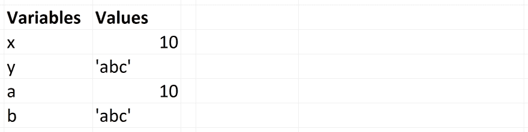
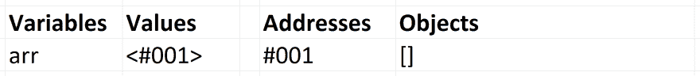
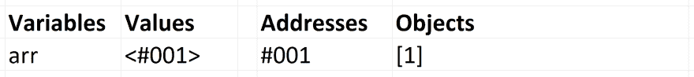
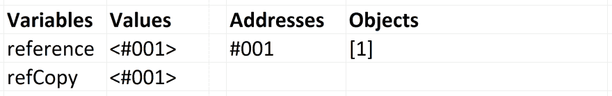
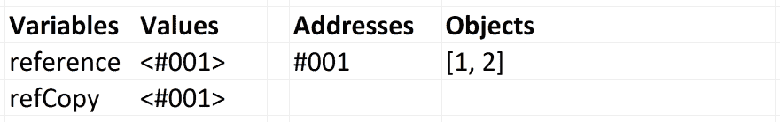
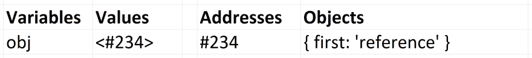
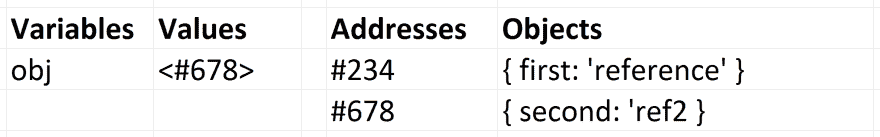
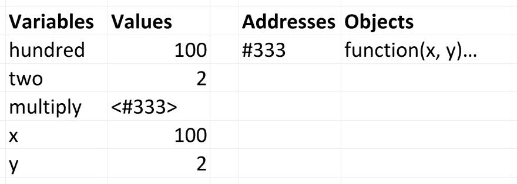

# JavaScript 中的主值与引用

> 原文：<https://dev.to/arnavaggarwal/master-value-vs-reference-in-javascript>

这摘自我的新课程，[提升你的 JS:中级 JavaScript 综合指南](https://www.educative.io/collection/5679346740101120/5707702298738688?authorName=Arnav%20Aggarwal)。欢迎[去那里](https://www.educative.io/collection/page/5679346740101120/5707702298738688/5685265389584384)查看互动代码游戏场和练习题。

* * *

[T2】](https://res.cloudinary.com/practicaldev/image/fetch/s--23pHwtmQ--/c_limit%2Cf_auto%2Cfl_progressive%2Cq_auto%2Cw_880/https://thepracticaldev.s3.amazonaws.com/i/qcp16fvpc9sr20cfesdd.jpg)

JavaScript 有 5 种数据类型，由 ***值*** 复制:`Boolean`、`null`、`undefined`、`String`、`Number`。我们将这些原始类型称为**。**

 **JavaScript 有 3 种数据类型被 ***引用*** : `Array`、`Function`、`Object`复制。这些都是技术上的对象，所以我们将它们统称为**对象**。

## 原语

如果一个原始类型被赋给一个变量，我们可以认为这个变量包含了原始值。

```
var x = 10;
var y = 'abc';
var z = null; 
```

`x` *包含* `10`。`y` *包含* `'abc'`。为了巩固这个想法，我们将维护这些变量和它们各自的值在内存中的样子。

[T2】](https://res.cloudinary.com/practicaldev/image/fetch/s--YwdKjL9O--/c_limit%2Cf_auto%2Cfl_progressive%2Cq_auto%2Cw_880/https://cdn-images-1.medium.com/max/4684/1%2APdKLlT7zUrmDBZUOBsZh7w.png)

当我们使用`=`将这些变量赋给其他变量时，我们**将值**复制到新变量。它们是按值复制的。

```
var x = 10;
var y = 'abc';

var a = x;
var b = y;

console.log(x, y, a, b);
// -> 10, 'abc', 10, 'abc' 
```

现在`a`和`x`都包含了`10`。b 和 y 现在都包含`'abc'`。它们是分开的，因为值本身是复制的。

[T2】](https://res.cloudinary.com/practicaldev/image/fetch/s--q8XM9qNB--/c_limit%2Cf_auto%2Cfl_progressive%2Cq_auto%2Cw_880/https://cdn-images-1.medium.com/max/4682/1%2AMZ3AcwELYZ2ONYFg3LiTXQ.png)

改变一个不会改变另一个。把变量想象成彼此没有关系。

```
var x = 10;
var y = 'abc';

var a = x;
var b = y;

a = 5;
b = 'def';

console.log(x, y, a, b); // -> 10, 'abc', 5, 'def' 
```

## 物体

这会让你感到困惑，但请耐心阅读。一旦你熬过来了，事情就会变得简单。

被赋予非原始值的变量被赋予该值的*引用*。该引用指向对象在内存中的位置。变量实际上不包含值。

对象是在计算机内存的某个位置创建的。当我们写`arr = []`时，我们已经在内存中创建了一个数组。变量`arr`现在包含的是该数组的地址和位置。

我们假设`address`是一种新的数据类型，它是通过值传递的，就像数字或字符串一样。地址指向通过引用传递的值在内存中的位置。就像字符串由引号(`''`或`""`)表示一样，地址将由箭头括号、`<>`表示。

当我们分配和使用一个引用类型变量时，我们写下和看到的是:

```
1) var arr = [];
2) arr.push(1); 
```

上面第 1 行和第 2 行在内存中的表示为:

1.

[T2】](https://res.cloudinary.com/practicaldev/image/fetch/s--lqJW88Hy--/c_limit%2Cf_auto%2Cfl_progressive%2Cq_auto%2Cw_880/https://cdn-images-1.medium.com/max/4680/1%2Ah1aXuPwCyhu6GKwgeFMLDw.png)

2.

[T2】](https://res.cloudinary.com/practicaldev/image/fetch/s--pniFO43a--/c_limit%2Cf_auto%2Cfl_progressive%2Cq_auto%2Cw_880/https://cdn-images-1.medium.com/max/4678/1%2AHaemMnuU05EW1b3BZPubIg.png)

注意，变量`arr`中包含的值，即地址，是**静态的**。改变的是内存中的数组。当我们使用`arr`做一些事情时，比如推送一个值，JavaScript 引擎会转到内存中 arr 的位置，并处理存储在那里的信息。

### 参照赋值

当使用`=`将一个引用类型值(一个对象)复制到另一个变量时，该值的地址就是实际复制到*上的内容，就好像它是一个原语*。**对象通过引用**复制，而不是通过值复制。对象本身是不变的，静态的。唯一被复制的是对象的引用和地址。

```
var reference = [1];
var refCopy = reference; 
```

上面的代码在内存中是这样的。

[T2】](https://res.cloudinary.com/practicaldev/image/fetch/s--WkLRyoHL--/c_limit%2Cf_auto%2Cfl_progressive%2Cq_auto%2Cw_880/https://cdn-images-1.medium.com/max/4670/1%2Ad2W3ulHbHRGrFQ-c1SG5gA.png)

每个变量现在都包含一个对*相同数组*的引用。这意味着如果我们改变`reference`，`refCopy`将会看到这些变化:

```
reference.push(2);
console.log(reference, refCopy);
// -> [1, 2], [1, 2] 
```

[T2】](https://res.cloudinary.com/practicaldev/image/fetch/s--L8Wm7q4t--/c_limit%2Cf_auto%2Cfl_progressive%2Cq_auto%2Cw_880/https://cdn-images-1.medium.com/max/4666/1%2ARFrFRXIperg0yTwXauc97w.png)

我们已经将`2`放入内存数组中。当我们使用`reference`和`refCopy`时，我们指向同一个数组。

### 重新分配参考

重新分配引用变量会替换旧的引用。

```
var obj = { first: 'reference' }; 
```

在内存中:

[T2】](https://res.cloudinary.com/practicaldev/image/fetch/s--4aHMaMwr--/c_limit%2Cf_auto%2Cfl_progressive%2Cq_auto%2Cw_880/https://cdn-images-1.medium.com/max/4672/1%2APWGp9d2zZ_QGg18HXBSq9Q.png)

当我们有第二行时:

```
var obj = { first: 'reference' };
obj = { second: 'ref2' } 
```

存储在`obj`中的地址发生变化。第一个对象仍然存在于内存中，下一个对象也是如此:

[T2】](https://res.cloudinary.com/practicaldev/image/fetch/s--jUtHcsq5--/c_limit%2Cf_auto%2Cfl_progressive%2Cq_auto%2Cw_880/https://cdn-images-1.medium.com/max/4674/1%2A1h73Wn9IyaiXbhxhmJZmYA.png)

当没有剩余的对象引用时，正如我们在上面看到的地址`#234`，JavaScript 引擎可以执行垃圾收集。这只是意味着程序员已经丢失了对该对象的所有引用，并且不能再使用该对象，所以引擎可以安全地从内存中删除它。在这种情况下，对象`{ first: 'reference' }`不再可访问，并且可用于引擎的垃圾收集。

## ==和===

当相等运算符`==`和`===`用于引用类型变量时，它们检查引用。如果变量包含对同一项的引用，比较结果将为 true。

```
var arrRef = ['Hi!'];
var arrRef2 = arrRef;

console.log(arrRef === arrRef2); // -> true 
```

如果它们是不同的对象，即使它们包含相同的属性，比较也会导致 false。

```
var arr1 = ['Hi!'];
var arr2 = ['Hi!'];

console.log(arr1 === arr2); // -> false 
```

如果我们有两个不同的对象，并想看看它们的属性是否相同，最简单的方法是将它们都转换成字符串，然后比较这些字符串。当相等运算符比较原语时，它们只是检查值是否相同。

```
var arr1 = ['Hi!'];
var arr2 = ['Hi!'];

var arr1str = JSON.stringify(arr1);
var arr2str = JSON.stringify(arr2);

console.log(arr1str === arr2str); // true 
```

注意，如果某些属性是函数，使用`JSON.stringify`会导致问题，或者`undefined`会跳过这些值。更安全的选择是递归地遍历对象，并确保每个属性都是相同的。

## 通过函数传递参数

当我们将原始值传递给函数时，函数会将这些值复制到它的参数中。这实际上与使用`=`是一样的。

```
var hundred = 100;
var two = 2;

function multiply(x, y) {
    // PAUSE
    return x * y;
}

var twoHundred = multiply(hundred, two); 
```

在上面的例子中，我们给`hundred`赋值`100`。当我们把它传递给`multiply`时，变量`x`得到那个值`100`。该值被复制，就像我们使用了一个`=`赋值一样。同样，`hundred`的值不受影响。这里是在`multiply`中的`// PAUSE`注释行的内存快照。

[T2】](https://res.cloudinary.com/practicaldev/image/fetch/s--wW_wkqqf--/c_limit%2Cf_auto%2Cfl_progressive%2Cq_auto%2Cw_880/https://cdn-images-1.medium.com/max/4536/1%2A3AYcflNTwTTGTgCul0DgBw.png)

### 纯函数

我们称不影响外部作用域的函数为*纯函数*。只要一个函数只将原始值作为参数，并且在其周围的作用域中不使用任何变量，它就自动是纯的，因为它不能影响外部作用域中的任何东西。一旦函数返回，在内部创建的所有变量都被垃圾收集。

然而，接受对象的函数可以改变其周围范围的状态。如果一个函数接受一个数组引用并改变了它所指向的数组，也许是通过推它，那么引用该数组的周围作用域中的变量就会看到这种变化。函数返回后，它所做的更改将保留在外部范围内。这可能会导致难以追踪的不良副作用。

因此，许多本机数组函数，包括 Array.map 和 Array.filter，都被编写为纯函数。它们接受一个数组引用，在内部复制数组，并使用副本而不是原始数组。这使得原来的数组没有被改动，外部的作用域也没有受到影响，我们返回了一个对全新数组的引用。

让我们来看一个纯函数和不纯函数的例子。

```
function changeAgeImpure(person) {
    person.age = 25;
    return person;
}

var alex = {
    name: 'Alex',
    age: 30
};

var changedAlex = changeAgeImpure(alex);

console.log(alex); // -> { name: 'Alex', age: 25 }
console.log(changedAlex); // -> { name: 'Alex', age: 25 } 
```

这个不纯的函数接受一个对象，并将该对象的属性 age 更改为`25`。因为它作用于给定的引用，所以它直接改变对象`alex`。注意，当它返回`person`对象时，它返回的是与传入的对象完全相同的对象。`alex`和`alexChanged`包含相同的引用。返回`person`变量并将该引用存储在一个新变量中是多余的。

我们来看一个纯函数。

```
function changeAgePure(person) {
    var newPersonObj = JSON.parse(JSON.stringify(person));
    newPersonObj.age = 25;
    return newPersonObj;
}

var alex = {
    name: 'Alex',
    age: 30
};

var alexChanged = changeAgePure(alex);

console.log(alex); // -> { name: 'Alex', age: 30 }
console.log(alexChanged); // -> { name: 'Alex', age: 25 } 
```

在这个函数中，我们使用`JSON.stringify`将传递给我们的对象转换成一个字符串，然后用`JSON.parse`将它解析回一个对象。通过执行这个转换并将结果存储在一个新的变量中，我们创建了一个新的对象。新对象与原始对象具有相同的属性，但它在内存中是一个明显独立的对象。

当我们更改这个新对象的`age`属性时，原始对象不受影响。这个函数现在是纯的。它不能影响自己作用域之外的任何对象，即使是传入的对象也不行。新的对象需要被返回并存储在一个新的变量中，否则一旦函数完成，它就会被垃圾回收，因为对象不再在作用域中。

### 考验自己

价值与参考是编码面试中经常测试的一个概念。试着自己找出这里记录了什么。

```
function changeAgeAndReference(person) {
    person.age = 25;
    person = {
      name: 'John',
      age: 50
    };

    return person;
}

var personObj1 = {
    name: 'Alex',
    age: 30
};

var personObj2 = changeAgeAndReference(personObj1);

console.log(personObj1); // -> ?
console.log(personObj2); // -> ? 
```

该函数首先更改传入的原始对象的属性 age。然后，它将变量重新分配给一个全新的对象，并返回该对象。下面是这两个对象被注销的内容。

```
console.log(personObj1); // -> { name: 'Alex', age: 25 }
console.log(personObj2); // -> { name: 'John', age: 50 } 
```

记住，通过函数参数的赋值本质上与使用`=`的赋值是一样的。函数中的变量`person`包含对`personObj1`对象的引用，所以它最初直接作用于该对象。一旦我们将人重新分配给一个新的对象，它就不再影响原来的对象。

这种重新分配不会改变`personObj1`在外部作用域中指向的对象。`person`有新的参考，因为它已被重新分配，但这种重新分配不会改变`personObj1`。

与上述代码块等效的一段代码是:

```
var personObj1 = {
    name: 'Alex',
    age: 30
};

var person = personObj1;
person.age = 25;

person = {
    name: 'John',
    age: 50
};

var personObj2 = person;

console.log(personObj1); // -> { name: 'Alex', age: 25 }
console.log(personObj2); // -> { name: 'John', age: 50 } 
```

唯一的区别是，当我们使用函数时，一旦函数结束，`person`就不再在作用域内。

### 就是这样。

* * *

如果你喜欢这个，请击中心脏，让它到达更多的人。

同样，对于交互式代码示例，请在我的课程中免费阅读这篇文章。还有其他免费文章可供阅读。

[提升你的 JS:中级 JavaScript 综合指南](https://www.educative.io/collection/5679346740101120/5707702298738688?authorName=Arnav%20Aggarwal)

* * *

[Twitter-@ farm _ fresh _ js](https://twitter.com/farm_fresh_js)
T3】Medium-@ Arnav _ AggarwalT5[Quora-Arnav Aggarwal](https://www.quora.com/profile/Arnav-Aggarwal)**