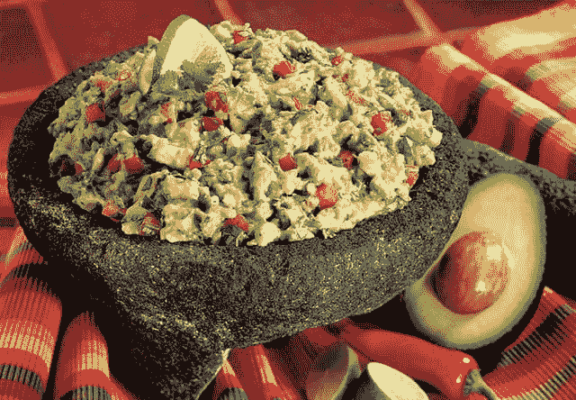

# 你在编码时最喜欢的零食是什么，为什么它最受欢迎？

> 原文:[https://dev . to/niko/whats-your ' s absolute-favorite-零食-编码-以及-why-it-hit-spot](https://dev.to/niko/whats-your-absolute-favorite-snack-food-while-coding-and-why-does-it-hit-the-spot)

[T2】](https://res.cloudinary.com/practicaldev/image/fetch/s--GsJ2TPAU--/c_limit%2Cf_auto%2Cfl_progressive%2Cq_auto%2Cw_880/https://thepracticaldev.s3.amazonaws.com/i/gsc07ch7dd9opo02326j.jpg)

我的是任何有令人满意的嘎吱声的东西，我可以把它埋在正宗的鹰嘴豆泥或鳄梨色拉酱里。我活着就是为了用一只手就能吃到咸味、咸味，可能还有扑鼻的和浓郁的:D 风味！