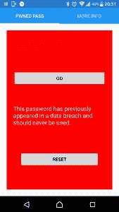

# Pwned 通行证–可从游乐商店购买

> 原文：<https://dev.to/funkysi1701/pwned-pass-available-from-the-play-store-2fjp>

Pwned 通行证现在可以从[谷歌 Play 商店](https://play.google.com/store/apps/details?id=pwnedpasswords.pwnedpasswords)获得。

[T2】](https://res.cloudinary.com/practicaldev/image/fetch/s--8e3N8laL--/c_limit%2Cf_auto%2Cfl_progressive%2Cq_auto%2Cw_880/https://i1.wp.com/www.funkysi1701.com/wp-content/uploads/2017/08/Screenshot_20170813-205152.png%3Fresize%3D169%252C300%26ssl%3D1)

Pwned Pass 是一个简单的 android 应用程序，允许你输入密码，并告诉你它是否被用于数据泄露。

我被耍了吗？最近在他的网站上增加了一个新的 API，可以让你搜索他庞大的密码数据库，其中有 3.06 亿个密码。我只是为这个 API 创建了一个 Android 前端。

API 本身接受密码的 SHA1 散列，如果找到了密码，则返回 HTTP 200，如果 HIBP 数据库中不存在密码，则返回 HTTP 404。关于 Troy Hunt 如何创造这个的更多细节，请查看他的博客文章。

我的应用程序只是生成任何输入的 SHA1 散列，然后将它传递给特洛伊·亨特的 API。然后我得到 HTTP 返回代码，这样我就知道密码是否存在。

需要注意的是:**不要将您经常使用的任何密码发送给第三方服务——即使是这个！**我不会记录你在我的应用程序中输入的任何内容，我所做的只是通过 SSL 向 HIBP 传递一个 SHA1 哈希。然而，你不应该只相信我的话。

这个应用程序本身是用 Xamarin Forms 在 Visual Studio 中编写的，与我上周谈到的应用程序类似。

因为我正在使用 Xamarin 表单，所以我有可能在将来开发 iPhone 或 UWP 版本的代码。考虑到这一点，我为 android 特定部分的代码使用了接口。

由于我在 httpclient 和 SSL 方面遇到的问题，我还使用了 [modernhttpclient](https://www.nuget.org/packages/modernhttpclient/) nuget 包。这是由于 mono 中可用的库和已实现的库的限制，我怀疑有更好的方法来解决这个问题，但这只是乐趣的一部分。

请务必看一看 Pwned 通行证，并让我知道你的想法。尤其是如果它不工作或抛出错误。我想花时间让这个应用程序尽可能好。

帖子[Pwned Pass——可从 Play Store](https://www.funkysi1701.com/2017/08/14/pwned-pass/) 获得，最早出现在 [Funky Si 的技术演讲](https://www.funkysi1701.com)上。