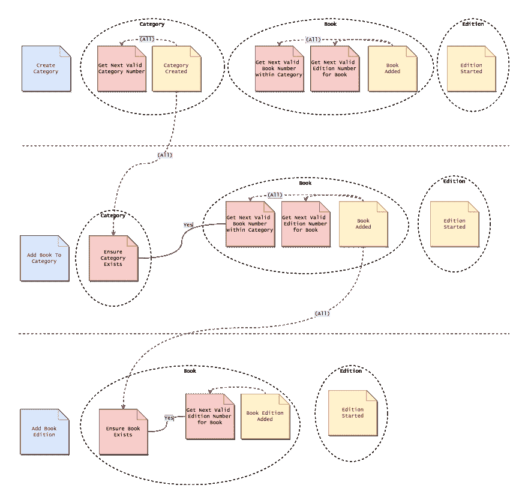

# 混乱的事件流:第 1 部分

> 原文:[https://dev.to/barryosull/messy-event-flows-part-1](https://dev.to/barryosull/messy-event-flows-part-1)

# [T1】简介](#intro)

我最近一直在试着写作，但发现很难。然后看了一个视频[“不要创建，文档”](https://www.youtube.com/watch?v=RVKofRN1dyI)。TL；DR:与其试图写一个如何做，集中在一个解决方案上，为什么不记录下你正在做什么，当你朝着一个解决方案努力的时候？我真的很喜欢这个想法，因为这是一个问题第一，解决方案第二的方法，这是任何发现或创造过程应该如何开始(编码和任何其他努力都是如此)。

所以事不宜迟，让我们进入一个我们一直面临的问题。

# 我们系统的当前状态

我们有一个来源于系统的[事件，这意味着它完全是事件驱动的，所有状态都来自事件。我们目前有三个核心对象/概念(更改名称以避免暴露我们的业务内部，使用适当的隐喻，应该是宏大的)。](https://martinfowler.com/eaaDev/EventSourcing.html)

*   种类
*   书
*   版本

它们以多对一的关系分层。

上述概念是我们的集合，因为每个对象都有独立的生命周期。

## 我们的约束

1.  类别包含一本或多本书
2.  书籍有一个或多个版本。
3.  当作者创建一个类别时，必须为该类别创建一本书，并且必须为该书创建一个图书版本，否则用户就没有任何工作可做。
4.  在整个部门中，类别必须有代表它们的唯一编号。这个数字递增，不能有重复。
5.  在一个类别中，每本书都必须有一个唯一的编号。对于类别中的每本书，此编号都会增加，并且在类别中必须是唯一的。
6.  一本书可以有许多图书版本，每个图书版本都必须有一个唯一的编号来代表它们在母书中的位置。该数字随图书的每个版本而递增，并且对于图书必须是唯一的。
7.  这三个值组合起来用于引用特定的图书版本，即。它们是它的参考号。

## 我们的模型

这就是我们目前对事件、集合和约束的建模方式。这被称为时间模型，它显示了事物是如何随着时间而变化的。发现这一点的过程通常被称为[事件风暴](https://techbeacon.com/introduction-event-storming-easy-way-achieve-domain-driven-design)。

### 图例

*   用户发出的命令是蓝色的
*   约束是红色的
*   事件为黄色
*   虚线圆圈是集合
*   虚线箭头将事件链接到需要它们的约束

 
点击缩放。

## 有什么问题吗？

我对生成数字的两个约束不满意。他们目前在聚合中，但是他们监听域中的事件，而不仅仅是聚合实例产生的事件。这感觉像是它应该在别的地方，或者至少是不同的模型。

在一些事件中，数据分布不均匀。“添加图书版本”事件是在图书聚合中创建的，但它包含版本号，该信息不应该由版本聚合控制吗？这使得约束和事件都难以使用，也难以推理。

对象创建的训练也有点痛苦，类别= >书= >版本。这些都是聚合，所以同时创建这三个并不符合聚合模式。然而，它是这样的是有正当理由的。当创建一个类别时，Edition 事件需要来自命令的数据，将这些数据放在更高级别的事件上是没有意义的，因为 Edition 可以访问这些数据。一次性创建它们会使这变得更简单。我不确定这个 TBH。

对于我们如何记录递增的数字，也有两种相互竞争的模式。类别号和图书号由侦听域范围事件的约束产生，但是版本号由仅侦听来自单个图书集合的事件的约束产生。这是解决同一个问题的两种不同方式，这意味着我们还没有确定这个问题的模式。这使得事情变得混乱，并且它对错误事件中的数据负有部分责任。

有多余的事件。看看“图书版本增加”，如果之后总有“版本开始”事件，为什么会有这种情况？好吧，它的存在是为了让我们可以在不监听域内事件的情况下生成类别号，事后看来，这并不是添加多余事件的好理由。

我们的域范围约束也不是一个很好的解决方案。我们需要确保数字是跨进程按顺序生成的，并且数据不能被破坏。我们使用一个事务在幕后处理这个问题，但是这个事务阻塞了其他也试图生成这些数字的进程。在不久的将来，这可能会成为一个瓶颈。

## 很难改变

以上所有的都是有问题的，因为我们最近修改了我们的流程，我们发现很难推理出我们需要做出的改变。结果，花费的时间比预期的要长，这让每个人都很沮丧。我们可以做得更好。

# 我们有哪些选择？

对于如何解决这些问题，我有一些想法，但是在我们探索任何一个之前，我们必须问“我们的核心问题是什么？”。我们的问题归结为缺乏对领域的理解，我们以一种笨拙的方式建模我们的事件和约束，这种方式适合我们用来实现系统的模式，而不是领域本身。我们不知道模型实际上是否应该是这样的。我们需要清晰。

这就是为什么我们需要更好地理解我们的领域及其约束。花时间在其他事情上可能是预先优化，我们不知道最终结果应该是什么样的，所以我们会对任何建议的解决方案过早行动。

因此，让我们产生一个新的领域模型，一个消除噪音并给我们指明方向的最新流程。毕竟，这是我们努力的核心。

做到这一点的最佳方式是事件风暴会议。我们将按照我们的理解对系统建模，而不是按照我们目前的方式建模(我们已经有了)。我们还应该考虑自上次会议以来我们已经创建/发现的所有约束和模式。

一旦我们有了这个，我们将会对事物的归属有一个更好的想法，以及流程实际上是如何工作的。这将指导我们设计我们的事件、它们的数据以及监听它们的约束。

# 结论

这似乎是一个停下来的好地方。我已经定义了我们的问题，并且意识到如果我们想让代码更好，我们需要更好地理解我们的领域。一旦我们有了这个，接下来的步骤就会清晰得多。

直到下次人们。

[混乱的事件流程:第二部分——它应该是什么样子](https://dev.to/barryosull/messy-event-flows-part-2---what-it-should-be)