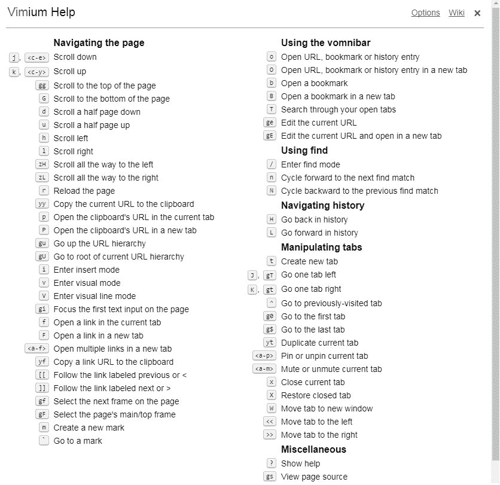

# 我对键盘的爱

> 原文：<https://dev.to/afaq404alam/my-love-for-my-keyboard>

我最近爱上了这个非常棒的 chrome 扩展，叫做 Vimium。对于那些真正热爱 Vim 并且讨厌触摸你的鼠标和箭头键的人来说，这个扩展是一个祝福。我已经用了一段时间了，我爱上了它。

它有许多快捷方式，让你的 Chrome 体验令人惊叹。试试看你的书呆子，我相信你会喜欢它。

您可以使用的命令的快速列表:
