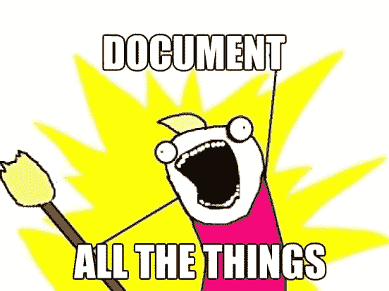

# DevOps 到底是什么？开发者的视角。

> 原文:[https://dev . to/theodesp/what-devo PS-really-is-a-developers-perspective](https://dev.to/theodesp/what-devops-really-is-a-developers-perspective)

[T2】](https://res.cloudinary.com/practicaldev/image/fetch/s--R2Hz5jfN--/c_limit%2Cf_auto%2Cfl_progressive%2Cq_auto%2Cw_880/https://thepracticaldev.s3.amazonaws.com/i/nludmngi4kkergdmhas4.jpeg)

> 无论您是刚刚开始您的开发职业生涯，还是您已经有了一个坚实的项目组合，并且您正在考虑转换到 DevOps，我写了这篇文章来表达我的观点，即 DevOps 的追随者如何在这个残酷的世界中生存。

我最近开始阅读凤凰计划，通过前几章，我认识到了我职业生涯中遇到的一些模式。虽然我并不期待成为一名开发运维人员，但我认识到在一个组织中拥有一个开发运维团队的极端重要性，这样我们开发人员就永远不必处理运营、部署、配置管理或变更管理。

如果我一开始是一个 DevOps，这是我对事情应该如何做和应该如何处理的看法。

## 你有一个目标

> 通过自动化文化、系统监控和跨所有业务、开发和运营部门的信息共享来消除浪费

是的，这是一个非常重要的目标。我可以说是批判性的。您需要确保 IT 运营和开发协同工作，而不是相互分离。这并不像理论上看起来那么容易。

关于消除浪费的第一句话来自[精益六适马](https://en.wikipedia.org/wiki/Lean_Six_Sigma)，这是一种**方法，依靠团队协作，通过系统地消除浪费和减少差异来提高绩效**。

> 这意味着你必须与上层或下层管理人员沟通，找出并消除所有阻碍你前进的烦恼和浪费。

稳定是你最关心的事情，你必须虔诚以保持高标准。否则，你将会在服务器室度过你的夜晚。

你是内部业务部门、开发部门和运营部门的粘合剂。如果胶水变稀，生意就完蛋了。

这将我们带到下一个观察点。

## 当灾难来袭时，确保你受到保护

灾难迟早会发生。是在新年前夜每个人都喝醉时部署到生产中的补丁，还是被解雇的员工触发了逻辑炸弹、错误的软件或外部因素都可能导致问题。

要意识到的一件重要的事情是:

> 复杂系统会失败。

我们所说的复杂系统是什么意思？作为整个系统的一部分，平均包含 7 个以上相互作用的节点或组件的任何东西。

**为什么是 7？**这是因为它是我们人类可以同时管理的项目、任务或互动的[完美数字](https://www.psychologytoday.com/blog/fulfillment-any-age/201109/7-reasons-we-7-reasons)。

**什么是节点或组件？**它是任何有逻辑边界的东西，比如 UI Web app、后端服务、数据库服务器、操作系统等。正如你所想象的，即使一个简单的三层系统也是复杂的，因此它会失败。

所以为了保护你自己，你必须:

> 您需要针对以下方面进行优化

这意味着您需要确保一切都是自动化的。如果你认为你已经完成了自动化。

我所说的自动化是指:

*   **运行测试**:所有测试用例天气单位，e2e，系统无论什么都应该是管道的一部分，确保在测试失败的情况下没有任何东西损坏。

*   **收集指标**:所有指标、回溯、监控数据都应该以最无障碍的方式运行，并且不消耗资源。日志应该轮换并收集到安全的地方。

*   **运行报告和警报**

**自我修复**:在服务器上运行的软件需要进行必要的调整，以便在出现故障时恢复正常运行。

**备份**

而且只有最低要求…

这让我们看到了另一个现象。

## 记录一切

[T2】](https://res.cloudinary.com/practicaldev/image/fetch/s--lX_eVIlH--/c_limit%2Cf_auto%2Cfl_progressive%2Cq_auto%2Cw_880/https://thepracticaldev.s3.amazonaws.com/i/67kcybsbndls6xf8wjtc.jpg)

你需要记录一切。我的意思是:

*   自动化:一切都回归自动化。文档真的很难维护。你需要有自动化的脚本，为每一个暴露 API、配置、需求、验证等的过程保留一个活的 wiki，而不需要人工干预。

*   **连续**:每次有变化，需要与当前环境保持一致时，都应该调用文档生成。

*   **可追溯**:文档应该有可追溯的元数据。谁更新的，什么时候更新的，为什么更新。

*   **详细**:文档应尽可能详细。光写“用最新 OS 补丁更新了 10 个终端”这种东西是不够的。您需要更具体的信息，如补丁版本信息、应用补丁的步骤、观察到的效果。等等。

这使我们最终进入另一个观察。

## 变化需要控制

在这里，开发人员是您最好的朋友，因为他们通常需要确保他们的新代码行无缝集成到组织中。您需要更加紧密地合作，并自动化部署过程。

> 这将导致频繁的发布

这实际上并不坏，因为它证明了一切都像一台运转良好的机器。您需要始终关注所有的业务需求和当前的开发状态，以便按时计划您的发布。当然，这需要经验，但是如果你热爱你的工作，你可以做任何事情！

## 裁决

好了，你已经尝到了竞选 DevOps 职位的滋味。请记住，这些只是从开发人员的角度进行的观察。当你在你的角色上工作时，你会发现你需要遵循大量的其他最佳实践。这篇文章只是为了让你足够好奇。我补充了几个出发点，供你遵循。

## 参考文献

我列出了一些潜在开发人员可以在自己的时间里消耗的资源。

*   [凤凰计划](https://www.amazon.com/Phoenix-Project-DevOps-Helping-Business/dp/0988262592):devo PS 必读书。

*   DevOps 书签:一个真正有用的书签分类列表。

*   [连续交货](https://www.amazon.com/Continuous-Delivery-Deployment-Automation-Addison-Wesley/dp/0321601912/ref=cm_cr_pr_product_top?ie=UTF8):固体参考。

*   [DevOps For Developers](https://www.amazon.com/DevOps-Developers-Experts-Voice-Development/dp/1430245697/ref=sr_1_1?s=books&ie=UTF8&qid=1502461277&sr=1-1&keywords=DevOps+for+Developers) :如果你已经是一名开发者，这是一个不错的选择。

如果这篇文章对你有帮助，请分享它，并关注我的其他文章。可以在 [GitHub](https://github.com/theodesp) 和 [LinkedIn](https://www.linkedin.com/in/theofanis-despoudis-7bb30913/) 上关注我。如果你有任何想法和改进，请随时与我分享。
快乐编码。