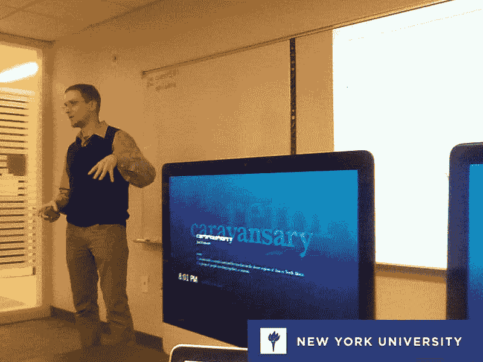

# 一行代码如何改变了我的生活

> 原文:[https://dev . to/rfunk 82/how-a-单行代码改变了我的生活](https://dev.to/rfunk82/how-a-single-line-of-code-changed-my-life)

那是 2012 年，我的职业生涯毫无进展。那天，一位同事 Otto Lombardo 向我展示了一行代码，它永远地改变了我的生活，这就是我如何成为一名软件开发人员的故事。大约在 1992 年，我是在玩“街头棒”游戏时，被我的表弟介绍认识电脑的。那是一见钟情，我记得我让我妈妈带我去他家，这样我就可以一次又一次地玩。没过多久，我妈妈给我报名参加了一个计算机课程，DOS，Windows 3.1，Lotus 1–2–3，DBase！我是一个兴奋的 10 岁小孩！我开始提早去上电脑课，这样我就可以有更多的时间和电脑在一起。直到我的父母能够给我买一个，我记得无数天扮演卡门圣地亚哥。
现在让我们快进几年。我 15 岁的时候从阿根廷搬到了美国，我等了大约一年，直到我的父母给了我第一台电脑，一台黑色的索尼电脑，太棒了！现在有一个叫互联网的东西，那是 1999 年，我会花一整夜在记事本上写我的网站，然后上传到 AngelFire 主机服务。我甚至收到了一枚黄金(24 kt。)比尔盖茨和史蒂夫鲍尔默签名的 CD，作为测试 MSN 的礼物。那些日子，玩得开心，时不时的黑一下，感觉棒极了。

几年后，我决定修理我的电脑，我学了一些技巧，突然，我去了纽约的一家电脑公司面试。哇！我走进去，看到所有这些装满电脑零件的箱子，我到达了希望之乡。我成为了一名网络工程师，我不得不说我可以解决任何计算机/网络问题，我很擅长这个…但是我并不完全开心。我总是喜欢创造东西，现在我意识到我 8 年的职业是修理东西，而不是创造。事情就在那时发生了。一位同事向我展示了一行 Delphi 代码，它可以打印一条消息“你好，里卡多！”太神奇了。对我来说就是这样，我立刻知道我想成为一名软件开发人员。我回到家，下载了 delphi，不到一周我就有了和我们工作时一样的软件界面。我甚至欺骗了该软件的联合创始人和开发者，认为我黑了该软件并更改了菜单。那太有趣了！但是现在呢？我应该继续学习“Delphi”吗？如果我想卖我开发的东西，我必须把它刻录成 CD？我很幸运，我的一个朋友建议学习 iOS“你可以直接构建它并将其放在应用商店中！”。我花了大约一年的时间来学习基础知识，记住，我没有开发背景。我花了很多时间，阅读，看视频，写东西。我和我的朋友会从周六早上 9 点开始不停地工作，直到周日凌晨 2-3 点(或者直到我妻子说够了！).我能够构建一个应用程序的原型，它帮助我获得了我的第一份工作…离家几乎 3 个小时！在大约 6 个月的时间里，我会花 5 到 6 个小时在通勤上。我住在纽约皇后区，我作为 iOS 开发人员的第一份工作是在新泽西州的萨米特。这是值得的！我会花一半的时间阅读关于发展的书籍，另一半时间试着睡觉。我不得不承认这很残酷，但那份工作帮助我找到了一份离我家更近的工作，大约 40 分钟的路程，在纽约曼哈顿。大约在那个时候，我赢得了一个开发竞赛，其中包括 20，000 美元的大奖(链接),我不能要求更多。

我获得了纽约大学的认证，后来我被邀请做演讲嘉宾，还被雇佣做一些开发工作。我开始参加会议，甚至在一些会议上发言。这是我梦想的生活，我实现了我的美国梦！

[T2】](https://res.cloudinary.com/practicaldev/image/fetch/s--w6D4wTex--/c_limit%2Cf_auto%2Cfl_progressive%2Cq_auto%2Cw_880/https://cdn-images-1.medium.com/max/800/1%2Aq_vfgNiWUkkAnT4VId5kqQ.jpeg)

我目前在 MediPortal 工作，我们正试图颠覆医疗保健行业。我负责所有的移动解决方案。现在时间不重要，我晚上工作，白天工作，周末也工作。当你享受你所做的事情时，你不会看着时钟想“我想回家”。来到这里并不容易，但这是值得的。看，有一个秘密，你准备好了吗？谁都可以！我总是想起史蒂夫·乔布斯说过的一句话:
“一旦你发现一个简单的事实，生活会变得更加广阔:你周围的一切你称之为生活的东西都是由不比你聪明的人组成的，你可以改变它，你可以影响它，你可以创造你自己的东西让别人使用。
一旦你明白了这一点，你就再也不会和以前一样了。”
如果有什么事情是我想实现的，那就是激励别人，就像奥托激励我一样。走出去，开始实现你的梦想。没有什么是你不能做的，你是唯一一个阻止它发生的人。要疯狂，要大胆。让它发生！

[T2】](https://res.cloudinary.com/practicaldev/image/fetch/s--DRgq7uIb--/c_limit%2Cf_auto%2Cfl_progressive%2Cq_auto%2Cw_880/https://cdn-images-1.medium.com/max/800/1%2AT1bea5MF8L-_F5vA6wnS5Q.jpeg)

感谢阅读。我是里卡多·芬克( [@rfunk82](https://dev.to/rfunk82) )。如果你喜欢这件作品，它的出处还有很多。我喜欢开发带来创新的代码和应用程序。热爱写作，热爱发展，热爱生活。