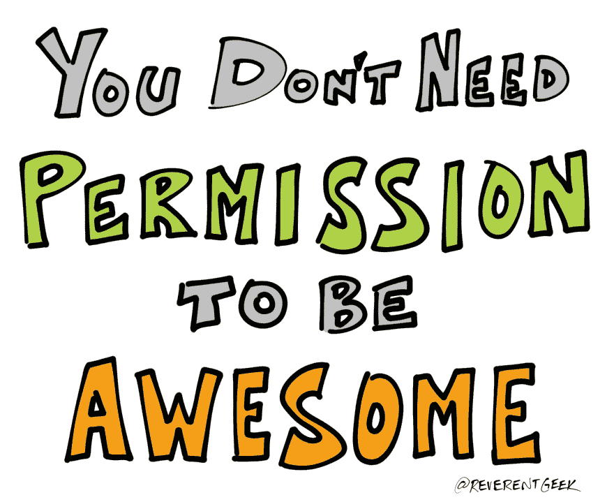

# 请尝试一下公开演讲

> 原文:[https://dev . to/reverent geek/please-give-public-speaking-a-try](https://dev.to/reverentgeek/please-give-public-speaking-a-try)

[T2】](https://res.cloudinary.com/practicaldev/image/fetch/s--c-1kgpKW--/c_limit%2Cf_auto%2Cfl_progressive%2Cq_auto%2Cw_880/https://thepracticaldev.s3.amazonaws.com/i/mls6xey3sr35wim1fkaq.PNG)

当我和人们谈论公开演讲时，我会告诉他们这为去有趣的地方旅行和结识了不起的人提供了机会。在过去的几年里，我经历了一些惊人的冒险，都是因为我鼓起勇气站起来，和一群像我一样的极客说话。

我做过这样的事情:

*   在俄亥俄州的桑达斯基，泡在室外热水浴缸里，雪花落在我的脸上
*   佛罗里达大西洋海滩，我的脚趾在沙滩上晒太阳
*   北卡罗莱纳州阿什维尔的美丽的比尔特莫尔庄园
*   在挪威奥斯陆的挪威民俗博物馆学习挪威历史
*   在乌拉圭的蒙得维的亚品尝深夜街头小吃，开怀大笑
*   怀着敬畏的心情站在英国伦敦的威斯敏斯特大教堂
*   漫步在澳大利亚悉尼附近蓝山奇怪而美丽的树荫下

...还有很多 10 年前的我做梦也想不到的事情。

尽管所有的地方都很棒，但我遇到的人、建立的关系以及我与朋友和家人分享的经历才是最珍贵的。

公开演讲让我的世界变得更大、更丰富多彩、更容易接近。

## 制定三个目标

比起公众演讲带来的焦虑，我更喜欢在社区中帮助其他人的感觉。没多久我就迷上了。

在你的公司做一次午餐学习讲座。在你当地的[聚会](https://www.meetup.com/)上做一个展示或简短的演讲。谈谈你正在学习的东西，或者你喜欢钻研的东西。

如果试了三次后你还是不相信，没关系。你将会比大多数人取得更大的成就。你还将获得新的技能和知识，这些将继续为你带来收益。

谁知道它会把你带到哪里？

## 下一步

想要一些提示和秘密吗？[观看我来自](https://youtu.be/aPSvHT9USO8)[的演讲](http://nodevember.org/)2016 年 11 月。

查看我的[公开演讲资源](https://github.com/reverentgeek/public-speaking/blob/master/README.md)。

需要更多证据吗？阅读科里·豪斯的文章，[公众演讲改变了我的生活...并且也可以改变你的](https://medium.freecodecamp.org/public-speaking-transformed-my-life-and-can-change-yours-too-ca8acdbcc188)。

走出去，变得很棒！

[T2】](https://res.cloudinary.com/practicaldev/image/fetch/s--LNfUel9s--/c_limit%2Cf_auto%2Cfl_progressive%2Cq_auto%2Cw_880/https://thepracticaldev.s3.amazonaws.com/i/qm90jslkihkjb6cf8b9i.PNG)