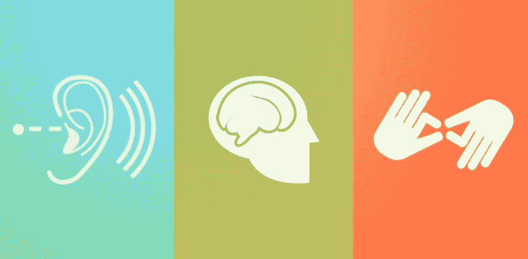

# 使 React 导航再次可访问

> 原文:[https://dev . to/johnlucasg/make-react-navigation-accessible-again](https://dev.to/johnlucasg/make-react-navigation-accessible-again)

[T2】](https://res.cloudinary.com/practicaldev/image/fetch/s--PVfzB53b--/c_limit%2Cf_auto%2Cfl_progressive%2Cq_auto%2Cw_880/http://i.imgur.com/zd2m9dN.jpg)

上周早些时候，我们的产品经理终于说服我们花一天时间来弄清楚如何让我们的 React 应用程序更容易访问。如果你和我一样，你在学校上过一门课，花了一个学期的时间解释网络无障碍的重要性，并把你介绍给最受影响的人。如果你还不熟悉这个问题，那么我强烈建议你熟悉它，因为你会了解到我们每天使用互联网时有多少是理所当然的。

在我看来，当涉及到更复杂的情况时，[React Accessibility documentation](https://facebook.github.io/react/docs/accessibility.html)是非常小的，所以我们起初很难找到正确的解决方案。他们很好地解释了“为什么”重要，但不是真正的“如何”重要。我们有一个相当大的应用程序，需要用`tab`、`shift + tab`、&、`enter`键完全导航。我们还需要确保每个按钮在`:focused`时都会提供反馈。我将向你们展示我们是如何尽可能务实地解决这个问题的。显然，它并不完美，我们总是可以提高我们的可访问性，但我想分享我学到的东西，向你展示你可以通过使用 React 应用程序做出微小的改变，为任何残疾人带来巨大的改善。

* * *

## 向 eslint 添加 jsx-a11y

这个 [eslint-plugin-jsx-a11y](https://www.npmjs.com/package/eslint-plugin-jsx-a11y) 插件有助于建议在开发过程中可以对你的应用程序进行的可访问性更改。我认为这对于以内联方式学习可访问性最佳实践非常重要。我们在 Fixt Inc .这里使用 eslint，所以我偏爱它，但是我确信在那里有相当的东西。

* * *

## [T1】！！标签](#tab)

[T2】](https://res.cloudinary.com/practicaldev/image/fetch/s--v57xH8cx--/c_limit%2Cf_auto%2Cfl_progressive%2Cq_auto%2Cw_880/http://i.imgur.com/C11EUT3.jpg)

不费吹灰之力就能获得一个巨大的收益，就是让你不用鼠标就能浏览应用程序中的所有按钮。这对 webforms 非常有用，但在 webforms 之外也很有用。

让我们从在 React 中创建一个定制的`Button`组件开始，并使其可选项卡化。

```
import React from 'react';
import PropTypes from 'prop-types';

const Button = ({ children, onClick }) => (
  <div onClick={ onClick } tabIndex={ 0 }>
    { children }
  </div> ); 
```

太好了。如你所见，`tabIndex`道具是这里真正的英雄。这个全局属性可以有三种不同类型的值，[根据 MDN 文档](https://developer.mozilla.org/en-US/docs/Web/HTML/Global_attributes/tabindex):

*   负值
    *   负值(通常是 tabindex="-1 "表示元素应该是可聚焦的，但是不应该通过连续的键盘导航来访问。最有用的是用 JavaScript 创建可访问的小部件。
*   零位值
    *   `tabindex="0"`表示元素在顺序键盘导航中应该是可聚焦的，但是它的顺序是由文档的源顺序定义的。
*   积极价值
    *   正值表示该元素在顺序键盘导航中应该是可聚焦的，其顺序由数字的值定义。也就是说，tabindex="4 "将在 tabindex="5 "之前聚焦，但在 tabindex="3 "之后聚焦。如果多个元素共享同一个正的 tabindex 值，它们相对于彼此的顺序遵循它们在文档源中的位置。

很简单，对吧？

* * *

## (回车||回车)键

现在我们可以跳转到按钮，我们希望用户能够点击回车键来模拟点击，因为跳转到不能点击的按钮有什么好处呢？

让我们构建一个函数来帮助我们做到这一点:

```
const buildHandleEnterKeyPress = (onClick) => ({ key }) => {
  if (key === 'Enter') { 
    onClick(); 
  }
}; 
```

如果你以前从未遇到过，这里发生的一些事情可能会令人困惑。

这个函数是一个固定的函数，意味着它是一个返回函数的函数。我不会深入解释这个，但是如果你对这个概念不熟悉，我会解释为什么我们需要这个。在我们的情况下，我们希望为组件提供一个函数，无论何时按下一个键，它都会进行处理。既然我们可以假设在调用`buildHandleEnterKeyPress`时我们将知道`onClick`的值是什么，那么我们可以创建一个使用`onClick`函数的函数。这允许我们将任何回调函数传递给`buildHandleEnterKeyPress`，当用户聚焦于给定元素时按下一个键，它就会执行。

所以现在我们可以使用我们的`Button`组件，使用这个函数来获得我们想要的结果:

```
const Button = ({ children, onClick }) => (
  <div 
    onClick={ onClick } 
    onKeyPress={ buildHandleEnterKeyPress(onClick) } 
    tabIndex={ 0 }
  >
    { children }
  </div> ); 
```

这对于开发者来说非常简单，对于互联网上那些绝对需要使用键盘导航的人来说非常重要。

* * *

## 结论

正如我提到的，这是关于可访问性的最低要求。有这么多好的资源和最佳实践，我们应该放下我们的懒惰去做正确的事情。