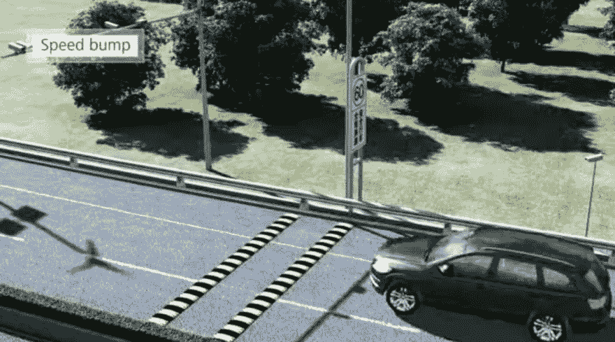
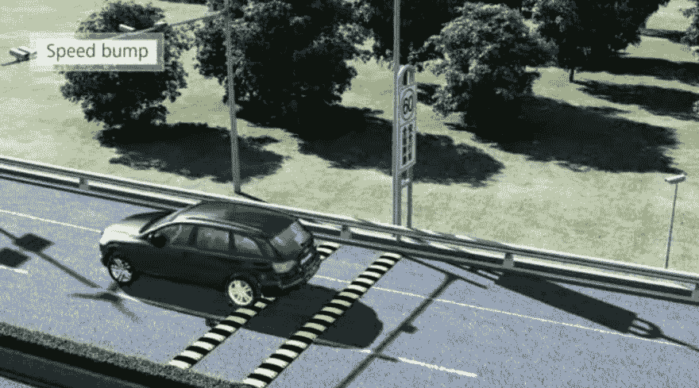
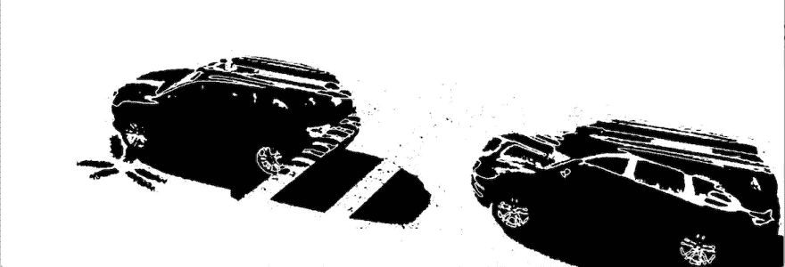
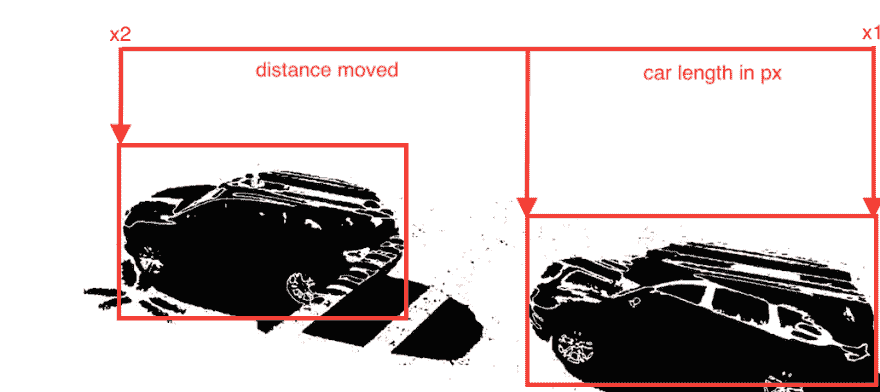

# 从两幅图像中检测汽车速度

> 原文:[https://dev.to/ore/detecting-speed-of-a-car-from-two-images](https://dev.to/ore/detecting-speed-of-a-car-from-two-images)

# 简介

本文面向计算机视觉的初学者和专家。我希望这个帖子能让ðÿ™ðÿ法官满意。

## 问题

我们已经有了运动传感器，可以轻松完成这类事情，但如果我们想使用计算机视觉，事情就变得棘手了。如何从图片中获得速度，起初似乎是不可能的，但读完这篇文章后，希望事情会变得更好。

## 接近

为此，我们需要遵循以下步骤

*   将两幅图像输入我们的应用程序- *显然是*ðÿ˜‚
*   得到两个图像之间的差异
*   从图像差异计算ðÿš—ðÿ'

听起来很简单，对吗？让我带你去ðÿž

## 将图像输入我们的应用程序

我们使用 JAVA 提供的默认缓冲图像类来读取指定了路径的文件。

*实施*

```
BufferedImage image1 = ImageIO.read(new File(img1));
BufferedImage image2 = ImageIO.read(new File(img2)); 
```

<svg width="20px" height="20px" viewBox="0 0 24 24" class="highlight-action crayons-icon highlight-action--fullscreen-on"><title>Enter fullscreen mode</title></svg> <svg width="20px" height="20px" viewBox="0 0 24 24" class="highlight-action crayons-icon highlight-action--fullscreen-off"><title>Exit fullscreen mode</title></svg>

[](https://res.cloudinary.com/practicaldev/image/fetch/s--_ztjmEGm--/c_limit%2Cf_auto%2Cfl_progressive%2Cq_auto%2Cw_880/https://thepracticaldev.s3.amazonaws.com/i/khx9i1gjjai315ygonkw.PNG) 
*第一幅图像*
[](https://res.cloudinary.com/practicaldev/image/fetch/s--T3alQ25R--/c_limit%2Cf_auto%2Cfl_progressive%2Cq_auto%2Cw_880/https://thepracticaldev.s3.amazonaws.com/i/2wf68l7av82kkyb5vevh.PNG) 
*第二幅图像*

## 图像相减得到差值

现在我们有了两幅图像，然后我们执行图像减法。你可能想知道什么是图像减法。图像实际上是由许多像素值组合而成的阵列。
图像减法用最简单的话来说就是*寻找一幅图像中的每一个像素与另一幅图像中对应像素的差值。*为了执行图像相减，两幅图像需要具有相同的分辨率(*，因为我们从一幅图像中减去另一幅图像中的每个像素*)。
当我们减去图像时，我们设置一个*阈值*并将任何高于阈值的像素值设置为黑色，将低于阈值的像素值设置为白色(*我们这样做是因为我们希望在减去图像后看到黑色的汽车*

*实施*

```
public BufferedImage ImageSubtract(BufferedImage img1 , BufferedImage img2){

    int imageheight = img1.getHeight();
    int imagewidth = img1.getWidth();   

    WritableRaster image1 = img1.getRaster();
    WritableRaster image2 = img2.getRaster();

    // pixel values have their, red , green and blue components

    int diffred;    
    int diffblue;
    int diffgreen;

    // set threshold for subtraction

    Color treshold = new Color(30,30,30);

    // Create an empty image
    BufferedImage DiffImage = new BufferedImage(imagewidth,imageheight,BufferedImage.TYPE_INT_RGB);

    for(int y = 0 ; y < imageheight ; y++){    
        for( int x = 0 ; x < imagewidth ; x++){
        diffred = Math.abs( image1.getSample(x, y, 0) - image2.getSample(x,y,0));
        diffgreen = Math.abs(image2.getSample(x,y,1) - image1.getSample(x, y, 1));
        diffblue = Math.abs(image2.getSample(x,y,2) - image1.getSample(x, y, 2)); 

            // combine individual rgb components to give one color

            Color diff = new Color(diffred,diffgreen,diffblue);
        DiffImage.setRGB(x, y, diff.getRGB());

            // to visualize the differences in the image

            if(DiffImage.getRGB(x, y) < treshold.getRGB()){
            diff= Color.WHITE;
        DiffImage.setRGB(x, y,diff.getRGB());
            }
        else{
            diff = Color.BLACK;
            DiffImage.setRGB(x,y,diff.getRGB());
        }
    }
    }
    try {
        // write the result image to a file
        ImageIO.write(DiffImage,"jpg",new File("MotionDetected.jpg"));
    } catch (IOException e) { e.printStackTrace(); }        
        return DiffImage;
    } 
```

<svg width="20px" height="20px" viewBox="0 0 24 24" class="highlight-action crayons-icon highlight-action--fullscreen-on"><title>Enter fullscreen mode</title></svg> <svg width="20px" height="20px" viewBox="0 0 24 24" class="highlight-action crayons-icon highlight-action--fullscreen-off"><title>Exit fullscreen mode</title></svg>

[](https://res.cloudinary.com/practicaldev/image/fetch/s--Yk8jHBXl--/c_limit%2Cf_auto%2Cfl_progressive%2Cq_auto%2Cw_880/https://thepracticaldev.s3.amazonaws.com/i/lvma4uh5m26bcn1j3hge.png) 
*结果图像*

## 从图像差异计算速度

既然我们已经看到了不同之处，现在是ðÿ•ðÿ“有趣”的时候了。从图像中获取速度。对此，我们应用了一些有趣的逻辑
*免责声明:可能有更好的方法来实现这一点，但我正在寻找最容易解释的方法*

我们浏览“差异”图像，然后选择您找到的第一个黑色像素，然后保存它。然后，我们再次运行“差异”图像，然后选择我们找到的最后一个黑色像素。

现在必须做出一些假设

*   第一张和第二张照片之间的时间大约是 5 秒
*   用于拍照的相机的假定放大倍数
*   以毫米为单位的汽车长度(比如 6000 毫米)

一旦做出这些假设，我们就把汽车的长度转换成像素，这样更方便，然后得到移动的距离，
`distance_moved = Math.abs(x2 - x1) - car_length_in_px;`
我们用像素减去汽车的长度，因为移动的距离是从汽车的前面开始的。
我们接着求解速度
`speed = (double) distance_moved / timepassed;`

*更多详情下面*
[](https://res.cloudinary.com/practicaldev/image/fetch/s--l31oAYrr--/c_limit%2Cf_auto%2Cfl_progressive%2Cq_auto%2Cw_880/https://thepracticaldev.s3.amazonaws.com/i/oo330kthg8tmr2waqj0h.png)

*实施*

```
public double SpeedCalc(BufferedImage img){
        double speed = 0.0;
        int x1 = 0;
        int x2 = 0;
        WritableRaster newImg = img.getRaster();
        for(int y = 0; y< img.getHeight(); y++){
            for(int x = 0; x < img.getWidth(); x++){
                if( newImg.getSample(x, y, 0)== 0){
                    x1 = x; // thats the the first x black value
                    break;
                }
                else{
                    continue;
                }
            }
            if(x1 > 0){
                break;
            }
        }
        for(int y=0; y< img.getHeight(); y++){
            for(int x = 0; x<title>Enter fullscreen mode</title></svg> <svg width="20px" height="20px" viewBox="0 0 24 24" class="highlight-action crayons-icon highlight-action--fullscreen-off"><title>Exit fullscreen mode</title></svg>

*结果*

```
$ java MotionDetection images/car_moving_final_1.PNG images/car_moving_final_2.PNG
The resulting difference of the image is stored in MotionDetected.jpg
Time Passed between 2 images 7 seconds 
Final Position of Car:370, Initial Position of Car:1311 
Speed of car is 0.63 metres/second 
```

<svg width="20px" height="20px" viewBox="0 0 24 24" class="highlight-action crayons-icon highlight-action--fullscreen-on"><title>Enter fullscreen mode</title></svg> <svg width="20px" height="20px" viewBox="0 0 24 24" class="highlight-action crayons-icon highlight-action--fullscreen-off"><title>Exit fullscreen mode</title></svg>

如果你想看完整的源代码
[【https://github.com/oreHGA/Speed-Detector】](https://github.com/oreHGA/Speed-Detector)，这里有一个 github 回购的链接

谢谢你和我一起乘车！ðÿ'ðÿ“ðÿ'