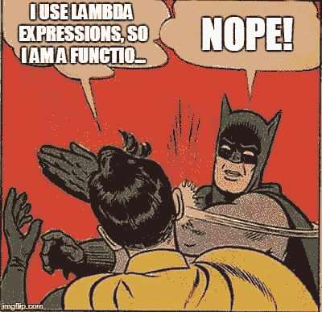
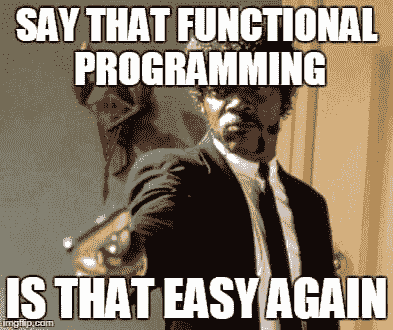
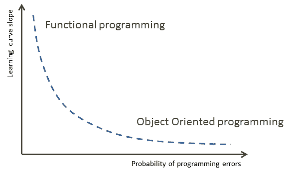

# 面向对象编程反击了！

> 原文:[https://dev . to/riccardo _ cardin/面向对象编程反击](https://dev.to/riccardo_cardin/object-oriented-programming-strikes-back)

*原贴于:[大泥球](http://rcardin.github.io/)T3】*

*声明:帖子包含一些幽默。如果你对幽默很敏感，请不要继续阅读。*

最近我在 DZone 上读了文章[开始怀疑面向对象编程](https://dzone.com/articles/beginning-to-doubt-object-oriented-programming-1)。这不是我在博客上发现的第一篇赞扬函数式编程相对于面向对象编程的文章。对于所有这些帖子，面向对象编程已经死了(或多或少)。我认为，在所有这些帖子的基础上，对函数式编程到底是什么存在误解。现在是时候让我对不同编程范例之间的斗争发表自己的意见了。

首先我想说，我尊重上述文章作者的意见。我要说的是我对这个问题的个人观点。在这个难题上没有绝对正确或绝对错误的观点。所以，祝大家平安和爱。

## 什么是函数式编程？

我认为，为了更好地理解我对函数式编程的观点，首先理解这个术语的含义是很重要的。

> 在计算机科学中，函数式编程是一种编程范式[..]将计算视为数学函数的评估，并避免改变状态和可变数据。

这是维基百科给出的定义。你读过任何关于λ表达式的参考资料吗？没有。所以，在你的代码中滥用 lambda 表达式并不意味着你在使用函数式编程范式。

[T2】](https://res.cloudinary.com/practicaldev/image/fetch/s--OqpGjxLw--/c_limit%2Cf_auto%2Cfl_progressive%2Cq_auto%2Cw_880/https://i.imgflip.com/1sy6bf.jpg)

首先，你需要*引用透明*，这意味着任何时候用相同的输入调用一个函数**必须**返回相同的输出。正确实现参照透明性的前提是状态的*不变性*。一旦一个结构(我们能不能说一个*型*？)被创建，则不能以任何方式对其进行修改。

容易吗？引用透明意味着没有副作用，没有抛出异常，没有来自外部资源的读取等等。没有这些能力，我们怎么能有生产力呢？

### 故事的艰难部分

看来我们被困在黑洞里了，不是吗？我不能在函数内部产生副作用(没那么糟糕)，我不能向函数调用方发出信号，告诉他们可能会出错，我不能访问任何外部资源。哦天哪！

你听说过*幺半群*、*函子*、*幺半群*吗？这些结构直接来自于数学分支的范畴理论。描述这些结构在这篇文章的范围之外，但是让我们做一些例子。

我很确定你在代码中至少使用了一些单子。如果你是一个 Scala 开发者，很可能你使用了`Option[T]`类型，或者`Either[T, E]`，或者任何一种集合，比如`List[T]`、`Set[T]`等等。如果你是一名 Java 开发者，你可以考虑像`Optional<T>`、`Collection<T>`和`Stream<T>`这样的类型。所有这些类型都是单子。

从行为的角度来看，这些类型没有任何共同点，这意味着单子是一种在彼此不直接相关的不同类型之间共享某些属性(基本上是代码重用)的机制。这是什么意思？引用书 [Scala 设计模式](https://www.amazon.com/Scala-Design-Patterns-Ivan-Nikolov/dp/1785882503)，

> 单子是将计算表示为步骤序列的结构。单子对于构建管道是有用的，它将带有副作用的操作干净地添加到一种一切都是不可变的语言中。

让我们借用 Scala 中的优秀书籍[函数式编程中单子的定义](https://www.manning.com/books/functional-programming-in-scala)

> 单子是单子组合子的最小集合之一(即`unit`和`flatMap`)的实现，满足结合律和恒等式。

一元组合子？结合性？身份？独角兽？Wtf？！！？我是一个简单的开发人员:我听说数学，我改变编程范式。

[T2】](https://res.cloudinary.com/practicaldev/image/fetch/s--VhhyK1BA--/c_limit%2Cf_auto%2Cfl_progressive%2Cq_auto%2Cw_880/https://i.imgflip.com/1sydmc.jpg)

我想把这篇论文带向何方？真正的函数式编程真正处理的是数学规律和理论。如果你遵循这些法则开发你的程序，你将会受益于一系列直接来自数学理论的良好特性，比如可组合性、可测试性、线程限制。

然而，你需要研究和学习数学。范畴论的点滴会打湿你的脸。

## 面向对象编程

面向对象编程怎么样？你听说过你必须遵循的枯燥的数学定律吗？你听说过像单子或函子，或其他什么深奥的术语吗？你曾经在你的面向对象程序中应用过一些数学理论吗？

没有。面向对象编程的美妙之处在于它几乎不涉及数学。每个人都可以开始学习一门面向对象的编程语言，比如 Java、C++或者 Kotlin。乍一看，面向对象编程非常接近我们如何感知现实的**。**

 **作为生活在世界幸运部分的人类，我们知道每辆汽车都是由一个引擎、一些轮子、一个车身等等组成的。我们理解一个`Car`类型意味着什么，以及为什么它拥有类型`Engine`、`Wheel`和`Body`的属性。

面向对象编程比函数式编程更容易学习。停下来。这是唯一的真理。这两种范式从计算机时代开始就或多或少的存在(比如想想诞生于 1958 年的 Lisp)。你听说过用函数式编程语言编写的操作系统吗？没有。

### 简单导致折衷

更简单意味着约束更少。更少的约束意味着尊重更少的形式。不那么正式意味着更容易以错误的方式使用编程语言的特性。

以我们刚刚给出的单子的定义为例。在定义中，一个类型被认为是单子所必须满足的约束是明确的。数学不会说谎。

现在，以任何面向对象编程的原则为例:例如，单一责任原则。该原则指出

> 一个类应该只有一个改变的理由。

改变的*理由是什么？适用于函数式编程语言的原理所具有的数学魔力在哪里？没有痕迹。*

耦合的*定义是所有面向对象编程相关理论的基础，也没有以正式的方式定义。*

> 组件之间的耦合精确地度量了它们的依赖程度。

好的，那么，我如何度量组件之间的依赖程度呢？没有正式的方式。在我过去的一篇文章 [Dependency](http://rcardin.github.io/programming/oop/software-engineering/2017/04/10/dependency-dot.html) 中，我试图给出这类概念的数学定义，但这只是一次尝试。

原则定义的不严谨导致了原则的解释。个人解读往往会导致错误和不良做法。

## 结论

在讨论了函数式编程和面向对象编程范例之间的差异之后，我们发现并理解了一个重要的概念，即:

一门编程语言越容易学，使用它就越容易出错。

下图试图直观地展示这个句子的意思。

最后，面向对象编程语言不会有任何发展。我们将继续使用它们，因为它们简单易学。函数式编程语言也将继续存在。每次我们需要确保一些与我们的程序相关的好属性时，它们都会给我们很大的帮助。

这个世界充满了权衡。因此，停止编程范例之间的战争，开始从双方的力量中获得最佳效果。

[T2】](https://res.cloudinary.com/practicaldev/image/fetch/s--XyQZBwrl--/c_limit%2Cf_auto%2Cfl_progressive%2Cq_auto%2Cw_880/https://i.imgflip.com/1tfz4g.jpg)

## 参考文献

*   [维基百科上的函数式编程](https://en.wikipedia.org/wiki/Functional_programming)
*   [第十一章。单子。Scala 中的函数式编程，保罗·丘萨诺和鲁纳·比雅纳松，2014 年，曼宁出版社](https://www.manning.com/books/functional-programming-in-scala)
*   [单子，第一章。《设计模式和设置您的环境》，Ivan Nikolov，2016 年，Packt Publishing](https://www.amazon.com/Scala-Design-Patterns-Ivan-Nikolov/dp/1785882503)
*   第八章:单一责任原则。C#中的敏捷原则、模式和实践，罗伯特·C·马丁，弥迦·马丁，2006 年，普伦蒂斯霍尔
*   [依赖。](http://rcardin.github.io/programming/oop/software-engineering/2017/04/10/dependency-dot.html)**