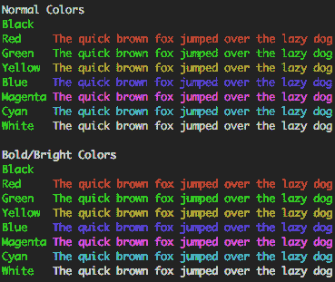

# 使用 rgblog 进行格式化

> 原文:[https://dev.to/foresthoffman/go-formatting-with-rgblog](https://dev.to/foresthoffman/go-formatting-with-rgblog)

我的一个项目涉及到大量的控制台输出，为了让它可读，我添加了一些颜色。青色表示重要消息，红色表示错误，黄色表示正常(一切正常)日志。

简而言之:我想在别的地方做同样的事情，所以我出版了它。

如果你是一个 Go 开发者，想要一些快速简单的函数来给东西上色，那就试试吧。

如果你想看自述文件，这里有 [GitHub repo](https://github.com/foresthoffman/rgblog) 。或者，您可以直接`go get github.com/foresthoffman/rgblog`并立即使用它。

如果您想看看颜色会是什么样子，不需要下载软件包，您可以在您的 shell 中运行以下代码:

```
echo -e " \033[0;37mNormal Colors\033[0m
Black\t\033[0;30mThe quick brown fox jumped over the lazy dog\033[0m
Red\t\033[0;31mThe quick brown fox jumped over the lazy dog\033[0m
Green\t\033[0;32mThe quick brown fox jumped over the lazy dog\033[0m
Yellow\t\033[0;33mThe quick brown fox jumped over the lazy dog\033[0m
Blue\t\033[0;34mThe quick brown fox jumped over the lazy dog\033[0m
Magenta\t\033[0;35mThe quick brown fox jumped over the lazy dog\033[0m
Cyan\t\033[0;36mThe quick brown fox jumped over the lazy dog\033[0m
White\t\033[0;37mThe quick brown fox jumped over the lazy dog\033[0m \033[1;37mBold/Bright Colors\033[0m
Black\t\033[1;30mThe quick brown fox jumped over the lazy dog\033[0m
Red\t\033[1;31mThe quick brown fox jumped over the lazy dog\033[0m
Green\t\033[1;32mThe quick brown fox jumped over the lazy dog\033[0m
Yellow\t\033[1;33mThe quick brown fox jumped over the lazy dog\033[0m
Blue\t\033[1;34mThe quick brown fox jumped over the lazy dog\033[0m
Magenta\t\033[1;35mThe quick brown fox jumped over the lazy dog\033[0m
Cyan\t\033[1;36mThe quick brown fox jumped over the lazy dog\033[0m
White\t\033[1;37mThe quick brown fox jumped over the lazy dog\033[0m
" 
```

<svg width="20px" height="20px" viewBox="0 0 24 24" class="highlight-action crayons-icon highlight-action--fullscreen-on"><title>Enter fullscreen mode</title></svg> <svg width="20px" height="20px" viewBox="0 0 24 24" class="highlight-action crayons-icon highlight-action--fullscreen-off"><title>Exit fullscreen mode</title></svg>

在我看来是这样的:

[T2】](https://res.cloudinary.com/practicaldev/image/fetch/s--94NRKqw6--/c_limit%2Cf_auto%2Cfl_progressive%2Cq_auto%2Cw_880/http://foresthoffman.com/wp-content/uploads/2017/08/ansi-color-table.png)

干杯！

## 学分

封面图片由[斯蒂夫·约翰森](https://unsplash.com/@steve_j?utm_source=unsplash&utm_medium=referral&utm_content=creditCopyText)在 [Unsplash](https://unsplash.com/s/photos/rainbow-letter?utm_source=unsplash&utm_medium=referral&utm_content=creditCopyText) 上拍摄！:D