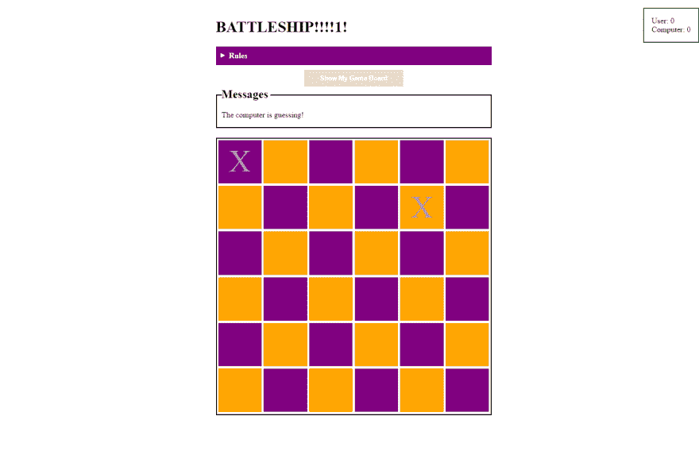

# 用你的电脑玩战舰

> 原文:[https://dev.to/tevko/playing-battleship-with-your-computer](https://dev.to/tevko/playing-battleship-with-your-computer)

[T2】](https://res.cloudinary.com/practicaldev/image/fetch/s--g101Xe4L--/c_limit%2Cf_auto%2Cfl_progressive%2Cq_auto%2Cw_880/https://timevko.website/blog/wp-content/uploads/2017/06/battleship-screen.png)

最近，在一家公司发给我一个基于相同概念的编码挑战后，我决定做一个游戏(实际上我从未完成)。挑战在于围绕游戏[战舰](https://en.wikipedia.org/wiki/Battleship_(game))构建一个 API。我认为把它变成一个前端项目会很有趣，这就是我最终做的。

首先，我决定使用一个 6°—6 的网格，其中每一片都占据网格上的一个点。这使得游戏进行得更快，同时也使得项目更容易编码。我也有一些我想在这场比赛中实现的目标。我希望它能完全响应，离线可用，可安装在用户的设备上，并且代码尽可能简单。也就是说，我很高兴完成了所有这些目标。[前端](https://github.com/tevko/battleship-game)(根本没有后端)不使用传输、预处理或构建工具。由于 TLS、一个服务工作者和一个 manifest.json 文件，UI 完全响应迅速，可以脱机使用，并且可以安装。

虽然为了创作这个游戏，在幕后发生了很多事情，但我认为在这里分享一些特别有挑战性的方面会很有趣。

## 挑战 1——为电脑游戏板创建一组随机坐标

因为我们是在和计算机比赛，所以我们需要它给出 6 个唯一且不重复的数字对，从 1 到 6 ([1，1]，[2，2]，[3，3]等等)。为了做到这一点，我编写了一个递归函数，该函数生成一个随机集合，并将其与任何现有集合进行比较，将新集合推送到现有集合，或者如果它已经存在，则将其丢弃。看起来是这样的:

参见[码笔](https://codepen.io/)上 Tim ( [@tevko](https://codepen.io/tevko) )的笔 [jwMERQ](https://codepen.io/tevko/pen/jwMERQ/) 。

首先，我们有一个名为 usedCoords 的空数组，它将存储生成的坐标对。接下来，我们有另一个空数组，它将存储转换为字符串的坐标对的值，当我们希望确保我们的计算机游戏板没有任何重复的坐标时，这将使它们更容易测试(这是因为[2，2] === [2，2]在[2，2]时返回 false)。toString()= = = =[2，2]。toString()返回 true)。returnNewCoords 用于生成一个包含 2 个从 1 到 6 的随机数的数组，returnAvailableCoords 是一个递归函数，它返回一个新的坐标对或其自身(如果该坐标对已经被使用)。这个函数的最后一部分是一个通过我们内部状态的循环，它将每个计算机生成的坐标对分配给一个相应的血管对象。

从用户那里收集坐标的挑战性要小一些，我们通过将用户的输入存储在 12 个单独的输入元素上，并将这些输入与具有相应数据属性的 DOM 元素集合进行匹配来完成(用户选择 1，2 作为坐标对，因此我们向 div 添加一个数据属性与 data-coord-point="1-2 "匹配的游戏块)。

## 挑战 2——假装电脑需要时间来猜测

这让我很惊讶，但我仍然意识到，如果你自己猜完之后，电脑马上就猜，这个游戏就没有意思了。取而代之的是，电脑需要被拟人化，这样游戏就不会感觉机械。翻译:它需要感觉计算机在“思考”。尽管计算机需要几毫秒才能给出坐标猜测，但我们需要等待几秒钟才能向用户显示该猜测。

随着我慢慢开始意识到，为了感觉更真实，整个游戏需要一点人为的延迟。我决定保持简单，使用 setTimeout 来创建每个特定动作后的延迟。在整个代码库中，你会发现很多这样的例子。

## 挑战 3–CSS

虽然这个游戏的设计是最小的(不存在会是一个更好的术语)，但一个独特的挑战以必须创建一个响应的棋盘的形式出现。我最初的策略是以基于百分比的宽度将每个棋盘显示为内嵌块项目，但是当屏幕尺寸变小时，这很快就失败了。最终，我发现使用基于 flexbox 的布局，结合填充顶部百分比值来创建每个项目的高度，将允许每个 checker 成比例缩放，而不管屏幕大小。至于平铺的背景，我使用第 n 个子选择器将每隔一个平铺的背景设置为紫色，而不是橙色。我很想说，我使用了一些神奇的公式来计算第 n 个子块应该是什么，以使它看起来完美，但这真的只是一个小时左右的沮丧谷歌结合试错，直到它看起来正确。你可以在这里看到这一切:

参见[码笔](https://codepen.io/)上 Tim ( [@tevko](https://codepen.io/tevko) )的笔 [XaRJVO](https://codepen.io/tevko/pen/XaRJVO/) 。

## 下一步

我想给这个游戏添加的下一个特性是，当用户离开页面或者意外刷新时，浏览器能够记住用户的游戏状态。这可以通过在状态更新时将序列化的状态对象保存到浏览器的 localStorage 来实现，然后在页面加载时检查该状态对象，并将该对象用作新状态。此外，如果用户不想在每次想玩游戏时都填写表单，那么单击一个按钮就自动填写用户面板的能力会带来更好的体验。

[你可以在这里玩游戏](https://tevko.github.io/battleship-game/)