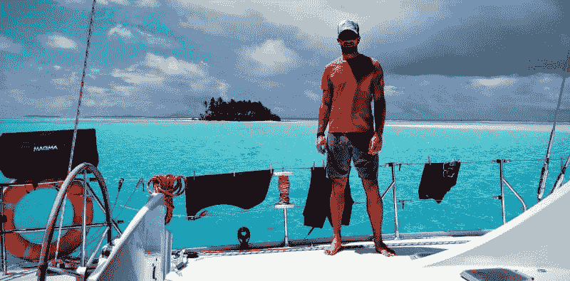
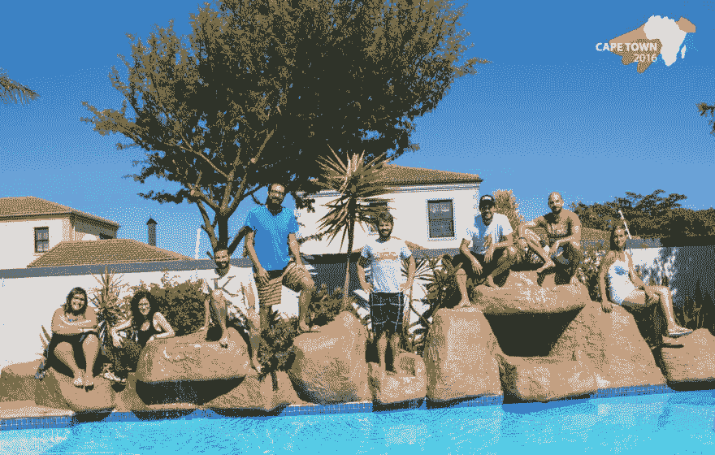

# 为什么生活方式企业胜过创业公司

> 原文：<https://dev.to/bugfenderapp/why-a-lifestyle-business-beats-a-startup>

[T2】](https://res.cloudinary.com/practicaldev/image/fetch/s--53JNWD8v--/c_limit%2Cf_auto%2Cfl_progressive%2Cq_auto%2Cw_880/https://bugfender.com/wp-content/uploads/2017/08/01-Treasure-Island.jpg)

你可能会认为上面的图片来自一个股票摄影网站。通常我也会这么想。但在这种情况下，我其实更清楚。就在一个月前，我在穿越南太平洋密克罗尼西亚的帆船上远程工作时，自己拍摄了这张照片。听起来不可能，对吧？不管怎样，我们设法做到了。

许多人梦想每天做他们喜欢的事情，并以此过上好日子。但是只有一小部分人认为这是可能的。毕竟，你怎么能在享受乐趣的同时盈利地工作呢，对吗？

秘密在于你创建的企业类型。一个生活方式的企业将会给你**机会来优化你的幸福生活**，而不是启动一个创业公司和发展一个大公司。

## 生活方式企业的好处

任何成功建立生活方式企业的人都会证明这种方法的好处，尤其是与启动和建立一家初创公司相比。

每个人都知道创业需要大量的资金和大量的时间投入才能成功。但是，有了一个看起来很棒的商业想法，并说服投资者为一家新的创业公司投资，你可以想象如果发现这家公司不适合你会有多沮丧。如果事实证明你并不像你想象的那样喜欢自己的商业理念，你可能会发现自己被困住了，实际上成了它的囚徒。

[T2】](https://res.cloudinary.com/practicaldev/image/fetch/s--gDutA0sI--/c_limit%2Cf_auto%2Cfl_progressive%2Cq_auto%2Cw_880/https://optimizingforhappiness.com/wp-content/uploads/2016/05/Sailing-Boat-Stefan-Treasure-Island-800x395.jpg)

Mobile Jazz 首席执行官斯特凡·克兰普在密克罗尼西亚的一艘帆船上远程工作

现实是，在一家初创公司，你不是老板。即使你是首席执行官、首席运营官或董事总经理，你的投资者也总是有最后的决定权，他们唯一的兴趣是最大化他们的回报。另一方面，在生活方式业务中，你保持完全的控制权。你可以精确地控制你想花多少时间去赚钱，花多少时间去享受生活。

## 经营一家生活方式企业并不意味着你最终会变穷

最大化你的生活质量并不意味着你不能过上好日子。如果你想要的话，一个好的生活方式企业甚至可以变成一个价值数百万美元的公司。经营一家生活方式企业当然不意味着你会变穷；都是优先级的问题。

这是一种误解，认为赚钱的唯一方法是启动并发展一家初创公司，然后再出售它。虽然许多初创公司确实以一次性支付的巨额款项被出售，但要实现这一目标，必须做出许多牺牲——尤其是生活方式。如果你没有时间去享受，那么有很多钱又有什么意义呢？

[T2】](https://res.cloudinary.com/practicaldev/image/fetch/s--IBOop_8i--/c_limit%2Cf_auto%2Cfl_progressive%2Cq_auto%2Cw_880/https://optimizingforhappiness.com/wp-content/uploads/2016/05/Summer-Camp-Kayak-800x600.jpg)

我们决定将利润用于和团队一起做一些很酷的事情，而不是为创始人购买法拉利。

事实是，许多有利可图的企业，从大公司到小企业，都能够产生非常健康的月收入。我们自己的网络和移动应用开发公司 [Mobile Jazz](https://mobilejazz.com) 创造了大量高利润的业务。我们相信这是因为我们投入业务的工作质量和我们长期以来建立的声誉。我们也毫不怀疑，任何人或企业，如果在他们所做的事情上投入了大量的工作，并建立了良好的声誉，最终将为他们吸引业务。**让人开心，钱就跟着来了**。

## 关注生活方式并不意味着你不成功

成功有许多不同的方式。以 5000 万美元的价格卖掉你的公司只是成功的一个标志，一个星期后，每个人都已经忘记了那个新闻标题！

在 Mobile Jazz，我们专注于小而持续的成功故事。我们参与了许多创业项目，几乎每个月我们都会宣布一个与谷歌、空中客车和惠普等领先合作伙伴合作的成功的新项目。但事实是，我们已经建立并继续建立一种生活方式的业务，这意味着我们可以偶尔休息一周，一起去滑雪。**对我们来说，这就是成功**。

[T2】](https://res.cloudinary.com/practicaldev/image/fetch/s--jaL7BfY6--/c_limit%2Cf_auto%2Cfl_progressive%2Cq_auto%2Cw_880/https://optimizingforhappiness.com/wp-content/uploads/2016/05/MJ-Skiing-2016-800x800.jpg)

每年冬天我们都会花一周时间一起去滑雪？为什么？因为我们可以。

我们不打算为了推销我们的公司而出现在新闻或社交媒体上。我们优先考虑的是我们的生活方式，我们每年为员工在异国他乡如泰国、巴厘岛和南非举办的多次静修活动吸引了相当多的线上和线下关注。

## 你不必考虑规模

当你创建一家初创公司时，作为首席执行官，对你来说最重要的是尽快扩大业务规模，这样你就能尽快占据市场主导地位。这对投资者来说也很重要。一个成功的首席执行官会实现这个目标，但对大多数企业家来说，实现这个目标是有压力的，通常会对他们的个人健康留下情感和身体上的痕迹。

[T2】](https://res.cloudinary.com/practicaldev/image/fetch/s--2Spx8HiQ--/c_limit%2Cf_auto%2Cfl_progressive%2Cq_auto%2Cw_880/https://optimizingforhappiness.com/wp-content/uploads/2016/05/mj-cape-town-pool-logo.jpg)

在南非开普敦的一个公司静修处的移动爵士乐小组。

相比之下，当你建立一个生活方式的企业时，你唯一的目标是确保企业有足够的利润来维持你和你的团队的工资。任何**剩余的钱**都可以**投资到你团队内部项目中有趣的事情**上。或者，如果你愿意，你可以决定少工作，享受与家人或朋友在一起的自由时光，或者专注于自己的爱好。因此，你不去考虑规模，而是专注于做你真正想做的事情的优质时间。

## 你不必和官僚机构打交道

从本质上来说，初创公司在起步时规模很小。但最终大多数创业的人发现，他们的日程已经排满了会议。可悲的是，这些大多是不必要的或令人不快的，通常两者都有。他们发现，创意和创新的早期预发布时代已经一去不复返了。

[T2】](https://res.cloudinary.com/practicaldev/image/fetch/s--0SEHMId_--/c_limit%2Cf_auto%2Cfl_progressive%2Cq_auto%2Cw_880/https://optimizingforhappiness.com/wp-content/uploads/2016/05/Himalayas-800x600.jpg)

首席执行官斯特凡·克伦普将离线一个月，徒步攀登尼泊尔的喜马拉雅山。他领导着一个 20 人的小团队，他可以完全信任这个团队，没有投资者会妨碍他，告诉他应该如何经营自己的企业。

在 Mobile Jazz，我们经过深思熟虑后决定:**保持一个小型但技术高超的团队,**不需要等级制度，因此不会发展成官僚机构。我们以生活方式为导向的方法让我们能够自由地不断创新，开发新的有趣的想法，甚至不时地重塑自我。

## 你有随时改变主意的自由

一个简单的事实是，你控制着你的生活方式业务，而不是你的投资者，你有做任何你选择做的事情的自由。

例如，在 Mobile Jazz 做了四年的纯咨询后，我们决定启动我们的内部工具之一 [Bugfender，](https://bugfender.com)作为一项产品生成资产，为公司带来额外收入。

[T2】](https://res.cloudinary.com/practicaldev/image/fetch/s--2eK6sOSz--/c_limit%2Cf_auto%2Cfl_progressive%2Cq_auto%2Cw_880/https://optimizingforhappiness.com/wp-content/uploads/2016/05/20140721-0118.jpg)

我们的一个很酷的实验:全自动 Nespresso 点餐机。

**为快乐而优化**是一项倡议，更像是一项实验。因此，通过在 Mobile Jazz 中使用 O4H 理念，我们能够做出这一大胆的举动。如果我们一直在一个有明确目标和期望的初创企业的范围内工作，这种举动永远不会被批准。

## 一切都是为了人民

虽然初创公司最初对大多数人来说很有趣，尤其是当三个创始人被迫夜以继日地呆在一个小房间里，靠披萨生存(这可能很有趣，但不健康)时，这些日子不会永远持续下去。要让任何创业公司成功，你需要完全专注于你的商业目标，朝着赚钱并最终回报给投资者的目标前进。

另一方面，移动爵士乐是关于人的。每个人都可以**在任何他们想去的地方远程工作**，你可以选择**你想工作的时间**。也许你想兼职学习哲学？我们没意见。此外，我们希望公平对待我们的员工。我们不仅支付行业最高工资，还通过奖金计划分享公司利润。

尽管我们是同事，但我们视对方为朋友，而且我们在工作之外的很多时间都在一起。这可能是在烧烤，去[风筝冲浪](https://mobilejazz.com/blog/how-we-kept-business-running-while-learning-to-kitesurf-in-tarifa/)或滑雪假期，或者只是当我们的孩子一起玩耍时聚在一起。

[T2】](https://res.cloudinary.com/practicaldev/image/fetch/s--X5HB7xrW--/c_limit%2Cf_auto%2Cfl_progressive%2Cq_auto%2Cw_880/https://optimizingforhappiness.com/wp-content/uploads/2016/05/MJ-Summer-Camp-2014-800x533.jpg)

有时候我们只是租个别墅过个周末，和家人一起闲逛。分享美好的生活，享受朋友、伙伴和孩子的陪伴。

归根结底，让你的生活方式事业成功不仅仅取决于你，还取决于你的所有员工。他们越快乐，越投入，对每个人都越好。

记住，**生活就是经历和与你分享经历的人。工作是每个人生活中很大的一部分。所以不要掉以轻心，一定要让自己得到最大的收获。**

如果你想了解更多关于如何开始一个生活方式的生意，发展你的公司文化，让你的生意更成功，请访问[优化幸福](https://www.optimizingforhappiness.com/)。