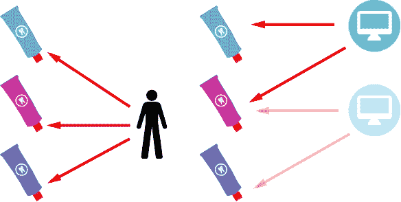

# SQL 案例和 R 粘贴

> 原文:[https://dev.to/ladvien/sql-case-and-r-paste-3l5h](https://dev.to/ladvien/sql-case-and-r-paste-3l5h)

## SQL 案例

SQL `CASE`函数是我最喜欢的函数之一。该命令基本上类似于 if-then 命令。如果您熟悉 if-then 命令，那么可以跳过这一步。

### 如果——那么

我们今天拥有令人惊叹的设备的原因之一是因为计算机具有推理能力。电脑可以比较两个东西，决定喜欢哪一个。

现在，这可能听起来很简单，但它实际上是一个微妙的奇迹。任何被困在牙膏岛上试图在 45 种牙膏中做出选择的人可能都知道做决定是困难的。当然，人类决策和计算机决策甚至不在一个层面上。人类可以同时对所有 45 种产品进行比较(某种程度上)。计算机必须在两个对象之间做出决定，然后，两个对象，然后两个对象，等等，直到它完成所有 45 个。幸运的是，计算机可以快速做出这些决定。

[T2】](https://res.cloudinary.com/practicaldev/image/fetch/s--A-N6DRno--/c_limit%2Cf_auto%2Cfl_progressive%2Cq_auto%2Cw_880/https://ladvien.cimg/toothpaste-decision.svg)

在计算机编程中，我们称这个计算机决策过程为控制流。但是为了更好的理解，让我们写一些伪代码:

```
 If (Computer Likes Toothpaste 1) then buy Toothpaste 1 
```

<svg width="20px" height="20px" viewBox="0 0 24 24" class="highlight-action crayons-icon highlight-action--fullscreen-on"><title>Enter fullscreen mode</title></svg> <svg width="20px" height="20px" viewBox="0 0 24 24" class="highlight-action crayons-icon highlight-action--fullscreen-off"><title>Exit fullscreen mode</title></svg>

很简单，对吧？电脑唯一做不到的就是自己决定喜不喜欢牙膏 1。我们必须给它编程来做到这一点。

嗯，如果一台计算机正在试图决定买牙膏还是不买牙膏，这句话是有道理的，但如果有两种以上的牙膏选项呢？我们只是创建了另一个 if-then 语句。

```
 If (Computer Likes Toothpaste 1 Best) then buy Toothpaste 1
    If (Computer Likes Toothpaste 2 Best) then buy Toothpaste 2 
```

<svg width="20px" height="20px" viewBox="0 0 24 24" class="highlight-action crayons-icon highlight-action--fullscreen-on"><title>Enter fullscreen mode</title></svg> <svg width="20px" height="20px" viewBox="0 0 24 24" class="highlight-action crayons-icon highlight-action--fullscreen-off"><title>Exit fullscreen mode</title></svg>

因为计算机是按顺序做出决定的，所以如果它买了牙膏 1，它就不会买牙膏 2。然而，如果他不是最喜欢牙膏 1，那么如果他认为牙膏 2 是最好的，他会买它。否则他不会买任何牙膏——这有道理，电脑没有牙齿。

这几乎是我们需要知道的关于`if-then`的一切，还有两个小捕捉。

首先，如果电脑不喜欢任何牙膏，不想让他就这么放弃，我们该怎么办？我们需要一种方式来说，“看，计算机，如果你不喜欢任何牙膏，那么去寻求帮助。”

在编程中，这被称为`if-then-else`语句。它们与`if-then`类似，但有一个意外条款，如果出现问题。

我们来看看:

```
 if (Computer Likes Toothpaste 1 Best) then buy Toothpaste 1
    if (Computer Likes Toothpaste 2 Best) then buy Toothpaste 2
    else Go Ask a Computer Dentist what to buy 
```

<svg width="20px" height="20px" viewBox="0 0 24 24" class="highlight-action crayons-icon highlight-action--fullscreen-on"><title>Enter fullscreen mode</title></svg> <svg width="20px" height="20px" viewBox="0 0 24 24" class="highlight-action crayons-icon highlight-action--fullscreen-off"><title>Exit fullscreen mode</title></svg>

好了，就这样。现在让我们把它应用到 SQL 中。

### SQL 案例当

SQL 以多种方式应用 if-then 逻辑。我们已经看过了`WHERE`语句，它基本上像`if-then`一样工作。

```
 SELECT * FROM data WHERE Name = 'Bob' 
```

<svg width="20px" height="20px" viewBox="0 0 24 24" class="highlight-action crayons-icon highlight-action--fullscreen-on"><title>Enter fullscreen mode</title></svg> <svg width="20px" height="20px" viewBox="0 0 24 24" class="highlight-action crayons-icon highlight-action--fullscreen-off"><title>Exit fullscreen mode</title></svg>

看看这怎么能写成

```
 SELECT * FROM data IF Name = 'Bob' 
```

<svg width="20px" height="20px" viewBox="0 0 24 24" class="highlight-action crayons-icon highlight-action--fullscreen-on"><title>Enter fullscreen mode</title></svg> <svg width="20px" height="20px" viewBox="0 0 24 24" class="highlight-action crayons-icon highlight-action--fullscreen-off"><title>Exit fullscreen mode</title></svg>

但是最有可能用于`if-then-else`逻辑的 SQL 语句是`CASE WHEN`语句。

这里有一个在 r 中运行的例子

```
library(sqldf)  ################### Data DO NOT CHANGE ###########################  peopleDf  <-  data.frame(PersonalID=c("ZP1U3EPU2FKAWI6K5US5LDV50KRI1LN7",  "IA26X38HOTOIBHYIRV8CKR5RDS8KNGHV",  "LASDU89NRABVJWW779W4JGGAN90IQ5B2"),  FirstName=c("Timmy",  "Fela",  "Sarah"),  LastName=c("Tesa",  "Falla",  "Kerrigan"),  DOB=c("2010-01-01",  "1999-1-1",  "1992-04-01"))  ##################################################################  peopleDf1  <-  sqldf("SELECT *, 
                  CASE WHEN DOB > '2000-1-1' THEN 'Yes' ELSE 'No' END As 'Millennial' 
                  FROM peopleDf") 
```

<svg width="20px" height="20px" viewBox="0 0 24 24" class="highlight-action crayons-icon highlight-action--fullscreen-on"><title>Enter fullscreen mode</title></svg> <svg width="20px" height="20px" viewBox="0 0 24 24" class="highlight-action crayons-icon highlight-action--fullscreen-off"><title>Exit fullscreen mode</title></svg>

以下是输出:

| 个人 id | 西方人名的第一个字 | 姓 | 告发 | 性别 | 一千年的 |
| --- | --- | --- | --- | --- | --- |
| ZP 1u 3 epu 2 fkawi 6k 5 us 5 LDV 50 kri 1 ln 7 | 蒂米 | Tesa | 2010-01-01 | 男性的 | 是 |
| ia 26×38 光子鱼雷 8CKR5RDS8KNGHV | 丝状部份 | 法雅 | 1999-1-1 | 女性的 | 不 |
| lasdu 89 nrabvjww 779 w4 jggan 90 iq5b 2 | 撒拉 | 凯瑞甘 | 1992-04-01 | 女性的 | 不 |

SQL 查询，特别是`CASE WHEN`语句创建了一个名为`Millennial`的列，然后它检查每个人的出生日期，并进行比较。当查询找到一个出生于 2000 年 1 月 1 日之后的人时，它会在千禧年一栏中插入一个“是”。如果他们不是在 2000 年 1 月 1 日之后出生的，那么它会把`Millennial`一栏设置为‘否’。很棒，对吧？

注意，`ELSE`是获得‘否’所必需的。否则，查询会将其他人留空。

这里还有几个使用 CASE WHEN 获得强大结果的例子。

#### 用或用格当

```
peopleDf2  <-  sqldf("SELECT *, 
                  CASE WHEN DOB > '2000-1-1' OR FirstName = 'Sarah' THEN 'PersonIsCool' ELSE 'NotHip' END As 'Cool?' 
                  FROM peopleDf") 
```

<svg width="20px" height="20px" viewBox="0 0 24 24" class="highlight-action crayons-icon highlight-action--fullscreen-on"><title>Enter fullscreen mode</title></svg> <svg width="20px" height="20px" viewBox="0 0 24 24" class="highlight-action crayons-icon highlight-action--fullscreen-off"><title>Exit fullscreen mode</title></svg>

| 个人 id | 西方人名的第一个字 | 姓 | 告发 | 性别 | 凉爽的 |
| --- | --- | --- | --- | --- | --- |
| ZP 1u 3 epu 2 fkawi 6k 5 us 5 LDV 50 kri 1 ln 7 | 蒂米 | Tesa | 2010-01-01 | 男性的 | 人格化学校 |
| ia 26×38 光子鱼雷 8CKR5RDS8KNGHV | 丝状部份 | 法雅 | 1999-1-1 | 女性的 | 不时髦 |
| lasdu 89 nrabvjww 779 w4 jggan 90 iq5b 2 | 撒拉 | 凯瑞甘 | 1992-04-01 | 女性的 | 人格化学校 |

#### 用和用格当

```
peopleDf3  <-  sqldf("SELECT *, 
                  CASE WHEN FirstName = 'Sarah' AND LastName = 'Kerrigan' THEN 'Yes' ELSE '' 
                  END As 'Queen of Blades' 
                  FROM peopleDf") 
```

<svg width="20px" height="20px" viewBox="0 0 24 24" class="highlight-action crayons-icon highlight-action--fullscreen-on"><title>Enter fullscreen mode</title></svg> <svg width="20px" height="20px" viewBox="0 0 24 24" class="highlight-action crayons-icon highlight-action--fullscreen-off"><title>Exit fullscreen mode</title></svg>

| 个人 id | 西方人名的第一个字 | 姓 | 告发 | 性别 | 刀锋女王 |
| --- | --- | --- | --- | --- | --- |
| ZP 1u 3 epu 2 fkawi 6k 5 us 5 LDV 50 kri 1 ln 7 | 蒂米 | Tesa | 2010-01-01 | 男性的 |  |
| ia 26×38 光子鱼雷 8CKR5RDS8KNGHV | 丝状部份 | 法雅 | 1999-1-1 | 女性的 |  |
| lasdu 89 nrabvjww 779 w4 jggan 90 iq5b 2 | 撒拉 | 凯瑞甘 | 1992-04-01 | 女性的 | 是 |

#### 使用求和时用的格

结合使用`CASE WHEN`和`SUM`是获得不同离散数据计数的好方法。下面是一个获得
人口中男性和女性总数的例子

```
count1  <-  sqldf("SELECT 
                  SUM(
                      CASE WHEN Gender = 'Female' THEN 1 ELSE 0 END
                    ) As 'NumberOfFemales',
                  SUM(
                      CASE WHEN Gender = 'Male' THEN 1 ELSE 0 END
                    ) As 'NumberOfMales'
                   FROM peopleDf") 
```

<svg width="20px" height="20px" viewBox="0 0 24 24" class="highlight-action crayons-icon highlight-action--fullscreen-on"><title>Enter fullscreen mode</title></svg> <svg width="20px" height="20px" viewBox="0 0 24 24" class="highlight-action crayons-icon highlight-action--fullscreen-off"><title>Exit fullscreen mode</title></svg>

| 女性数量 | 麦芽数量 |
| --- | --- |
| Two | one |

#### 使用多个案例

到目前为止，我们只涉及了一个`if-then`语句，但是在牙膏的例子中，我们可以把它们串在一起。同样可以用`CASE WHEN`来做。

```
peopleDf4  <-  sqldf("SELECT *, CASE WHEN DOB >= '1980-01-01' AND DOB < '1990-01-01' THEN 'X'
                           WHEN DOB >= '1990-01-01' AND DOB < '2000-01-01' THEN 'Y'
                           WHEN DOB >= '2000-01-01' AND DOB < '2010-01-01' THEN 'Millennial'
                           WHEN DOB >= '2010-01-01' AND DOB < '2020-01-01' THEN 'NotYetDefined'
                           END As 'Generation'
                   FROM peopleDf") 
```

<svg width="20px" height="20px" viewBox="0 0 24 24" class="highlight-action crayons-icon highlight-action--fullscreen-on"><title>Enter fullscreen mode</title></svg> <svg width="20px" height="20px" viewBox="0 0 24 24" class="highlight-action crayons-icon highlight-action--fullscreen-off"><title>Exit fullscreen mode</title></svg>

| PersonalID | 西方人名的第一个字 | 姓 | 告发 | 性别 | 产生 |
| --- | --- | --- | --- | --- | --- |
| ZP 1u 3 epu 2 fkawi 6k 5 us 5 LDV 50 kri 1 ln 7 | 蒂米 | Tesa | 2010-01-01 | 男性的 | 尚未定义 |
| ia 26×38 光子鱼雷 8CKR5RDS8KNGHV | 丝状部份 | 法雅 | 1999-1-1 | 女性的 | Y |
| lasdu 89 nrabvjww 779 w4 jggan 90 iq5b 2 | 撒拉 | 凯瑞甘 | 1992-04-01 | 女性的 | Y |

## 粘贴

R 中的`paste()`是用来操作文本字符串的。您将字符串作为参数传递给它，它返回一个包含所有传递给它的字符串的字符串。让我们来看看。

```
greeting  <-  paste("Hello how are you,",  "Bob?") 
```

<svg width="20px" height="20px" viewBox="0 0 24 24" class="highlight-action crayons-icon highlight-action--fullscreen-on"><title>Enter fullscreen mode</title></svg> <svg width="20px" height="20px" viewBox="0 0 24 24" class="highlight-action crayons-icon highlight-action--fullscreen-off"><title>Exit fullscreen mode</title></svg>

运行这一行后，`greeting`变量包含以下字符串`Hello how are you, Bob?`。这可以通过使用`print()`T3 打印变量的内容来使用

```
print(greeting) 
```

<svg width="20px" height="20px" viewBox="0 0 24 24" class="highlight-action crayons-icon highlight-action--fullscreen-on"><title>Enter fullscreen mode</title></svg> <svg width="20px" height="20px" viewBox="0 0 24 24" class="highlight-action crayons-icon highlight-action--fullscreen-off"><title>Exit fullscreen mode</title></svg>

侧注，`print()`将实际打印出你传递给控制台的任何东西。这在调试代码时很有用。

回到我们的组合字符串，注意每当问候语打印出来时，在“you”和“Bob？”之间都会插入一个空格，这是通过粘贴自动完成的。它会在你传递给它的每个字符串之间插入一个空格，除非你传递额外的参数`sep`。该参数将接受您设置的任何内容，并将其插入到两个字符串之间。

```
greeting  <-  paste("Hello how are you,",  "Bob?",  sep  =  "!!")  print(greeting) 
```

<svg width="20px" height="20px" viewBox="0 0 24 24" class="highlight-action crayons-icon highlight-action--fullscreen-on"><title>Enter fullscreen mode</title></svg> <svg width="20px" height="20px" viewBox="0 0 24 24" class="highlight-action crayons-icon highlight-action--fullscreen-off"><title>Exit fullscreen mode</title></svg>

这个时候`print()`会显示“你好你好，！！鲍勃？”在控制台里。但是，插入感叹号可能不是我们想要的。大多数时候我们不希望粘贴插入任何东西，我们可以告诉它不要插入任何东西。

```
greeting  <-  paste("Hello how are you,",  "Bob?",  sep  =  "")  print(greeting) 
```

<svg width="20px" height="20px" viewBox="0 0 24 24" class="highlight-action crayons-icon highlight-action--fullscreen-on"><title>Enter fullscreen mode</title></svg> <svg width="20px" height="20px" viewBox="0 0 24 24" class="highlight-action crayons-icon highlight-action--fullscreen-off"><title>Exit fullscreen mode</title></svg>

打印会吐出“你好你好吗，鲍勃？”。注意，在“你”和“鲍勃”之间不再有任何字符。

粘贴是一个非常简单的函数，最后一个技巧是知道你可以传入多个字符串。

```
greeting  <-  paste("Hello",  " how are you,",  " Bob?",  sep  =  "")  print(greeting) 
```

<svg width="20px" height="20px" viewBox="0 0 24 24" class="highlight-action crayons-icon highlight-action--fullscreen-on"><title>Enter fullscreen mode</title></svg> <svg width="20px" height="20px" viewBox="0 0 24 24" class="highlight-action crayons-icon highlight-action--fullscreen-off"><title>Exit fullscreen mode</title></svg>

这将产生字符串“你好吗，Bob？”。注意空格是手动插入的，所以末尾的字符串是可读的。

## 带粘贴的动态 SQL()

准备好大吃一惊吧。`paste()`的功能之一是构建一个`sqldf`字符串。还记得这样用 SQLdf 吗？

```
library(sqldf)  ################### Data DO NOT CHANGE ###########################  peopleDf  <-  data.frame(PersonalID=c("ZP1U3EPU2FKAWI6K5US5LDV50KRI1LN7",  "IA26X38HOTOIBHYIRV8CKR5RDS8KNGHV",  "LASDU89NRABVJWW779W4JGGAN90IQ5B2"),  FirstName=c("Timmy",  "Fela",  "Sarah"),  LastName=c("Tesa",  "Falla",  "Kerrigan"),  DOB=c("2010-01-01",  "1999-1-1",  "1992-04-01"))  ##################################################################  peopleDf1  <-  sqldf("SELECT * FROM peopleDf WHERE DOB > '2001-01-01'") 
```

<svg width="20px" height="20px" viewBox="0 0 24 24" class="highlight-action crayons-icon highlight-action--fullscreen-on"><title>Enter fullscreen mode</title></svg> <svg width="20px" height="20px" viewBox="0 0 24 24" class="highlight-action crayons-icon highlight-action--fullscreen-off"><title>Exit fullscreen mode</title></svg>

这将创建表格

| 个人 id | 西方人名的第一个字 | 姓 | 告发 |
| --- | --- | --- | --- |
| ZP 1u 3 epu 2 fkawi 6k 5 us 5 LDV 50 kri 1 ln 7 | 蒂米 | Tesa | 2010-01-01 |

这是 2001 年 1 月 1 日以后出生的所有人的数据图表。这种过滤数据的方法适用于静态日期。但是，假设您想轻松地将`2001-01-01`更改为其他日期。您*可以*用不同的日期替换该日期，但是当该日期出现在多个 SQL 调用中时，很容易漏掉一个。更好的方法是使用`paste()`。记住，`sqldf()`括号内的所有内容都是字符串。

```
targetDate  <-  "2001-01-01"  sqlString  <-  paste("SELECT * FROM peopleDf WHERE DOB > '",  targetDate,  "'",  sep  =  "")  peopleDf5  <-  sqldf(sqlString) 
```

<svg width="20px" height="20px" viewBox="0 0 24 24" class="highlight-action crayons-icon highlight-action--fullscreen-on"><title>Enter fullscreen mode</title></svg> <svg width="20px" height="20px" viewBox="0 0 24 24" class="highlight-action crayons-icon highlight-action--fullscreen-off"><title>Exit fullscreen mode</title></svg>

好吧，我们慢慢来，事情太多了。首先，我们创建一个名为`targetDate`的变量，并将字符串`2001-01-01`赋给它。接下来，我们使用`paste()`创建一个复杂的字符串，它看起来很像一个 SQLdf 字符串，但是我们没有硬编码日期，而是插入了`targetDate`变量。这将创建以下字符串:

```
"SELECT * FROM peopleDf WHERE DOB > '2001-01-01'" 
```

<svg width="20px" height="20px" viewBox="0 0 24 24" class="highlight-action crayons-icon highlight-action--fullscreen-on"><title>Enter fullscreen mode</title></svg> <svg width="20px" height="20px" viewBox="0 0 24 24" class="highlight-action crayons-icon highlight-action--fullscreen-off"><title>Exit fullscreen mode</title></svg>

然后插入到变量`sqlString`中，变量`sqlString`是一个字符串。

最后，我们将变量`sqlString`传递给执行有趣的 SQL 查询的`sqldf()`。太棒了，对吧？

现在，如果我们想查看不同日期之后出生的人，我们只需更改`targetDate`变量并重新运行脚本。

```
targetDate  <-  "1980-01-01"  sqlString  <-  paste("SELECT * FROM peopleDf WHERE DOB > '",  targetDate,  "'",  sep  =  "")  peopleDf5  <-  sqldf(sqlString) 
```

<svg width="20px" height="20px" viewBox="0 0 24 24" class="highlight-action crayons-icon highlight-action--fullscreen-on"><title>Enter fullscreen mode</title></svg> <svg width="20px" height="20px" viewBox="0 0 24 24" class="highlight-action crayons-icon highlight-action--fullscreen-off"><title>Exit fullscreen mode</title></svg>

### Sys。日期()

### GSUB