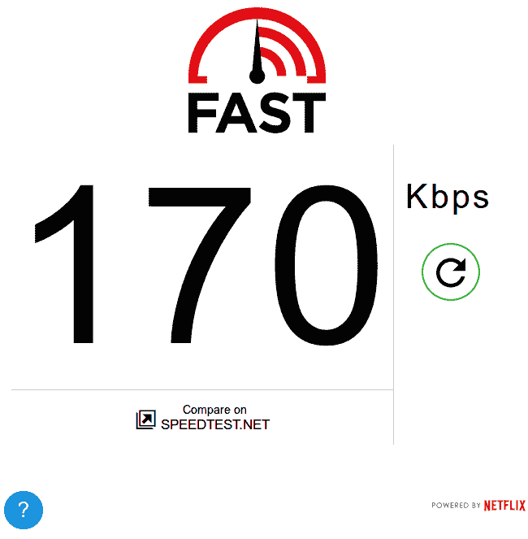

# 构建网络的未来

> 原文:[https://dev.to/computistic/building-future-of-web](https://dev.to/computistic/building-future-of-web)

新的网络时代包含了令人兴奋的特性，这些特性使得这个网络更加令人敬畏，并且有助于填补曾经被认为是不可思议的本地和网络应用之间的空白。这些成为网络标准的新功能不仅是时髦的词汇，它们还允许开发者使他们的网络应用更快、更易访问，同时逐步升级用户体验，并且在用户的浏览器不支持这些功能的情况下仍然保持网站的可访问性。(剧透:更多关于这个在最后)

作为一名开发人员和 web 爱好者，我不得不写一些关于渐进式 web 应用程序中的功能的技术故事，这些功能使它们非常令人兴奋，例如 web 推送通知，这是一种供应商免费的方式，可以在 Web 应用程序中接收推送通知，但在我开始之前，我们应该总结一下，并问自己为什么我们要构建一个 Web 应用程序，它可以在慢速连接上提供良好的体验，并在用户没有连接到互联网时工作，从而立即增加应用程序的可访问性。

## 网速慢，感同身受

慢速体验给世界各地的许多人带来了问题，尤其是那些没有大数据计划和快速带宽能力的人。如今，我不必走很远就能感受到它给世界各地的人们带来了多么严重的影响，但当我搬到一个由于信号覆盖差而网络连接较慢的地区时，这种同感深深打动了我。

截至目前，我的桌面连接速度大约为 0.17 mbps，这对于我过去的使用来说是非常低的，我通常在高峰时间体验到如此慢的速度，速度从这个速度到大约 0.6 mbps 不等，与我以前使用的提供商相去甚远，以前的提供商不是特别好，但速度稳定，可以无限制下载。

[T2】](https://res.cloudinary.com/practicaldev/image/fetch/s--bAY4HevZ--/c_limit%2Cf_auto%2Cfl_progressive%2Cq_auto%2Cw_880/https://i.imgur.com/tt2wpRt.png)

更多的人应该尝试一下[脸书在他们的 2G 星期二](https://www.theverge.com/platform/amp/2015/10/28/9625062/facebook-2g-tuesdays-slow-internet-developing-world)所做的事情，让他们的开发者在一个小时的慢速 2G 连接上感受他们自己的产品，让他们与数百万每天在类似或更糟糕的条件下浏览他们的应用程序的用户联系起来，并使用资源少得多的设备。我能感受到开发人员的沮丧，但可以肯定地说，这样的练习是一个很好的教训，可以用来构建以同理心为核心的产品。你今天也可以采取类似的行动，进入 [Chrome 开发者工具网络面板](https://developers.google.com/web/tools/chrome-devtools/network-performance/resource-loading)，调节你的网络速度以匹配 3G 连接的速度，并问问你自己你正在构建的应用程序的性能是否适合你。

[T2】](https://res.cloudinary.com/practicaldev/image/fetch/s--yNT6aJ_N--/c_limit%2Cf_auto%2Cfl_progressive%2Cq_auto%2Cw_880/https://i.imgur.com/x6VI4u2.jpg)

当连接速度很慢，每个网站都无法加载并向用户提供同样快速的交互体验时，有很多人会说 no。在许多情况下，不存在是因为 web 应用程序的非优化体验，我们可以通过更好地关注 web 应用程序的性能和页面加载时间来将它们转化为是。

### 计量心态

用户行为是不同的虽然人类渴望富足，但当他们知道自己的资源有限时，他们会很谦虚，这是生存和更好地获取信息所必需的，人们有时会更聪明地使用他们的数据计划(在这里也称为电信行话中的套餐订阅)，只在需要时使用。

这些数据耗费了宝贵的金钱，而且相当昂贵，因为许多人甚至一开始就没有准备好为其付费，而且它的速度也很慢，这使得它更加珍贵，访问每个网站以获取重要信息或有时购买或出售某些东西的决定耗费时间，人们已经忙得花不了一分钟左右的时间来等待页面加载，除非它以某种方式出现在 web 上。如果我们能帮助用户快速实现他们的目标，同时让它成为一种无摩擦的体验，这样他们就能在更短的时间内做更多的事情，网络就会变得更好。

## 留意网络问题

[T2】](https://res.cloudinary.com/practicaldev/image/fetch/s--x6nO5nrj--/c_limit%2Cf_auto%2Cfl_progressive%2Cq_auto%2Cw_880/https://i.imgur.com/oAwkGqz.jpg)

在移动连接上提供低延迟体验并在不可靠的连接上可靠运行的网站会提高用户的参与度，降低回头率，使用户更频繁地回到网站。更好的参与为企业提供了更多的赚钱机会，如果包含广告，会直接增加点击率(CTR)。
移动网站的低延迟体验可以使平均会话时间延长约 70%[,广告可视性提高 25%](https://www.doubleclickbygoogle.com/articles/mobile-speed-matters/),这可以将企业的移动广告收入提高 2 倍，如果你问我，这还不算太差。

网站的大部分流量来自移动设备，对于发展中国家来说，这部分流量甚至更大，超过了移动设备上 90%的用户门槛，因为发展中国家的大多数人都将移动设备作为他们的第一个屏幕，降低应用程序的准入门槛对于获得更大的用户群和在更便宜、更低性能的设备上也能表现良好极其重要。

低数据消耗体验可以降低许多用户的准入门槛，因为打开应用程序不需要安装应用程序、信用卡或注册。等待时间比安装一个移动应用程序要短，而且考虑到应用程序的热潮已经过去，如果不给 web 应用程序更多必要的关注，你就会失去用户。Jumia 的[新移动网络体验](https://developers.google.com/web/showcase/2017/jumia)需要的数据存储减少了 25 倍，跳出率比以前的移动网站低 50%。

[OLX 印度](https://www.olx.in/)，一个流行的购买/销售门户网站，其 90%的流量来自移动设备，但大部分转换仍然发生在他们的本地移动应用程序上，然而，根据对他们的移动网站的分析，他们发现它很慢，并且由于缓慢加载的广告而影响了盈利。在[重建他们的移动网站体验](https://developers.google.com/web/showcase/2017/olx)后，OLX 印度公司的跳出率下降了 80%,他们的参与度增加了 250%。

## 开发更好的解决方案

[T2】](https://res.cloudinary.com/practicaldev/image/fetch/s--iOY6kis3--/c_limit%2Cf_auto%2Cfl_progressive%2Cq_auto%2Cw_880/https://i.imgur.com/ihaLzw6.png)

到目前为止，我希望你能相信用户对速度和质量的期望比以往任何时候都高，我们需要增强我们构建的网络体验，向任何屏幕提供快速、高性能和安全的内容。

移动 web 存在的问题是真实的，但是这些问题可以通过分析应用程序的性能，然后按照最佳实践减少应用程序中存在的性能瓶颈来解决。

### 浏览器演变与 PWAs

浏览器每天都在发展，[引入新功能](https://developers.google.com/web/updates/)和性能改进，立即使世界各地的人们能够用他们的应用程序做更多的事情，新的浏览器捆绑了一些功能，如服务人员在网络上实现本地的未来体验。

如果浏览器支持诸如 ServiceWorkers 之类的功能，以在移动和桌面上实现即时加载和离线第一应用程序，则 Web 应用程序可以通过逐步增强用户体验来利用即将到来的 web 新功能。

[Web 推送通知](https://developers.google.com/web/fundamentals/engage-and-retain/push-notifications/)可用于吸引和留住您应用程序的用户，向他们提供有关不同事件的提醒，无需安装原生手机，只需点击几下鼠标。

从公司的案例研究中可以明显看出，构建渐进式网络应用程序(PWA)可以直接增加用户参与度和移动广告收入。如果你想在数据和资源消耗较低的情况下为用户提供快速可靠的体验，PWA [可能正适合你的品牌](https://www.thinkwithgoogle.com/marketing-resources/experience-design/progressive-web-apps-benefit-brands/)。

### 学习开发下一代网络应用

构建遵循最佳实践并利用浏览器最新功能的下一代 web 应用是一个漫长的旅程，也需要大量的学习。谷歌(Google)等公司的开发人员一直在构建优化的网站，这些网站适合移动设备，并在这样做的同时在网上公开分享他们的经验。

Google 开发人员已经建立了一个专门的网络门户，以便了解更多的最佳实践和模式，根据用户的需求建立自己的解决方案。

[门户网站](https://developers.google.com/web/)还提供有关高级[工具](https://developers.google.com/web/tools/)的信息，这些工具可用于调试、分析和优化您的应用程序的性能，例如世界上最好的 Chrome 开发者工具，这是一个对 Web 开发者至关重要的工具，有关它的指南可让您充分利用该工具。

### 提升网页基础

谷歌开发者门户网站包含了一个关于[网络基础](https://developers.google.com/web/fundamentals/)的综合指南，它需要特别提及，因为它包含了构建网络的有用信息。

Web Fundamentals 是由许多开发人员共同编写的，他们在编写经过实战检验的 Web 代码方面经验丰富，并且熟悉那些对优化网站有用的好模式。诸如 [UI &设计](https://developers.google.com/web/fundamentals/design-and-ui/)和 Web [应用程序架构](https://developers.google.com/web/fundamentals/architecture/app-shell)等主题在本指南中有着重要的强调，在它们的专门章节中有所涉及，以提供更深入的知识。

在应用程序中构建渐进式增强时，该指南非常方便，因为它详细介绍了诸如[服务人员](https://developers.google.com/web/fundamentals/getting-started/primers/service-workers)和 Web 推送通知等功能，并且有关于其内部工作和实现的有用文档。

如果对现代网络体验至关重要的话，你在现代网络中发现的大部分东西可能都会在这里记录下来。所以，请关注这个有用的资源，和我一起学习更多的网络基础知识。

### 这是关于开放网络的

Google Developers web Portal 包含的大部分信息与开放 web 标准直接相关，与 Google 几乎没有关系，因此，通过将这些信息转化为行动，您将不会被任何供应商所束缚，您将像许多其他数百万像您一样出色的 Web 开发人员一样，独立地在 Web 上进行构建。

### 结尾注...

改善网络状态并为全球用户提供更好的网络体验的责任落在了我们的肩上，信息可以帮助我们开发更好的应用程序，真正让全球人民的生活变得更轻松，这样您就可以放心地睡觉和放松了，因为您知道远离您的某个人正在很好地利用您构建的应用程序，并且通过使用渐进的增强功能，它在不可靠的离线连接上也能很好地工作。如果你做到了，祝你成功！如果我遇见你，我们必须拥抱，因为你正在让网络(碰巧也是我最喜欢的地方)变得更好，它把我们联系在一起，即使我们可能住得很远，所以我们可以合作发挥小小的作用，让这个大世界变得更好。<3