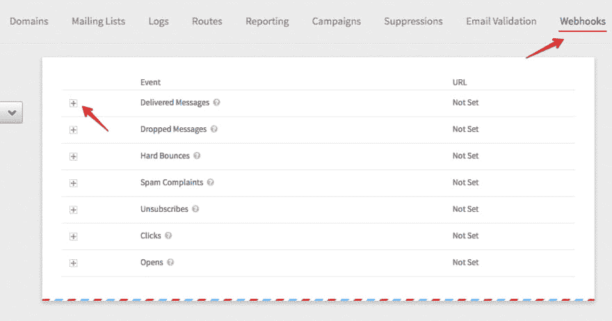
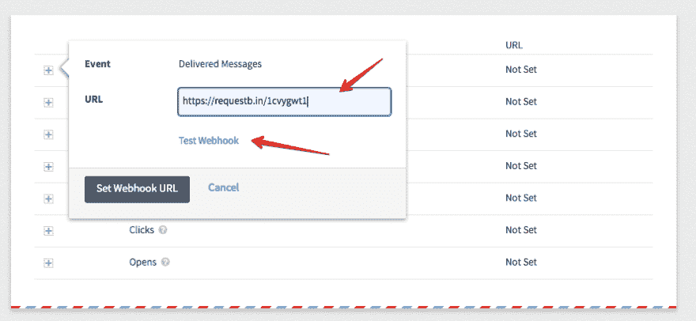
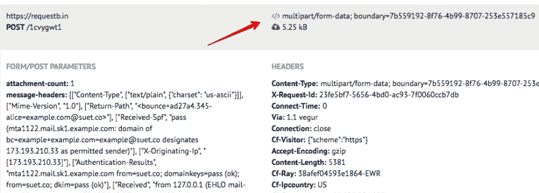

# 使用 Mailgun webhooks

> 原文:[https://dev.to/kehers/working-with-mailgun-webhooks](https://dev.to/kehers/working-with-mailgun-webhooks)

*TL；DR
Mailgun webhooks 允许您接收交易电子邮件的事件数据，并且易于使用。您可以使用这些数据来构建自定义分析并丰富您的应用程序。关于真实世界的例子，请查看 Github 上的[羊脂](https://github.com/kehers/suet)。*

对于大多数应用程序来说，交易电子邮件是必不可少的。我们会发送欢迎电子邮件、密码恢复电子邮件、通知等。当我们这样做时，我们使用像 [Mailgun](https://mailgun.com/) 这样的供应商。发送电子邮件很酷，但交付和性能呢？那个用户收到密码重置邮件了吗？“信用卡到期”通知电子邮件打开了吗？

尽管这些数据可以在你的 Mailgun 账户仪表板上找到，但你也可以通过 webhooks 获得你的交易邮件的更新。还有 API，但与 API 不同的是，您可以“请求”这些更新(**轮询**)，而 webhooks 会将更新发送给您(**推送**)。您只需要提供一个脚本的 URL，该脚本可以通过`POST`处理事件数据。

不用说，push 比 poll 有一些优势。

1.  您不必重复进行 API 请求。这意味着消耗更少的服务器资源。
2.  更新更加实时，因为它会在服务器上一发布就被推送。

## 设置

在 Mailgun 中设置 webhooks 有两种方法。这可以通过 Mailgun 仪表板或 [API](http://mailgun-documentation.readthedocs.io/en/latest/api-webhooks.html#webhooks) 来完成。更直接的方法是通过仪表板。一旦登录到您的仪表板，导航栏上就会出现一个 **Webhooks** 链接。

[T2】](https://res.cloudinary.com/practicaldev/image/fetch/s--72EWin-X--/c_limit%2Cf_auto%2Cfl_progressive%2Cq_auto%2Cw_880/https://thepracticaldev.s3.amazonaws.com/i/m9ovyo98ezl699876a0d.png)

webhooks 页面列出了可以接收事件数据的不同事件类型。通过点击每个事件前面的 **+** 按钮，您可以设置事件数据将被发送到的 URL。

## 处理数据

为了处理发送到我们的 webhook URL 的事件数据，我们首先必须知道数据是什么样子的。通过 POST 发送的参数可在 [API 文档](https://documentation.mailgun.com/en/latest/user_manual.html#tracking-opens)中获得。我们可以更进一步，通过使用一个测试 webhook URL 来确认这一点，该 URL 将记录来自 Mailgun 的数据。我们可以在中使用[邮箱](http://bin.mailgun.net/)或[请求。这些服务将生成一个惟一的端点，我们可以在 Mailgun 仪表板中使用它来获取样本事件数据。我推荐 requestbin，因为它提供了更多细节，比如请求头。这些头很重要，因为您很容易忽略这样一个事实，即 Mailgun 使用内容类型`application/x-www-form-urlencoded`发送一些数据，使用内容类型`multipart/form-data`发送一些数据。缺少这个小细节会改变您获取事件数据的方式。](https://requestb.in)

让我们继续创建一个测试端点，看看事件数据与文档中的数据相比是什么样的。

*   在中访问 [requestb .并创建一个 bin。](https://requestb.in)
*   复制 URL 并访问 Mailgun 仪表板的 Webhooks 部分。
*   将 URL 粘贴到输入字段中，并单击 **Test Webhook** 链接。这将向 URL 发送示例事件数据。
*   对所有你感兴趣的事件重复这个步骤。
*   刷新 requestbin 页面以查看发送的事件数据。

[T2】](https://res.cloudinary.com/practicaldev/image/fetch/s--Ep2v5aJ9--/c_limit%2Cf_auto%2Cfl_progressive%2Cq_auto%2Cw_880/https://thepracticaldev.s3.amazonaws.com/i/n04kozbkaeebyx5zhrwz.png)

如果您仔细观察 requestbin 数据，您会注意到我所说的一些数据是作为多部分/表单数据发送的。

[T2】](https://res.cloudinary.com/practicaldev/image/fetch/s--Fgq_gGGU--/c_limit%2Cf_auto%2Cfl_progressive%2Cq_auto%2Cw_880/https://thepracticaldev.s3.amazonaws.com/i/qb9swzuhpweep4t3c85y.png)

既然我们知道了每个事件类型的参数以及它们可能进入的内容类型，那么编写处理发送数据的代码就很容易了。下面是一个简单的代码，它将输出**投诉**和**丢弃**邮件的详细信息。(我使用[乘法器](https://github.com/expressjs/multer)来处理多部分/表单数据)

```
const express = require('express')
    , bodyParser = require('body-parser')
    , multer = require('multer')
    ;

const app = express();
app.use(bodyParser.urlencoded({extended: false}));
app.listen(process.env.PORT || 3000);

app.post('/webhook', multer().none(), function(req, res) {
  const email = req.body.recipient;
  const event = req.body.event;

  if (event == 'complained') {
    console.log(`${email} complained about your mail`);
  }
  else if (event == 'dropped') {
    console.log(`Mail to ${email} dropped. ${event.description}`);
  }
  else if (event == 'bounced') {
    console.log(`Error ${event.code}: Mail to ${email} bounced. ${event.error}`);
  }

  res.end();
}); 
```

<svg width="20px" height="20px" viewBox="0 0 24 24" class="highlight-action crayons-icon highlight-action--fullscreen-on"><title>Enter fullscreen mode</title></svg> <svg width="20px" height="20px" viewBox="0 0 24 24" class="highlight-action crayons-icon highlight-action--fullscreen-off"><title>Exit fullscreen mode</title></svg>

## 使其安全

没有什么能阻止任何知道我们的 webhook URL 的人伪造事件数据并将其发送到该 URL。幸运的是，Mailgun 对发送的每个请求进行签名，并附上以下参数:

*   **时间戳**(自 1970 年 1 月 1 日起经过的秒数)
*   **令牌**(随机生成的长度为 50 的字符串)
*   **签名**(HMAC 算法生成的十六进制字符串)

验证令牌；

*   连接**时间戳**和**令牌**的值。
*   使用您的 Mailgun API 密匙作为密匙，Sha256 作为算法，用 HMAC 对结果字符串进行编码。
*   结果应该与签名相同。

下面是它在 Node.js 中的样子:

```
const value = event_data_timestamp+event_data_token;
const hash = crypto.createHmac('sha256', apikey)
                   .update(value)
                   .digest('hex');
if (hash !== event_data_signature) {
  console.log('Invalid signature');
  return;
} 
```

<svg width="20px" height="20px" viewBox="0 0 24 24" class="highlight-action crayons-icon highlight-action--fullscreen-on"><title>Enter fullscreen mode</title></svg> <svg width="20px" height="20px" viewBox="0 0 24 24" class="highlight-action crayons-icon highlight-action--fullscreen-off"><title>Exit fullscreen mode</title></svg>

如果我们将它添加到我们的原始代码示例中，我们将得到类似这样的结果:

```
const express = require('express')
    , crypto = require('crypto')
    , multer = require('multer')
    , bodyParser = require('body-parser')
    ;

const app = express();
app.use(bodyParser.urlencoded({extended: false}));
app.listen(process.env.PORT || 3000);

app.get('/webhook', multer().none(), function(req, res) {
  // Validate signature
  const value = req.body.timestamp+req.body.token;
  const hash = crypto.createHmac('sha256', 
                            process.env.API_KEY)
                   .update(value)
                   .digest('hex');
  if (hash !== req.body.signature) {
    console.log('Invalid signature');
    return res.end();
  }

  // Log status of event
  const email = req.body.recipient;
  const event = req.body.event;

  if (event == 'complained') {
    console.log(`${email} complained about your mail`);
  }
  else if (event == 'dropped') {
    console.log(`Mail to ${email} dropped. ${event.description}`);
  }
  else if (event == 'bounced') {
    console.log(`Error ${event.code}: Mail to ${email} bounced. ${event.error}`);
  }

  res.end();
}); 
```

<svg width="20px" height="20px" viewBox="0 0 24 24" class="highlight-action crayons-icon highlight-action--fullscreen-on"><title>Enter fullscreen mode</title></svg> <svg width="20px" height="20px" viewBox="0 0 24 24" class="highlight-action crayons-icon highlight-action--fullscreen-off"><title>Exit fullscreen mode</title></svg>

我们甚至可以更进一步:

1.  对于每个请求，对照令牌缓存进行检查，以防止使用相同的令牌。每个令牌都将存储在那里。这将防止重放攻击。
2.  检查时间戳是否与当前时间相差不远。

## 使其可扩展

如果你发送大量的电子邮件，并期待大量的事件，把你的 webhook 脚本放在一个不能自动伸缩的服务器上是一个坏主意。即使你不期望有很多事件，意外的事情也会导致事件激增。拥有一台可以自动扩展的服务器对于这种情况非常有用。

进入[无服务器计算](https://en.wikipedia.org/wiki/Serverless_computing)。简单地说，这个想法就是你可以委托执行你的代码和任何与提供者相关的事情。因为您的代码的多个实例可以并行执行，并且您可以动态地调整计算资源，如 RAM 和执行时间，所以它是高度可伸缩的。你也可以根据消耗的资源和执行时间来收费，所以它真的很便宜。

有几个无服务器计算提供商。我使用和推荐的一个是 [Google Cloud Functions](https://cloud.google.com/functions/) ，因为设置 *HTTP functions* 很容易。HTTP 函数是一个包装成函数的代码块，可以通过访问 URL 来触发。这正是我们需要的网页挂钩。

要创建这个函数，我们需要编写一个 JavaScript 函数，它将作为 Node.js 模块导出。该函数接受特定于 HTTP 的参数:`request`和`response`。

```
exports.webhook = function(request, response) {
  // Handle event data here
  response.send({status:"ok"});
} 
```

<svg width="20px" height="20px" viewBox="0 0 24 24" class="highlight-action crayons-icon highlight-action--fullscreen-on"><title>Enter fullscreen mode</title></svg> <svg width="20px" height="20px" viewBox="0 0 24 24" class="highlight-action crayons-icon highlight-action--fullscreen-off"><title>Exit fullscreen mode</title></svg>

基于请求*内容类型*，请求的主体被自动传递，并在请求对象的**主体**参数中可用。

```
exports.webhook = function(request, response) {
  let event = request.body.event; // delivered
  // Handle event data here
  // ...
  response.send({status:"ok"});
} 
```

<svg width="20px" height="20px" viewBox="0 0 24 24" class="highlight-action crayons-icon highlight-action--fullscreen-on"><title>Enter fullscreen mode</title></svg> <svg width="20px" height="20px" viewBox="0 0 24 24" class="highlight-action crayons-icon highlight-action--fullscreen-off"><title>Exit fullscreen mode</title></svg>

不过，这对于内容类型*多部分/表单数据*来说并不适用。正如我们已经知道的，Mailgun 以多部分/形式数据的形式发送一些数据。我们可以通过使用 **require()** 来引入像 Multer 这样的库。然而，我们需要确保依赖关系列在 *package.json* 文件中。

```
const multer = require('multer');

exports.webhook = function(request, response) {
    parser(request, response, function(){
    console.log(request.body); // Our event data
    // Handle event data here
    // ...
    response.send({status:"ok"});
    });
} 
```

<svg width="20px" height="20px" viewBox="0 0 24 24" class="highlight-action crayons-icon highlight-action--fullscreen-on"><title>Enter fullscreen mode</title></svg> <svg width="20px" height="20px" viewBox="0 0 24 24" class="highlight-action crayons-icon highlight-action--fullscreen-off"><title>Exit fullscreen mode</title></svg>

```
{  "dependencies":  {  "multer":  "^1.3.0"  }  } 
```

<svg width="20px" height="20px" viewBox="0 0 24 24" class="highlight-action crayons-icon highlight-action--fullscreen-on"><title>Enter fullscreen mode</title></svg> <svg width="20px" height="20px" viewBox="0 0 24 24" class="highlight-action crayons-icon highlight-action--fullscreen-off"><title>Exit fullscreen mode</title></svg>

接下来，我们可以将函数发布到云函数。要做到这一点，一个简单的方法是从云功能仪表板中完成。

*   转到您的 [Google Cloud 控制台](https://console.cloud.google.com)(如果您还没有帐户，请创建一个)。
*   在仪表板中启用云功能。
*   点击**创建功能**。
*   输入函数的名称(例如 *mailgun-webhook* )。
*   在触发器部分，选择 **HTTP 触发器**。记下 URL，这将是你的 webhook URL。
*   将您的事件数据处理代码复制到云函数的 **index.js** 部分。
*   复制你的 *package.json* 的内容，粘贴到 **package.json** 部分。
*   选择或创建一个**阶段桶**。阶段存储桶就是存放代码的地方。你可以用这里的任何东西。
*   在要执行的函数中，输入函数的名称(例如 **webhook** )。
*   保存。

现在，您可以使用 Mailgun 中的函数 URL 作为您的 webhook URL。

## 结论

使用 Mailgun 的 webhooks 很容易。在 Mailgun 之外，有许多方法可以使用事件数据来丰富您的应用程序。例如，如果您允许您的用户出于任何原因从您的网站发送电子邮件，并且您使用 Mailgun，您可以使用它来为他们提供分析。或者你可能想把你的邮件分析发送到另一个平台。或者，您可能希望在您的 Slack 帐户失败时得到通知。或者甚至不是那样。也许你只是想要比 Mailgun 仪表板上提供的更详细的分析。无论用例是什么，事件数据都是可用的。

对于一个真实世界的例子，请查看 Suet 的 webhook 文件的源代码。