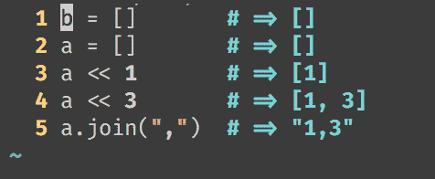
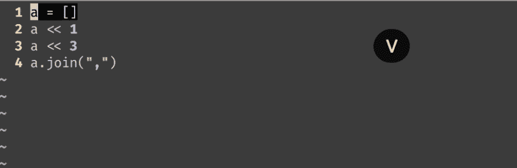

# 直接从 VIM 评估您的 ruby 代码

> 原文:[https://dev . to/caduribeiro/evaluate-your-ruby-code-directly-from-vim-1 OAG](https://dev.to/caduribeiro/evaluate-your-ruby-code-directly-from-vim-1oag)

[T2】](https://res.cloudinary.com/practicaldev/image/fetch/s--5fdBwRTC--/c_limit%2Cf_auto%2Cfl_progressive%2Cq_auto%2Cw_880/https://cdn-images-1.medium.com/max/476/1%2A-t37W7RSogM604xODOKokw.png)

当我写代码时，通常我想评估一些代码。我习惯做以下动作:

*   将我的代码复制并粘贴到 IRB(或者直接从终端运行我的 ruby 脚本文件)。
*   当使用 tmux 时，用 [vim-tmux-runner](https://github.com/christoomey/vim-tmux-runner) 插件将我的代码直接从 vim 发送到 tmux。

第一个选项需要复制和粘贴内容的额外工作。我更喜欢第二个选项，但有时我忘记连接 VTR 面板并出现错误。

现在我正在使用[https://github.com/JoshCheek/seeing_is_believing](https://github.com/JoshCheek/seeing_is_believing)以及[https://github.com/t9md/vim-ruby-xmpfilter](https://github.com/t9md/vim-ruby-xmpfilter)插件

我把我的。包含以下内容的 vimrc(我使用 Plug 来管理我的依赖项):

```
Plug 't9md/vim-ruby-xmpfilter'

" Enable seeing-is-believing mappings only for Ruby
let g:xmpfilter\_cmd = "seeing\_is\_believing"

autocmd FileType ruby nmap \<buffer\> \<F4\> \<Plug\>(seeing\_is\_believing-mark)
autocmd FileType ruby xmap \<buffer\> \<F4\> \<Plug\>(seeing\_is\_believing-mark)
autocmd FileType ruby imap \<buffer\> \<F4\> \<Plug\>(seeing\_is\_believing-mark)

autocmd FileType ruby nmap \<buffer\> \<F6\> \<Plug\>(seeing\_is\_believing-clean)
autocmd FileType ruby xmap \<buffer\> \<F6\> \<Plug\>(seeing\_is\_believing-clean)
autocmd FileType ruby imap \<buffer\> \<F6\> \<Plug\>(seeing\_is\_believing-clean)

autocmd FileType ruby nmap \<buffer\> \<F5\> \<Plug\>(seeing\_is\_believing-run)
autocmd FileType ruby xmap \<buffer\> \<F5\> \<Plug\>(seeing\_is\_believing-run)
autocmd FileType ruby imap \<buffer\> \<F5\> \<Plug\>(seeing\_is\_believing-run) 
```

<svg width="20px" height="20px" viewBox="0 0 24 24" class="highlight-action crayons-icon highlight-action--fullscreen-on"><title>Enter fullscreen mode</title></svg> <svg width="20px" height="20px" viewBox="0 0 24 24" class="highlight-action crayons-icon highlight-action--fullscreen-off"><title>Exit fullscreen mode</title></svg>

现在，我可以直观地选择我的代码，使用 F4 来标记，这一行将被计算，按 F5 并获得该代码的结果。之后，我可以和 F6 一起清理所有的痕迹。

[T2】](https://res.cloudinary.com/practicaldev/image/fetch/s--h8NtRv21--/c_limit%2Cf_auto%2Cfl_progressive%2Cq_66%2Cw_880/https://cdn-images-1.medium.com/max/922/1%2A7gjSHyVfzMhsoa038YicQg.gif)

干杯🍻

* * *