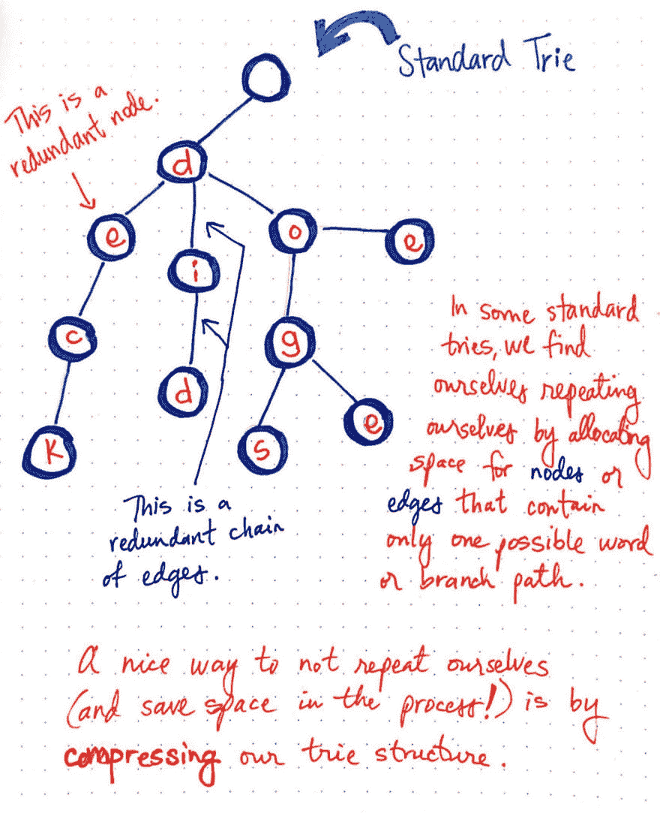
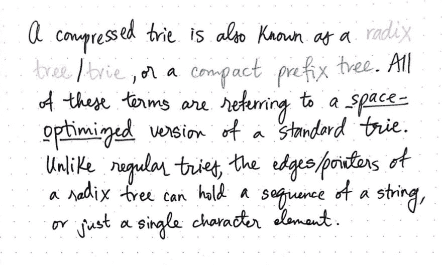
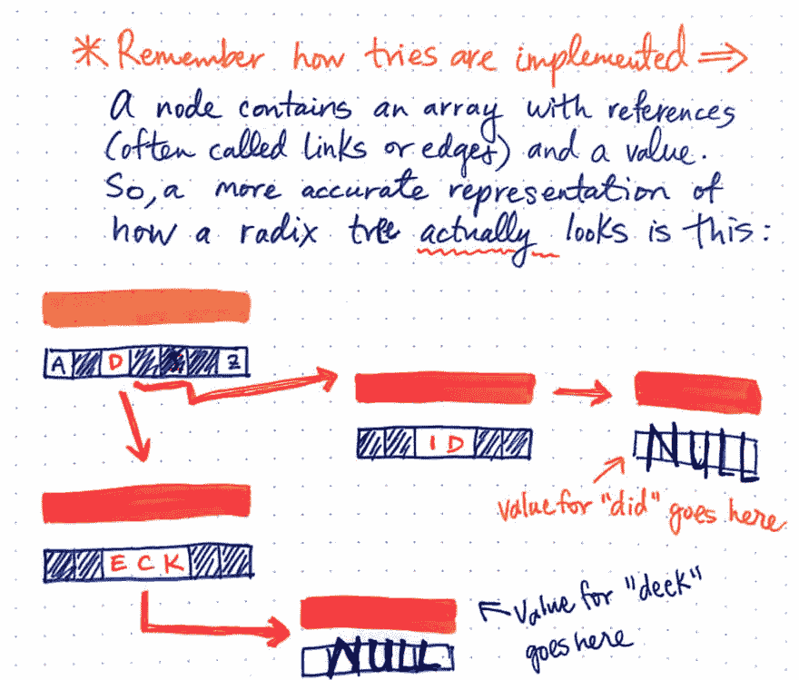
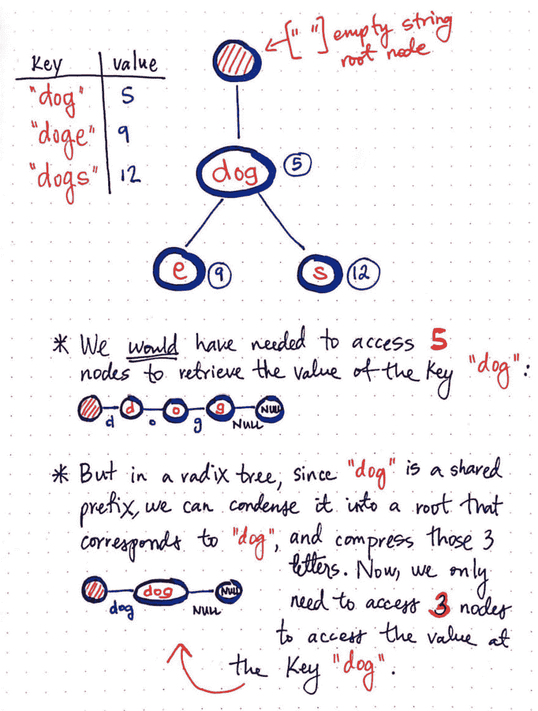
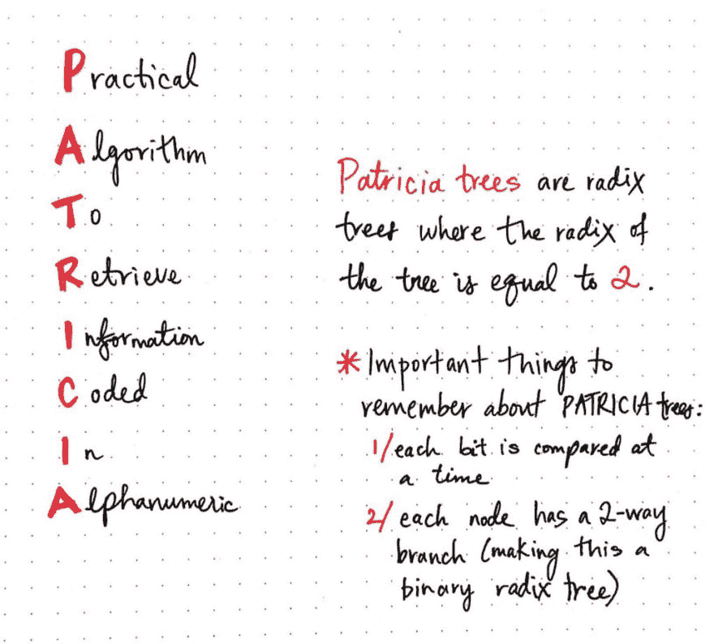
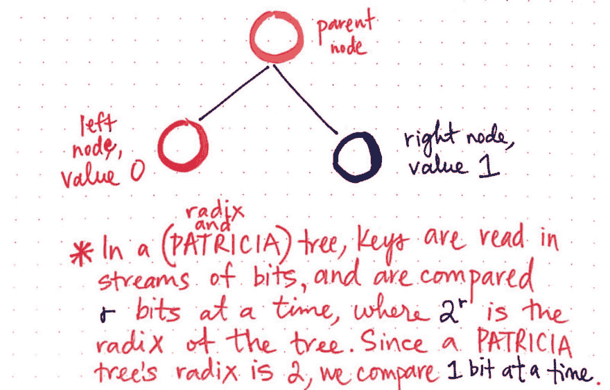
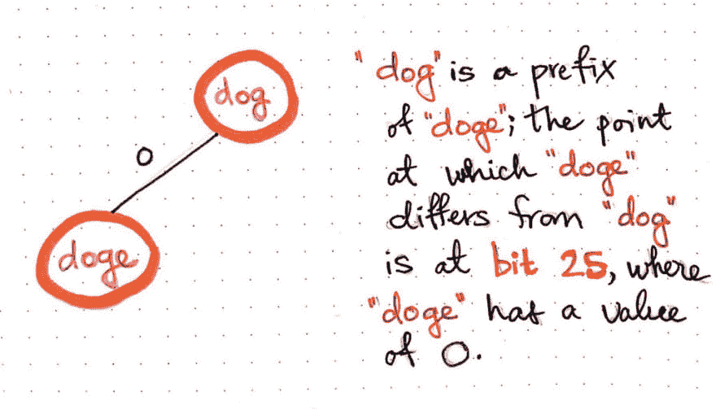
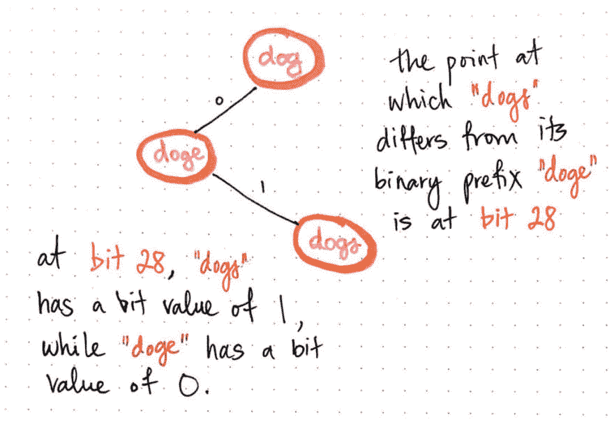

# 压缩基数树而没有(太多)撕裂

> 原文：<https://dev.to/vaidehijoshi/compressing-radix-trees-without-too-many-tears>

事实证明，在研究计算机科学的过程中出现了一个转折点，你对自己说，“哦，哇，没有人真正知道如何解释这一点。”(当然，如果你是我，你会对自己说:*“哦，不——我该怎么解释呢？!"*。)

我有一些好消息和一些坏消息

先说坏消息:我终于到了那个转折点。本周的话题是我觉得*应该*已经足够容易研究和学习的一个话题；然而，这比我想象的要复杂得多！事实上，如果说这个系列中有一个话题让我感动到流泪的边缘，毫无疑问，这就是我今天要与你分享的话题。不过，好消息是:我努力通过了，经过一场艰苦的战斗(主要是我疯狂地搜索答案)，我终于开始理解这个概念是如何工作的，以及它有多酷！

今天的话题都是关于*压缩*的东西。例如，我将尝试把一个非常复杂的主题压缩到一篇文章中，这个主题是人们花了整个职业生涯来开发和理解的。那么，我们还压缩了什么？是时候找出答案了。

### 硬核(trie)压缩

上周，我们学习了一个叫做 *trie* 的[强大结构](https://dev.to/vaidehijoshi/trying-to-understand-tries)，它支持我们日常交互的功能(如自动完成)，并用于实现匹配算法，有时甚至是基数排序。我们知道，trie 是一种树状数据结构，其节点存储字母表中的字母，并且可以通过遍历树的分支路径从该结构中检索单词和字符串。

我们还了解到尝试是权衡的好例子。它们使得检索单词变得容易，但是它们也用空指针占用了大量的内存和空间。上周，我们几乎接受了这个事实:随着大小的增加，尝试总是会占用大量的内存和空间。但是如果有一种方法可以减少标准 the 使用的空间和内存呢？

嗯…惊喜！原来有*就有*一条路。我们终于准备好了解它了。

为了让我们理解如何减少 trie 使用的空间量，我们需要能够容易地看到究竟是什么占用了空间。

假设我们有一个标准的 trie，表示一组键:["deck "、" did "、" doe "、" dog "、" doge "、" dogs"]。请记住，我们在这里处理的并不是真正的字符串数组——每个字符串都有值，所以它更像是一个哈希/字典，其中每个键都有一个值:

```
{ 
  "deck": someValue,
  "did": someValue,
  "doe": someValue,
  "dog": someValue,
  "doge": someValue,
  "dogs": someValue
} 
```

在下图中，我们将这些键转换成了一个标准的 trie。

<figure>[](https://res.cloudinary.com/practicaldev/image/fetch/s--saSOt8ct--/c_limit%2Cf_auto%2Cfl_progressive%2Cq_auto%2Cw_880/https://cdn-images-1.medium.com/max/1024/1%2AD6BHerhstwwtKLg7eE1h3Q.jpeg) 

<figcaption>在一些标准的尝试中，我们重复自己。</figcaption>

</figure>

当我们查看这个 trie 时，我们注意到的第一件事是有两个键，我们有 ***冗余节点*** 以及一个 ***冗余键链*** 。

冗余节点是指占用过多空间的节点，因为它只有一个自己的子节点。我们将看到，对于键“deck ”,字符“e”的节点是冗余的，因为它只有一个子节点，但是我们仍然必须初始化一个完整的节点，包括它的所有指针。

类似地，连接键“did”的边是冗余的，因为它们连接不真正需要初始化的冗余节点，因为它们各自只有一个自己的子节点。

在一些标准的尝试中——就像我们上面正在处理的那种——我们经常发现自己重复了很多次。

> 标准 trie 的冗余来自于这样一个事实:我们通过为只包含一个可能的字符串或单词的节点或边分配空间来重复自己。另一种思考方式是，我们通过为只有一个可能的分支路径的东西分配大量空间来重复自己。

这就是压缩的用武之地。我们可以压缩篇幅，这样既不会重复，也不会占用过多的篇幅。 ***压缩的 trie*** 是为了节省空间而被压缩的 trie。

<figure>[](https://res.cloudinary.com/practicaldev/image/fetch/s--vAMzwf1J--/c_limit%2Cf_auto%2Cfl_progressive%2Cq_auto%2Cw_880/https://cdn-images-1.medium.com/max/1024/1%2AZhU9p-cYmHyeWxAy36qzXw.jpeg) 

<figcaption>压缩试:一个定义</figcaption>

</figure>

在了解我们可以压缩哪些时，最重要的一条规则就是:*每个内部节点(每个父节点)必须有两个或更多的子节点*。如果一个父节点有两个子节点，它们位于潜在叶节点的两个分支路径上，那么它不需要被压缩，因为我们实际上需要为这两个分支路径分配空间和内存。

但是，如果父节点只有一个子节点，也就是说，如果它只有一个可能的分支路径指向叶节点，那么它可以被压缩。为了完成“压缩”trie 的工作，作为其父节点的唯一子节点的每个节点被合并到其父节点中。父节点和单个子节点融合在一起，它们包含的值也是如此。

我们可以开始压缩前面的标准 trie 示例，并像这样压缩“单个分支路径”:

<figure>[](https://res.cloudinary.com/practicaldev/image/fetch/s--kJSuVdQc--/c_limit%2Cf_auto%2Cfl_progressive%2Cq_auto%2Cw_880/https://cdn-images-1.medium.com/max/1024/1%2Ag8fvYFyd8igtMkMkJCJrxw.jpeg) 

<figcaption>一个压缩的 trie</figcaption>

</figure>

我们会注意到，我们已经压缩了以前包含“e”、“c”、“k”的节点，因此节点“d”具有对“eck”的引用，作为包含在一个节点中的单个字符串，而不是三个。这是一个类似的故事，关键是“did”，它已经被压缩。尚未压缩的内部父节点有多个分支路径；然而，那些具有单个子节点的内部节点已经被压缩，我们已经减少了我们以前需要的节点数量。

### 树根树

“trie 压缩”是一个众所周知的概念，足以保证它自己的名字。压缩树又称为 ***基数树*** 、 ***基数树*** ，或 ***紧凑前缀树*** 。(我知道，我知道，首先是“尝试”，现在我们又回到了“树”，我不知道为什么没有人能就什么叫什么达成一致！)

<figure>[](https://res.cloudinary.com/practicaldev/image/fetch/s--KWVZutQb--/c_limit%2Cf_auto%2Cfl_progressive%2Cq_auto%2Cw_880/https://cdn-images-1.medium.com/max/1024/1%2AsMp5st8CMMb1S1iHbpK_dA.jpeg) 

<figcaption>一个压缩的 trie 也被称为一个 radix tree</figcaption>

</figure>

所有这些术语实际上都指的是一件事:*标准 trie* 的空间优化版本。与常规尝试不同，基数树的引用/边/指针可以保存一个字符串序列，而不仅仅是单个字符元素。

<figure>[](https://res.cloudinary.com/practicaldev/image/fetch/s--b45WvUXX--/c_limit%2Cf_auto%2Cfl_progressive%2Cq_auto%2Cw_880/https://cdn-images-1.medium.com/max/1024/1%2ABWh059jXx32VVnrxMBeWDw.jpeg)

<figcaption></figcaption>

</figure>

下的试炼是如何实现的

重要的是要指出，尽管我已经把尝试描述为好像一个单词的字符串字符存在于这个单词中，但是我们应该很快提醒自己尝试实际上是如何工作的。请记住，trie 中的单个节点包含一个带有引用的数组和一个值。

上图更准确地展示了基数树的内部情况。请注意，单字符值和字符串值都包含在对其他节点的引用中。当字符串终止时，最后一个引用指向一个空值/null。

<figure>[](https://res.cloudinary.com/practicaldev/image/fetch/s--gwYbTTEp--/c_limit%2Cf_auto%2Cfl_progressive%2Cq_auto%2Cw_880/https://cdn-images-1.medium.com/max/1024/1%2A2BF7604ti-ZQr6FgAuXUkw.jpeg) 

<figcaption>标准 trie 与 node count 中的基数树表示。</figcaption>

</figure>

既然我们已经知道如何压缩一个标准的 trie 树，我们也许应该弄清楚压缩一个 trie 树的工作实际上有多有用。为了理解基数树如何在节省内存方面更有用，我们可以比较我们的两次尝试——我们开始使用的标准 trie 和我们将其转换成的基数树。

我们可以看到，在我们的标准 trie 中，我们需要 11 个节点来表示一组键:["deck "、" did "、" doe "、" dog "、" doge "、" dogs"]。

然而，当我们将标准的 trie 压缩到一个基数树中时，每个子节点都与其父节点合并，我们只需要 8 个节点来表示同一个键组。回想一下，每当我们初始化一个节点时，我们还需要用(通常)26 个键来初始化一个数组，每个键对应英语字母表中的 26 个字母。通过在压缩过程中消除 3 个节点，我们节省了原本需要分配的大量空间和内存。

在访问和检索键时，我们还可以看到基数树的压缩能力。在这里显示的例子中，我们已经精简了基数树，所以我们现在只使用三个键:“dog”、“doge”和“dogs”。这三个键中的每一个都有一个值，所以我们*实际上*试图在这里表示的结构看起来像这样:

```
{ 
  "dog": 5,
  "doge": 9,
  "dogs": 12
} 
```

既然我们现在知道如何用基数树格式编写和表示这些键值对，我们就可以画出基数树的样子。

<figure>[](https://res.cloudinary.com/practicaldev/image/fetch/s--ROA10XmH--/c_limit%2Cf_auto%2Cfl_progressive%2Cq_auto%2Cw_880/https://cdn-images-1.medium.com/max/1024/1%2AGAY5p1YO2n_BNyZqJDkkvA.jpeg) 

<figcaption>标准 trie vs radix tree</figcaption>

</figure>

中的节点访问和键检索

我们有一个空字符串作为根节点的值，引用字符串“dog ”,它指向一个父节点，值为 5。

当我们在前面编写标准 trie 时，我们需要访问 5 个不同的节点(包括根节点),以便检索以“g”结尾的节点的值，这是“dog”的最后一个字符。

但是，在 radix 树中，由于“dog”是一个共享前缀，我们可以将其压缩成一个根节点，这消除了一些我们以前拥有的冗余节点。现在，为了访问键“dog”的值，我们只需要访问 3 个节点。请记住，即使我们在“dog”的引用点有一个节点，我们仍然需要一个额外的带有空引用的终止节点来存储这个键的实际值。

基数树的强大之处在于我们根据前缀压缩子串。即使从这个小例子中，我们也可以看到子串“dog”如何通过将 trie 压缩成 radix treeformat 来节省两个节点及其相应的空间。

### 回位和字节基础

我们已经回答了许多关于基数树的问题，但是有一件事仍然是个谜:基数*和树有什么关系？为了回答这个问题，我们需要稍微回到基础。*

我们学到的一些最早的核心概念是[位、字节和用二进制构建](https://dev.to/vaidehijoshi/bits-bytes-building-with-binary)。在本系列的课程中，我们遇到过几次二进制，猜猜会发生什么？它又回来了！

> 为了理解树的基数，我们必须理解我们的机器如何读取尝试。在基数树中，密钥是按位或二进制数字读取的。一次比较 r 位，其中 2 的 r 次方是树的基数。

可以一次读取和处理一个 trie 的键一个字节，一次读取和处理半个字节，或者一次读取和处理两位。然而，有一种特殊类型的基数树以一种非常有趣的方式处理密钥，称为 **PATRICIAtree** 。

PATRICIA tree 是由 Donald R. Morrison 于 1968 年创建的，他根据自己创建的一种算法创造了首字母缩写词，该算法用于有效地从尝试中检索信息；PATRICIA 代表“*检索字母数字编码信息的实用算法*”。

<figure>[](https://res.cloudinary.com/practicaldev/image/fetch/s--B7uGx5Uw--/c_limit%2Cf_auto%2Cfl_progressive%2Cq_auto%2Cw_880/https://cdn-images-1.medium.com/max/1024/1%2ATGOVXVnN0Vnm9p2Y5s8-uQ.jpeg) 

<figcaption>帕特里夏树</figcaption>

</figure>

帕特里夏树如此有趣的原因是因为它们处理密钥的方式。正如我们所了解的，密钥的处理方式直接与 radixtree 的基数相关。

关于帕特里夏树，要记住的最重要的事情是它的基数是 2。因为我们知道比较密钥的方式是一次发生 *r* 位，其中 2 的 *r 的幂*是树的基数，我们可以使用这个数学计算出 PATRICIA 树如何读取 akey。

由于帕特里夏树的基数是 2，我们知道 *r* 必须等于 1，因为 2β= 2。因此，帕特里夏树在一个时间 T5 一位处理它的关键字**T3。**

<figure>[](https://res.cloudinary.com/practicaldev/image/fetch/s--rABcJheL--/c_limit%2Cf_auto%2Cfl_progressive%2Cq_auto%2Cw_880/https://cdn-images-1.medium.com/max/1024/1%2AXVtr0UXucQPxisP5vzO3zg.jpeg) 

<figcaption>帕特里夏树一次读取密钥 1 位</figcaption>

</figure>

因为 PATRICIA 树以位流的形式读取其密钥，每次比较一位，所以整个树被构建为表示二进制数字。如果你记得学过二分搜索法树，你会记得一棵二叉树只能有两个子树，左边节点的值小于右边节点的值。因此，在二进制基数树中，右节点总是用于表示二进制数字(或位)1，左节点用于表示位 0。

正因为如此，帕特里夏树中的每个节点都有一个双向分支，使得这种特殊类型的基数树成为 ***二进制基数树*** 。这个用一个例子就更明显了，现在我们来看看 onenow。

假设我们想要将我们的原始密钥集["dog "、" doge "、" dogs"]转换成 PATRICIA 树表示。由于 PATRICIA 树一次读取一位密钥，我们需要将这些字符串转换成二进制，以便我们可以一位一位地查看它们。

```
dog: 01100100 01101111 01100111
doge: 01100100 01101111 01100111 01100101
dogs: 01100100 01101111 01100111 01110011 
```

注意键“doge”和“dogs”都是“dog”的子字符串。这些字的二进制表示直到第 25 位都是完全相同的。有趣的是，连“doge”都是“dogs”的子串；这两个字的二进制表示直到第 28 位都是一样的！

很酷，对吧！？谁知道“doge”是“dogs”的二进制子串？

好的，那么既然我们知道“狗”是“doge”的前缀，我们就一点一点比较一下。它们分叉的点在第 25 位，其中“doge”的值为 0。因为我们知道我们的二进制基数树只能有 0 和 1，我们只需要把“doge”放在正确的位置。因为它的值为 0，所以我们将它添加为根节点“dog”的左子节点。

<figure>[](https://res.cloudinary.com/practicaldev/image/fetch/s--c9sQuemE--/c_limit%2Cf_auto%2Cfl_progressive%2Cq_auto%2Cw_880/https://cdn-images-1.medium.com/max/1024/1%2ASXhUXLZTVulvAtGjmgO8Kg.jpeg) 

<figcaption>将“doge”添加到我们的 patria tree</figcaption>

</figure>

现在我们将对“狗”做同样的事情。由于“dogs”在第 28 位不同于它的二进制前缀“doge ”,我们将一位一位地比较，直到那个点。

<figure>[](https://res.cloudinary.com/practicaldev/image/fetch/s--wCHNuqOt--/c_limit%2Cf_auto%2Cfl_progressive%2Cq_auto%2Cw_880/https://cdn-images-1.medium.com/max/1024/1%2ANUpE8TTqOP94CeE7MoVRhw.jpeg) 

<figcaption>给我们的 patria tree</figcaption>

</figure>

添加“狗”

在第 28 位，“狗”的位值为 1，而“狗”的位值为 0。所以，我们就把“狗”加为“doge”的右子。

当然，这是唐纳德·r·莫里森算法的简化版，要复杂得多。但最终，这是发生在一个非常低的水平！他的 [*摘要介绍了检索字母数字编码信息的实用算法*](http://dl.acm.org/citation.cfm?id=321481) 简明扼要地解释了帕特丽夏背后的基本思想及其应用:

> PATRICIA 是一种算法，它提供了一种在大文件中存储、索引和检索信息的灵活方法，节省了索引空间和重新索引时间。它根据用户提供的关键字检索信息，其计算量的界限线性地依赖于关键字的长度和它们正确出现的次数，而与库的大小无关。它已经作为 CDC-3600 的 FORTRAN 程序，利用文本的磁盘文件存储，以几种不同的形式实现。它已经应用于几个大型信息检索问题，并将应用于其他问题。

Radix 和 PATRICIA 树可能是一种难以理解的结构，因为它们涉及抽象概念，但利用了非常低级(完全是*字面上的*二进制)的东西。

老实说，这是这个系列中第一个让我真正努力去理解一个概念的主题。但是当我最终明白事情是如何运作的时候，看到小积木是如何组成更大的结构来驱动我们世界的一部分是非常酷的。

但是如果这个话题让你想哭，不要担心——它也差点让我流泪。

<figure>[](https://res.cloudinary.com/practicaldev/image/fetch/s--ANe1Uk88--/c_limit%2Cf_auto%2Cfl_progressive%2Cq_auto%2Cw_880/https://cdn-images-1.medium.com/max/500/1%2APzo-vkZ_95PaZBntu0wSKA.jpeg)</figure>

### 资源

在基数树上找到可接近的资源是相当棘手的，但是如果你在互联网上挖得足够深，它们*确实*存在。幸运的是，你不需要去挖掘它们，因为我已经做了！如果您想了解更多关于二进制基数和 PATRICIAtrees 的知识，可以从这里开始阅读。

1.  [压缩的尝试(Patricia tries)](http://www.mathcs.emory.edu/~cheung/Courses/323/Syllabus/Text/trie02.html) 顺彦春教授
2.  [基数树和 Patricia tries 有什么区别？](https://cs.stackexchange.com/questions/63048/what-is-the-difference-between-radix-trees-and-patricia-tries)、计算机科学 StackExchange
3.  [trie 和 radix trie 数据结构有什么区别？](https://stackoverflow.com/questions/14708134/what-is-the-difference-between-trie-and-radix-trie-data-structures)，StackOverflow
4.  [字符串的数据结构](http://cglab.ca/~morin/teaching/5408/notes/strings.pdf)，PatMorin 教授
5.  [PATRICIA——检索字母数字编码信息的实用算法](http://dl.acm.org/citation.cfm?id=321481)，Donald R.Morrison 教授
6.  [算法和数据结构字典——帕特里夏树](https://xlinux.nist.gov/dads/HTML/patriciatree.html)，StefanEdelkamp
7.  [比试，帕特里夏比试，后缀树](https://appsrv.cse.cuhk.edu.hk/~taoyf/course/comp3506/camp/trie.pdf)，俞飞涛教授

* * *

*本帖最初发表于[medium.com](https://medium.com/basecs/compressing-radix-trees-without-too-many-tears-a2e658adb9a0)T3】*