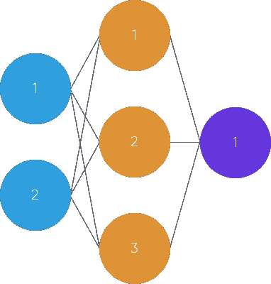
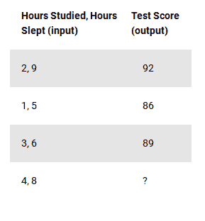
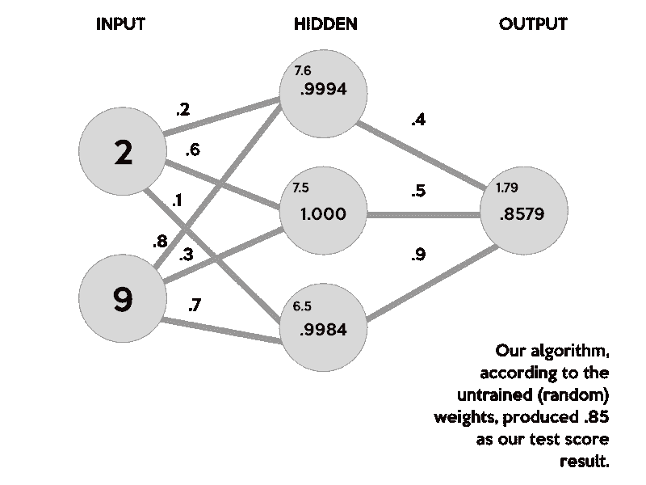
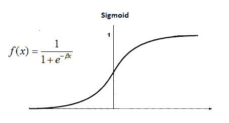
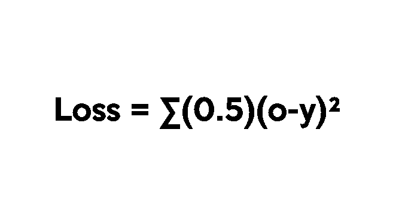
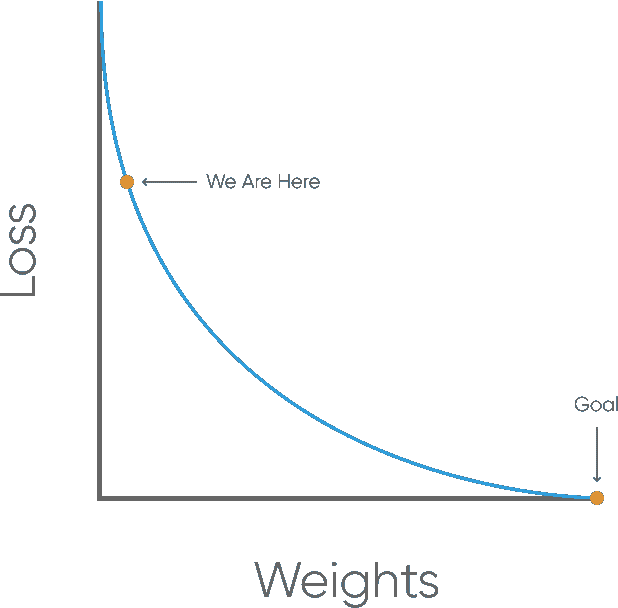

# 用 Python 构建一个具有反向传播功能的柔性神经网络

> 原文：<https://dev.to/shamdasani/build-a-flexible-neural-network-with-backpropagation-in-python>

## 什么是神经网络？

在我们开始*如何*构建神经网络之前，我们需要先了解一下*是什么*。

神经网络可能会令人生畏，尤其是对于机器学习的新手来说。然而，本教程将详细说明神经网络的工作原理，最终你将拥有一个灵活的工作神经网络。我们开始吧！

### 理解过程

人类大脑拥有大约 1000 亿个神经元，处理数据的速度高达每小时 268 英里！本质上，神经网络是由**突触**连接的**神经元**的集合。该集合分为三个主要层:输入层、隐藏层和输出层。你可以有许多隐藏层，这就是术语**深度学习**发挥作用的地方。在人工神经网络中，有几个输入，称为**特征**，并产生一个输出，称为**标签**。

[](https://res.cloudinary.com/practicaldev/image/fetch/s--OdTB8p1Q--/c_limit%2Cf_auto%2Cfl_progressive%2Cq_auto%2Cw_880/https://blog.kabir.ml/img/machine-learning/FeedForwardNeuralNetwork.svg) 
*经[卡比尔沙](https://kabir.ml)*

圆圈代表神经元，而线条代表突触。突触的作用是将输入和**权重**相乘。你可以把权重想象成神经元之间连接的“强度”。权重主要定义神经网络的输出。然而，它们非常灵活。之后，应用激活函数来返回输出。

下面是简单前馈神经网络工作原理的简要概述:

1.  将输入作为一个矩阵(2D 数列)

2.  将输入乘以设定的权重(执行[点积](https://www.khanacademy.org/math/precalculus/precalc-matrices/multiplying-matrices-by-matrices/v/matrix-multiplication-intro)即矩阵乘法)

3.  应用激活功能

4.  返回输出

5.  通过从数据和预测输出中取得期望输出的差来计算误差。这产生了我们的梯度下降，我们可以用它来改变权重

6.  然后根据误差稍微改变权重。

7.  为了训练，这个过程要重复 1000 次以上。数据训练得越多，我们的输出就越准确。

> 本质上，神经网络很简单。它们只是用输入和权重执行点积，并应用激活函数。当通过损失函数的梯度来调整权重时，网络适应变化以产生更精确的输出。

我们的神经网络将用三个输入和一个输出来模拟单个隐藏层。在网络中，我们将根据前一天我们学习了多少小时和睡眠了多少小时来预测考试分数。我们的测试分数就是输出。这是我们用来训练神经网络的样本数据:

[T2】](https://res.cloudinary.com/practicaldev/image/fetch/s--KGkvouhX--/c_limit%2Cf_auto%2Cfl_progressive%2Cq_auto%2Cw_880/https://cdn-images-1.medium.com/max/800/1%2AjK4Ct8-EG913GkKZh0R1yg.png)

正如你可能已经注意到的，在这种情况下的`?`代表我们希望我们的神经网络预测什么。在这种情况下，我们根据某人之前的表现，预测他学习了四个小时，睡了八个小时的测试分数。

## 正向传播

让我们开始给这个坏男孩编码吧！打开一个新的 python 文件。您可能想要导入`numpy`，因为它将帮助我们进行某些计算。

首先，让我们使用`np.array`将数据作为 numpy 数组导入。我们还希望规范化我们的单位，因为我们的输入以小时为单位，但是我们的输出是一个从 0-100 的测试分数。因此，我们需要通过除以每个变量的最大值来缩放数据。

```
import numpy as np

# X = (hours sleeping, hours studying), y = score on test X = np.array(([2, 9], [1, 5], [3, 6]), dtype=float)
y = np.array(([92], [86], [89]), dtype=float)

# scale units X = X/np.amax(X, axis=0) # maximum of X array y = y/100 # max test score is 100 
```

接下来，让我们定义一个 python `class`并编写一个`init`函数，其中我们将指定我们的参数，如输入、隐藏和输出层。

```
class Neural_Network(object):
  def __init__(self):
    #parameters
    self.inputSize = 2
    self.outputSize = 1
    self.hiddenSize = 3 
```

是我们第一次计算的时候了。记住，我们的突触执行[点积](https://www.khanacademy.org/math/precalculus/precalc-matrices/multiplying-matrices-by-matrices/v/matrix-multiplication-intro)，或者输入和权重的矩阵乘法。请注意，权重是随机生成的，介于 0 和 1 之间。

### 我们网络背后的计算

在数据集中，我们的输入数据`X`，是一个 3x2 的矩阵。我们的输出数据`y`，是一个 3x1 的矩阵。矩阵`X`中的每个元素都需要乘以相应的权重，然后与隐藏层中每个神经元的所有其他结果相加。下面是第一个输入数据元素(2 小时学习和 9 小时睡眠)如何计算网络中的输出:

[T2】](https://res.cloudinary.com/practicaldev/image/fetch/s--AjPpIz8e--/c_limit%2Cf_auto%2Cfl_progressive%2Cq_auto%2Cw_880/https://cdn-images-1.medium.com/max/800/0%2Ao8Rb-ztx6G4pjzgu.png)

这个图像分解了我们的神经网络实际上是如何产生输出的。首先，将每个突触上随机生成的权重(. 2，.. 6，.. 1，.. 8，.. 3，.. 7)与相应输入的乘积相加，得到隐藏层的第一个值。这些总和以较小的字体显示，因为它们不是隐藏层的最终值。

```
(2 * .2) + (9 * .8) = 7.6 
(2 * .6) + (9 * .3) = 7.5 
(2 * .1) + (9 * .7) = 6.5 
```

为了得到隐藏层的最终值，我们需要应用[激活函数](https://en.wikipedia.org/wiki/Activation_function)。激活函数的作用是引入非线性。这样做的一个优点是，输出是从 0 到 1 的范围映射的，这使得将来更容易改变权重。

有许多激活功能。在这种情况下，我们将坚持使用更受欢迎的函数之一 sigmoid 函数。

[T2】](https://res.cloudinary.com/practicaldev/image/fetch/s--lN-oXMal--/c_limit%2Cf_auto%2Cfl_progressive%2Cq_auto%2Cw_880/http://www.saedsayad.cimg/ANN_Sigmoid.png)

```
S(7.6) = 0.999499799
S(7.5) = 1.000553084
S(6.5) = 0.998498818 
```

现在，我们需要再次使用矩阵乘法，使用另一组随机权重来计算我们的输出图层值。

```
(.9994 * .4) + (1.000 * .5) + (.9984 * .9) = 1.79832 
```

最后，为了规范化输出，我们只需再次应用激活函数。

```
S(1.79832) = .8579443067 
```

就这样。理论上，使用这些权重，我们的神经网络将计算出`.85`作为我们的测试分数！然而，我们的目标是`.92`。我们的结果并不差，只是不是最好的。当我为这个例子选择随机权重时，我们只是运气好了一点。

我们如何训练我们的模型去学习？我们很快就会知道了。现在，让我们继续编码我们的网络。

如果你仍然困惑，我强烈推荐你看一下[这个](https://www.youtube.com/watch?v=UJwK6jAStmg)信息丰富的视频，它用相同的例子解释了神经网络的结构。

### 实现计算

现在，让我们使用`np.random.randn()`随机生成我们的权重。记住，我们需要两套砝码。一个是从输入层到隐藏层，另一个是从隐藏层到输出层。

```
#weights self.W1 = np.random.randn(self.inputSize, self.hiddenSize) # (3x2) weight matrix from input to hidden layer self.W2 = np.random.randn(self.hiddenSize, self.outputSize) # (3x1) weight matrix from hidden to output layer 
```

一旦我们设置好了所有的变量，我们就可以开始编写我们的`forward`传播函数了。让我们传入我们的输入，`X`，在这个例子中，我们可以使用变量`z`来模拟输入和输出层之间的活动。如前所述，我们需要获得输入和权重的点积，应用激活函数，获得隐藏层和第二组权重的另一个点积，最后应用最终激活函数来接收我们的输出:

```
def forward(self, X):
    #forward propagation through our network
    self.z = np.dot(X, self.W1) # dot product of X (input) and first set of 3x2 weights
    self.z2 = self.sigmoid(self.z) # activation function
    self.z3 = np.dot(self.z2, self.W2) # dot product of hidden layer (z2) and second set of 3x1 weights
    o = self.sigmoid(self.z3) # final activation function
    return o 
```

最后，我们需要定义我们的 sigmoid 函数:

```
def sigmoid(self, s):
    # activation function 
    return 1/(1+np.exp(-s)) 
```

好了，我们做到了！能够产生输出的(未经训练的)神经网络。

```
import numpy as np

# X = (hours sleeping, hours studying), y = score on test X = np.array(([2, 9], [1, 5], [3, 6]), dtype=float)
y = np.array(([92], [86], [89]), dtype=float)

# scale units X = X/np.amax(X, axis=0) # maximum of X array y = y/100 # max test score is 100 
class Neural_Network(object):
  def __init__(self):
    #parameters
    self.inputSize = 2
    self.outputSize = 1
    self.hiddenSize = 3

    #weights
    self.W1 = np.random.randn(self.inputSize, self.hiddenSize) # (3x2) weight matrix from input to hidden layer
    self.W2 = np.random.randn(self.hiddenSize, self.outputSize) # (3x1) weight matrix from hidden to output layer 
  def forward(self, X):
    #forward propagation through our network
    self.z = np.dot(X, self.W1) # dot product of X (input) and first set of 3x2 weights
    self.z2 = self.sigmoid(self.z) # activation function
    self.z3 = np.dot(self.z2, self.W2) # dot product of hidden layer (z2) and second set of 3x1 weights
    o = self.sigmoid(self.z3) # final activation function
    return o 

  def sigmoid(self, s):
    # activation function 
    return 1/(1+np.exp(-s))

NN = Neural_Network()

#defining our output o = NN.forward(X)

print "Predicted Output: \n" + str(o) 
print "Actual Output: \n" + str(y) 
```

您可能已经注意到，我们需要训练我们的网络来计算更准确的结果。

## 反向传播

### 我们网络的“学习”

因为我们有一组随机的权重，所以我们需要改变它们，使我们的输入等于我们数据集中相应的输出。这是通过一种叫做反向传播的方法实现的。

反向传播通过使用一个**损失**函数来计算网络离目标输出有多远。

#### 计算错误

表示损失函数的一种方式是使用**均方损失**函数:

[T2】](https://res.cloudinary.com/practicaldev/image/fetch/s--uORemxIk--/c_limit%2Cf_auto%2Cfl_progressive%2Cq_auto%2Cw_880/https://cdn-images-1.medium.com/max/800/0%2AEdvxSgRqmgZQTfLM.png)

在这个函数中，`o`是我们的预测产量，`y`是我们的实际产量。现在我们有了损失函数，我们的目标是让它尽可能接近 0。这意味着我们需要几乎没有任何损失。当我们训练我们的网络时，我们所做的就是将损失最小化。

为了找出改变我们权重的方向，我们需要找到我们的损失相对于我们权重的变化率。换句话说，我们需要使用损失函数的导数来理解权重如何影响输入。

在这种情况下，我们将使用偏导数来考虑另一个变量。

[](https://res.cloudinary.com/practicaldev/image/fetch/s--ltFBiNlb--/c_limit%2Cf_auto%2Cfl_progressive%2Cq_auto%2Cw_880/https://blog.kabir.ml/img/machine-learning/weightToLoss.svg) 
*经[卡比尔沙](https://kabir.ml)*

这种方法被称为**梯度下降**。通过了解改变权重的方式，我们的输出只会变得更加准确。

下面是我们计算体重增量变化的方法:

1)通过取预测输出和实际输出(y)的差值，找到输出层(o)的误差的

 **2)将我们的 sigmoid 激活函数的导数应用于输出层误差。我们称这个结果为 **delta 输出和**。

3)使用输出层误差的增量输出和，通过用我们的第二个权重矩阵执行点积，计算出我们的 z <sup>2</sup> (隐藏)层对输出误差的贡献。我们可以称之为 z <sup>2</sup> 误差。

4)通过应用我们的 sigmoid 激活函数的导数，计算 z <sup>2</sup> 层的 delta 输出和(就像步骤 2)。

5)通过执行输入层与隐藏的**(z<sup>2</sup>)输出和**的**点积来调整第一层的权重。对于第二个权重，执行隐藏(z <sup>2</sup> 层和**输出(o) delta 输出和**的点积。**

计算 delta 输出和，然后应用 sigmoid 函数的导数，这对于反向传播非常重要。sigmoid 的导数，也称为 **sigmoid 质数**，将为我们提供在输出总和下激活函数的变化率或斜率。

让我们继续通过添加一个 sigmoid prime(sigmoid 的导数)函数来编写我们的`Neural_Network`类:

```
def sigmoidPrime(self, s):
    #derivative of sigmoid
    return s * (1 - s) 
```

然后，我们想要创建我们的`backward`传播函数，它完成上面四个步骤中指定的所有事情:

```
def backward(self, X, y, o):
    # backward propgate through the network
    self.o_error = y - o # error in output
    self.o_delta = self.o_error*self.sigmoidPrime(o) # applying derivative of sigmoid to error 
    self.z2_error = self.o_delta.dot(self.W2.T) # z2 error: how much our hidden layer weights contributed to output error
    self.z2_delta = self.z2_error*self.sigmoidPrime(self.z2) # applying derivative of sigmoid to z2 error 
    self.W1 += X.T.dot(self.z2_delta) # adjusting first set (input --> hidden) weights
    self.W2 += self.z2.T.dot(self.o_delta) # adjusting second set (hidden --> output) weights 
```

我们现在可以通过启动前向传播来定义我们的输出，并通过在`train`函数中调用它来启动后向函数:

```
def train (self, X, y):
    o = self.forward(X)
    self.backward(X, y, o) 
```

要运行网络，我们要做的就是运行`train`函数。当然，我们会希望这样做多次，或者可能数千次。因此，我们将使用一个`for`循环。

```
NN = Neural_Network()
for i in xrange(1000): # trains the NN 1,000 times
  print "Input: \n" + str(X) 
  print "Actual Output: \n" + str(y) 
  print "Predicted Output: \n" + str(NN.forward(X)) 
  print "Loss: \n" + str(np.mean(np.square(y - NN.forward(X)))) # mean sum squared loss
  print "\n"
  NN.train(X, y) 
```

以下是完整的 60 行精彩内容:

```
import numpy as np

# X = (hours sleeping, hours studying), y = score on test
X = np.array(([2, 9], [1, 5], [3, 6]), dtype=float)
y = np.array(([92], [86], [89]), dtype=float)

# scale units
X = X/np.amax(X, axis=0) # maximum of X array
y = y/100 # max test score is 100

class Neural_Network(object):
  def __init__(self):
    #parameters
    self.inputSize = 2
    self.outputSize = 1
    self.hiddenSize = 3

    #weights
    self.W1 = np.random.randn(self.inputSize, self.hiddenSize) # (3x2) weight matrix from input to hidden layer
    self.W2 = np.random.randn(self.hiddenSize, self.outputSize) # (3x1) weight matrix from hidden to output layer

  def forward(self, X):
    #forward propagation through our network
    self.z = np.dot(X, self.W1) # dot product of X (input) and first set of 3x2 weights
    self.z2 = self.sigmoid(self.z) # activation function
    self.z3 = np.dot(self.z2, self.W2) # dot product of hidden layer (z2) and second set of 3x1 weights
    o = self.sigmoid(self.z3) # final activation function
    return o 

  def sigmoid(self, s):
    # activation function 
    return 1/(1+np.exp(-s))

  def sigmoidPrime(self, s):
    #derivative of sigmoid
    return s * (1 - s)

  def backward(self, X, y, o):
    # backward propgate through the network
    self.o_error = y - o # error in output
    self.o_delta = self.o_error*self.sigmoidPrime(o) # applying derivative of sigmoid to error

    self.z2_error = self.o_delta.dot(self.W2.T) # z2 error: how much our hidden layer weights contributed to output error
    self.z2_delta = self.z2_error*self.sigmoidPrime(self.z2) # applying derivative of sigmoid to z2 error

    self.W1 += X.T.dot(self.z2_delta) # adjusting first set (input --> hidden) weights
    self.W2 += self.z2.T.dot(self.o_delta) # adjusting second set (hidden --> output) weights

  def train (self, X, y):
    o = self.forward(X)
    self.backward(X, y, o)

NN = Neural_Network()
for i in xrange(1000): # trains the NN 1,000 times
  print "Input: \n" + str(X) 
  print "Actual Output: \n" + str(y) 
  print "Predicted Output: \n" + str(NN.forward(X)) 
  print "Loss: \n" + str(np.mean(np.square(y - NN.forward(X)))) # mean sum squared loss
  print "\n"
  NN.train(X, y) 
```

你有它！一个成熟的神经网络，可以从输入和输出中学习。虽然我们认为我们的输入是学习和睡觉的时间，我们的输出是考试分数，但你可以随意改变这些，观察网络如何适应！毕竟网络看到的都是数字。我们所做的计算，尽管看起来很复杂，但都在我们的学习模型中扮演了重要角色。如果你想一想，你的计算机，一个物体，设法自己*学习*，这是超级令人印象深刻的！

敬请关注更多关于线性回归和分类等其他模型的机器学习教程！

## 本教程最初发布在 [Enlight](https://tryenlight.github.io) 上，一个通过构建项目来学习的网站。更多类似的内容，请务必查看 Enlight！

#### 参考文献

[史蒂芬·米勒](https://stevenmiller888.github.io/mind-how-to-build-a-neural-network/)

[韦尔奇实验室](https://www.youtube.com/watch?v=bxe2T-V8XRs)

*特别感谢[卡比尔·沙阿](https://blog.kabir.ml/posts/machine-learning.html)为本教程的开发做出的贡献***