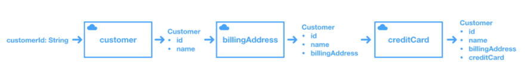

# 在 Swift 中链接异步功能

> 原文:[https://dev . to/zeitgeist 7/chaining-asynchronous-functions-in-swift](https://dev.to/zeitgeist7/chaining-asynchronous-functions-in-swift)

在本文中，我们将看到如何在 Swift 中使用函数组合来链接多个异步请求(不一定使用 RxSwift)。

*【本文* *可以下载同伴* [*游乐场。]*](https://github.com/zeitgeist7/ComposingAsyncRequestInSwift)

假设我们有一个支付验证应用程序，它有以下模型:

```
public struct Customer {
    public let id: String

    public var name: String?
    public var billingAddress: Address?
    public var creditCard: CreditCard?
    public var canMakeOnlinePurchase: Bool {
        guard
            let name = self.name,
            name.characters.count > 0,
            let _ = self.billingAddress,
            let _ = self.creditCard
            else { return false }
        return true
    }

    public init(with id: String) {
        self.id = id
    }
}

public struct CreditCard {
    public let id: String
    public let cardNumber: String
    public let bankId: String
}

public struct Address {
    public let id: String
    public let address: String
}

public struct Bank {
    public let id: String
    public let name: String
} 
```

<svg width="20px" height="20px" viewBox="0 0 24 24" class="highlight-action crayons-icon highlight-action--fullscreen-on"><title>Enter fullscreen mode</title></svg> <svg width="20px" height="20px" viewBox="0 0 24 24" class="highlight-action crayons-icon highlight-action--fullscreen-off"><title>Exit fullscreen mode</title></svg>

从客户标识符开始，我们想知道客户是否可以进行在线购买。我们创建一个带有标识符的客户。其他属性需要分别从服务器**获取**。因此，为了让客户能够进行购买，我们需要获取姓名、帐单地址和信用卡信息。

<figure>[](https://res.cloudinary.com/practicaldev/image/fetch/s--oO3vEUYm--/c_limit%2Cf_auto%2Cfl_progressive%2Cq_auto%2Cw_880/https://cdn-images-1.medium.com/max/1024/1%2AmF7FsKhIVpfca6EidpItXA.png) 

<figcaption>验证购买的信息流举例。</figcaption>

</figure>

对 web 服务的一般请求可能如下所示:

```
func fetch(using input: InputType, completion: (Result<ResponseType>) -> Void) {
    // transform input if needed to make the request
    request(input.requestObject) { data, error in
        // handle any potential error and 
        // transform the receivedResult into what we expect 
        // to bubble up in the completion block
        let tranformedResult: Result<ResponseType> = transform(data)
        completion(tranformedResult)
    }
} 
```

<svg width="20px" height="20px" viewBox="0 0 24 24" class="highlight-action crayons-icon highlight-action--fullscreen-on"><title>Enter fullscreen mode</title></svg> <svg width="20px" height="20px" viewBox="0 0 24 24" class="highlight-action crayons-icon highlight-action--fullscreen-off"><title>Exit fullscreen mode</title></svg>

我们接受一些输入，用来发出请求。当请求成功完成时，它将数据转换成预期的 ResponseType，将其包装成现在著名的`Result`类型，并使用该结果调用我们的完成块。如果出现错误，它被封装在一个`Result`中，并在完成中传递。

下面是我们基于上述签名的请求 API 的接口:

```
public typealias RequestCompletion<ResponseType> = (ResponseType) -> Void

public func fetchCustomer(using customerId: String, completion: @escaping RequestCompletion<Result<Customer>>)

public func updateAddress(of customer: Customer, completion: @escaping RequestCompletion<Result<Customer>>)

public func updateCreditCard(of customer: Customer, completion: @escaping RequestCompletion<Result<Customer>>)

public func fetchBank(of customer: Customer, completion: @escaping RequestCompletion<Result<Bank>>) 
```

<svg width="20px" height="20px" viewBox="0 0 24 24" class="highlight-action crayons-icon highlight-action--fullscreen-on"><title>Enter fullscreen mode</title></svg> <svg width="20px" height="20px" viewBox="0 0 24 24" class="highlight-action crayons-icon highlight-action--fullscreen-off"><title>Exit fullscreen mode</title></svg>

为了进行我们讨论过的验证，我们可能会在应用程序中的某个地方编写这样的代码:

```
fetchCustomer(using: "12345") { customer in
    switch customer {
    case .failure(let error): print(error.localizedDescription)
    case .success(let customer):
        updateAddress(of: customer) { customer in
            switch customer {
            case .failure(let error): print("Address failure: ", error.localizedDescription)
            case .success(let customer):
                updateCreditCard(of: customer) { customer in
                    switch customer {
                    case .failure(let error): 
                        print("Credit card failure: ", error.localizedDescription)
                    case .success(let customer): 
                        print("Can make online purchase: \(customer.canMakeOnlinePurchase ? "✅" : "⚠️")")
                    }
                }
            }
        }
    }
} 
```

<svg width="20px" height="20px" viewBox="0 0 24 24" class="highlight-action crayons-icon highlight-action--fullscreen-on"><title>Enter fullscreen mode</title></svg> <svg width="20px" height="20px" viewBox="0 0 24 24" class="highlight-action crayons-icon highlight-action--fullscreen-off"><title>Exit fullscreen mode</title></svg>

上面的片段清楚地表明，以这种方式链接请求总有一天会让我们发疯。仅仅通过粉饰代码很难判断这里到底发生了什么。让我们试着想出一个类似下图的东西:

[T2】](https://res.cloudinary.com/practicaldev/image/fetch/s--oO3vEUYm--/c_limit%2Cf_auto%2Cfl_progressive%2Cq_auto%2Cw_880/https://cdn-images-1.medium.com/max/1024/1%2AmF7FsKhIVpfca6EidpItXA.png)

您应该已经猜到了，我们将使用函数组合来实现这一点。

让我们来看看我们的通用请求函数:

```
func fetch(_ input: InputType, completion:(Result<ResponseType>) -> Void) 
```

<svg width="20px" height="20px" viewBox="0 0 24 24" class="highlight-action crayons-icon highlight-action--fullscreen-on"><title>Enter fullscreen mode</title></svg> <svg width="20px" height="20px" viewBox="0 0 24 24" class="highlight-action crayons-icon highlight-action--fullscreen-off"><title>Exit fullscreen mode</title></svg>

并用下面的别名来表示:

```
public typealias Request<T, U> = (T, @escaping RequestCompletion<U>) -> Void 
```

<svg width="20px" height="20px" viewBox="0 0 24 24" class="highlight-action crayons-icon highlight-action--fullscreen-on"><title>Enter fullscreen mode</title></svg> <svg width="20px" height="20px" viewBox="0 0 24 24" class="highlight-action crayons-icon highlight-action--fullscreen-off"><title>Exit fullscreen mode</title></svg>

*在我们这里，`U`会映射到* *`Result<ResponseType>`。*

接下来，我们将定义一个允许我们*通过管道*发送请求的操作符。

```
infix operator |>: AdditionPrecedence

public func |> <T, U, V> (f: @escaping Request<T, Result<U>>, g: @escaping Request<U, Result<V>>) -> Request<T, Result<V>> {
    return { (input, combineCompletion) in

        f(input) { (u: Result<U>) in
            switch u {
            case .success(let unwrappedU): 
                g(unwrappedU) { (v: Result<V>) in combineCompletion(v) }
            case .failure(let error): 
                combineCompletion(.failure(error))
            }
        }
    }
} 
```

<svg width="20px" height="20px" viewBox="0 0 24 24" class="highlight-action crayons-icon highlight-action--fullscreen-on"><title>Enter fullscreen mode</title></svg> <svg width="20px" height="20px" viewBox="0 0 24 24" class="highlight-action crayons-icon highlight-action--fullscreen-off"><title>Exit fullscreen mode</title></svg>

该操作符通用于三种类型:`T`、`U`和`V`，并以两个函数`f`和`g`作为参数，其中:

*   `f`取一个`T`并以一个`Result<U>`结束
*   `g`取一个`U`并以一个`Result<V>`结束。

它返回一个带有签名的复合函数:`Request<T, Result<V>>`，即接受`f`的输入并以`Result<V>`结束的函数。

*注:*

*   *`input`是* *`T`* 的类型
*   *`combineCompletion`是* *`RequestCompletion<Result<V>>`的类型。*

这个返回函数的实现从应用`f`开始，然后在`f`的完成块中，它切换到一个`Result<U>`。

*   如果`f`用一个`.success`完成，它*用成功值继续*，并用它调用`g`。当`g`完成时(通过`Result<V>`，它执行`combineCompletion`并得到结果。
*   如果`f`以一个`.failure`结束，它不再移动，并以相应的错误调用`combineCompletion`。

有了这些，我们上面复杂的验证码就变成了:

```
let validation = (fetchCustomer |> updateAddress |> updateCreditCard)
validation("12345") { customer in
  switch customer {
  case .failure(let error): 
    print("Validation failure: ", error.localizedDescription)
  case .success(let customer): 
    print("Can make online purchase: \(customer.canMakeOnlinePurchase ? "✅" : "⚠️")")
  }
} 
```

<svg width="20px" height="20px" viewBox="0 0 24 24" class="highlight-action crayons-icon highlight-action--fullscreen-on"><title>Enter fullscreen mode</title></svg> <svg width="20px" height="20px" viewBox="0 0 24 24" class="highlight-action crayons-icon highlight-action--fullscreen-off"><title>Exit fullscreen mode</title></svg>

我们首先用 3 个请求组成一个验证函数。然后，为了执行实际的验证，我们只需传入客户标识符，在它的完成块中，我们打开结果，看看我们是否设法获得了客户的所有必需属性。

这就是全部了！

### 结论

在评论区留下你的。

*本帖最初发表于[medium.com](https://medium.com/@jhoomuck/composing-asynchronous-functions-in-swift-acd24cf5b94a)T3】*