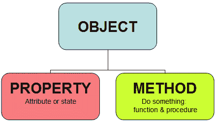

# 哎呀！OOP 来了。

> 原文:[https://dev.to/jordanirabor/oops-here-comes-the-oop](https://dev.to/jordanirabor/oops-here-comes-the-oop)

我开始写计算机程序仅仅是为了娱乐。

最初，我想对我的朋友们开些小玩笑，搞些其他的恶作剧，但过了一会儿，我才意识到，在不久的将来，我将认真对待计算机编程。

今年的某个时候，有人给了我一份一次性工作，实际上是我的第一份网络开发工作——他让我建立一个基本的网站，我认为这将是一个将我所学的一切付诸实践的好时机。

完成这个项目花了我大约两周的时间。最终，我做出了足够好的东西来使用，并且还自夸地挑战了所有管理 OOP 和编程的规则。嗯，我想不能完全怪我，95%的代码是由随机的 stackoverflow 答案组成的。

我当时的信念是:如果它看起来有效，那么它很可能有效。

很久以后，我有机会在一家真正的软件驱动公司工作，然后我意识到在计算机编程中以正确的方式做事很重要；没有人想和意大利面条代码扯上关系。

意识到这一点，我开始有意识地工作，使我的代码更可读，采用缩进的习惯，并确保对程序中每一个模糊的代码块进行注释，但我的努力仍然不够。

有些日子，我看着我周围更好的开发人员的代码，遇到了一些我经常使用但从来不知道它们是什么意思的关键词。我对 OOP 的基础也不是很熟悉，这是我最烦恼的问题。那时我试图学习和理解 OOP，事实证明它和其他事情一样困难。

这篇文章将通过例子向你介绍 OOP 的基本概念，但是在某种程度上，我更愿意在我为 OOP 奋斗的时候阅读它。

让我们从理解什么是面向对象编程开始。

面向对象编程是一种编程风格，它支持在一个类中定义一个对象的所有属性和功能的概念，这确保了代码是可重用的，并且是一种比以前的范例更有效的编程方法。

[T2】](https://res.cloudinary.com/practicaldev/image/fetch/s--wc7k6sND--/c_limit%2Cf_auto%2Cfl_progressive%2Cq_66%2Cw_880/http://www.teachitza.com/delphi/object.gif)

这就引出了一个问题，什么是类，类应该包含什么？我们如何知道我们有足够的属性和函数来分组为一个类呢？

要回答这些问题，让我们这样想；一个类可以包含处理某个程序元素的所有代码。解释这一点的一个例子是:假设我们有一个做很多事情的通用程序，但我们有一个定义“用户”元素的程序的较小部分，我们可以将与用户属性和用户功能相关的所有代码分组到一个类中，这将在许多方面对我们的程序整体有益。

代码示例用 PHP 编写，并且保持简短。

我们应该根据它是什么来命名一个类，为了可读性，并且，习惯上以大写字母开始类名，如果一个类名包含两个或更多的单词，那么应该用大写字母来写。

```
class User { 
    // The code 
} 
```

<svg width="20px" height="20px" viewBox="0 0 24 24" class="highlight-action crayons-icon highlight-action--fullscreen-on"><title>Enter fullscreen mode</title></svg> <svg width="20px" height="20px" viewBox="0 0 24 24" class="highlight-action crayons-icon highlight-action--fullscreen-off"><title>Exit fullscreen mode</title></svg>

一个类可以有属性；属性是类中的变量，这些变量可以被初始化为包含值，也可以不初始化(在某些编程语言中，它们必须在源代码编译之前被初始化)。)

我们还可以通过使用访问修饰符关键字来指定这些属性的可访问性。

```
class User {
    protected $age;  
    public $name;  
    public $clothed = true; 
} 
```

<svg width="20px" height="20px" viewBox="0 0 24 24" class="highlight-action crayons-icon highlight-action--fullscreen-on"><title>Enter fullscreen mode</title></svg> <svg width="20px" height="20px" viewBox="0 0 24 24" class="highlight-action crayons-icon highlight-action--fullscreen-off"><title>Exit fullscreen mode</title></svg>

现在有趣的部分来了，我们可以继续创建同一个类的对象，每个对象都有它自己的一组唯一的属性。

```
$firstUser = new User ();
$secondUser = new User ();
$thirdUser = new User (); 
```

<svg width="20px" height="20px" viewBox="0 0 24 24" class="highlight-action crayons-icon highlight-action--fullscreen-on"><title>Enter fullscreen mode</title></svg> <svg width="20px" height="20px" viewBox="0 0 24 24" class="highlight-action crayons-icon highlight-action--fullscreen-off"><title>Exit fullscreen mode</title></svg>

现在你可能想知道，类有什么用，为什么我们需要创建类的实例(对象)？这样想吧；在过去，编程的过程化方法允许所有的变量和函数在整个程序的全局范围内共存，也就是说，它们都存在于一个表面上，并且可以通过调用它们的名字等方式相互交互。

对于类来说，情况并非如此；一个类定义了一个全局作用域之外的作用域，在类作用域内执行的每个操作对全局作用域来说都是完全隐藏的。嵌套在类范围内的代码由类封装，不可用于全局范围，为了访问和使用类内的代码，必须创建类实例。这个类实例称为对象。

我们可以创建任意多的一个类的对象，并且每个对象都是不同的。在创建或实例化一个对象时，该对象从其类继承所有属性，并可以接收其自身属性的唯一值。

值得记住的是，一个类定义了从它创建的对象的结构和行为。

获取对象属性中的值很容易。在 PHP 中，这可以通过引用对象的名称，附加一个大于符号(->)的破折号，然后是属性名来实现。

```
echo $firstUser->age;
echo $secondUSer->name;
echo $thirdUser->clothed; 
```

<svg width="20px" height="20px" viewBox="0 0 24 24" class="highlight-action crayons-icon highlight-action--fullscreen-on"><title>Enter fullscreen mode</title></svg> <svg width="20px" height="20px" viewBox="0 0 24 24" class="highlight-action crayons-icon highlight-action--fullscreen-off"><title>Exit fullscreen mode</title></svg>

结果:
12
乔丹
假

还值得记住的是,$符号只附加在对象的名称上，而不是属性的名称上。

为一个对象的属性设置一个新值并没有完全不同，我们只是在右边附加了一个赋值操作符，这个值就被赋给了对象的属性。

```
$firstUser->age = 20;
$secondUSer->name = “Castiel”;
$thirdUser->clothed = true; 
```

<svg width="20px" height="20px" viewBox="0 0 24 24" class="highlight-action crayons-icon highlight-action--fullscreen-on"><title>Enter fullscreen mode</title></svg> <svg width="20px" height="20px" viewBox="0 0 24 24" class="highlight-action crayons-icon highlight-action--fullscreen-off"><title>Exit fullscreen mode</title></svg>

现在打印这些对象的属性会产生:

结果:
20
卡斯提尔
真

这样做很有趣！

类使用起来很棒，属性背后的想法也很有创意，但是想想这个。想象一个定义用户的类，这个类规定所有用户必须有一个名字和年龄属性，这很好，但是这个类没有定义与用户对象相关的功能，对象很可能使用函数执行操作，这些函数被称为方法，这个类应该为它的对象定义方法。

由方法执行的用户类的功能的例子有“创建帖子”、“发表评论”和其他类似的功能。

```
class User{
         protected $age;  
     public $name;  
     public $clothed = true;   
     public function makePost()   { 
       // code for making a post go here;
    } 
```

<svg width="20px" height="20px" viewBox="0 0 24 24" class="highlight-action crayons-icon highlight-action--fullscreen-on"><title>Enter fullscreen mode</title></svg> <svg width="20px" height="20px" viewBox="0 0 24 24" class="highlight-action crayons-icon highlight-action--fullscreen-off"><title>Exit fullscreen mode</title></svg>

我们只是在用户类中包含了一个简单的 makePost()方法，请注意，我们用 public access 修饰符作为该方法的前缀，以表明该方法可以被一个类的具体实例从全局范围调用。

习惯上用小写字母命名一个方法。方法应该根据它们执行的功能来命名，并保持简短。

我们调用方法的方式类似于我们引用对象属性的方式；对象名、大于号(->)和方法名。

```
$firstUser = new User();
$firstUser->makePost(); 
```

<svg width="20px" height="20px" viewBox="0 0 24 24" class="highlight-action crayons-icon highlight-action--fullscreen-on"><title>Enter fullscreen mode</title></svg> <svg width="20px" height="20px" viewBox="0 0 24 24" class="highlight-action crayons-icon highlight-action--fullscreen-off"><title>Exit fullscreen mode</title></svg>

上面的第一行代码创建了一个 user 类的对象，而另一行代码调用了 makePost()方法。在实际编程中，makepost()方法最好有一个参数来接收用户生成的文本，并可能将其保存到数据库中，但这些只是示例，一切都非常简单，因为这只是对 OOP 基础的介绍。

现在让我们看看我们已经做了多少，我们已经学习了 OOP 的基本思想，现在更清楚地知道了 OOP 的含义，我们也看到了为什么类和对象对于现代编程是伟大的。干得好，我们做了这么多！如果你想了解更多关于 OOP 的知识，这应该有助于打下基础。