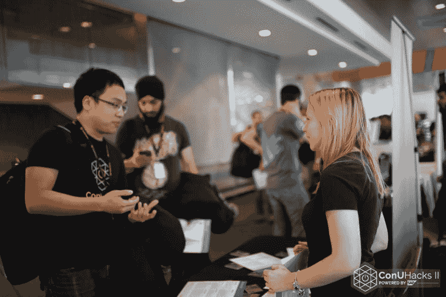

# 我的 GitHub 校园之旅专家:第一部分

> 原文：<https://dev.to/kimcodes/my-journey-in-github-campus-experts-part1>

* * *

### 前言

我仍然记得我参加的第一次黑客马拉松。我太害羞了，不敢以黑客的身份参加，所以我决定自愿参加。那是 2014 年 9 月的蒙特利尔 WearHacks。我被我周围的人迷住了。什么样的人会花整个周末做一个项目？从零开始，与完全陌生的人一起工作，几乎不睡觉，这一切都只是因为他们热爱他们所做的事情

不知不觉中，我每个周末都会去不同的城市。有一个周末，我会去费城参加 PennApps，去密歇根的 MHacks(顺便坐 14 个小时的巴士)，去 HackHarvard，一直到罗德岛布朗大学的 HackBrown。坐飞机成了第二天性。太不真实了。2015 年秋天，从 9 月到 12 月，我想我总共有 2 个周末在蒙特利尔的家里。最重要的是，2016 年 1 月，我的黑客集体在肯考迪亚大学举办了我们有史以来第一次黑客马拉松——conu hacks

当我回顾那一年的时候，所有的周末都有点交织在一起，有点模糊。我记得我一直都很累，但是红牛、披萨和臭脚的味道让我兴奋不已。我被机会和可能性迷住了。那一年我完成了所有的事情，但我仍然觉得我不知道自己想做什么。我不断被诸如“大学毕业后你打算做什么”之类的问题轰炸。和*你喜欢什么领域的软件？*”。我不知道。但我知道的是我发现了一些东西。我能感觉到，但我还没准备好放手。

### 简介

2016 年 6 月，我发现自己在科罗拉多州丹佛市的官方黑客马拉松组织者会议 HackCon IV 上。我周围都是让北美黑客马拉松成为可能的学生。我不敢相信我会到那里，站在落基山脉的山顶上

[T2】](https://res.cloudinary.com/practicaldev/image/fetch/s--mTyNQUTx--/c_limit%2Cf_auto%2Cfl_progressive%2Cq_auto%2Cw_880/http://res.cloudinary.com/dvjbwnhef/image/upload/v1501959083/hackon-1_qeiswy.jpg)

那个周末就像我经历过的所有黑客马拉松周末一样，模糊但充满了兴奋、机会和可能性。我记得很清楚的一件事是 Brandon Keepers 的一次演讲，他是 GitHub 开源的领导者。他做了题为“为你的事业做贡献”的报告。他谈到了开源以及它是如何被普通人创造出来的。他接着说，没有什么能阻止我们中的任何人去我们想去的地方。有了正确的工具和正确的支持，您就可以实现这一目标。我想就在那一刻，我对自己有了一点了解，了解了我的信仰和我想做的事情。我对这个社区非常着迷，我渴望采取下一步行动。

Keepers 演讲之后，GitHub 宣布启动校园专家计划。我对这个机会有一种瞬间的激情、渴望和纯粹的兴奋。我立即抓起我的手机，跳到网上填写申请。在一堆标准问题之后，确保我实际上是一个活生生的非机器人，还有最后一个问题。黄金问题。*“你为什么想成为 GitHub 校园专家？”。*你只有 500 字来解释。我怎么能把我脑子里发生的一切都压缩成 500 个字符呢？

所以那天晚上我没有睡觉，躺在床上听着半运转的风扇绝望地试图再转一整圈。当我看着窗外的群山，那些星星像星星一样在山顶上闪烁时，我想，“我怎样才能把我自己的一部分融入到这个信息中呢？我思考着如何向他们展示我是谁，以及我对这个社区有多么不可思议的着迷。

周末过去了，我仍然不确定如何完成申请。我对这个项目了解得越多，我就越强烈地想要开始做我真正想做的事情。但是我总是找借口。我想开始写博客，我想开研讨会，我想做演讲...我再也不想只是参加活动了。我想在前线。我最终决定用 JavaScript 编写一个输入效果，将我的消息输出到 GitHub。这是我知道的最好的方法，让信息更加个人化，反映我自己。

我点击提交，然后等待

### 程序

[T2】](https://i.giphy.com/media/rl0FOxdz7CcxO/giphy.gif)

在我意识到之前，我和来自世界各地的 29 名学生一起参加了一个为期 8 周的项目。尽管陷入了疯狂的期中考试，但我们都非常乐意加入

在这几周里，我们收到了来自 GitHub 组织的大量支持。我们在如何组织技术活动方面得到了帮助，如技术讲座、黑客之夜和黑客马拉松。我们学习了如何将技术内容组合在一起。我们有机会开发引人入胜的讲座/教程，并有机会展示和排练它们。我们获得了建设和发展社区所需的资源和工具。

##### 等等，什么是校园专家计划？

校园专家计划始于这样一个理念:让我们在校园里找到领导他们技术社区的人，并帮助他们做得更好。该计划侧重于建设我们的社区。它提供了在组织活动、公开演讲和技术写作中获得经验的机会

归结起来就是:我们将帮助你把你的社区聚集到一起，进行交流、学习、分享和庆祝！！

### 流程

我们首先检查我们社区的人口统计，我们当前的资源，以及我们当前的通讯媒介。从小处着手不会被反对，简单是有利的。通过分析和定义我们的社区，我们设定了一个明确的目标，并指定了实现这些目标的步骤。最重要的是，我们得到保证，如果我们不能按时达到目标，也不会气馁。没有唯一的方法，也没有唯一正确的方法。这是一个适应性的过程，我们精心打造了我们的社区，使之最适合我们。

最重要的一点是，没有一成不变的食谱可以遵循，相反，我们要把我们的八周变成我们想要的。你想提高什么或者你想在什么方面变得更好？让我们记录下来，让它发生。我认为这是我最喜欢的。我们都有不同的想法。而且成功了。我们有自由建立我们的社区。**您想向您的社区发送什么信息**？从某种意义上来说，我们可以自由地创建自己的程序，但仍然由两个不可思议的领导者 Joe 和 Hector 指导。

### 体验

这是一次很棒的经历，可以见到其他热情的学生，他们也在志愿贡献他们的时间来做一些令人惊奇的事情。这 29 名学生已经在鼓励和培养下一代年轻人才了！这些人是我想被包围的人。这些学生启发了我。

这个项目教会了我公共艺术品的重要性——关于留下书面记录——并开始建设我自己和我的事业。你现在做的所有小事都在为你将来的目标做准备。“布兰登·凯斯。

总的来说，我简直不敢相信我从 GitHub 员工那里得到了如此多的培训和指导。我开始意识到人是社会的基础这一现实。作为 GitHub 校园专家计划的一部分，我获得了帮助其他开发人员所需的正确工具和支持。我觉得我得到了一个秘密武器。八个星期后，我已经准备好迎接这个世界，因为我知道我的后兜里有这个秘密武器...

[T2】](https://res.cloudinary.com/practicaldev/image/fetch/s--0FpMZcgH--/c_limit%2Cf_auto%2Cfl_progressive%2Cq_auto%2Cw_880/http://res.cloudinary.com/dvjbwnhef/image/upload/v1501959078/hackon-2_nzijw9.jpg)

### Postscript

我可以急切地说，我已经扩大了我的支持网络，我觉得对下一个挑战准备得更充分了。我在社区和技术之间找到了我的甜蜜点。GitHub 校园专家给了我前进的动力。

这个项目让我走出了自己的舒适区，并取得了很好的效果。我参加了我的第一次 Hacktoberfest，并加入了令人惊叹的开源社区。我还制作了我的第一个视频教程，内容是我几周前才开始学习的。我甚至上了 MLH 当地的黑客日 YouTube 频道。最重要的是，我结识了新朋友和新导师。

我在过去几个月里所做的一切，参加黑客马拉松，参加聚会，组织科技活动等等。允许我建立自己。更重要的是，它让我坠入爱河。我爱上了沉浸在一种注重学习、建设和分享的文化中。

GitHub 校园专家计划正在培育在全球范围内促进学习、建设和分享技术的社区。——金诺尔

今天，我可以自豪地说，我是 Keepers 所说的技术社区支持系统中的一员。我也不会马上去任何地方。

谢谢你乔，谢谢你赫克托，谢谢你约翰，谢谢你 GitHub！â Â

* * *

你喜欢组织、计划和召集人们吗？您需要支持和帮助来举办活动吗？你想获得资源和建议吗？如果你想成为一个成长中的社区的一员，为科技的未来做出长期积极的贡献，那么这里就是你的地方！立即申请 GitHub 校园专家计划[https://education.github.com/experts](https://education.github.com/experts)