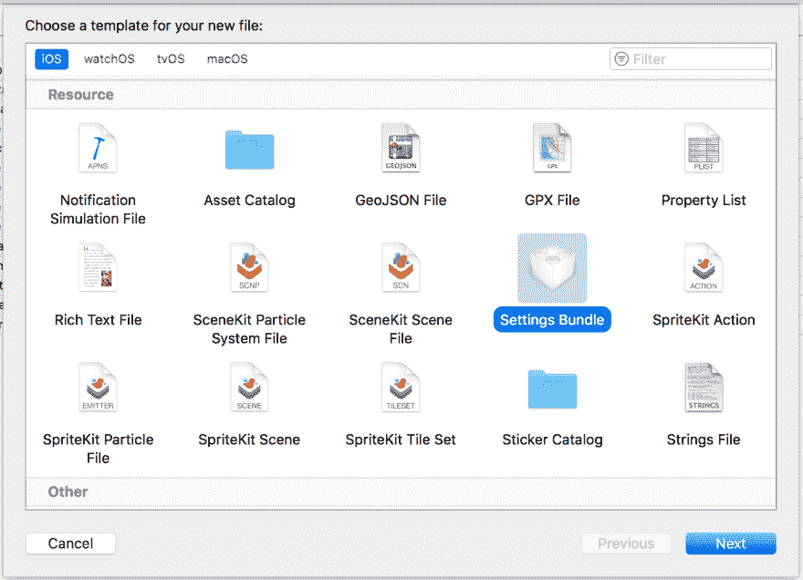
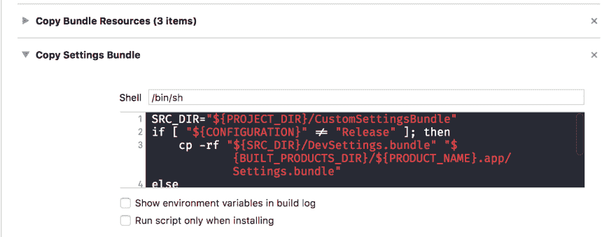

# 每个配置的自定义 iOS 设置

> 原文：<https://dev.to/coverback/custom-ios-settings-per-configuration>

# 根据配置自定义 iOS 设置

许多公司迟早会面临为应用程序提供额外信息或定制的需求。对我来说，它通常是针对非生产服务器并在开发、测试和生产服务器环境之间进行选择的能力。

有多种方法可以实现，最简单的可能是在 iOS 系统设置部分为你的应用程序提供自定义设置捆绑包。

## 添加设置捆绑包

添加一个设置包就像添加一个新类一样简单。

[T2】](https://res.cloudinary.com/practicaldev/image/fetch/s--nmndOTb1--/c_limit%2Cf_auto%2Cfl_progressive%2Cq_auto%2Cw_880/https://thepracticaldev.s3.amazonaws.com/i/49qsixu0tj4nicfxcwhf.png)

在[示例项目](https://github.com/coverback/CustomSettingsBundle)中，我添加了两个包，`ProdSettings`和`DevSettings`。
添加完包之后，从`Copy Bundle Resources`构建阶段移除包，因为在下一步中您将手动复制它们。

## 根据配置覆盖捆绑包

在目标的构建阶段，添加一个新的构建步骤`New Run Script Phase`并将其放在`Copy Bundle Resources`步骤之后。
T3T5】

复制正确包的脚本应该是这样的:

```
SRC_DIR="${PROJECT_DIR}/CustomSettingsBundle"
if [ "${CONFIGURATION}" != "Release" ]; then cp -rf "${SRC_DIR}/DevSettings.bundle" "${BUILT_PRODUCTS_DIR}/${PRODUCT_NAME}.app/Settings.bundle"
else cp -rf "${SRC_DIR}/ProdSettings.bundle" "${BUILT_PRODUCTS_DIR}/${PRODUCT_NAME}.app/Settings.bundle"
fi 
```

Enter fullscreen mode Exit fullscreen mode

## 用法

就像普通设置一样，通过`UserDefaults`访问值。

```
UserDefaults.standard.bool(forKey: "dev_preference_enabled") 
```

Enter fullscreen mode Exit fullscreen mode

请注意，从捆绑包中移除设置不会清除`UserDefaults`中的相应键，并且在设置至少更新一次之前，无论设置捆绑包的`plist`中的默认值如何，它都将是`nil`。

## 明白了

成品文件夹中的设置必须命名为`Settings.bundle`。也许您可以在某个地方更改这个需求，但是因为这个示例脚本也重命名了文件夹本身。

iOS 设置会被缓存，因此在配置之间切换需要项目清理，并且可能需要重新安装应用程序以强制更改设置内容。我的建议是让 beta/dev 版本具有单独的捆绑 ID，这样你就可以同时安装多个版本的应用程序，而不必重新安装来测试配置。

另一个问题是 iOS 设置应用本身。有时所有的应用程序都会从其中消失，所以如果你切换，特别是如果你在打开设置应用程序时安装了一个应用程序，通常需要重新启动设置应用程序。

## 替代品？

提供自定义设置捆绑包非常容易，但不是很灵活。下一个最好的方法是通过一个隐藏在应用程序登陆屏幕上的调试/测试按钮下的特殊屏幕来完成。

最大的好处是不必离开应用程序切换环境，也不必记得杀死应用程序，如果你的设置只在启动时读取。使用自定义代码，您可以进行“保存”以执行数据保存，然后执行`exit(0)`。