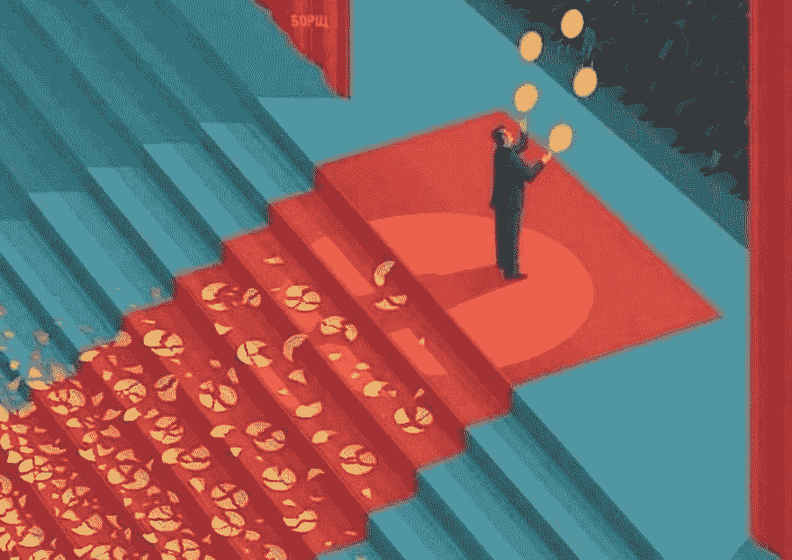

# # 30 天无畏编码

> 原文:[https://dev.to/devfestnyc/30days-of-fearless-coding-33f](https://dev.to/devfestnyc/30days-of-fearless-coding-33f)

如果你和我一样在科技行业待了这么久，你可能会对术语*冒名顶替综合症*很熟悉——这是一种女性和少数族裔在科技行业经常经历的行为，这并不奇怪。

根据定义，冒名顶替综合症是..

> 这个概念描述的是那些成就卓越的人，他们的特点是无法[将自己的成就](https://en.wikipedia.org/wiki/Internalisation_(sociology))内化，并且一直害怕被揭穿是“骗子”…。成功的证据被认为是运气、时机或者是欺骗他人，让他们认为自己比他们认为的更聪明、更有能力的结果

这里的问题在于对自我的认知。这种挥之不去的恐惧是，一个人不够好、不够聪明或不够称职，不适合你现在的角色或职位——无论是作为开发人员、公共演说家、经理还是顾问。

我们都无法幸免。虽然最近关于这个问题的报道已经导致了一系列自我提升的文章，比如《快速公司》的这篇文章(《T2》的《五种类型的冒名顶替综合症》)..以及如何打败他们事实是，从本质上来说，这是关于克服你对被他人评判的恐惧——以及对自己有足够的自信，从而变得脆弱并对自己不知道的事情开诚布公。

随着每一天的过去，当我读到更多关于试图发展多元化和包容性技术所面临的偏见和挑战的叙述和故事时，我再次被提醒，不要屈服于这种对自己不够优秀而不属于技术的恐惧是多么重要。

那完全是胡说八道。没人有权利告诉你，你不属于科技行业。我们都是某个地方的少数民族。如果有人给任何行业带来激情、毅力和良好的职业道德——**认可并放大它们**而不是感到不安全或积极破坏这种努力。*水涨船高。*

当我感到自己屈服于任何类型的怀疑时，我会花一分钟看看这张照片并提醒自己——**“每个所谓的“专家”背后都有一系列的失败，这些失败为到达*,即*点铺平了道路，在那里他们可以让成功看起来很容易。**

> banksy@ thereaibanksy人们只看到最终的结果。2017 年 7 月 22 日上午 02:051486024415

是失败*和随后的坚持*让他们成为专家——而不是最终结果。因此，我希望在我做的每一件事情中——无论是构建产品还是社区——我都愿意接受失败，将其作为获得专业知识的重要组成部分。这不容易，但我打算试一试。

因此，这开始了我的**# 30 天**挑战，成为一名无畏的程序员。如果你想了解 *30 天挑战*，请查看马特·卡茨的 TED 演讲！

[https://medium . com/media/463d 6337590 c78 f 435 c 242 e 297 f 88 DC 7/href](https://medium.com/media/463d6337590c78f435c242e297f88dc7/href)

### 关于无畏编码

在接下来的 30 天里，我将潜心学习一些新的技术或概念，这些技术或概念是我一直想探索的，但我觉得我没有足够的专业知识来谈论它们。这包括从对话式 UI/UX 和机器学习，到嵌入式系统和物联网——我作为业余爱好者探索过的主题，但我希望在构建现实世界的产品时使用这些主题。

我的目标是在 30 天内每天写点东西，分享我的所作所为或所学——即使只是一些相当琐碎的事情。我希望每个帖子都能展示我认为的无畏编码的三个关键行为

1.  *好奇心:任何领域的专业知识通常都是从一个简单的问题“为什么”或“如何”开始的，这个问题会引发探索，揭示挑战，然后有望带来创新和体验。我真诚地相信，只要我们满足我们的好奇心，我们就会发现我们的头脑中没有多少空闲的空间留给仇恨或消极。*
**   ***坚持:*** 专业知识来自实践。很多。我们都过着快节奏的多任务生活，很多时候感觉没有足够的时间来进行那种建立完美的练习。我的目标是每天努力做些事情来让自己保持专注。可能会有失误——“我有很多事情要做。所以我用大量的宽恕来武装自己，并提醒自己尽情享受。*   ***漏洞*** *。*也许是最重要的一个。我要强调分享*我的错误—*——换句话说，我想分享成堆的碎盘子，即使我试图让杂耍看起来毫不费力。特别是，我将假设这本“日记”的唯一读者是我。在这种背景下，我想用一种我可以诚实回忆的方式来记录它，我可以在以后重温，用先进的见解来改进这种理解..*

 *所以我们开始…

> 亲爱的未来的我…>你承诺过什么？如果你以后再来看这个，我希望你能为自己迈出这一步而感到自豪！向前！
> 
> * * **