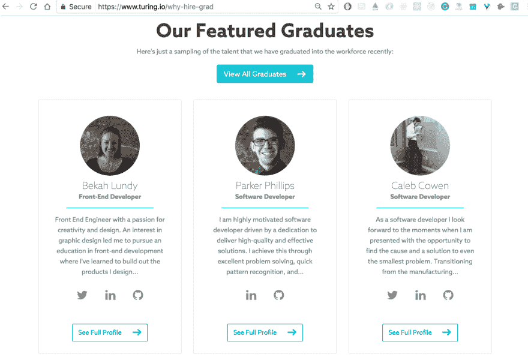
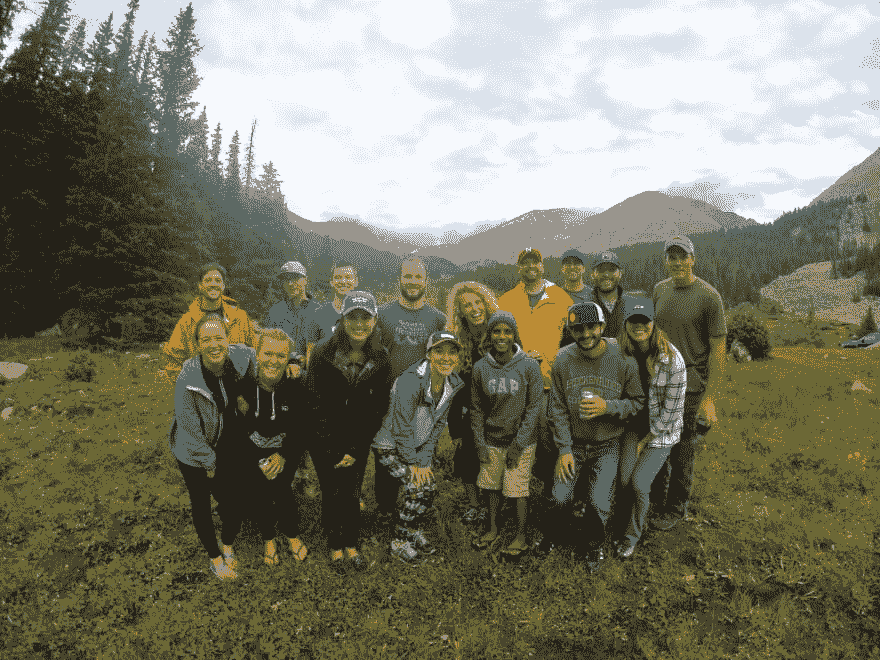
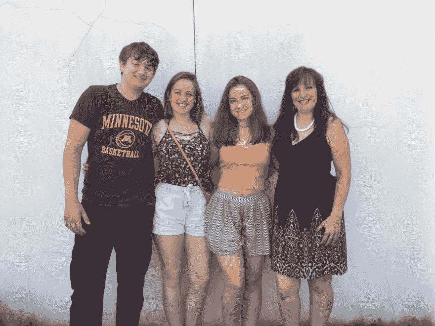

# 我成为 19 岁全栈工程师的旅程

> 原文:[https://dev . to/bekah _ lundy/my-journey-to-being-a-a-19 岁-全栈工程师](https://dev.to/bekah_lundy/my-journey-to-becoming-a-19-year-old-full-stackengineer)

一年前，我绝不会想到今天我会在丹佛市中心的一家初创公司做软件开发员。

随着我 20 岁生日的到来，我有很多事情要反思。我通常会说很多谢谢。我决定写一写我进入科技世界的旅程，以及让我走到今天的决定。

如果你想了解我是如何得到这份工作的，我打算不久就写一篇关于这份工作的文章，敬请关注。这纯粹是我的科技之旅，以及我的生活发生了怎样的变化。

所以我们开始吧:

## 预图灵

我是贝卡。我来自明尼苏达州。高中毕业后，我有机会在圣保罗的一家平面设计/营销公司实习。这是我的暑期工作。在那里的整个时间里，我用 Adobe Creative suite 完成了一些涉及图形设计的小任务。这对我来说已经足够有趣了，但我通常更感兴趣的是我的一个同事在做什么。他是一名软件开发人员。他告诉我，他的朋友制作了一个机器人，可以让他赢得他参加的任何 twitter 比赛。他会告诉我作为一名开发人员可以做的所有事情，以及他在一天结束时的成就感。有时我会停下手中的工作，和他坐在一起，看看他在做什么。太迷人了。他似乎可以访问和控制计算机的一个完全不同的部分，这是我从来没有看到或理解过的。尽管这是我当时最大的兴趣之一，但在我的脑海中，成为一名软件开发人员从来都不是一个真正的职业选择。回想起来，这可能是因为我的高中(和社会)推动男孩进入这些类型的领域，而不是女孩。所以有一段时间我一直走平面设计路线。

上大学后，我继续学习平面设计。我不喜欢大学。它很慢。我每天只有几节课，每项作业都是关于记忆事实和数字或者写论文。这些事情还不错，但是在接下来的四年里，我很难想到要做这些事情。平面设计课程很好，我仍然喜欢发挥我的创造力，但即使是这些也不足以挑战我。我很无聊。幸运的是，那一年的必修课之一是网络开发课，我记得看着我的同事建立网站是多么有趣，我再次变得兴奋起来。在我上 web 开发课的第一天，我们复习了一点 HTML 和 CSS。我完全被迷住了。我可以建造我设计的东西？就用这个代码？一个全新的世界展现在我面前。我迫不及待地想回家了解更多。我跳上 codecademy，浏览了 HTML 和 CSS 课程。当下周的课程来临时，我失望地得知我们将使用 DreamWeaver 来建立我们的网站。我想从头开始建造一切！这正是我所期待的。在梦想只用我输入的单词在我的脑海中创造出设计后，我开始重新考虑我要去的大学。

在寻找拥有更好的设计/计算机科学学位的不同大学时，我遇到了编码训练营。在朋友的帮助下，我找到了图灵软件与设计学院。这所学校之所以吸引我，有很多原因。首先，他们提供了一个前端开发程序，这与我想做的事情完全吻合。他们的价值观是杰出的，学校是非盈利的，这是一个沉浸式的 7 个月项目课程，以及令人难以置信的好学生成功率。他们还提供多样性奖学金。在我年轻的时候，似乎这是一所只为那些智力超常的人而设的学校，由于我缺乏经验和他们的低录取率，我被录取的可能性很小。我想我至少应该申请看看我是否能成功。

感觉有一百万步要走，但是在所有的申请和面试之后，我被录取了。这既令人兴奋又绝对令人恐惧。因为现在我要做一个决定。我真的要从大学退学，穿越整个国家去一所编码学校吗？

…是的

## 图灵

在图灵开始上学我非常紧张。我觉得他们只是偶然让我进来的。我班上的每个人都比我大，都有大学学位，有现实世界的工作经验，对自己正在做的事情有更高程度的把握。至少可以说这是令人生畏的。我开始对自己信心不足，在第一个模块中，我一直认为管理员让我进去是犯了某种错误。幸运的是，这一切在节目结束时都改变了。

图灵是一个陌生的世界。他们有精心设计的教学方法。教授们会向你展示足够让你开始的东西，给你分配一个三天内到期的项目，并慢慢教你你需要知道的东西，以便你能在三天内真正完成这个项目。这种方法教会了我如何研究，如何提问，以及如何作为团队的一员去解决看似不可能的事情。

图灵是我很久以来做过的最有趣的事情。我住在晚上，我的团队会熬夜完成项目。在三天内完成一个项目后，随之而来的压力感是难以置信的。我在那里遇到了一生的朋友。我喜欢在那里的每一秒钟，愿意再做一次。

图灵被分成四个模块。每期六周，中间有一周的休息时间。每个模块都让我感觉自己在成长。我觉得在这个项目中，我对自己的了解和对编码的了解一样多，对此我永远心存感激。

在整个 mods 中发生的一些事件让我印象深刻:

我回想起 mod one，我是多么的不安全和害怕。我记得我在恐慌的状态下参加了那个 mod 的最终评测，因为我确定我会失败(我通过了)。在这个时候，我仍然觉得自己一无所知，觉得自己不够资格呆在那里。

在第二阶段，当我的老师们通过我时，我在他们面前哭了(最后的“是的，你通过了，你继续前进，或者“你失败了，重复这个模块”)，我是如此的宽慰，所有这些失败和自我怀疑的想法都只是在我的脑海中，而不是我现实的一部分。他们向我保证，他们从来没有担心过我，他们知道我过得很好。

mod 的最后一周，一切都变了。我们得到了比平时多得多的期末评估材料。三个部分的第一部分是学习六个艰难的代码挑战，老师告诉我们他们会随机选择一个进行评估。学习这六种语言是我最关心的事情。当我看着他们的时候，我感到茫然。我把从里到外了解这些问题并理解它们各自的作用作为我的使命。在周末，我在白板上教我的同学如何解决这些代码问题。我的信心暴涨。在这之后，我对自己成功的能力感觉好多了，毫无问题地通过了 mod 3。

<figure>

啊 mod，所有的东西开始聚集在一起。这是事情真正开始对我有意义的时候。代码，事业，生活。在 mod four 中，当一家软件公司想要检查图灵的学生和人才、学生生活和我们所学的东西时，我的老师选择了我来代表图灵。我是图灵网站上的特色毕业生，是从所有成功的毕业生中挑选出来的。
[T3】](https://res.cloudinary.com/practicaldev/image/fetch/s--ANv6r4dM--/c_limit%2Cf_auto%2Cfl_progressive%2Cq_auto%2Cw_880/https://thepracticaldev.s3.amazonaws.com/i/f1fssm6uxwfztw7nls0f.png)

<figcaption>I was chosen to be a featured graduate on Turing’s site!</figcaption>

</figure>

芬兰的一名开发人员找到了我，他说在看完每个毕业生的简介后，他对我的故事和背景印象最深，也最兴奋，希望我加入他的团队。我参加了一个小型创业公司的面试，因为开发人员和我相处得太好了，所以面试时间比正常时间多了一个小时。与此同时，另一家公司正在考虑雇用我，在与他们面谈后，一切看起来都很有希望。在最后一个模块中，我还在不到 10 个小时的时间里，用 node/express API 从头开始构建了一个完整的 CRUD web 应用程序，以供我们进行最终评估。我在一群 60 多岁的人面前谈论我的团队的顶点项目，感觉很强大。

<figure>

> 杰夫卡西米尔@ J3。 [@bekah_lundy](https://twitter.com/bekah_lundy) 和团队演示他们的“Neumann”app 用于追踪 [@turingschool](https://twitter.com/turingschool) 校友，用 React、Auth0、an……[twitter.com/i/web/status/8…](https://t.co/hQZxs3Ri7g)00:17am-05 2017

<figcaption>This was my team on the final round of demo night, only seven groups were moved to this round</figcaption>

</figure>

毕业那天晚上，老师告诉我，我以全班第一名的成绩毕业了。我的同学们积极地包围着我。我对自己的任何怀疑都被我的同龄人、老师和朋友反复地踩在脚下。在这一点上，我不可能怀疑自己。我周围的人都对我的职业道德印象深刻，知道我会成功。当你周围的每个人都那么强烈地相信你时，相信你自己就很容易了。我知道我应该成功，我在这所学校非常努力。七个月来，我几乎每天晚上都呆到 7 点或 8 点，(每个工作日 10-12 个小时)，周末都有项目。我把所有的精力都倾注在学习上，在找工作的时候也很努力。

<figure>

> 杰夫·卡西米尔@ J3守望世界[twitter.com/bekah_lundy/st…](https://t.co/rT4Ndh9tG1)2017 年 4 月 23 日下午 13:40贝卡·伦迪[@贝卡·伦迪](https://dev.to/bekah_lundy)

<figcaption>The executive director of Turing School of Software and Design giving me a lil shoutout</figcaption>

</figure>

我带着对自己完全不同的看法离开了图灵。我擅长这个。我聪明又有才华，我热情又努力，而且擅长这个！我是一名程序员，我编写和呼吸代码，这是我应该做的。我无法感谢所有帮助过我的人。图灵绝对是我做过的最好的决定。

## 贴图灵

毕业夜之后事情发生的很快。同一个周末，我得到了第一份最终工作。接下来的周末，我得到了第二个。

我清楚地记得那一天。那是一个星期六，我敬畏地坐着(微笑着),试图完全理解正在发生的事情。我是一个 19 岁的孩子，从大学辍学，有两家公司为我竞争。我收到了两个非常有竞争力的邀请，来自两个非常棒的地方。

我最终选择为 Apto 工作，这是一家开发商业房地产软件的公司。我目前是他们工程团队的一名全栈工程师。在办公室的每一天都棒极了，我喜欢上班。每天都充满了学习，伟大的对话，编码，和狗(狗友好的办公室，哇！).我已经爱上了这里的社区。它就在市中心，有着年轻的创业风格文化。我交了新朋友，建立了美好的关系。我的团队是不可思议的，能得到这份工作我感到非常幸运。

<figure>

[T2】](https://res.cloudinary.com/practicaldev/image/fetch/s--_O4p-l7U--/c_limit%2Cf_auto%2Cfl_progressive%2Cq_auto%2Cw_880/https://thepracticaldev.s3.amazonaws.com/i/phabbbvkonoomnn8k230.jpg)

<figcaption>Company camping outing, not many people can say that they have gone off-roading with their CEO</figcaption>

</figure>

工作之外，我非常乐意成为图灵的导师。由于前端项目仍然很新，没有多少前端毕业生回来成为导师。学生们经常联系我，我通常一周见他们几次。有时候只是吃午饭聊天，有时候是教学看代码。无论会议如何进行，帮助这些学生都是一件愉快的事情。八个月前，我也处在他们的位置上，所以我很乐意给他们提供他们需要的所有信息和帮助。

我还在 Girl Develop It meetups 做志愿者，帮助像 GDI Boulder 创始人 Cara Jo 这样的摇滚明星做助教。

我花时间做的另一件事是半程马拉松训练。十月份我和一些很棒的同事一起报名参加了一个。

现在，我很高兴能呆在我现在的地方。我真的空前高涨。在我的新公司，我感觉就像在家里一样，我也很高兴能够帮助现在的图灵学生完成他们的课程。在这段旅程中，一路上有很多不可思议的人。对一路走来支持我的每一个人，谢谢你们，我会永远记得你们对我的帮助。我迫不及待地想知道接下来会发生什么。我的下一个目标是做一个技术会议演讲，所以在未来寻找它。

<figure>

[T2】](https://res.cloudinary.com/practicaldev/image/fetch/s--SKvt6HsF--/c_limit%2Cf_auto%2Cfl_progressive%2Cq_auto%2Cw_880/https://thepracticaldev.s3.amazonaws.com/i/m2ir1hzk2lzq5dgcfh1c.jpg)

<figcaption>Very very grateful for my family</figcaption>

</figure>

没有我的家人我不可能做到这一点。他们从明尼苏达一直支持我。我敢肯定，我妈妈最大的恐惧是她的一个孩子从大学辍学，搬到很远的地方，所以她是一个坚强的女人。她的信任和支持意味着整个世界，我很幸运有一个同意我这么做的母亲。她为我的新工作感到非常骄傲。当我需要帮助时，我的小妹妹总是竖起耳朵倾听，我的小弟弟提醒我不要把事情看得太严重。他们是我最大的支持者和粉丝。再次衷心感谢在这段旅程中帮助过我的所有人。
现在，你可以给我发电子邮件或在 twitter 上跟进 [@bekah_lundy](https://twitter.com/bekah_lundy) 或 [linkedIn](https://www.linkedin.com/in/bekah-lundy/)
*寻找我的下一篇文章，确切地解释我如何在从图灵毕业的一周半内找到一份工作(并收到多份邀请)！*”