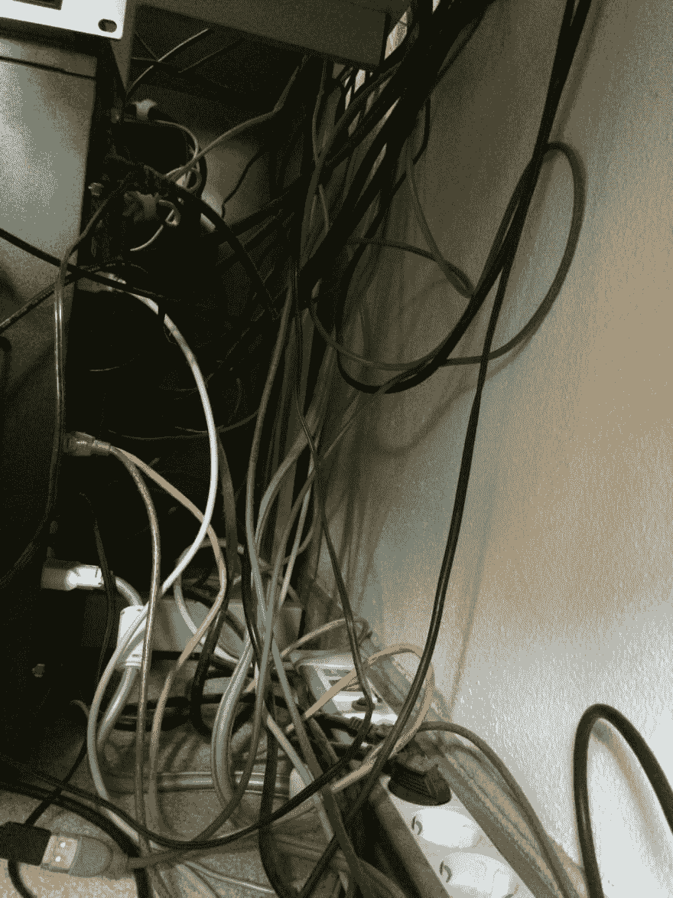
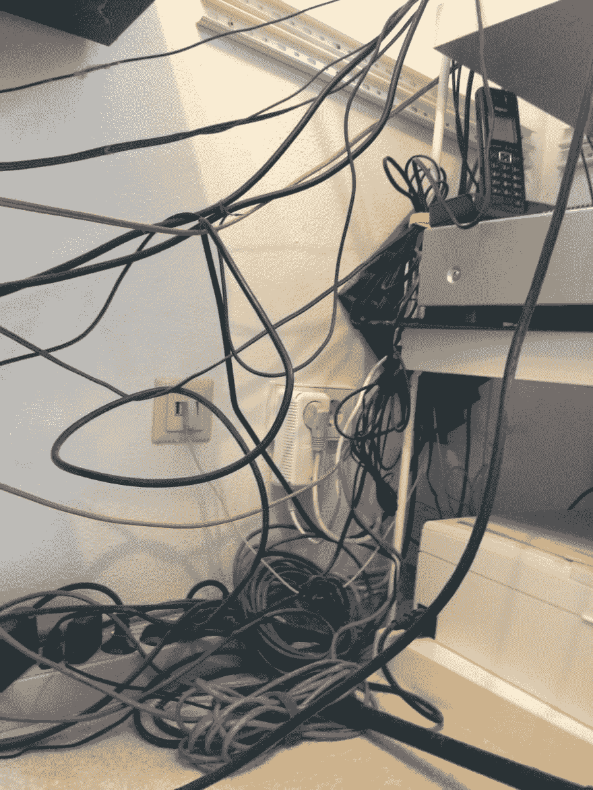

# 如何修复电缆混乱？

> 原文：<https://dev.to/mortoray/how-do-you-fix-cable-chaos>

我的有线电视情况已经失控，我不知道如何解决？！

[T6】](https://res.cloudinary.com/practicaldev/image/fetch/s--Mjs9yzAI--/c_limit%2Cf_auto%2Cfl_progressive%2Cq_auto%2Cw_880/http://i.imgur.com/iIjxJuB.jpg)

我最近清理了我的家庭影院，但它涉及的组件少了很多。我的电脑系统把这些部分连接在一起:

*   两台台式电脑(其中一台不再连接)
*   两台笔记本电脑(其中一台基本断开连接)
*   PS3 + PS4
*   班长
*   麦克风+前置放大器
*   网络摄像头(必须经常连接/断开)
*   2 个鼠标，键盘，5 个 PS 控制器
*   5 部手机，4 部平板电脑(通常都是断开的，但需要连接/供电)
*   线路混音器、放大器、CD 播放器、扬声器(我需要我的音乐！)
*   音乐键盘、吉他效果处理器、踏板
*   2 台路由器、电话、KVM 交换机
*   打印机
*   可能是一些我已经忘记甚至不再需要的东西

我的桌子后面有超过 100 米的各种电缆。我一直在寻找组织它的选项，但从未找到任何令人满意的东西。大多数组织者似乎认为电缆在连接设备之前要走很长一段距离，但我的设备大多靠在一起，分散在各处。我的电缆需求没有规律性。

有人设法清理这种情况吗？