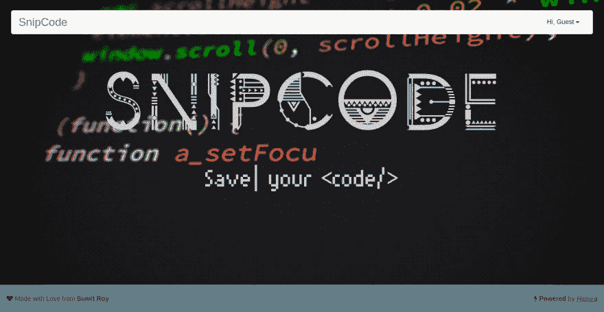
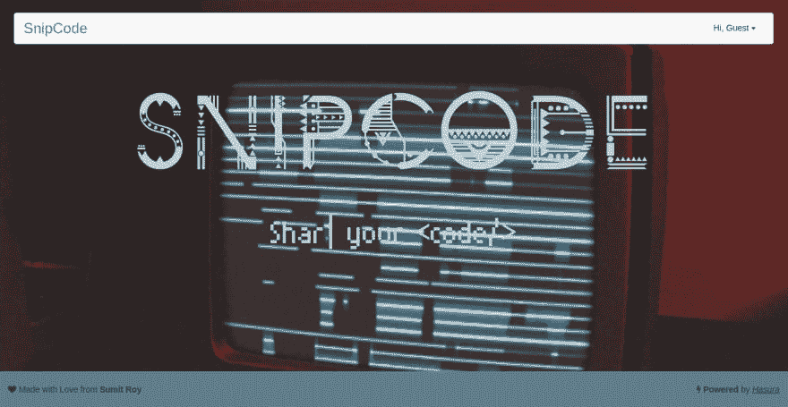

# 我的 web 应用程序的改进

> 原文:[https://dev.to/sroy8091/improvements-in-my-web-app](https://dev.to/sroy8091/improvements-in-my-web-app)

## 我得到了什么

我从同龄人和朋友那里得到了评论和建议。其中一些是

*   主页字体超赞
*   这个应用程序很好，但加载速度很慢。

在所有这些审查之后，现在是改进的时候了。我必须考虑的第一件事是我的 web 应用程序的加载时间，由于使用。gif 文件在后台，所以我手动压缩它，虽然我不满意加载时间。所以在我的项目中引入了一个新的包[压缩](https://www.npmjs.com/package/compression)T2】

```
var compression = require('compression')
var express = require('express')
var app = express()
app.use(compression()) 
```

<svg width="20px" height="20px" viewBox="0 0 24 24" class="highlight-action crayons-icon highlight-action--fullscreen-on"><title>Enter fullscreen mode</title></svg> <svg width="20px" height="20px" viewBox="0 0 24 24" class="highlight-action crayons-icon highlight-action--fullscreen-off"><title>Exit fullscreen mode</title></svg>

我又想到了一个主意。背景会随机选择怎么办？

## 随机背景

我在我的 static/img 文件夹中引入了 4 个 gif，并编写了一个小脚本来随机选择它们。

```
var source = [
            'back.gif',
            'code.gif',
            'codeback.gif',
            'abs.gif',
            'app.gif'
        ];
var randomNumber = Math.floor(Math.random()*source.length);
$('body').css('background-image', 'url(/img/'+source[randomNumber]+')'); 
```

<svg width="20px" height="20px" viewBox="0 0 24 24" class="highlight-action crayons-icon highlight-action--fullscreen-on"><title>Enter fullscreen mode</title></svg> <svg width="20px" height="20px" viewBox="0 0 24 24" class="highlight-action crayons-icon highlight-action--fullscreen-off"><title>Exit fullscreen mode</title></svg>

瞧，每次用户重新加载时，他都会得到一个新的背景(大多数情况下)。

| 主页 1 | 主页 2 | 主页 3 |
| --- | --- | --- |
|  |  |  |

## 搜索优化

我想在未来做的另一个调整是优化搜索，为 tsvector 增加一个单独的列，并使用 GIN 索引。在浏览 PostgreSQL 的文档时，我看到了这三页优化全文搜索和函数信息的内容。

*   [搜索表格](https://www.postgresql.org/docs/9.5/static/textsearch-tables.html#TEXTSEARCH-TABLES-SEARCH)
*   [更新 tsvector 的触发器](https://www.postgresql.org/docs/9.5/static/textsearch-features.html#TEXTSEARCH-UPDATE-TRIGGERS)
*   [文本搜索功能](https://www.postgresql.org/docs/9.6/static/functions-textsearch.html)

*这里是关于这一系列 snipcode 开发的所有帖子的索引*

[第一部分:App Idea](https://dev.to/sroy8091/app-idea-for-hasura-internship)
[第二部分:App 原型](https://dev.to/sroy8091/app-prototype)
[第三部分:本地开发](https://dev.to/sroy8091/hasura-local-development)
[第四部分:G for Git](https://dev.to/sroy8091/g-for-git)
[第五部分:数据建模](https://dev.to/sroy8091/its-modeling-time)
[第六部分:Data&Auth API](https://dev.to/sroy8091/postman-a-major-tool-for-developers)
[第七部分:基本功能](https://dev.to/sroy8091/i-love-cookies-expressjscookies)
[第八部分:App 屏幕 1](https://dev.to/sroy8091/i-built-it-with-codemirror)
[第九部分](https://dev.to/sroy8091/app-screen-2)