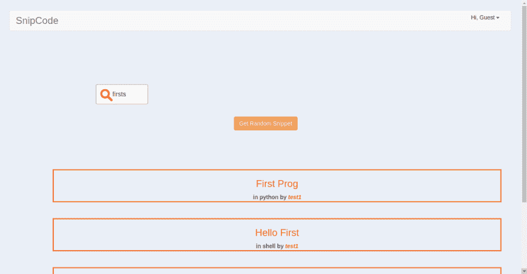

# 使用 Postgres 全文搜索功能搜索页面

> 原文：<https://dev.to/sroy8091/search-page-using-postgres-full-text-search-feature>

## 全文搜索

> 在文本检索中，全文搜索是指在全文数据库中搜索单个计算机存储的文档或集合的技术。全文搜索不同于基于元数据或数据库中表示的部分原始文本(如标题、摘要、选定部分或参考书目)的搜索。

-维基百科

这对于初始级别的搜索页面来说已经足够了，因此我为我的 web 应用程序选择了这个。

## Postgres

我编写了一个非常简单的 SQL 来实现这一点。

```
SELECT id, heading, lang, user
FROM code_lang
WHERE to_tsvector(heading) @@ 
to_tsquery('" + key + "') and private=false; 
```

Enter fullscreen mode Exit fullscreen mode

[T2】](https://res.cloudinary.com/practicaldev/image/fetch/s--NykhiPfr--/c_limit%2Cf_auto%2Cfl_progressive%2Cq_auto%2Cw_880/https://thepracticaldev.s3.amazonaws.com/i/agupfed859hr97kdkwsk.png)

在这里，我从表 code_lang 中选择 id、标题、语言和用户。但是 where 子句是一个难题。tsvector value 是不同词位的排序列表，另一方面 **tsquery** value 存储要搜索的词位。

现在 **to_tsvector** 将文档简化为 **tsvector** ，类似地， **to_tsquery** 将 word 规范化为 **tsquery** 。将这两个与 **@@** 操作符结合起来，我们得到查询的字符串(键)是否与当前行匹配，并确保匹配的行不是私有代码。因为我们不能在搜索结果中显示它。

这就是最基本的全文搜索在 PostgreSQL 中的实现方式。

*这里是关于这一系列 snipcode 开发的所有帖子的索引*

[第一部分:App Idea](https://dev.to/sroy8091/app-idea-for-hasura-internship)
[第二部分:App 原型](https://dev.to/sroy8091/app-prototype)
[第三部分:本地开发](https://dev.to/sroy8091/hasura-local-development)
[第四部分:G for Git](https://dev.to/sroy8091/g-for-git)
[第五部分:数据建模](https://dev.to/sroy8091/its-modeling-time)
[第六部分:Data&Auth API](https://dev.to/sroy8091/postman-a-major-tool-for-developers)
[第七部分:基本功能](https://dev.to/sroy8091/i-love-cookies-expressjscookies)
[第八部分:App 屏幕 1](https://dev.to/sroy8091/i-built-it-with-codemirror)
[第九部分](https://dev.to/sroy8091/app-screen-2)

| 喜欢我的帖子吗？ |
| --- |
| [T2】](https://ko-fi.com/A0A5WBC1) |