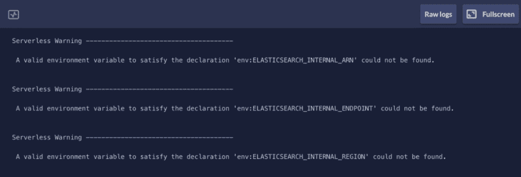
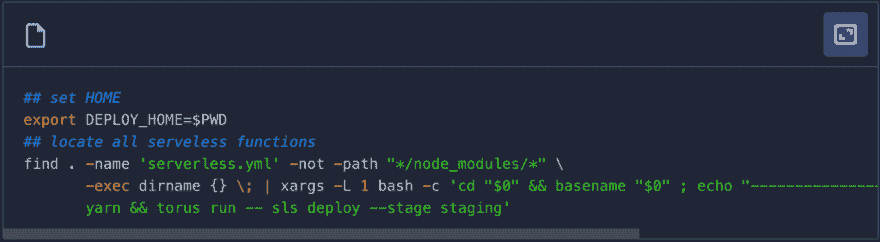
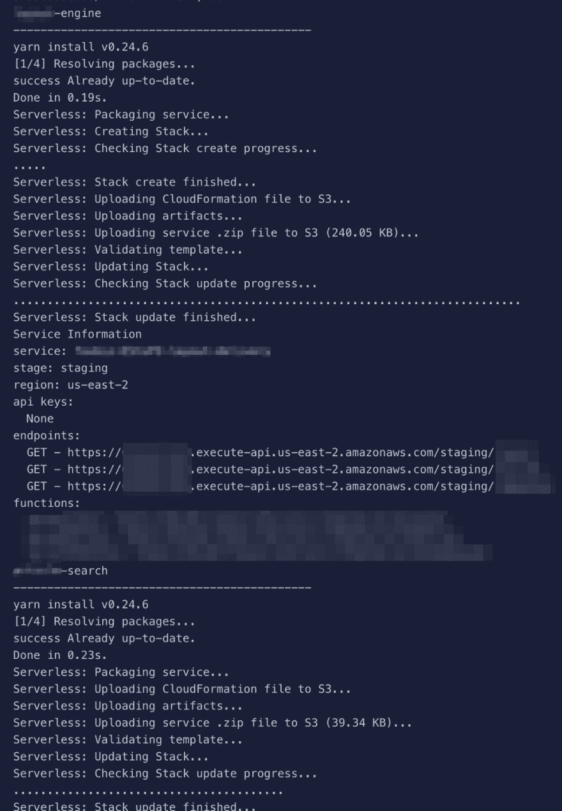

# 使用无服务器框架的持续工程

> 原文:[https://dev . to/foxteck/continuous-engineering-with-the-server less-framework-cg4](https://dev.to/foxteck/continuous-engineering-with-the-serverless-framework-cg4)

[T2】](https://res.cloudinary.com/practicaldev/image/fetch/s--o34n6KIY--/c_limit%2Cf_auto%2Cfl_progressive%2Cq_auto%2Cw_880/https://cdn-images-1.medium.com/max/1024/1%2AmESgrjzutfFUg2dhEZBEsw.jpeg)

我们正在与微服务合作，我很喜欢。我们的实施基于 [AWS Lambda](https://aws.amazon.com/lambda/) 无服务器计算。这项技术于 2014 年推出，到了 2017 年，仍然没有成熟的工程最佳实践。

当我们开发产品时，我们总是遵循最佳实践。在这篇文章中，我描述了我们如何将我们的工作流应用到“功能即服务”范例中。

### 工作流程

我们使用特征分支。每个故事都有自己的分支。当代码准备好时，我们创建一个 [*拉请求*](https://help.github.com/articles/about-pull-requests/) (PR)来合并开发变更。

团队*同行评审*代码，我们会在需要时提出修改建议。在合并更改之前，我们需要至少两次批准。

在变更合并之前，CI/CD 运行。它检查我们是否坚持我们的编码标准并运行我们的测试。如果一切顺利，你可以合并你的分支。

当它被合并开发时，它会自动部署到我们在 AWS 上的开发环境中。

### 代码结构

使用*功能作为服务**【FaaS】*意味着编码更简单、更容易理解的模块。

每个微服务都有自己的存储库。在它里面，我们围绕它所属的 [*子域*](http://blog.jonathanoliver.com/ddd-strategic-design-core-supporting-and-generic-subdomains/) 来构建我们的代码。将*服务*的所有相关功能聚集在同一个文件夹中。

我们使用[无服务器框架](https://serverless.com/framework/docs/providers/aws/guide/quick-start/)来管理、构建和部署我们的功能即服务微服务。

我们为每个子域创建一个 [*服务*](https://serverless.com/framework/docs/providers/aws/guide/services/) ，它有自己的 *serverless.yml* 配置文件，它需要的外部包( *package.json* )和几个实现其功能的 JavaScript 文件。

### 事件定义

*功能即服务*是一种事件驱动的范例。函数的产生是对事件的响应。

事件定义放在每个服务的 *serverless.yml* 配置文件中。它可以是通过 API Gateway 的 HTTP 请求、上传到 S3 的文件、在 Aurora DB 中更新的记录、在 DynamoDB 中插入的文档等。

我们目前只为我们的项目使用 HTTP，Kinesis 流和 SNS 事件。该框架支持更多的事件源。

### 环境变量

我们尽可能多地使用环境变量。ARNs、端点、AWS 凭证、AWS 区域等。无服务器允许您从环境变量中定义资源。在它尝试部署您的 lambdas 之前，它会让您知道您的环境中是否有任何未定义的变量。

 

<figcaption>无服务器框架抱怨缺少环境变量</figcaption>

团队在 [Torus](https://www.torus.sh/) 的帮助下共享环境变量。当我们批准一个 PR 时，我们的 CI/CD 工具读取这些环境变量来自动部署我们的 lambdas。

### 发布/部署

我们使用*持续集成*和*部署*。在 PR 可以被合并之前，代码林挺和测试运行。部署到*开发*和*准备*是自动化的。

 

<figcaption>用 CI/CD + Bash +无服务器(staging)部署</figcaption>

我们的 CI/CD 管道运行一个基本的 NodeJS docker 映像，找到我们所有的服务，进入每个文件夹，运行 [*yarn*](https://yarnpkg.com/lang/en/) 来安装所有的依赖项并部署到 AWS。没什么特别复杂的。

几个 bash get run 命令， *et voil！*一套功能齐全的 lambdas 运行。

 

<figcaption>我方 CI/CD ***纱****+****SLS***βrun。</figcaption>

> 一切都处理好了

如果一切顺利，我们会在 Slack 上收到一条消息，说一切都已经处理好了。所有服务都是最新的。

此时，我们已经准备好开发下一个特性，并继续开发周期。

### 更多资源ðÿ"š

*   无服务器架构和许多[的例子](https://github.com/serverless/examples)。
*   [微](https://github.com/zeit/micro)异步 http 节点微服务。构建服务的自托管简单函数的第一个好方法。
*   管理 FaaS 的另一个框架。它有 Go、Clojure 和 Rust 的运行时，因此您可以在 AWS Lambda 不支持的语言上编写函数。
*   Auth0 团队的 [WebTasks](https://webtask.io/) FaaS。与 Slack 和 GitHub 集成得非常好。对计划任务有类似 Cron 的支持。
*   稍微不同的方法。他们努力成为 FaaS 的标准图书馆。有一个服务目录，可以从常规 NodeJS、Python 或 Ruby 项目中调用函数。