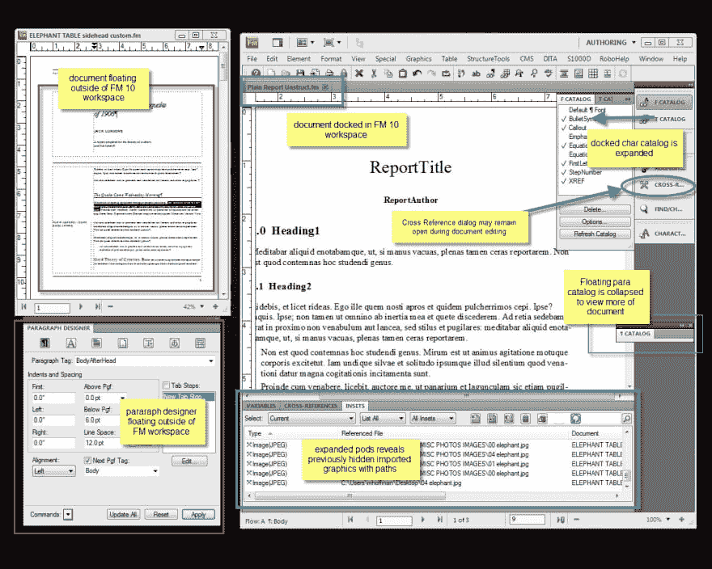
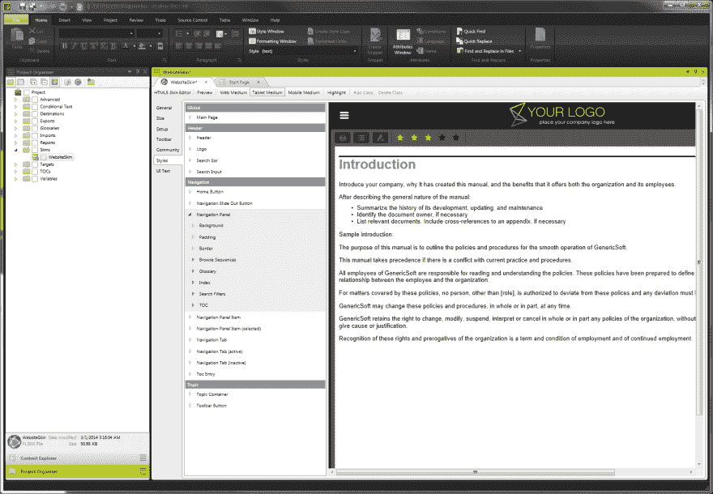
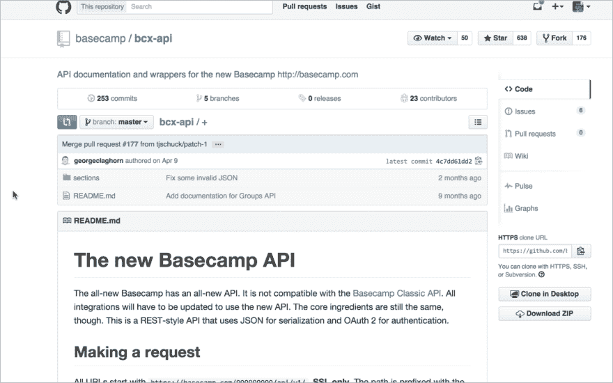
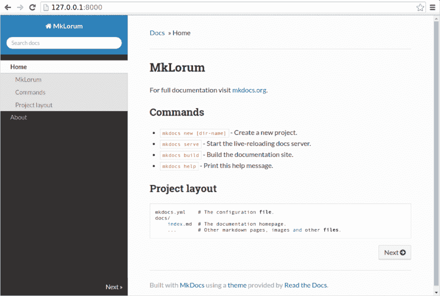
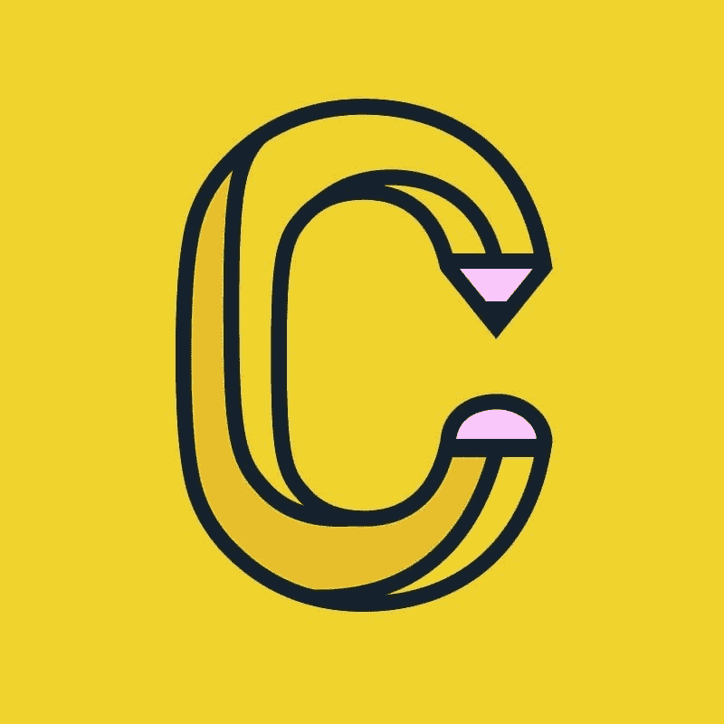
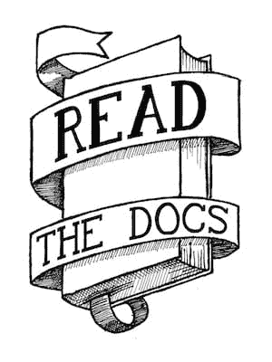
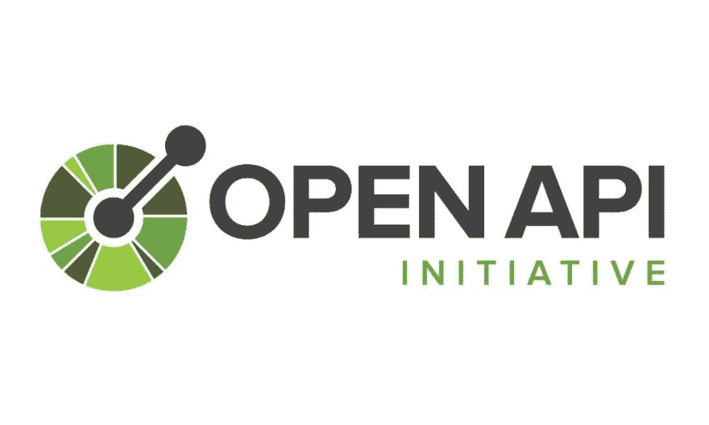

# 逆向加工

> 原文:[https://dev.to/wiredferret/retrograde-tooling](https://dev.to/wiredferret/retrograde-tooling)

我们已经到达了技术写作的临界点，我们需要处理它。

未来将不再涉及制作文档，而是在产品中和产品周围制作无缝集成的内容，这意味着我们需要改变对工具的期望。这会很痛，但希望是好的方面。

当我开始写作时，我学习了 FrameMaker。太棒了。即使在那个时候，它也有 20 年的历史，你可以用它做任何事情。等式、打印机的裁剪标记、自动交换文本块、从同一个文件生成打印、PDF 和帮助文件，以及改变交叉引用。使用 Frame 既是艺术也是科学，而且有一些关键命令是通过邮件列表口头传播的，因为它们不再出现在官方文档中。它有一个像砖墙一样的学习曲线，但一旦你通过了它，你就驾驶着一辆不可阻挡的坦克，可以碾过任何问题。

[T2】](https://res.cloudinary.com/practicaldev/image/fetch/s--uRkSQvPF--/c_limit%2Cf_auto%2Cfl_progressive%2Cq_auto%2Cw_880/http://www.heidiwaterhouse.com/wp-content/uploads/2017/08/img_0752.jpg)

15 年后，包括偶尔痛苦地尝试在 Microsoft Word 中做专业文档，我们有了一个新的热门产品，叫做 MadCap Flare。这就像 FrameMaker 已经为网络转世。它更容易使用，有本地化，CSS，HTML5 的集成。它闪闪发光，美丽而有力。我仍然可以做条件文本、引用文本块和单一来源。

[T4】](https://res.cloudinary.com/practicaldev/image/fetch/s---jqkf9h7--/c_limit%2Cf_auto%2Cfl_progressive%2Cq_auto%2Cw_880/http://www.heidiwaterhouse.com/wp-content/uploads/2017/08/img_0753-1.png)

我已经有 18 个月没有用过那样的技术写作工具了，我想这种情况会越来越少。

“软件即服务”和应用程序文化的兴起正在让我们远离一个充斥着用户指南、管理指南和安装指南的世界。我们期待弹出的帮助气泡和界面来指导我们应该做什么，而不是带有说明的光盘。这很有意义，因为我们都在体验基于带宽、应用冲突、需求和许可结构的个性化体验。用旧工具编写一个包含所有这些内容的文档是非常困难的，而且我们已经没有旧工具了。

我们没有它们，因为不需要制作官方文件，我们已经减少和取消了技术写作部门和工作。我们正在将大量工作转移到用户体验中，我们要求留下来的作者充当开发者制作的内容的交换所。我们不再采用采访开发者或嵌入团队的新闻模式，而是作为聚合者工作，从许多来源获取内容，并准备好分发。或者根本就没有作家，出版就更加随意了。

[T2】](https://res.cloudinary.com/practicaldev/image/fetch/s--tQQ62lZG--/c_limit%2Cf_auto%2Cfl_progressive%2Cq_auto%2Cw_880/http://www.heidiwaterhouse.com/wp-content/uploads/2017/08/img_0754.png)

FrameMaker 和 Madcap Flare 每个席位的许可费用在 1000 美元到 2000 美元之间。这不是你会给兼职做这个的人买的东西。而且很难将数据移入和移出它们，因为所有的元文本和编译信息都在工具中附加到它们上面。它是一个数据库，而不是一组平面文件。或者更准确地说，它是一个编译过的二进制文件——不是程序，是文档。因此，使用这些工具之一的作者将是团队发表他们自己作品的能力的一个硬门控功能。它看起来很棒，但是会有单点故障。

相反，我们一直在努力让技术作者使用开发人员可以自由访问的工具。用 readthedocs 或 readme.io 或其他一些钝器工具编译的 Markdown，创建一个包含目录和一些最小链接的页面。这样做的好处是每个人都可以读、写和访问文档。不利的一面是，我们将文档作为面向对象的编译对象来对待，从而失去了巨大的丰富性，这一点通常只有技术作者才看得见。

[T2】](https://res.cloudinary.com/practicaldev/image/fetch/s--ivYMgo78--/c_limit%2Cf_auto%2Cfl_progressive%2Cq_auto%2Cw_880/http://www.heidiwaterhouse.com/wp-content/uploads/2017/08/img_0755.png)

以下是一些我做不到或非常困难的事情的例子:

*   条件文本–基于整个文档上设置的标志的不同输出文本。
*   白色标签–配置我的文档，以便二级组织可以自行标记它们
*   智能本地化–根据常用单词和短语进行批量本地化，减少翻译时间和成本
*   一次编写/多次发布–拥有一个可以生成帮助、网页、打印和产品内协助的主文档
*   与用户所在页面相关的上下文相关帮助
*   桌子——降价，你为什么这么不擅长这个？
*   复杂的布局–页眉、页脚、面包屑、插图和文本块
*   自动接收和格式化其他文件格式
*   包括，引用的文本，插入的文件-想想图书馆

那可就亏大了！有时候我觉得用 Markdown 写作就像让古腾堡放弃印刷机，给他一只愤怒的鹅和一张卷曲的羊皮。

[T4】](https://res.cloudinary.com/practicaldev/image/fetch/s--QIjd0PDg--/c_limit%2Cf_auto%2Cfl_progressive%2Cq_auto%2Cw_880/http://www.heidiwaterhouse.com/wp-content/uploads/2017/08/img_0758.jpg)

然而，哀叹技术写作工具罗马时代失去的荣耀对我没有任何好处，因为我们现在处于黑暗时代，我们必须尽快前进到启蒙时代。

….我本打算在 WordPress 为你做一个比较表，但那不是一个东西。我正是这个意思。

无论如何，我认为我们可以开始使用这些来重获我们失去的一些能力:

CSS——可能能够帮助布局、HTML5 支持、表格和白色标签

功能标志——条件文本、一次编写/多次发布，以及摄取

HTML——(别笑了。HTML 的功能比 Markdown 更全面)表格、上下文相关帮助，包括

重复数据删除–智能本地化，包括

Javascript、PHP 等–接收和格式化、菜单、导航、面包屑

哇，要学的东西真多。另一方面，我上周听到了一个演讲，其中包括一个 5 分钟的清单，列出了成为一名有用的 devops 工程师所需要知道的一切，所以我想与此相比，它还不错。对于那些因为喜欢写作而不是因为喜欢技术而进入技术写作的人来说，这是一个相当令人生畏的列表。这并不是说作家不能学习技术——显然我们可以，因为我们学习了那些旧工具。那就是，围绕这种新的文艺复兴时期的写作，只有一个社区的开端，没有一种工具，我们可以教低年级学生。

我迷上科技写作是因为我上了一堂英语文学课，老师非常前卫，教我们手工编码 HTML(因为 1995 年)。那是为我打开大门的钥匙。但是现在外面有什么钥匙呢？

我希望 Corilla 继续学习、成长和繁荣——他们可以添加许多这些功能或已经拥有它们。

[T4】](https://res.cloudinary.com/practicaldev/image/fetch/s--iJpPe2x9--/c_limit%2Cf_auto%2Cfl_progressive%2Cq_auto%2Cw_880/http://www.heidiwaterhouse.com/wp-content/uploads/2017/08/img_0756.jpg)

我希望 Read Docs 得到足够的资金来雇佣一个既是技术作家又是程序员的人，因为他们缺少一些重要的用例，但他们也是行业标准。

[T4】](https://res.cloudinary.com/practicaldev/image/fetch/s--JKkeV6bH--/c_limit%2Cf_auto%2Cfl_progressive%2Cq_auto%2Cw_880/http://www.heidiwaterhouse.com/wp-content/uploads/2017/08/img_0757.png)

我希望 OpenAPI 标准和 Swagger 能够更容易地将它们对代码片段的强大使用扩展到非 API 文档中，因为它们正在以一种新的方式来解决这个问题，并且它包含了我正在寻找的大量超文本。

[T2】](https://res.cloudinary.com/practicaldev/image/fetch/s--tErgHhmp--/c_limit%2Cf_auto%2Cfl_progressive%2Cq_auto%2Cw_880/http://www.heidiwaterhouse.com/wp-content/uploads/2017/08/img_0761.jpg)

我希望 Confluence 意识到他们正在设计人们创建无用的维基，因为他们默认了一个更古老的孤立的世界。

老实说，我希望 SharePoint 自燃，因为这太可怕了。

*本帖最初发表于[heidiwaterhouse.com](http://www.heidiwaterhouse.com/2017/08/03/retrograde-tooling/)T3】*