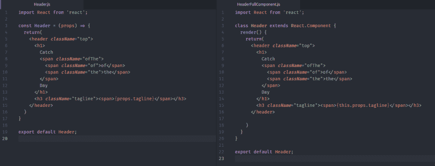
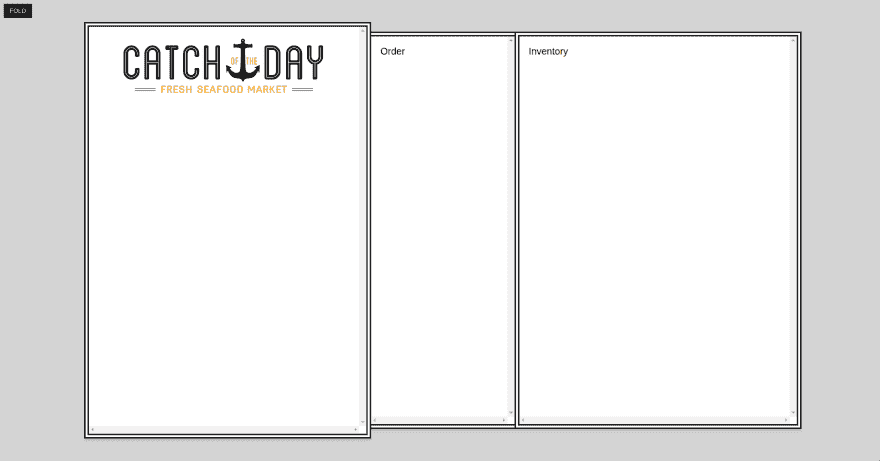
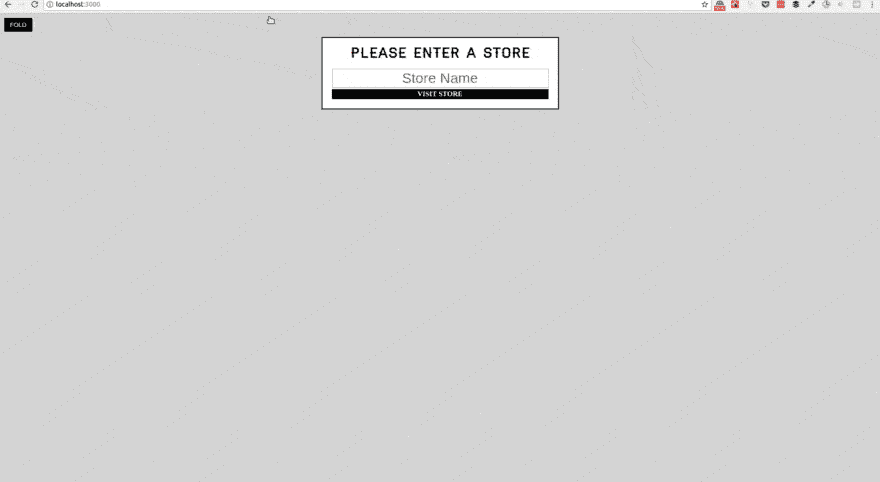
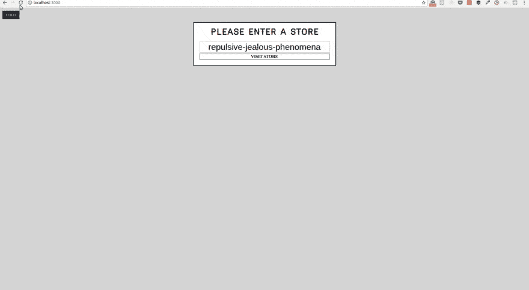
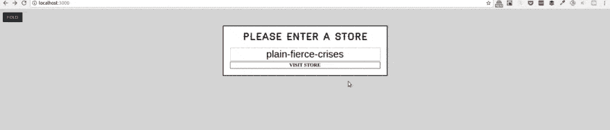
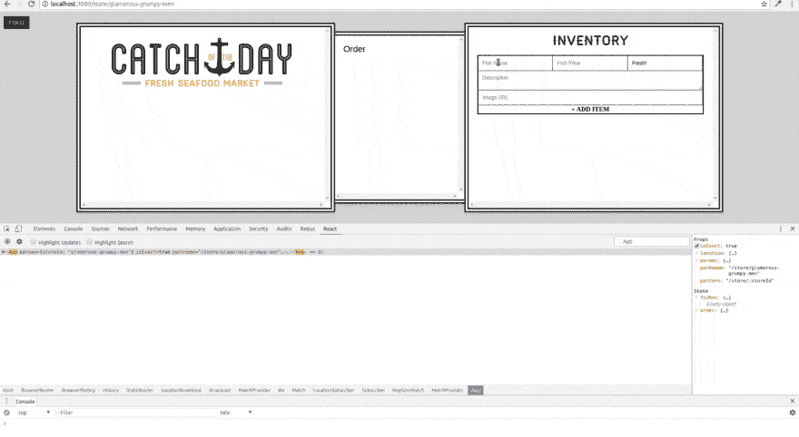
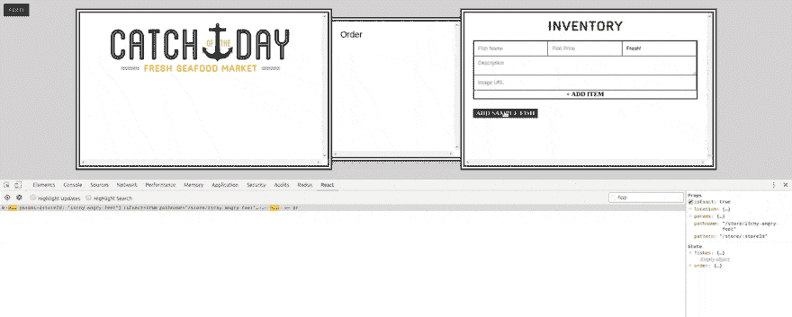

# 学习反应-第 2 周

> 原文:[https://dev.to/stefdotninja/learning-react-第二周](https://dev.to/stefdotninja/learning-react---week-2)

本文原载于 [stef.ninja](https://stef.ninja/learning-react-week-2/) 。

这是我 30 天 30 分钟的挑战中的第二周，通过韦斯·博斯[为初学者开设的精彩课程](https://reactforbeginners.com/)学习 [React](https://facebook.github.io/react/) 。

你可以在这里看到第一周的围捕[。](https://stef.ninja/learning-react-week-1/)

请注意:这些帖子绝不能替代本课程。它们是我在这 30 天中的笔记。如果你对 React 感兴趣，我 100%推荐购买课程或在 Twitter 上关注 Wes Bos。

### 第八天:无状态功能组件

真正的反应元件是复杂的生物。它们有一大堆继承的特性，比如生命周期方法以及我们创建的其他方法。

有时候我们根本不需要这种复杂性。例如，我们的 Header 组件仅用于将 HTML 呈现给 DOM。它只需要是一个箭头函数。

这意味着我们可以将它从一个完整的 React 组件转换成一个无状态的功能组件:
[](https://res.cloudinary.com/practicaldev/image/fetch/s--TfyKRWR---/c_limit%2Cf_auto%2Cfl_progressive%2Cq_auto%2Cw_880/https://s3-ap-southeast-2.amazonaws.com/ghost-blog-stef-ninja/2017/07/functional_stateless_component-1499392930264.png)

###### 经验法则:

```
if( component only uses render method ){
convert it to a stateless functional component
} 
```

<svg width="20px" height="20px" viewBox="0 0 24 24" class="highlight-action crayons-icon highlight-action--fullscreen-on"><title>Enter fullscreen mode</title></svg> <svg width="20px" height="20px" viewBox="0 0 24 24" class="highlight-action crayons-icon highlight-action--fullscreen-off"><title>Exit fullscreen mode</title></svg>

**进一步阅读:**这只是一个简短的视频，所以在剩下的 30 分钟里，我可以多读一些关于*无状态功能组件*的内容。以下是我找到的一些好资源:

*   [反应无状态功能组件:你可能忽略的九个胜利](https://hackernoon.com/react-stateless-functional-components-nine-wins-you-might-have-overlooked-997b0d933dbc)作者[科里豪斯](https://twitter.com/housecor)
*   [React 0.14 中的无状态功能组件](https://medium.com/@joshblack/stateless-components-in-react-0-14-f9798f8b992d)作者[乔希·布莱克](https://medium.com/@joshblack)

###### 今天的应用程序看起来像:

[T2】](https://res.cloudinary.com/practicaldev/image/fetch/s--1nk9BBDT--/c_limit%2Cf_auto%2Cfl_progressive%2Cq_auto%2Cw_880/https://s3-ap-southeast-2.amazonaws.com/ghost-blog-stef-ninja/2017/07/day_8-1499400482804.png)

注意:从昨天开始没有视觉上的变化

*【视频 8:无状态功能组件】*

### 第九天:使用 React 路由器

今天我们探索了`React Router`工具。它不是 React 包的一部分，但它是 React 应用程序中实现路由的行业标准。

我们的应用程序路由将由一个简单的组件来处理，该组件内置了一些 if/else 风格的逻辑。它从`React Router`调用`Match`和`Miss`来处理重物。

```
Import { BrowserRouter, Match, Miss } from 'react-router';

const Root = () => {
  return(
    <BrowserRouter>
      <div>
        <Match exactly pattern="/" component={StorePicker} />
        <Match pattern="/store/:storeId" component={App} />
        <Miss component={NotFound} />
      </div>
    </BrowserRouter>
  )
} 
```

<svg width="20px" height="20px" viewBox="0 0 24 24" class="highlight-action crayons-icon highlight-action--fullscreen-on"><title>Enter fullscreen mode</title></svg> <svg width="20px" height="20px" viewBox="0 0 24 24" class="highlight-action crayons-icon highlight-action--fullscreen-off"><title>Exit fullscreen mode</title></svg>

**注意:这使用的是`React Router`的过时版本。最新的版本看起来更像:**T3

```
Import { Switch, Route } from 'react-router-dom';

const Root = () => {
  return(
    <Switch>
        <Route exact path="/" component={StorePicker} />
        <Route path="/store/:storeId" component={App} />
        <Route component={NotFound} />
    </Switch>
  )
} 
```

<svg width="20px" height="20px" viewBox="0 0 24 24" class="highlight-action crayons-icon highlight-action--fullscreen-on"><title>Enter fullscreen mode</title></svg> <svg width="20px" height="20px" viewBox="0 0 24 24" class="highlight-action crayons-icon highlight-action--fullscreen-off"><title>Exit fullscreen mode</title></svg>

结果可以在下面看到。今天研讨会的另一个任务是创建一个可以显示为 sudo 404 页面的`NotFound`组件。

###### 今天的应用程序看起来像:

[T2】](https://res.cloudinary.com/practicaldev/image/fetch/s--e0VBIq8X--/c_limit%2Cf_auto%2Cfl_progressive%2Cq_66%2Cw_880/https://s3-ap-southeast-2.amazonaws.com/ghost-blog-stef-ninja/2017/07/day_9_progress-1499663936121.gif)

*【视频 9:用 React 路由器路由】*

### 第 10 天:助手功能

今天是关于辅助函数的简短而尖锐的一课。这些并不是 React 特有的，而是 Wes Bos 选择放入他的 Javascript 应用程序中的东西。

如果一个函数将在整个应用程序中使用，但它并不重要/大到足以保证为它创建一个模块，那么把它放在`helper.js`文件中是一个好主意。

项目文件是用几个助手函数生成的，这些函数允许我们生成随机的商店名称，并很好地以货币格式显示价格。

使用这些函数就像导入函数一样简单&然后调用它:

```
import { getFunName } from '../helpers';
...
<input type="text" required placeholder="Store Name" defaultValue={ getFunName() } />
... 
```

<svg width="20px" height="20px" viewBox="0 0 24 24" class="highlight-action crayons-icon highlight-action--fullscreen-on"><title>Enter fullscreen mode</title></svg> <svg width="20px" height="20px" viewBox="0 0 24 24" class="highlight-action crayons-icon highlight-action--fullscreen-off"><title>Exit fullscreen mode</title></svg>

###### 今天的应用程序看起来像:

[T2】](https://res.cloudinary.com/practicaldev/image/fetch/s--liZD-0jp--/c_limit%2Cf_auto%2Cfl_progressive%2Cq_66%2Cw_880/https://s3-ap-southeast-2.amazonaws.com/ghost-blog-stef-ninja/2017/07/day_10_random__storename-1499669184462.gif)

*【视频 10:助手和实用功能】*

### 第 11 天:对事件做出反应

今天的课程中有几点值得注意:

*   React 事件通过[合成事件](https://facebook.github.io/react/docs/events.html)处理
*   React 事件是在线完成的。
*   为了从输入中获取数据，我们需要使用一个`function ref`。
*   `render()`是一个固有地绑定到组件的方法。
*   当添加一个额外的/自定义的方法做一个组件时，你需要显式地将它绑定到组件，这样我们就可以在其中使用`this`。

有几种方法可以将自定义方法绑定到组件:

您可以在`constructor()`中引用它们，例如:

```
class StorePicker extends React.Component {
  constructor(){
    super();
    this.goToStore = this.goToStore.bind(this);
  }

  goToStore() {
    //Custom method.
  }

  render() {
    //Standard method
  }
} 
```

<svg width="20px" height="20px" viewBox="0 0 24 24" class="highlight-action crayons-icon highlight-action--fullscreen-on"><title>Enter fullscreen mode</title></svg> <svg width="20px" height="20px" viewBox="0 0 24 24" class="highlight-action crayons-icon highlight-action--fullscreen-off"><title>Exit fullscreen mode</title></svg>

您可以在`onSubmit`事件处理程序调用该方法时绑定它。例如:

```
render() {
    return(
      <form className="form" onSubmit={this.goToStore.bind(this)}>
        <input type="text" ref={(input) => {this.storeInput = input}}/>
        <button type="submit">Submit</button>
      </form>
    )
  } 
```

<svg width="20px" height="20px" viewBox="0 0 24 24" class="highlight-action crayons-icon highlight-action--fullscreen-on"><title>Enter fullscreen mode</title></svg> <svg width="20px" height="20px" viewBox="0 0 24 24" class="highlight-action crayons-icon highlight-action--fullscreen-off"><title>Exit fullscreen mode</title></svg>

当方法被`onSubmit`事件处理程序调用时，您可以运行一个箭头函数。例如:

```
render() {
    return(
      <form className="form" onSubmit={(e) => this.goToStore(e)}>
        <input type="text" ref={(input) => {this.storeInput = input}}/>
        <button type="submit">Submit</button>
      </form>
    )
  } 
```

<svg width="20px" height="20px" viewBox="0 0 24 24" class="highlight-action crayons-icon highlight-action--fullscreen-on"><title>Enter fullscreen mode</title></svg> <svg width="20px" height="20px" viewBox="0 0 24 24" class="highlight-action crayons-icon highlight-action--fullscreen-off"><title>Exit fullscreen mode</title></svg>

我们今天没有对很多应用程序做改动，但是我们把一个`console.log()`放入事件处理程序，这样你就可以看到 refs 被传递了。

*注意:这一课引发了我和开发团队的长时间讨论。虽然，传统上构造函数是用来初始化状态的，但是，随着 JS 的变化，我们可以直接将状态初始化为一个类属性。这减少了代码中的噪声并提高了性能。额外的好处:当使用`create-react-app`时，不需要担心代码的转换——它已经内置了。你可以在[的](https://twitter.com/MichalZalecki) [React 组件和类属性](https://michalzalecki.com/react-components-and-class-properties/)中读到更多。*

###### 今天的应用程序看起来像:

[T2】](https://res.cloudinary.com/practicaldev/image/fetch/s--5rIioMqp--/c_limit%2Cf_auto%2Cfl_progressive%2Cq_66%2Cw_880/https://s3-ap-southeast-2.amazonaws.com/ghost-blog-stef-ninja/2017/07/day12_consolelog_ref-1499841955473.gif)

*【视频 11:使用 React 事件】*

### 第 12 天:

今天我们将完成`GoToStore()`方法。我们已经收到了想要处理的数据(来自输入 ref ),现在我们需要通过重定向来执行该操作。

为此，我们使用由`React Router`提供的`transitionTo`方法。

由于 React 的单向数据流，我们需要使用 [contextTypes](https://facebook.github.io/react/docs/context.html) 将路由器从父路由器暴露出来。这将使它对我们的组件可用。

这是通过在 StorePicker.js 的组件下面添加以下内容来实现的:

```
StorePicker.contextTypes = {
  router: React.PropTypes.object
} 
```

<svg width="20px" height="20px" viewBox="0 0 24 24" class="highlight-action crayons-icon highlight-action--fullscreen-on"><title>Enter fullscreen mode</title></svg> <svg width="20px" height="20px" viewBox="0 0 24 24" class="highlight-action crayons-icon highlight-action--fullscreen-off"><title>Exit fullscreen mode</title></svg>

现在路由器对象对我们可用了，我们需要做的就是调用我们的`goToStore()` :
中的`transitionTo()`方法

```
goToStore(event){
    event.preventDefault();
    const storeId = this.storeInput.value
    this.context.router.transitionTo(`/store/${storeId}`)
  } 
```

<svg width="20px" height="20px" viewBox="0 0 24 24" class="highlight-action crayons-icon highlight-action--fullscreen-on"><title>Enter fullscreen mode</title></svg> <svg width="20px" height="20px" viewBox="0 0 24 24" class="highlight-action crayons-icon highlight-action--fullscreen-off"><title>Exit fullscreen mode</title></svg>

###### 今天的应用程序看起来像:

[T2】](https://res.cloudinary.com/practicaldev/image/fetch/s--gWJ4k9VB--/c_limit%2Cf_auto%2Cfl_progressive%2Cq_66%2Cw_880/https://s3-ap-southeast-2.amazonaws.com/ghost-blog-stef-ninja/2017/07/day12_transitionTo-1499843745265.gif)

*【视频 12:关于 React 路由器的一切】*

### 第十三天:状态介绍

今天的视频标题是“理解状态”。我要把那篇文章改头换面，称之为《国家概论》。

韦斯提到，这是你应该经常回来观看的视频之一，直到这个概念为你所接受。

以下是我在视频中的笔记:

*   您将所有应用程序数据存储在这个名为“state”的主对象中。然后，如果你想改变页面，你可以编辑“状态”,让 React 为你处理 HTML。
*   你编辑数据。React 为您编辑 HTML。
*   这非常强大，因为一旦您更改了 state 对象中的一些数据，它就会在应用程序中调用该状态的任何地方更新。不需要担心每个实现。
*   React 需要知道组件的初始状态。在 ES6 组件中，这是通过设置`this.state = {//state}`在构造函数方法中完成的。
*   当更新您的状态时，您应该复制您当前的状态，然后更新您的状态。这样做是为了提高性能和消除竞争条件。例如。

```
//Make a copy of the current state
const fishes = {...this.state.fishes};
//set time stamp
const timestamp = Date.now();
fishes[`fish-${timestamp}`] = fish;
//set state
this.setState({  fishes });
You can call a function from a child component via props.
e.g. in App.js:
<Inventory addFish={this.addFish} />
then in Inventory.js we can pass this down via props:
<AddFishFor addFish={this.props.addFish} /> 
```

<svg width="20px" height="20px" viewBox="0 0 24 24" class="highlight-action crayons-icon highlight-action--fullscreen-on"><title>Enter fullscreen mode</title></svg> <svg width="20px" height="20px" viewBox="0 0 24 24" class="highlight-action crayons-icon highlight-action--fullscreen-off"><title>Exit fullscreen mode</title></svg>

我不是 100%了解国家的错综复杂，但是今天我将把它留在这里。我们将在其他视频中再次讨论这一点。

###### 今天的应用程序看起来像:

[T2】](https://res.cloudinary.com/practicaldev/image/fetch/s--8bYtktef--/c_limit%2Cf_auto%2Cfl_progressive%2Cq_66%2Cw_880/https://s3-ap-southeast-2.amazonaws.com/ghost-blog-stef-ninja/2017/07/day_13_submit_form-1499928966761.gif)

*【视频 13:了解状态】*

### 第十四天:

今天我们关注的是在页面上放置一个`Load Sample Fishes`按钮。这对于在应用程序中快速插入一些虚拟数据很方便，这样我们就可以在下一课中处理数据的显示。它还通过`onClick()`向我们展示了加载状态。

**全部清单:**

*   在清单面板的底部创建一个按钮。
*   让`onClick()`调用一个函数(`loadSamples()`)，将`sample-fishes.js`中的对象加载到状态中。

*记住:状态在父组件`App`上，所以这是函数需要的地方。我们需要通过 props 将它传递给子组件(就像我们昨天做的那样)。*

###### 今天的应用程序看起来像:

[T2】](https://res.cloudinary.com/practicaldev/image/fetch/s--e6jLQVsN--/c_limit%2Cf_auto%2Cfl_progressive%2Cq_66%2Cw_880/https://s3-ap-southeast-2.amazonaws.com/ghost-blog-stef-ninja/2017/07/day14_loadSampleFishes-1499995248651.gif)

*【视频 14:加载数据到 onClick 状态】*

* * *

更多阅读本系列:[第 1 周](https://stef.ninja/learning-react-week-1/)、[第 3 周](https://stef.ninja/learning-react-week-3/)、[第 4 周](https://stef.ninja/learning-react-week-4/)、**或**为自己获取 [React for 初学者课程](https://reactforbeginners.com/)。