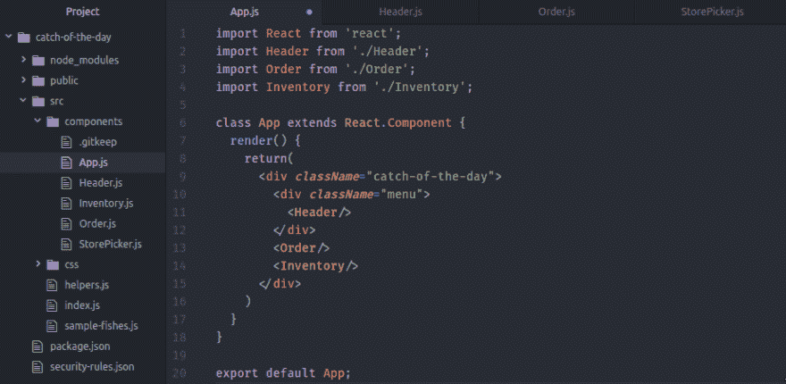
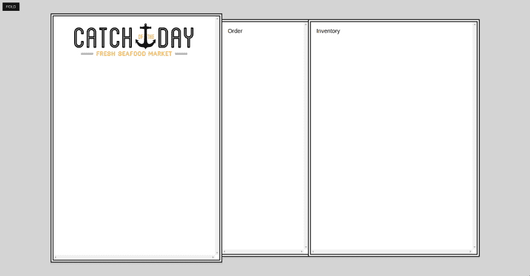

# 学习反应-第 1 周

> 原文:[https://dev.to/stefdotninja/learning-react-第一周](https://dev.to/stefdotninja/learning-react---week-1)

这篇文章最初出现在 [stef.ninja](https://stef.ninja/learning-react-week-1/) 上

今天我要开始一个 30 分钟的挑战。我将每天花 30 分钟通过韦斯·博斯编写的 [React 初学者](https://reactforbeginners.com/)课程学习 React。

旁注:这是迄今为止我上过的最好的课程之一。去拿吧。现在。

### 第一天:开发环境

设置我的开发环境&浏览启动文件。

这包括:

*   确保我的节点版本最新。
*   我有一个 ES6 语法荧光笔设置为我的文本编辑器(语言-原子巴别塔)。
*   将 React 开发者工具扩展安装到 Chrome 中。
*   派生启动文件 github 项目。
*   “创建-反应-应用”简介。

我们还介绍了 React 组件以及属性、状态和上下文如何与这些组件相关联。

*【视频 1:简介，工具&编辑设置& 2:思考和理解 React 组件】*

### 第二天:组件？

创建我的第一个组件。这包括:

*   在组件目录中创建新的“StorePicker.js”文件。
*   导入所需的依赖项
*   创建一个类并通过`render()`返回 JSX。
*   将我刚刚创建的新组件导入到“index.js”文件中。

我的文件现在看起来像这样:

```
index.js:

import React from 'react';
import { render } from 'react-dom';

import StorePicker from './components/StorePicker';

render(<StorePicker/>, document.querySelector('#main'));

components/StorePicker.js

import React from 'react';

class StorePicker extends React.Component{
  render() {
  return <p>Hello</p>
  }
}

export default StorePicker; 
```

<svg width="20px" height="20px" viewBox="0 0 24 24" class="highlight-action crayons-icon highlight-action--fullscreen-on"><title>Enter fullscreen mode</title></svg> <svg width="20px" height="20px" viewBox="0 0 24 24" class="highlight-action crayons-icon highlight-action--fullscreen-off"><title>Exit fullscreen mode</title></svg>

这个基本实现看起来非常简单。我喜欢 es6 类的使用和总是返回至少一个方法的基本要求(在这个例子中是 render())。

*【视频 3:创建我们的首批组件】*

### 第 3 天:JSX

问题是:用 JavaScript 写 HTML 糟透了。
解= JSX。

第一步是设置我的文本编辑器(Atom)来使用安装的 Emmet 插件。这打开了访问 Emmet 快捷方式的通道，使编写 JSX 大约容易 948%。

我使用这个 Atom 编辑器教程快速解释了 Emmet 是什么&如何使用它:[https://www.youtube.com/watch?v=BQurqKG6nGY](https://www.youtube.com/watch?v=BQurqKG6nGY)

快速提示:在 JavaScript 文件中扩展缩写的默认击键是“ctrl-e ”,而不是 HTML 中使用的“Tab”。

回到学习 JSX 的复杂性以及它如何与 React 一起工作。

要记住的事情:

*   要在 JSX 写评论，您需要使用“{ /* Comment here */ }”格式。不要把它放在顶层，因为它会把它当作一个元素。
*   “class”是 Javascript 中的保留字，因此您需要使用“className”。埃米特在这方面有所帮助。

*【视频 4:用 JSX 写 HTML】*

### 第 4 天:React 中的造型

关于如何将 CSS 加载到 React 应用程序中，有很多选择(和观点)。这些选项中有几个是:

*   在你的`index.html`文档中引用一个`style.css`表——很像标准的 HTML & CSS。
*   将样式表导入到您的`index.js`文档-混合选项:`import './css/style.css';`
*   为每个组件创建一个 CSS 表单，其中只包含该组件的 CSS。这允许对组件样式进行更好的控制。例如`import './css/store-picker.css';`
*   使用 JSX 格式的内联样式。

您选择的方法将取决于您正在进行的项目、当前的实践和项目的复杂性。

这个问题在我的办公室引发了一场关于我们为什么使用[‘styled-components’](https://github.com/styled-components/styled-components)以及这如何影响我们的开发风格的大讨论。这是一个很好的学习机会，我发现这是一个方便的概念，不仅可以探索我们如何做事情，还可以探索我们为什么以某种方式做事情。

**使用说明:**
我们团队刚刚升级到使用`prettier 0.34.0`内部。它现在美化了样式组件中的 CSS。顶级加法。

此外，包`language-babel`在 [Atom](https://atom.io/) 中为样式化组件提供了正确的语法高亮显示。

今天剩下的 30 分钟用来阅读 styled-components:
[https://github.com/styled-components/styled-components](https://github.com/styled-components/styled-components)
[https://www . smashingmagazine . com/2017/01/styled-components-enforcing-best-practices-components-based-systems/](https://www.smashingmagazine.com/2017/01/styled-components-enforcing-best-practices-component-based-systems/)
[https://medium . freecodecamp . org/a-5-minute-intro-to-styled-components-41 f 40 EB 7 CD 55](https://medium.freecodecamp.org/a-5-minute-intro-to-styled-components-41f40eb7cd55)

如果你不想读任何关于风格化组件的东西，那就花点时间看看这个吧:
[https://www.youtube.com/watch?v=bIK2NwoK9xk](https://www.youtube.com/watch?v=bIK2NwoK9xk)

*【视频 5:将 CSS 加载到 React 应用程序】*

### 第五天:过渡到 Linux

今天我从 Windows 转到了 Linux (Ubuntu)。

这包括设置我所有的工具和依赖项，以及根据我在 Windows 设置中的位置更新项目代码。

重新设置一切是我今天的重点。这次要快得多，也顺利得多。

### 第六天:组件

今天，我们深入探讨了组件的基本要求(类、呈现、返回)以及如何使用这些独立的构建模块来构建布局。

使用下面的基本组件结构，我们能够设计出整个应用程序的布局:

```
import React from 'react';

class MyComponent extends React.Component {
     render() {
          return(
               <p>MyComponent Content</p>
          )
     }
}

export default MyComponent; 
```

<svg width="20px" height="20px" viewBox="0 0 24 24" class="highlight-action crayons-icon highlight-action--fullscreen-on"><title>Enter fullscreen mode</title></svg> <svg width="20px" height="20px" viewBox="0 0 24 24" class="highlight-action crayons-icon highlight-action--fullscreen-off"><title>Exit fullscreen mode</title></svg>

然后，这些组件通过一个“app.js”组件组合在一起，该组件返回一个包含所有布局的 div。这是一个伟大的教训。

*【视频 6:使用组件创建我们的应用程序布局】*

### 第七天:使用道具

今天，我们从严格的静态组件转向通过 props 在页面上注入一些动态内容。

我们首先简单地将“Header.js”组件中副标题文本的内容改为引用标语 prop:

```
<h3 className="subheading">{this.props.subheading}</h3> 
```

<svg width="20px" height="20px" viewBox="0 0 24 24" class="highlight-action crayons-icon highlight-action--fullscreen-on"><title>Enter fullscreen mode</title></svg> <svg width="20px" height="20px" viewBox="0 0 24 24" class="highlight-action crayons-icon highlight-action--fullscreen-off"><title>Exit fullscreen mode</title></svg>

然后我们可以像这样设置一个特定的道具来传递和注入到内容中:

```
<Header subheading="Those Fresh Feels" /> 
```

<svg width="20px" height="20px" viewBox="0 0 24 24" class="highlight-action crayons-icon highlight-action--fullscreen-on"><title>Enter fullscreen mode</title></svg> <svg width="20px" height="20px" viewBox="0 0 24 24" class="highlight-action crayons-icon highlight-action--fullscreen-off"><title>Exit fullscreen mode</title></svg>

这里所发生的不仅是 Header 组件被调用，而且副标题 prop 也一起被传递。这意味着任何时候我们引用这个组件，我们可以注入定制的内容。例如:

```
<Header subheading="Those Fresh Feels" />
<Header subheading="This is the second Header component" /> 
```

<svg width="20px" height="20px" viewBox="0 0 24 24" class="highlight-action crayons-icon highlight-action--fullscreen-on"><title>Enter fullscreen mode</title></svg> <svg width="20px" height="20px" viewBox="0 0 24 24" class="highlight-action crayons-icon highlight-action--fullscreen-off"><title>Exit fullscreen mode</title></svg>

组件万岁！

[T2】](https://res.cloudinary.com/practicaldev/image/fetch/s--9BWYj6AZ--/c_limit%2Cf_auto%2Cfl_progressive%2Cq_auto%2Cw_880/https://s3-ap-southeast-2.amazonaws.com/ghost-blog-stef-ninja/2017/07/learning_react_atom-1499324732994.png)

*【视频 7:用道具传递动态数据】*

* * *

经过第一周的学习我的项目看起来是这样的:
[](https://res.cloudinary.com/practicaldev/image/fetch/s--Oq538FIa--/c_limit%2Cf_auto%2Cfl_progressive%2Cq_auto%2Cw_880/https://s3-ap-southeast-2.amazonaws.com/ghost-blog-stef-ninja/2017/07/learning_react-1499324570788.png)

* * *

更多阅读本系列:[第二周](https://stef.ninja/learning-react-week-2/)、[第三周](https://stef.ninja/learning-react-week-3/)、[第四周](https://stef.ninja/learning-react-week-4/)

为您自己获取 [React for 初学者课程](https://reactforbeginners.com/)。