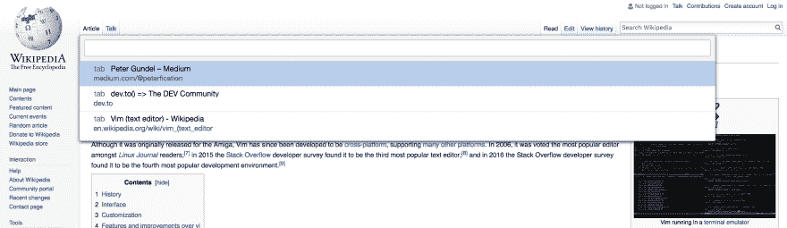
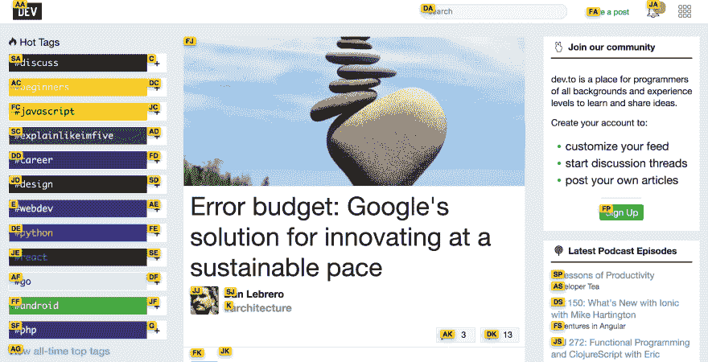

# 所以你换了 Vim——别忘了给 Chrome 安装 Vimium！

> 原文:[https://dev.to/peterfication/so-you-switched-to-vim-不要忘记安装 chrome 的 vimium](https://dev.to/peterfication/so-you-switched-to-vim---dont-forget-to-install-vimium-for-chrome)

几个月前，我写了我使用 Vim 的第一步。现在我终于可以说:我用 Vim 比用 RubyMine 更快🎉一旦您习惯了 Vim 键绑定，您就会要求其他程序也使用它们。例如在我的邮件程序中，我现在也试着用快捷方式做大多数事情。

最近我开始使用 Chrome 插件 Vimium。如果您已经习惯了 Vim 键绑定，它会使网上冲浪更有效率。

Firefox 的对等插件是 [VimFx](https://addons.mozilla.org/en-US/firefox/addon/vimfx/) 。

以下是我最喜欢的 3 个 Vimium 功能

*J* / *K* 让你跳到上一个/下一个标签页(比*<Ctrl-Tab>/*<Ctrl-Shift-Tab>*更容易键入)。*

[T2】](https://res.cloudinary.com/practicaldev/image/fetch/s--QlxGl7mE--/c_limit%2Cf_auto%2Cfl_progressive%2Cq_auto%2Cw_880/https://store2be.github.img/vimium/tab-switcher.jpg)

*T* 给你一个 [fzf](https://github.com/junegunn/fzf) 般的标签切换器。使用 *< Ctrl-j/k >* 可以在结果中上下移动(就像在 fzf 中一样)。同样，o 为你的历史和书签提供了一个类似 fzf 的菜单。

[T2】](https://res.cloudinary.com/practicaldev/image/fetch/s--hCBx9KrR--/c_limit%2Cf_auto%2Cfl_progressive%2Cq_auto%2Cw_880/https://store2be.github.img/vimium/link-opener.jpg)

*f* / *F* 为页面的每个链接提供叠加的字母，并在同一个标签/新标签中打开链接。

* * *

Vimium 的功能甚至更多。[来看看吧:)](https://chrome.google.com/webstore/detail/vimium/dbepggeogbaibhgnhhndojpepiihcmeb)

* * *

*大家好，我们是 [store2be](https://www.store2be.com) ，一家总部位于柏林的初创公司，为短期零售空间建立了一个支持 SaaS 的市场。如果你喜欢我们发布的内容，你可能想看看[store 2 be 技术页面](https://tech.store2be.com)或者关注我们的[媒体频道](https://medium.com/store2be-tech)。*