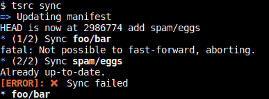
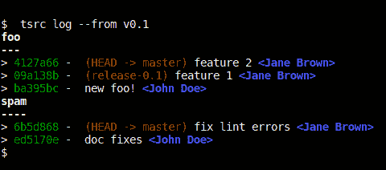

# tsrc 简介

> 原文:[https://dev.to/dmerejkowsky/introducing-tsrc](https://dev.to/dmerejkowsky/introducing-tsrc)

# 简介

在软件公司中处理源代码版本是一项挑战。你必须决定如何组织你的资源。

第一种方法是把所有东西放在一个巨大的存储库中。

第二种方法是将源代码分割到多个存储库中。

这两种方法各有利弊。

使用“巨型资源库”方法，你有时不能使用现有的源代码控制软件，如 git，因为它们对于非常大的项目来说伸缩性不够，或者你必须自己制作补丁，就像 facebook 使用 Mercurial 一样。

有了多个存储库，像往常一样使用 git 会变得更容易，但是您可能需要在它上面有一个工具，这样使用多个存储库就更容易了。

第二种情况的流行解决方案是使用 git 子模块，但是:

*   您需要在工作区之上有一个“主”存储库

*   当您更新子模块时，您也必须在父存储库中提交，这一步很容易跳过。

此外，我们发现，为了确保所有的存储库处于一致的状态，我们可以简单地在几个存储库上推送相同的标签。

# tsrc

输入 [tsrc](https://github.com/TankerApp/tsrc) 。我们每天在[油轮](https://tanker.io)使用它来管理我们的资源。

它有一个漂亮而直观的用户界面，可以在多个存储库中为您运行`git`命令。

它还具有与 GitLab 交互的(可选)命令。

让我们看看它是如何工作的。

注意:我们将只展示一些 tsrc 命令的基本用法。
您可以使用`--help`来发现所有可用的选项。

# 安装

`tsrc`用 Python3 编写，可以安装`pip` :

```
#  Linux
$  pip3 install tsrc --user
$  Add ~/.local/bin to PATH
  #  macOS
$  pip3 install tsrc --user
$  Add ~/Library/Python/3.x/bin to PATH
  #  Windows
$  pip3 install tsrc
#  PATH is already correct, set by Windows at installation 
```

<svg width="20px" height="20px" viewBox="0 0 24 24" class="highlight-action crayons-icon highlight-action--fullscreen-on"><title>Enter fullscreen mode</title></svg> <svg width="20px" height="20px" viewBox="0 0 24 24" class="highlight-action crayons-icon highlight-action--fullscreen-off"><title>Exit fullscreen mode</title></svg>

你可以在 [github](https://github.com/TankerApp/tsrc) 上找到源代码。

# 用法

## 克隆存储库

`tsrc`由一个**清单**文件驱动，该文件包含要克隆的存储库的名称和路径。

它使用了`YAML`语法，看起来像:

```
repos:
  - src: foo
    url: git@gitlab.local:acme/foo

  - src: bar
    url: git@gitlab.local:acme/bar 
```

<svg width="20px" height="20px" viewBox="0 0 24 24" class="highlight-action crayons-icon highlight-action--fullscreen-on"><title>Enter fullscreen mode</title></svg> <svg width="20px" height="20px" viewBox="0 0 24 24" class="highlight-action crayons-icon highlight-action--fullscreen-off"><title>Exit fullscreen mode</title></svg>

清单也必须放在 git 存储库中。然后，您可以使用以下命令创建一个新的工作空间:

```
$  mkdir ~/work
$  cd work
$  tsrc init git@gitlab.local:acme/manifest.git 
```

<svg width="20px" height="20px" viewBox="0 0 24 24" class="highlight-action crayons-icon highlight-action--fullscreen-on"><title>Enter fullscreen mode</title></svg> <svg width="20px" height="20px" viewBox="0 0 24 24" class="highlight-action crayons-icon highlight-action--fullscreen-off"><title>Exit fullscreen mode</title></svg>

在本例中:

*   使用`git@gitlab.com/acme/foo.git`源 url 将`foo`克隆到`<work>/foo`中。
*   类似地，使用`git@gitlab.com:acme/bar.git`将`bar`克隆到`<work>/bar`中

## 确保所有的库都是最新的

您可以使用`tsrc sync`来更新所有的存储库。

*   清单本身将首先被更新。
*   如果清单中添加了新的存储库，它将被克隆。
*   最后，将更新其他存储库。

请注意，`tsrc sync`只在变化很小的情况下更新存储库:

*   如果分支已经分叉，`tsrc`将什么也不做。用`rebase`还是`merge`由你决定
*   如果没有远程跟踪分支，同上

这样，就不会出现数据丢失或突发冲突的风险。

(顺便说一句，这是一个很好的例子，关于如何执行这个来自 Python 禅宗的指令:**“面对歧义，拒绝猜测的诱惑”**。)

为了让您知道哪里需要手动干预，`tsrc sync`还会在最后显示错误摘要:

[T2】](https://res.cloudinary.com/practicaldev/image/fetch/s--UQ_D_PBO--/c_limit%2Cf_auto%2Cfl_progressive%2Cq_auto%2Cw_880/https://dmerej.info/blog/pics/tsrc-sync.png)

## 管理合并请求

由于我们的大部分操作都是从命令行进行的，所以从 shell 中进行 GitLab 操作也很方便。

我们利用 GitLab REST API 来创建和接受合并请求。

例如，下面是如何创建和分配一个合并请求:

```
#  start working on your branch
$  tsrc push --assignee <an active user> 
```

<svg width="20px" height="20px" viewBox="0 0 24 24" class="highlight-action crayons-icon highlight-action--fullscreen-on"><title>Enter fullscreen mode</title></svg> <svg width="20px" height="20px" viewBox="0 0 24 24" class="highlight-action crayons-icon highlight-action--fullscreen-off"><title>Exit fullscreen mode</title></svg>

当审查完成时，您可以接受它，并让 GitLab 在 CI 通过后用下面的命令合并分支:

```
$  tsrc push --accept 
```

<svg width="20px" height="20px" viewBox="0 0 24 24" class="highlight-action crayons-icon highlight-action--fullscreen-on"><title>Enter fullscreen mode</title></svg> <svg width="20px" height="20px" viewBox="0 0 24 24" class="highlight-action crayons-icon highlight-action--fullscreen-off"><title>Exit fullscreen mode</title></svg>

注意`--accept`如何将*而不是*立即合并拉取请求。这是故意的。我们相信持续集成只有在*阻止*坏代码进入`master`时才是值得的，因此我们确保你不能绕过 CI。

## 其他好东西

### tsrc 状态

您可以使用`tsrc status`快速了解工作区的状态:

[T2】](https://res.cloudinary.com/practicaldev/image/fetch/s--jFJvkxNc--/c_limit%2Cf_auto%2Cfl_progressive%2Cq_auto%2Cw_880/https://dmerej.info/blog/pics/tsrc-status.png)

### tsrc foreach

有时您只想在每个存储库上运行相同的命令。

`tsrc`您是否已经覆盖:

```
$  tsrc foreach -- some-command --some-opts 
```

<svg width="20px" height="20px" viewBox="0 0 24 24" class="highlight-action crayons-icon highlight-action--fullscreen-on"><title>Enter fullscreen mode</title></svg> <svg width="20px" height="20px" viewBox="0 0 24 24" class="highlight-action crayons-icon highlight-action--fullscreen-off"><title>Exit fullscreen mode</title></svg>

(注意分隔`some-command`选项和`tsrc`选项的`--`标记)

### tsrc 日志

如果你有多个回购，你可能会在发布时使用其中的几个，所以你可能会在几个回购上使用相同的标签。

因此，您可能希望快速了解两个标签之间发生变化的所有内容。

这就是`tsrc log`派上用场的地方。它将运行`git log`并提供漂亮的颜色选项，并向您呈现一个摘要:

[T2】](https://res.cloudinary.com/practicaldev/image/fetch/s--uXPnRnaN--/c_limit%2Cf_auto%2Cfl_progressive%2Cq_auto%2Cw_880/https://dmerej.info/blog/pics/tsrc-log.png)

# 结论

我们希望您会发现这个工具对您自己的项目很方便。

请随意尝试、贡献并给我们反馈。