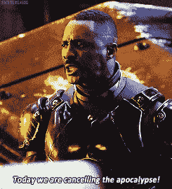

# 挂在 Git 挂钩上的 Git

> 原文:[https://dev.to/rpalo/git-hooked-on-git-hooks](https://dev.to/rpalo/git-hooked-on-git-hooks)

我发现一些很酷的东西，要么应该比现在更受欢迎，要么很受欢迎，应该比现在更快地教给新程序员。它们被称为 Git 挂钩。我准备写这篇文章，假设你知道 Git 是什么，并且假设你对编码、阶段、提交、涂肥皂、冲洗、重复、推送的一般过程感到舒适。如果你不是，这里有[少数](http://rogerdudler.github.io/git-guide/) [好](https://www.sitepoint.com/git-for-beginners/) [资源](https://git-scm.com/book/en/v2/Getting-Started-Git-Basics)。(注意，那是三个独立的链接，不是一个长的)。

## 背景

Git 挂钩是一些脚本，如果启用并正确设置，它们会在 git 进程中的特定时间被触发。以下是可用挂钩的列表:

1.  `pre-commit`:首先运行，在你输入提交消息之前(假设你没有使用-m 作为消息)。
2.  `prepare-commit-msg`:在向您显示提交消息进行编辑之前运行。这有利于提交消息的模板化。
3.  `commit-msg`:在您点击提交消息上的 save 之后，但在提交完成之前运行。有助于实施提交消息标准。
4.  `post-commit`:保存并完成提交后运行。通常用于通知或状态更新。
5.  `pre-rebase`:在重设基础发生之前运行。Git 的默认示例脚本确保您在重定基础之前没有推送(因为这可能会给其他人带来问题)。
6.  `post-rewrite`:提交被替换后运行(例如用`git commit --amend`、`git rebase`)。适用于生成文档或复制未跟踪的文件。觉得`npm install`或者类似的，也许吧。
7.  `post-checkout`:在`git checkout`之后运行。类似于#6。
8.  `post-merge`:在`git merge`之后运行。见#6。
9.  `pre-push`:在推送完成之前发生。如果需要，您可以使用它来中止推送，类似于`pre-commit`，但用于推送。

除此之外，还有一些基于电子邮件的工作流可用的钩子(例如，当人们通过电子邮件向您发送要合并的补丁时)。git 服务器端也有一些对部署有用的工具。现在我将跳过所有这些，只关注一个非常基础的案例(主要是因为这是我目前的技能水平)。

## 勾起来

所以让我们开始吧！举个例子，我用 Python，因为我当然是，闭嘴。我会一步一步跟你说清楚。首先，创建一个新的项目文件夹。

```
$ cd ~/Desktop
$ mkdir hooky && cd $_ 
```

<svg width="20px" height="20px" viewBox="0 0 24 24" class="highlight-action crayons-icon highlight-action--fullscreen-on"><title>Enter fullscreen mode</title></svg> <svg width="20px" height="20px" viewBox="0 0 24 24" class="highlight-action crayons-icon highlight-action--fullscreen-off"><title>Exit fullscreen mode</title></svg>

创建一个名为`hooky.py`的新 Python 文件。注意，在我们的例子中，我将有目的地使用糟糕的风格。一会儿你就知道为什么了。

```
# hooky.py 
def hook( quantity ):
    return "---u<><"*quantity

if __name__ == "__main__":
    print(hook(3)) 
```

<svg width="20px" height="20px" viewBox="0 0 24 24" class="highlight-action crayons-icon highlight-action--fullscreen-on"><title>Enter fullscreen mode</title></svg> <svg width="20px" height="20px" viewBox="0 0 24 24" class="highlight-action crayons-icon highlight-action--fullscreen-off"><title>Exit fullscreen mode</title></svg>

现在让我们初始化我们的 git 存储库。

```
$ git init
$ git add hooky.py 
```

<svg width="20px" height="20px" viewBox="0 0 24 24" class="highlight-action crayons-icon highlight-action--fullscreen-on"><title>Enter fullscreen mode</title></svg> <svg width="20px" height="20px" viewBox="0 0 24 24" class="highlight-action crayons-icon highlight-action--fullscreen-off"><title>Exit fullscreen mode</title></svg>

在我们提交之前，看一下`.git/hooks/`目录。另外，如果您还没有安装`flake8`，它是 Python 的众多 linters 之一。如果你使用另一种语言，安装一个等效的 linter。通常，我们会使用一个虚拟环境，但是 linter 是一个很方便的东西。

```
$ ls -l .git/hooks/
$ pip3 install flake8 
```

<svg width="20px" height="20px" viewBox="0 0 24 24" class="highlight-action crayons-icon highlight-action--fullscreen-on"><title>Enter fullscreen mode</title></svg> <svg width="20px" height="20px" viewBox="0 0 24 24" class="highlight-action crayons-icon highlight-action--fullscreen-off"><title>Exit fullscreen mode</title></svg>

您将会看到一堆示例，您稍后应该会浏览这些示例。他们有一些很好的想法。现在，我们将创建自己的`pre-commit`钩子。创建`.git/hooks/pre-commit`。确保没有文件扩展名。

```
#!/usr/bin/env bash

# This is the pre-commit file
echo "Linting code before commit..."
flake8 
```

<svg width="20px" height="20px" viewBox="0 0 24 24" class="highlight-action crayons-icon highlight-action--fullscreen-on"><title>Enter fullscreen mode</title></svg> <svg width="20px" height="20px" viewBox="0 0 24 24" class="highlight-action crayons-icon highlight-action--fullscreen-off"><title>Exit fullscreen mode</title></svg>

现在，确保您的脚本是可执行的，我们可以尝试提交。

```
$ chmod +x .git/hooks/pre-commit
$ git commit  # omit the -m for example's sake.
              # if you include a message, it will still work
              # you'll just waste your time typing a message 
```

<svg width="20px" height="20px" viewBox="0 0 24 24" class="highlight-action crayons-icon highlight-action--fullscreen-on"><title>Enter fullscreen mode</title></svg> <svg width="20px" height="20px" viewBox="0 0 24 24" class="highlight-action crayons-icon highlight-action--fullscreen-off"><title>Exit fullscreen mode</title></svg>

嘣！Flake8 抱怨我们的ðÿ'风格。不提交。用`git status`证明。请注意，文件仍在暂存，但未提交。但是为什么不提交呢？对于`pre-commit`钩子，如果脚本以除零以外的任何状态退出，它将取消提交。

[T2】](https://res.cloudinary.com/practicaldev/image/fetch/s--xaVusTi3--/c_limit%2Cf_auto%2Cfl_progressive%2Cq_66%2Cw_880/http://assertnotmagic.com/img/git-cancel.gif)

`prepare-commit-msg`、`commit-msg`、`pre-rebase`、`pre-push`都做类似的事情。差不多就是这样！很棒吧？往前走，勾住！为了说明这一点，我想再举一个类似的例子。这是额外的，所以如果你已经太兴奋了，迫不及待地想亲自尝试，请随意跳过它。

## 奖金示例

创建两个新文件:`__init__.py`和`test_hooky.py`。`__init__.py`将保持空白，但这里有测试文件的内容。

```
 from hooky import hooky   # From this dir, import the module 
# This test should pass def test_hook():
    assert hooky.hook(3) == "---u<><---u<><---u<><"

# This one will fail because there is no such method (yet). def test_release():
    assert hooky.release("---u<><") == 1 
```

<svg width="20px" height="20px" viewBox="0 0 24 24" class="highlight-action crayons-icon highlight-action--fullscreen-on"><title>Enter fullscreen mode</title></svg> <svg width="20px" height="20px" viewBox="0 0 24 24" class="highlight-action crayons-icon highlight-action--fullscreen-off"><title>Exit fullscreen mode</title></svg>

现在，更新你的`.git/hooks/pre-commit`文件。同样，如果您还没有，请通过 pip 安装 pytest(一个很棒的测试框架)。

```
#!/usr/bin/env bash

# This is the pre-commit file
echo "Linting code before commit..."
flake8

echo "Running tests..."
pytest 
```

<svg width="20px" height="20px" viewBox="0 0 24 24" class="highlight-action crayons-icon highlight-action--fullscreen-on"><title>Enter fullscreen mode</title></svg> <svg width="20px" height="20px" viewBox="0 0 24 24" class="highlight-action crayons-icon highlight-action--fullscreen-off"><title>Exit fullscreen mode</title></svg>

现在，运行`flake8`，回到你的`hooky.py`文件中，修复所有的警告，直到`flake8`被平息。然后尝试再次提交。你应该看到它与破碎的测试一起爆炸！觉得爽？很好，因为你很酷。不仅仅是 git 挂钩。尽管它们增加了你整体的酷感，但你已经很酷了。那怎么样？

* * *

*最初发布于[我的博客](http://assertnotmagic.com)T3】*