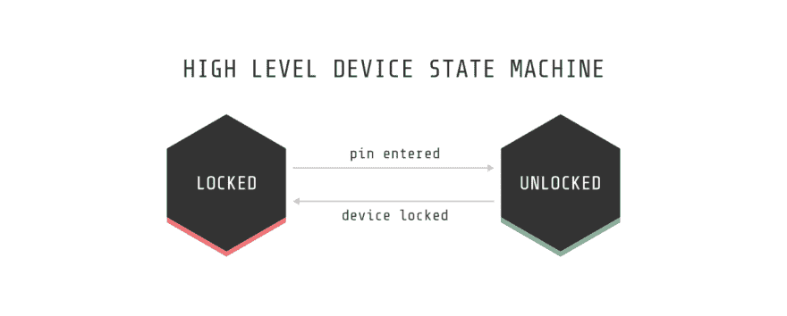

# 用 Python 构建一个简单的状态机。

> 原文：<https://dev.to/karn/building-a-simple-state-machine-in-python>

*最初发布在我的[个人博客](http://karn.io/post/163553561848/python-state-machine)上。*

大约两年前我发现了状态机，它被用于一个问题的解决方案中，我们映射 VoIP 电话呼叫的可能状态(呼入、振铃、应答等)。)到我们可以监控的东西。我惊讶于这是如此简单，并决定在我自己的项目中采用状态机。

我相信每个人都知道当你发现一些新的软件原理时会发生什么；你决定实际上你建造的所有东西都需要它。然而，作为负责任的开发人员，我们必须问自己，我们试图做的是否是最好的解决方案。我们必须问我们的用例是什么，在这种情况下，我们是否需要一个状态机。也许下面的例子将有助于深入了解状态机的用途。

##### 状态机

在我们开始用 Python 实现一个简单的状态机之前，让我们快速回顾一下什么是状态机，它看起来像什么。简而言之，它基本上是一组状态和一组动作/事件，我们从一个状态开始，就像一个[图形数据结构](http://www.algolist.net/Data_structures/Graph)，我们可以根据相应边描述的条件遍历节点。我们使用该条件来获得我们想要的节点(也称为状态)。因为一次只有一个状态是活动的，所以我们对自己在状态机生命周期中的位置有很多控制。这里有一个更全面的 CS 理论支持的解释，可以通过视频[找到。如果你想了解更多，我强烈推荐你去看看！](https://www.youtube.com/watch?v=Qa6csfkK7_I)

##### 用例

状态机有许多用例，其中一些包括—管理状态(如呼叫状态、WiFi 连接，甚至 Android 活动生命周期)或报告指标—例如，用户完成登录的持续时间(登录->挂起->成功)。

状态机特别有意思，因为除了别的以外，它们还提供了定义良好的场景，并列出了达到这些场景的条件。这使得确定边缘情况以及如何处理它们变得非常容易，因为我们被迫考虑我们的代码必须落入的每一个可能的场景。

个人认为，理解状态机的最佳方式是通过一个日常的例子。

想象你正在看你的密码保护的电话，在一个高层次上它有两种操作状态。第一个是`locked`，您的功能有限，第二个是`unlocked`，您现在可以使用更大容量的设备。

这是上面的状态机可视化后的样子。

[T2】](https://res.cloudinary.com/practicaldev/image/fetch/s--paNmoajP--/c_limit%2Cf_auto%2Cfl_progressive%2Cq_auto%2Cw_880/https://68.media.tumblr.com/3bdccbcb28dbbfd5a600c9216634cd34/tumblr_inline_otubp21k2r1sfy6fg_1280.png)

##### 使用状态机

我们从定义状态开始，这些状态被定义为状态机中的节点。在我们的例子中，我们有两种状态；`locked` & `unlocked`在下面的例子中，我还定义了一个`State`对象，它将为我们的状态处理一些实用函数(从这个对象扩展而来)。

```
# state.py

class State(object):
    """
    We define a state object which provides some utility functions for the
    individual states within the state machine.
    """

    def __init__(self):
        print 'Processing current state:', str(self)

    def on_event(self, event):
        """
        Handle events that are delegated to this State.
        """
        pass

    def __repr__(self):
        """
        Leverages the __str__ method to describe the State.
        """
        return self.__str__()

    def __str__(self):
        """
        Returns the name of the State.
        """
        return self.__class__.__name__ 
```

这些状态可以定义如下。

```
# my_states.py

from state import State

# Start of our states
class LockedState(State):
    """
    The state which indicates that there are limited device capabilities.
    """

    def on_event(self, event):
        if event == 'pin_entered':
            return UnlockedState()

        return self

class UnlockedState(State):
    """
    The state which indicates that there are no limitations on device
    capabilities.
    """

    def on_event(self, event):
        if event == 'device_locked':
            return LockedState()

        return self
# End of our states. 
```

然后我们定义实际的状态机。它相当简单，看起来像这样:

```
# simple_device.py

from my_states import LockedState

class SimpleDevice(object):
    """ 
    A simple state machine that mimics the functionality of a device from a 
    high level.
    """

    def __init__(self):
        """ Initialize the components. """

        # Start with a default state.
        self.state = LockedState()

    def on_event(self, event):
        """
        This is the bread and butter of the state machine. Incoming events are
        delegated to the given states which then handle the event. The result is
        then assigned as the new state.
        """

        # The next state will be the result of the on_event function.
        self.state = self.state.on_event(event) 
```

相当简单，对吗？这个状态机所做的是定义一个起始状态`LockedState`并公开一个函数来处理事件。该函数在处理事件时，基本上将当前状态分配给同一状态的结果。

最后，我们可以使用 python shell 测试状态机的实现。

```
$ python
Python 2.7.13 (default, Apr  4 2017, 08:47:57)
[GCC 4.2.1 Compatible Apple LLVM 8.1.0 (clang-802.0.38)] on darwin
Type "help", "copyright", "credits" or "license" for more information.
>>> 
>>> from simple_device import SimpleDevice
>>> device = SimpleDevice()
Processing current state: LockedState
>>> 
>>> device.on_event('device_locked')
>>> device.on_event('pin_entered')
Processing current state: UnlockedState
>>> 
>>> device.state
UnlockedState
>>> 
>>> device.on_event('device_locked')
Processing current state: LockedState
>>> 
>>> device.state
LockedState
>>> device.on_event('device_locked') 
```

您会注意到重复的事件被忽略，只有提供过渡的事件被利用。当我们想要忽略事件或者将一系列冗长的事件简化成一组简单的事件时，这就成了一个非常强大的工具。我最喜欢的一点是，如果将来我们想添加更多的状态和转换，这非常简单，无需重写我们的代码库。

##### 结论

状态机非常棒，从需要简单状态管理的情况到度量报告，它们已经被证明非常有用并且可扩展。上述技术是实现状态机来处理 SIP 信令事件(对于 VoIP)和测量传入事件之间的增量(以便更好地理解我们的痛点)的产物。它肯定可以扩展到几十个状态，并使状态测量变得简单易行。

如果您正在寻找不同的解决方案，请查看 Python [transitions](https://github.com/pytransitions/transitions) 库，这是一个状态机库，看起来很有前途。

##### 参考

*   在研究 Python 的状态机库时，我看到了一个记录了一个简单实现的页面，上面的解决方案基于提供的例子。点击查看最初的实现[。](http://python-3-patterns-idioms-test.readthedocs.io/en/latest/StateMachine.html)

如果你发现任何错误，或者你只是想打个招呼，请告诉我！