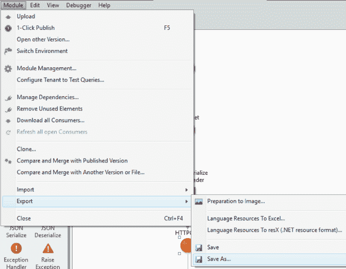
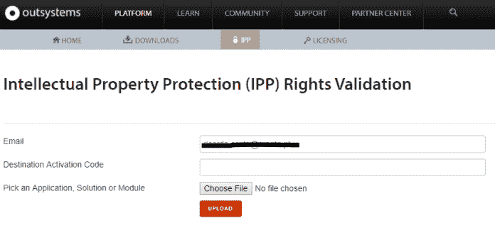
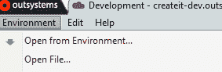

# 移动模块-移除 IPP-系统外

> 原文：<https://dev.to/rkosta/move-modules--remove-ipp--outsystems-5dag>

我需要将一些模块从一个基础设施转移到另一个基础设施，所以首先我需要删除 [IPP](https://www.outsystems.com/IPP/) (知识产权保护)。

1–在 Service Studio 中，打开您的模块并转到模块->导出->另存为…

<figure> 

<figcaption>出口 OML</figcaption>

</figure>

2–导航至[知识产权保护(IPP)权利验证](https://www.outsystems.com/homeipp/ipp_page.aspx)

在这里，您需要输入您的电子邮件、目标基础架构的目标激活码，并上传您的 OML

<figure> 

<figcaption>IPP 验证</figcaption>

</figure>

3–您将收到一封电子邮件，其中包含没有 IPP 保护的 OML 文件。下载文件。

4–在 Service Studio 中转到模块->打开文件…

<figure> 

<figcaption>打开模块</figcaption>

</figure>

5–发布您的模块

帖子[移动模块-移除 IPP-系统外](https://blogit.create.pt/ricardocosta/2017/08/01/move-modules-remove-ipp-outsystems/)首先出现在[博客 IT](https://blogit.create.pt) 上。