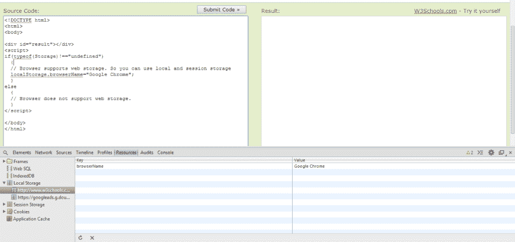

# HTML5 网络存储–网络离线存储解决方案

> 原文：<https://dev.to/mandarbadve/html5-web-storage--offline-storage-solution-for-the-web>

*这篇文章最初发表在[我的博客](http://blog.mandarbadve.com/2014/01/30/html5-web-storage-offline-storage-solution-web/)T3 上*

使用 HTML5，您可以将数据存储到用户的浏览器中。在 HTML5 之前，只有一种使用 cookies 存储数据的方法。这个 web 存储以键/值对的形式存储数据。您可以使用这种技术来脱机存储数据。

如何检查浏览器支持 web 存储？

```
 if(typeof(Storage) !== "undefined")
    {
        // Browser supports web storage. So you can use local and session storage
    }
    else
    {
        // Browser does not support web storage.
    } 
```

Enter fullscreen mode Exit fullscreen mode

web 存储器有两种类型

1.  局部存储器
2.  会话存储

### 本地存储

您可以像
一样将数据存储到本地存储器中

```
localStorage.key = "value"; 
```

Enter fullscreen mode Exit fullscreen mode

你可以用
来检索它

```
var localStorageValue = localStorage.key; 
```

Enter fullscreen mode Exit fullscreen mode

即使您关闭并重新打开浏览器，这种存储仍然存在。

### 会话存储

此存储与本地存储相同。与本地存储不同的一点是，如果用户关闭浏览器，数据将会丢失。因此，如果您想在每个会话中存储数据，请选择这种存储方式。

您可以按如下方式存储数据

```
sessionStorage.key = "value"; 
```

Enter fullscreen mode Exit fullscreen mode

之后您可以检索为

```
var sessionStorageValue = sessionStorage.key; 
```

Enter fullscreen mode Exit fullscreen mode

### 如何检查/调试 web 存储器是否工作？

浏览器的开发工具将显示存储在网络存储器中的数据。下图来自 w3schools.com，描述了网络存储的位置。

[T2】](https://res.cloudinary.com/practicaldev/image/fetch/s--vXP0JtrB--/c_limit%2Cf_auto%2Cfl_progressive%2Cq_auto%2Cw_880/https://thepracticaldev.s3.amazonaws.com/i/jhrmyjsb7kdx505iilkt.png)

你可以检查你的浏览器支持多少 HTML5 功能，只需在你的浏览器中打开[http://html5test.com/](http://html5test.com/)。