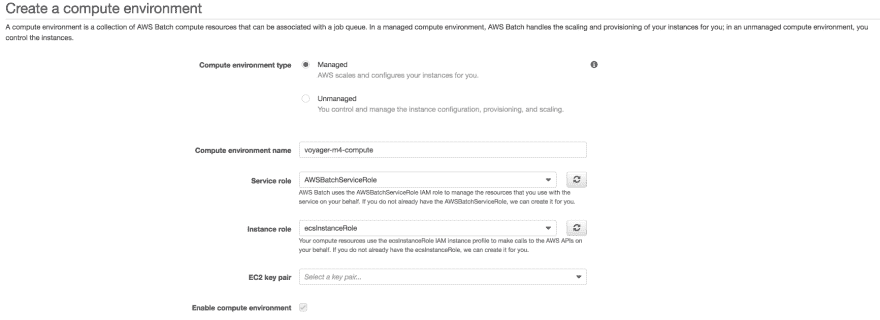
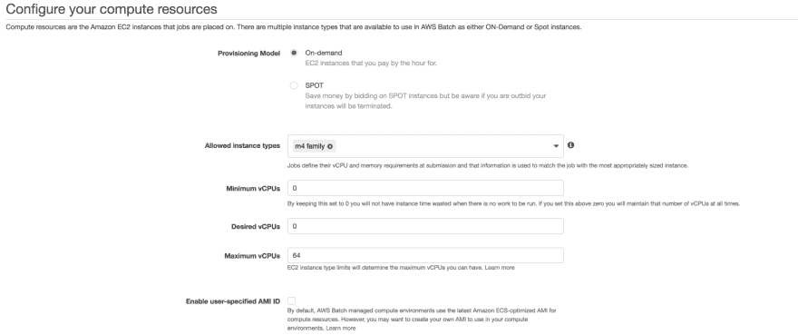
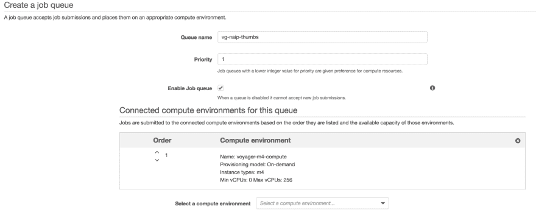
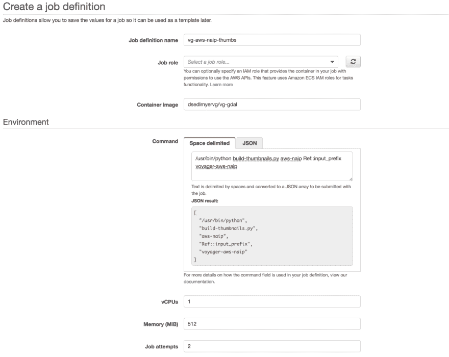
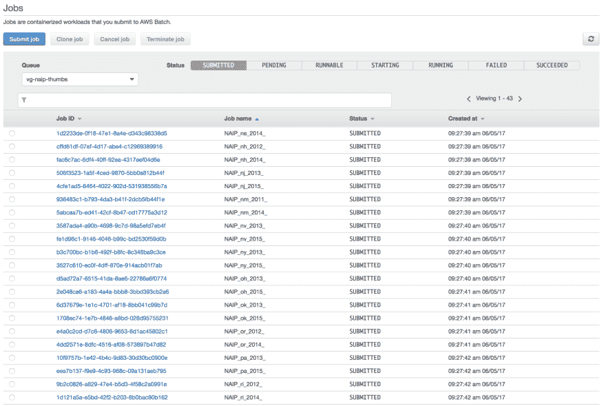
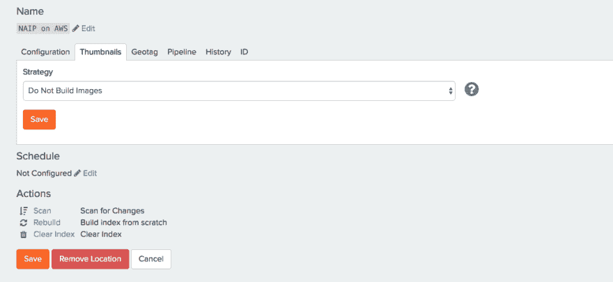
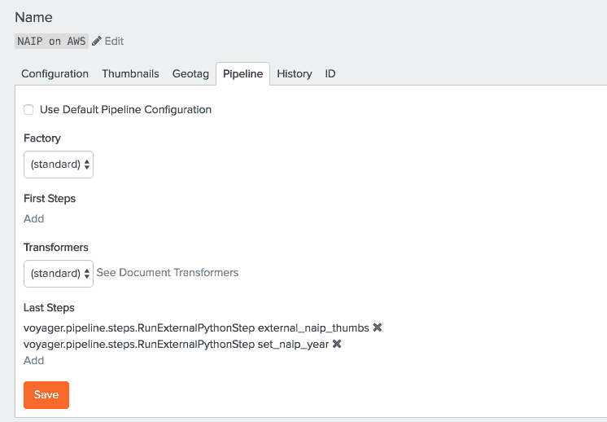
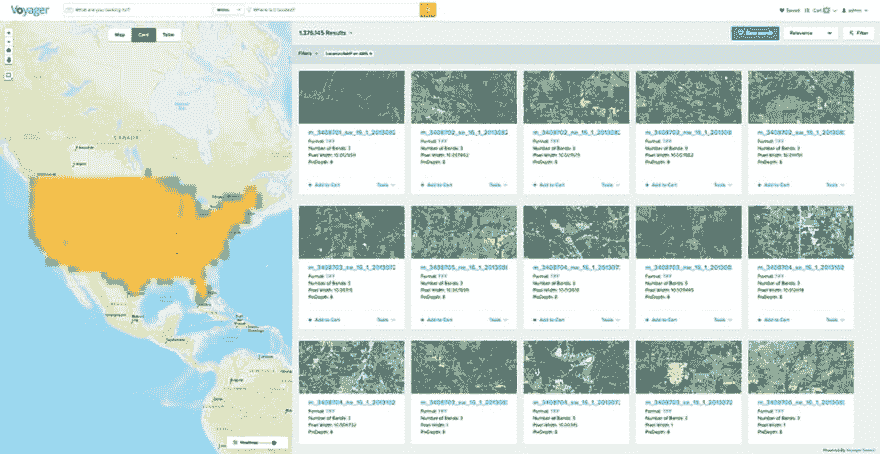

# 使用 AWS 批处理为 Voyager 生成图像缩略图

> 原文:[https://dev . to/dereksedlmyer/using-AWS-batch-to-generate-image-thumbnails-for-voyager-fa4](https://dev.to/dereksedlmyer/using-aws-batch-to-generate-image-thumbnails-for-voyager-fa4)

在 Voyager 的 1.9.9 版本中，添加了一些令人兴奋的新功能。最引人注目的是 Voyagers 对云部署和 AWS S3 的新支持。许多组织，包括我们的许多客户，越来越多地在公共云中部署应用程序、服务和数据，这是他们要求我们在云中部署 Voyager 并索引存储在云存储库中的数据的原因之一。

对于一般用户来说，Voyagers 易于使用的界面及其在组织内查找任何数据的能力是主要优势。系统管理员喜欢 Voyager 的企业集成和数据管理功能；而开发人员喜欢 Voyager 是因为它的 REST APIs 和创建自定义位置、提取器和管道步骤的可扩展性。

这篇博客文章将强调开发人员在 Voyager 基础上构建和使用公共云提供商提供的一些弹性功能的新方法，并重点关注 AWS Batch 如何帮助开发人员横向扩展将数据推送到 Voyager 的流程。

# AWS 和 NAIP 内容

作为我们最近发布的 VoyagerODN 的一部分，我们将包括来自 AWS 托管数据集上的 NAIP 的 NAIP 内容。AWS 上的 NAIP 包含前两个采集年美国大陆的 leaf-on 影像，并在亚马逊 S3 托管在 us-east-1(北弗吉尼亚州)的请求者付费桶中，在 2012 年至 2015 年期间积累了超过 130 万张影像。

通过 VoyagerODN，我们希望索引 NAIP 的内容，同时在搜索结果中为用户提供视觉上吸引人的缩略图。添加新的 S3 功能使我们能够轻松地索引 NAIP 内容，但为了生成缩略图，我们需要一个解决方案来扩展到单台服务器之外，以便能够快速完成。鉴于 NAIP 影像的容量超过 90TB，构建缩略图需要数周的处理时间。我们需要更快地构建缩略图。

输入 AWS 批次。AWS Batch 在 AWS re:Invent 2016 上公布。AWS Batch 可以运行成千上万的批处理计算作业，方法是根据批处理作业的数量和特定资源需求动态地提供计算资源。

AWS 批处理的关键组件是作业、作业定义、作业队列和计算环境。作业在 Docker 容器中作为命令执行，作业定义定义了要使用的 Docker 容器、要执行的命令、资源要求以及作业的其他配置。然后将作业提交到作业队列。计算环境定义执行作业的服务器集群，从一个或多个作业队列中提取作业并执行它们。AWS Batch 管理执行，提供最新状态，并将控制台输出写入 CloudWatch 进行监控。唯一真正的工作是开发实际处理数据的脚本。

对于 VoyagerODN，构建缩略图的计划是:

开发一个脚本来构建一组 NAIP 图像的缩略图。在这种情况下，我们使用州名和年份组合前缀来定义一个集合。在脚本中使用 GDAL 构建缩略图在为集合构建缩略图后，在 Voyager 中将缩略图推送到 S3，在索引 NAIP 数据时，关闭缩略图生成，并添加一个管道步骤来设置外部缩略图 URL。

# 第一步:构建 Docker 映像

在这一步，我需要基于 Ubuntu 构建一个 Docker 镜像，并安装和配置 GDAL 和 Python。

完整的 Docker 文件显示了 Docker 映像是如何构建的。aws-cli、python 和 gdal 软件包将通过 apt 安装。此外，Python 库将通过 pip 安装。构建缩略图的脚本也将被复制到图像中。

```
FROM ubuntu:trusty

# Define Python required libraries in requirements.txt
# Copy requirements file into the Docker image
COPY requirements.txt /tmp/requirements.txt

# Install required software via apt and pip
RUN sudo apt-get -y update && \
      apt-get install -y \
    awscli \
    python \
    python-pip \
    software-properties-common \
 && add-apt-repository ppa:ubuntugis/ppa \
 && apt-get -y update \
 && apt-get install -y \
      gdal-bin \
 && pip install --requirement /tmp/requirements.txt

# Copy Build Thumbnail script to Docker image and add execute permissions
COPY build-thumbnails.py build-thumbnails.py

RUN chmod +x build-thumbnails.py 
```

<svg width="20px" height="20px" viewBox="0 0 24 24" class="highlight-action crayons-icon highlight-action--fullscreen-on"><title>Enter fullscreen mode</title></svg> <svg width="20px" height="20px" viewBox="0 0 24 24" class="highlight-action crayons-icon highlight-action--fullscreen-off"><title>Exit fullscreen mode</title></svg>

使用以下命令构建并标记 Docker 映像(vg-gdal ):

`$docker build -t vg-gdal .`

使用 Docker 的好处是相同的映像可以在开发、测试和生产环境中使用。我的机器不再工作了。让我们在一台开发机器上测试这个新的 Docker 映像，方法是在一个 Docker 容器中用 Docker 映像运行脚本:

`$docker run -e AWS_ACCESS_KEY_ID=<ACCESSKEY> -e
AWS_SECRET_KEY=<SECRETKEY> -it vg-gdal /usr/bin/python build-thumbnails.py
aws-naip al/2013/ voyager-aws-naip`

该命令执行以下操作:

1.  在运行先前构建的名为 vg-gdal 的 Docker 映像的容器中运行构建缩略图脚本
2.  为 AWS 凭证指定环境变量(在 AWS 批处理中运行时不需要，稍后会详细介绍)
3.  从 aws-naip 桶中的图像构建缩略图，关键字以 al/2013/(2013 年在阿拉巴马州收集的所有图像)开头
4.  将缩略图存储在 voyager-aws-naip 存储桶中(关键字名称将在 aws-naip 和 voyager-aws-naip 之间同步)

成功执行后，缩略图将被构建并存储在航海家-aws-naip S3 桶中。从这里开始，Docker 映像需要被推送到一个映像存储库，要么是 Docker Hub，要么是 Amazon ECR。在这种情况下，我将使用 Docker Hub 存储库。以下命令将登录 Docker Hub，适当地重新标记 Docker 映像，并将 Docker 映像推送到存储库:

```
$docker login
$docker tag vg-gdal dsedlmyervg/vg-gdal:latest
$docker push dsedlmyervg/vg-gdal:latest 
```

<svg width="20px" height="20px" viewBox="0 0 24 24" class="highlight-action crayons-icon highlight-action--fullscreen-on"><title>Enter fullscreen mode</title></svg> <svg width="20px" height="20px" viewBox="0 0 24 24" class="highlight-action crayons-icon highlight-action--fullscreen-off"><title>Exit fullscreen mode</title></svg>

# 第二步:配置 AWS 批量

现在我有了一个工作脚本来构建在 Docker 容器中运行的缩略图，并将 Docker 图像推送到图像存储库，让我们配置 AWS Batch 来运行批处理作业。

第一步是配置计算环境。这将配置实例类型、安全组、网络、扩展策略和配置模型。

[T2】](https://res.cloudinary.com/practicaldev/image/fetch/s--NVbPw8vo--/c_limit%2Cf_auto%2Cfl_progressive%2Cq_auto%2Cw_880/https://cdn.hashnode.com/res/hashnode/image/upload/v1654047632619/o-21Km2Gg.png)

[T2】](https://res.cloudinary.com/practicaldev/image/fetch/s--BvKW60Je--/c_limit%2Cf_auto%2Cfl_progressive%2Cq_auto%2Cw_880/https://cdn.hashnode.com/res/hashnode/image/upload/v1654047664749/mV-L8e25T.png)

为了构建 NAIP 缩略图，我将使用以下内容配置计算环境:

*   托管计算环境。AWS 将为我扩展和配置集群实例。
*   按需供应模式。如果我想在现场运行，这是另一种选择，但我现在更喜欢按需运行。
*   M4 实例族。M4 实例是很好的通用实例类型，非常适合构建 NAIP 缩略图。
*   最大 96 个 vCPUs。我选择 96 是因为有 48 个州拥有 NAIP 影像和每年 2 年的数据，因此我可以并行处理整个数据集。
*   我还为实例分配了一个实例角色。这将使实例只能将缩略图写入特定的 S3 存储桶。实例配置文件不会授予实例访问任何其他 AWS 服务的权限。现在，我不必在脚本、凭证文件或环境变量中指定 AWS_ACCESS_KEY_ID 或 AWS_SECRET_ACCESS_KEY。

下一步是创建作业队列，并将其连接到之前创建的计算环境。我会将优先级 1 分配给作业队列，这样它的作业就有了更高的计算资源优先级。

[T2】](https://res.cloudinary.com/practicaldev/image/fetch/s--4lgvql7N--/c_limit%2Cf_auto%2Cfl_progressive%2Cq_auto%2Cw_880/https://cdn.hashnode.com/res/hashnode/image/upload/v1654047730037/PTIUFQwzt.png)

最后，是时候创建一个作业定义来使用步骤 1 中构建的 Docker 映像构建缩略图了。

[T2】](https://res.cloudinary.com/practicaldev/image/fetch/s--5BywM1Mt--/c_limit%2Cf_auto%2Cfl_progressive%2Cq_auto%2Cw_880/https://cdn.hashnode.com/res/hashnode/image/upload/v1654047768635/pWR043Iae.png)

我用以下内容创建了此作业定义:

*   名称设置为 vg-aws-naip-thumbs
*   使用我之前创建的 Docker 映像 dsedlmyervg/vg-gdal 作为容器映像
*   该命令定义为:

这是我在步骤 1 中测试 Docker 映像时使用的类似命令。不同之处在于 Im 在作业定义中指定了 input_prefix a 参数。因为它是一个参数，所以我可以在提交作业时传递实际的输入前缀。

*   vCPUs 设置为 1。这项工作不需要多个 vCPUs
*   内存(MiB)设置为 512。512 兆内存足够操作系统和作业运行。
*   作业尝试次数设置为 2。如果失败，整个作业将自动重启。构建缩略图脚本将在构建缩略图之前查看缩略图是否已经存在。这节省了处理时间。

配置计算环境、作业队列和作业定义。接下来，是时候提交要执行的作业了。

# 第三步:提交作业

将 AWS Batch 配置为构建缩略图后，我现在可以向作业队列提交作业了。AWS Batch 将处理作业的执行和状态更新。

我决定用州和年份来定义工作。例如，阿拉巴马州有 2013 年和 2015 年的数据，所以我将为阿拉巴马州提交两个工作，一个是 2013 年的，另一个是 2015 年的。我编写了一个简单的 Python 脚本来提交作业:

```
import json
import boto3

batch = boto3.client('batch')
s3 = boto3.client('s3')

states = s3.list_objects(Bucket='aws-naip',
      Delimiter="/",
      RequestPayer="requester")

for state_prefix in states['CommonPrefixes']:
  if state_prefix['Prefix'] == ".misc/":
    continue

  years = s3.list_objects(Bucket='aws-naip',
      Prefix="{0}".format(state_prefix['Prefix']),
      Delimiter="/",
      RequestPayer="requester")

  if 'CommonPrefixes' not in years:
    continue

  for year_prefix in years['CommonPrefixes']:
    input_prefix = year_prefix['Prefix']
    jobName = "NAIP_{0}".format(input_prefix.replace("/", "_"))
    print(jobName)

    try:
      response = batch.submit_job(jobQueue='vg-naip-thumbs',
        jobName=jobName,
        jobDefinition='vg-aws-naip-thumbs',
        parameters={"input_prefix":input_prefix })

      print ("Response: " + json.dumps(response, indent=2))
    except Exception as e:
      print ("Error submitting Batch Job")
      print (e) 
```

<svg width="20px" height="20px" viewBox="0 0 24 24" class="highlight-action crayons-icon highlight-action--fullscreen-on"><title>Enter fullscreen mode</title></svg> <svg width="20px" height="20px" viewBox="0 0 24 24" class="highlight-action crayons-icon highlight-action--fullscreen-off"><title>Exit fullscreen mode</title></svg>

我可以从我的开发者机器上运行这个脚本，并且在运行脚本之前需要设置 AWS 凭证:

```
$export AWS_ACCESS_KEY_ID=<ACCESSKEY>
$export AWS_SECRET_ACCESS_KEY=<SECRETKEY>
$python submit-aws-naip-thumb-jobs.py 
```

<svg width="20px" height="20px" viewBox="0 0 24 24" class="highlight-action crayons-icon highlight-action--fullscreen-on"><title>Enter fullscreen mode</title></svg> <svg width="20px" height="20px" viewBox="0 0 24 24" class="highlight-action crayons-icon highlight-action--fullscreen-off"><title>Exit fullscreen mode</title></svg>

提交所有作业后，我可以在 AWS 批处理控制台中提交作业:

[T2】](https://res.cloudinary.com/practicaldev/image/fetch/s--qPp8H1Tg--/c_limit%2Cf_auto%2Cfl_progressive%2Cq_auto%2Cw_880/https://cdn.hashnode.com/res/hashnode/image/upload/v1654047886155/nf1rA4Zh1.png)

我可以监视这些作业在挂起、可运行、可启动、运行和最终成功状态之间的移动。

# 第四步:索引 NAIP

最后一步是配置 Voyager 来索引 NAIP，并适当地设置缩略图。要索引 NAIP 数据，请创建一个新的云存储位置，并将缩略图策略设置为不构建图像。因为我在外部构建缩略图，所以我不想让航海家构建缩略图。

[T2】](https://res.cloudinary.com/practicaldev/image/fetch/s--yw7kZ6ML--/c_limit%2Cf_auto%2Cfl_progressive%2Cq_auto%2Cw_880/https://cdn.hashnode.com/res/hashnode/image/upload/v1654047923809/KjGCsOkGP.png)

现在，我可以使用管道步骤来设置 NAIP 拇指的外部 URL。Voyager 的索引管道提供了在将数据记录添加到索引时转换和操作数据记录属性(元数据)的功能。使用 Python 可以轻松开发管道步骤。

[T2】](https://res.cloudinary.com/practicaldev/image/fetch/s--Di63sOj5--/c_limit%2Cf_auto%2Cfl_progressive%2Cq_auto%2Cw_880/https://cdn.hashnode.com/res/hashnode/image/upload/v1654047949662/SnwFxXg-d.png)

`external_naip_thumbs`步骤的 Python 代码是:

```
import sys
import json

def run(entry):
    """
    Python step to compute the Thumb URL for a NAIP on AWS record. Thumbs are located in a
    publicly accessible AWS bucket. Thumbs have the same key as the full resolution image only
    ending in .thumb.jpg instead of .tif
    :param entry: a JSON file containing a voyager entry.
    """
    new_entry = json.load(open(entry, "rb"))
    key = new_entry['entry']['fields']['fs_key']
    thumb_key = key.replace(".tif", ".thumb.jpg")
    thumb_url = "https://voyager-aws-naip.s3.amazonaws.com/{0}".format(thumb_key)
    new_entry['entry']['fields']['image_url'] = thumb_url

    sys.stdout.write(json.dumps(new_entry))
    sys.stdout.flush() 
```

<svg width="20px" height="20px" viewBox="0 0 24 24" class="highlight-action crayons-icon highlight-action--fullscreen-on"><title>Enter fullscreen mode</title></svg> <svg width="20px" height="20px" viewBox="0 0 24 24" class="highlight-action crayons-icon highlight-action--fullscreen-off"><title>Exit fullscreen mode</title></svg>

应该将`external_naip_thumbs.py`脚本复制到/app/py/pipeline/steps 目录中。

`external_naip_thumbs`脚本执行以下操作:

1.  定义一个接受入口参数的运行方法。管道步骤需要 run 方法。entry 参数是包含文档 JSON 表示的文件路径。
2.  文件路径被打开并解析为 new_entry 中的 JSON。new_entry 是一个表示索引文档的 Python 字典。
3.  检索关键字(fs_key)字段。该关键字段是作为索引 S3 内容的结果而填充的。它包含了 NAIP 在 S3 形象的关键名称。
4.  使用键值，计算缩略图的 URL。缩略图存储在通过 AWS 批处理运行作业的 S3 中。
5.  缩略图 URL 存储在名为 image_url 的索引文档的单独字段中。Voyager 会将 image_url 解释为文档缩略图的绝对 url。
6.  作为管道步骤中的最后一个动作，索引文档被序列化为 JSON 到 stdout。Voyager 管道进程将从 stdout 中读取索引文档，并继续索引过程。

# 结果

使用 AWS Batch，我能够在一个周末为超过 130 万张 NAIP 图像构建缩略图，数据量超过 90TB。与在单个服务器上运行并花费数周时间来执行相比，这是一个好得多的改进。

下面是航海家的索引内容。你会注意到在 AWS 中生成并在 S3 托管的缩略图。

[T2】](https://res.cloudinary.com/practicaldev/image/fetch/s--9qJrblXn--/c_limit%2Cf_auto%2Cfl_progressive%2Cq_auto%2Cw_880/https://cdn.hashnode.com/res/hashnode/image/upload/v1654048038992/-C8pNtnYu.png)

# 结论

这是一个简单的例子，说明开发人员如何集成一个定制的解决方案，将内容推送到 Voyager 中，同时仍然在他们的组织内利用 Voyager 搜索功能。未来的博客文章将基于这个示例，展示更高级的定制解决方案。

有兴趣查看源代码的，请访问:[https://github . com/voyager search/voyager-samples/tree/master/AWS-batch-naip-thumbs](https://github.com/voyagersearch/voyager-samples/tree/master/aws-batch-naip-thumbs)