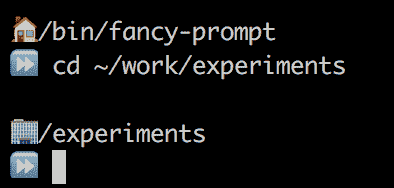

# 过去一周最受欢迎的 7 篇开发人员帖子

> 原文：<https://dev.to/thepracticaldev/the-7-most-popular-dev-posts-from-the-past-week-f462>

每周一我们都会收集一些上周的热门帖子、评论和推文。如果您有任何反馈，请留下评论。安

# 1。谁写的？等等， ***我*** 写了那个ðÿ˜

在这篇文章中，Bob 分享了坏代码的三个常见症状以及如何避免编写坏代码。开发人员总是希望在气味测试中做得更好，这篇文章的受欢迎程度就是例证。

 [## 你怎么知道你的代码是坏的？

### 鲍勃 Jul 23 ' 17 分钟阅读

#coding #cleancode](/bob/how-do-you-know-your-code-is-bad)

# 2。让我们 WFH，整天，每天

Gordon Shotwell 给了我们四个远程工作的理由，并触及了目前科技领域最大的问题之一。

> 工作场所是依赖于路径的地方。你用几个员工创办了自己的公司，然后根据这些员工来决定工作场所在物质和社会方面如何发展。这些决定反过来会吸引喜欢这些工作环境的员工，如此循环往复。例如，你的开放式初创办公室很可能是为支持身体健康的年轻人的工作而定制的，里面有攀岩墙，冰箱里有啤酒。也许你不会投资去支持一个盲人工程师的工作，他需要通过声音来编码，所以你永远不会雇佣那个工程师。

 [## 为什么您应该远程工作

### 戈登肖特维尔 7 月 26 日 177 分钟阅读](/gshotwell/why-you-should-work-remotely) 

# 3。刷起来

不言而喻，从 A 公司到 z 公司，技术性面试的范围会很广。在面试过程中，丹尼尔·戈兰特开始温习他可能会被问到的潜在话题。本周，他向我们回顾了 HTTP 生命周期。

 [## 本周我复习的内容:HTTP 请求生命周期

### 丹尼尔·戈兰特 7 月 25 日 1710 分钟阅读

#http #udp #tcp](/dangolant/things-i-brushed-up-on-this-week-the-http-request-lifecycle-)

# 4。谁不喜欢捷径呢？

我还没遇到过不喜欢更高效的人，所以关于快捷方式的文章总是 dev.to 社区的最爱也就不足为奇了。

 [## 这是我最喜欢的几个:终端快捷方式

### 萨尔·埃尔南德斯 7 月 28 日 173 分钟阅读

#terminal #programming #devtips #beginners](/clickclickonsal/these-are-a-few-of-my-favorite-terminal-shortcuts)

[T2】](https://i.giphy.com/media/zqYBZUOgNhbMI/giphy.gif)

# 5。这些数据是怎么来的？！

如果你不太理解互联网管道的这一层，你很幸运。Ben 也不太了解 TCP，所以他让我们的社区像五岁小孩一样给他解释。

我们得到了许多深入的回答以及有趣的轶事:

 [ George Offley ](/georgeoffley) • [<time datetime="2017-07-25T16:30:06Z"> Jul 25 '17 </time>](https://dev.to/georgeoffley/comment/ehm) 

你和一个朋友需要分享一个玩具:

1.  你问一个朋友他是否可以玩这个玩具。

2.  你的朋友问你是否真的向他要了玩具。

3.  你告诉你的朋友你想要那个玩具。

4.  他给你玩具。

UDP:

1.  你的朋友向你扔了一个玩具，然后走开了。

### 下面是完整的讨论:

 [## 像我五岁一样解释 TCP

### 本哈尔彭 7 月 25 日 171 分钟阅读

#explainlikeimfive #discuss #tcp](/ben/explain-tcp-like-im-five)

# 6。5 岁儿童以太坊

显然成年人也欣赏简单。我们上周开始使用[# explain like im5](https://dev.to/t/explainlikeimfive)标签，本的两个帖子使它进入了这个列表。我们都有兴趣了解的第二个概念是以太坊。

 [## 像我五岁一样解释以太坊

### 本哈尔彭 7 月 26 日 171 分钟阅读

#discuss #explainlikeimfive #ethereum #blockchain](/ben/explain-ethereum-like-im-five)

# 7。伊莫菲！ðÿ˜ðÿ˜³ðÿ˜±ðÿ˜µðÿ’€

开发工作可能会对精神造成伤害，所以 Joseph Moore 决定通过改变他的 bash 提示来为他的生活增加更多的快乐。以下是他所做的一些尝试:

[T2】](https://res.cloudinary.com/practicaldev/image/fetch/s--ROZJMfMm--/c_limit%2Cf_auto%2Cfl_progressive%2Cq_auto%2Cw_880/https://res.cloudinary.com/practicaldev/image/fetch/s--h2UTOx-3--/c_limit%2Cf_auto%2Cfl_progressive%2Cq_auto%2Cw_880/https://thepracticaldev.s3.amazonaws.com/i/ttoe1ciyc0f8yni0e4zu.png)

来自ðÿ˜†社区的反馈

 [ George Marr ](/rapidnerd) • [<time datetime="2017-07-29T21:24:34Z"> Jul 29 '17 </time>](https://dev.to/rapidnerd/comment/f9m) 

这比表情符号电影好多了

以及如何修改你的 bash 提示符！

 [## Emojifying 我的 Bash 提示符(为什么你也应该)

### 约瑟夫摩尔 7 月 29 日 178 分钟阅读

#bash #emoji #life](/thatjoemoore/emojifying-my-bash-prompt)

* * *

我们的每周总结到此结束！请关注 Dev.to 本周的每日内容和讨论...如果您遗漏了任何内容，我们将在下周一进行回顾！