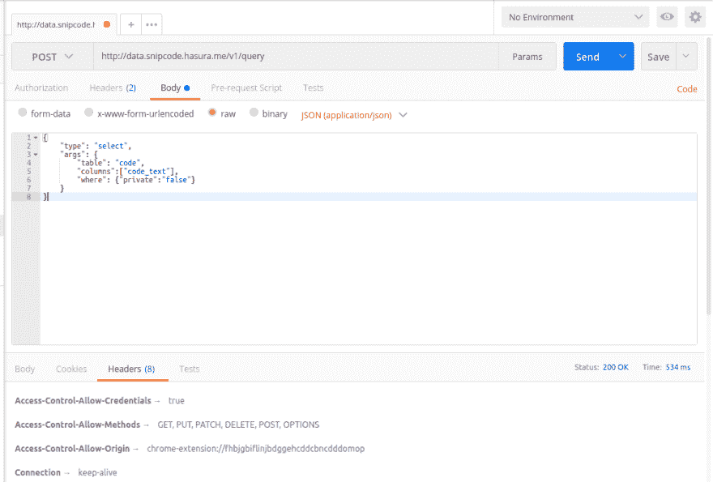
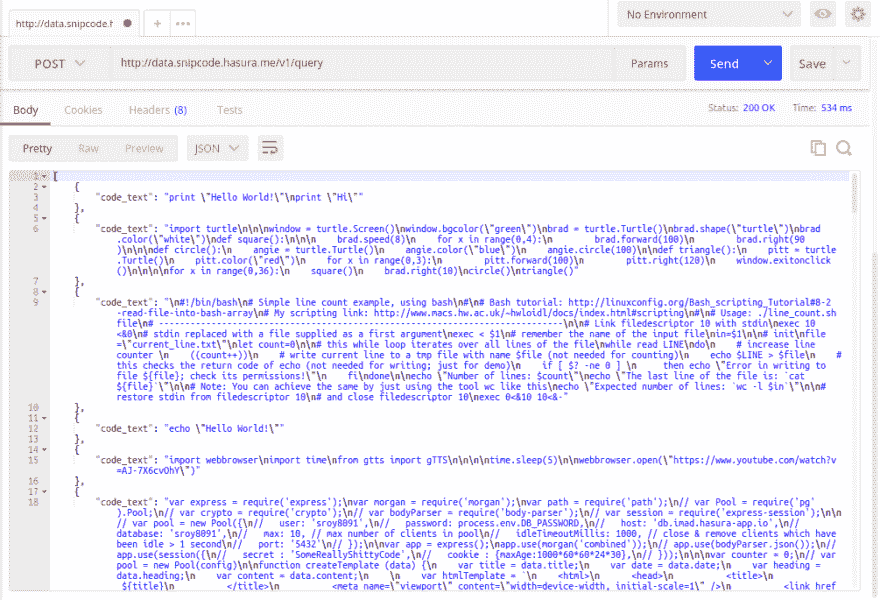
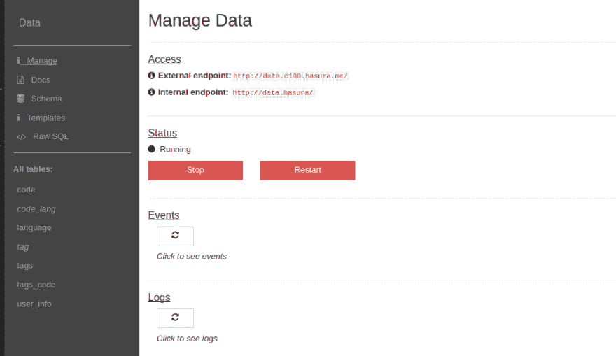
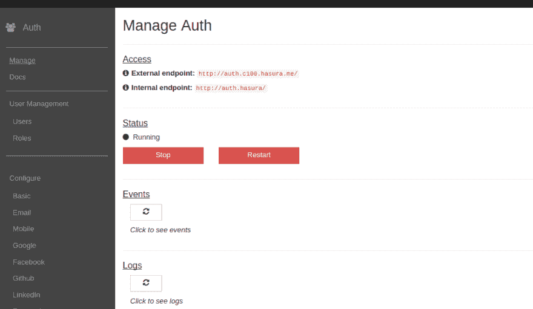
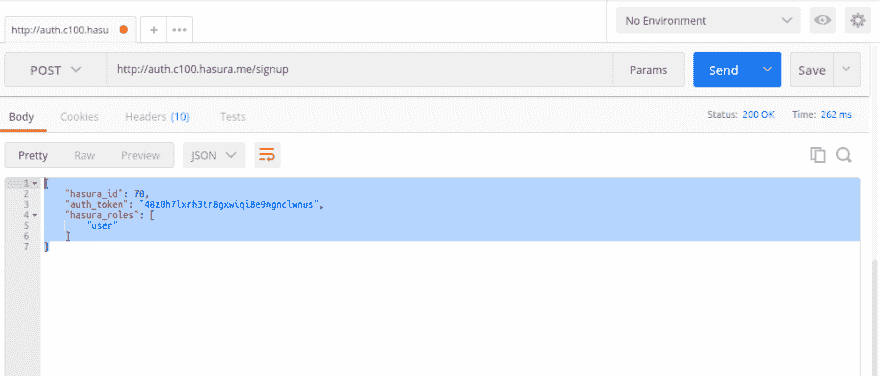

# Postman，开发者的主要工具

> 原文:[https://dev.to/sroy8091/postman-a-major-tool-for-developers](https://dev.to/sroy8091/postman-a-major-tool-for-developers)

## HasuraDB 如何工作

Hasura 为数据查询和授权查询都提供了 API。HasuraDB 是在 postgres 中实现的，我们可以在 json 中查询 RDBMS。这在不牺牲安全性的情况下节省了大量后端开发时间。因此，为了测试这些端点，我们需要 JSON 中的查询。

例如，对于 sql 中的选择查询

```
SELECT code_text FROM code WHERE private=false; 
```

这是一个查询，用于从包含我的应用程序 [snipcode](http://app.snipcode.hasura.me) 的代码片段的表中选择所有非私有的代码。这将在 json 中像这样被查询

```
{  "type":  "select",  "args":  {  "table":  "code",  "columns":["code_text"],  "where":  {"private":"false"}  }  } 
```

## 邮递员在工作

邮递员的角色来了，这是一个测试 API 端点的好工具。对于我的应用程序，我必须测试端点的数据和身份验证。让我们在 postman 中执行上面的查询

[T2】](https://res.cloudinary.com/practicaldev/image/fetch/s--DIqnL5Jg--/c_limit%2Cf_auto%2Cfl_progressive%2Cq_auto%2Cw_880/https://thepracticaldev.s3.amazonaws.com/i/r9w955y9syjkr3tsat6s.png)

这是上面邮差里的查询。有一个用于选择方法(GET、POST、PUT 等)的下拉菜单，然后是 API 的 URL 的 URL 框。基本的设置是设置适当的标题和正文。在这种情况下，正如我们从 hasura [docs](https://docs.hasura.io) 中了解到的，在头中我们必须传递两个参数

```
 "Authorization": "Bearer xxxxxxxxxxxxxxxx"
 "Content-Type": "application/json" 
```

并要求发布请求。

[T2】](https://res.cloudinary.com/practicaldev/image/fetch/s--IybgDMHz--/c_limit%2Cf_auto%2Cfl_progressive%2Cq_auto%2Cw_880/https://thepracticaldev.s3.amazonaws.com/i/0ufw6amcmoc9xihjerbl.png)

在 body 中，我们将选择原始输入，然后将上面相同的查询复制到那里。作为对这个查询的响应，我们得到了一个 json 对象，它可以再次在我们的网站上使用。回应是这样的

[T2】](https://res.cloudinary.com/practicaldev/image/fetch/s--SiKYwn3T--/c_limit%2Cf_auto%2Cfl_progressive%2Cq_auto%2Cw_880/https://thepracticaldev.s3.amazonaws.com/i/w3v3o7mlmbv016es2gog.png)

我们也可以通过 postman 测试身份验证 API，但 URL 会有所不同。对于数据 API 的端点是 [http://data](http://data) ..hasura.io/v1/query，但是对于 auth API 的端点是 [https://auth](https://auth) ..您可以在项目控制台的管理部分找到它们。

[T2】](https://res.cloudinary.com/practicaldev/image/fetch/s--dcVwkMNz--/c_limit%2Cf_auto%2Cfl_progressive%2Cq_auto%2Cw_880/https://thepracticaldev.s3.amazonaws.com/i/ub1uzmpq6tvcqdlrrvt2.png)

[T2】](https://res.cloudinary.com/practicaldev/image/fetch/s--0qUGpTGl--/c_limit%2Cf_auto%2Cfl_progressive%2Cq_auto%2Cw_880/https://thepracticaldev.s3.amazonaws.com/i/ewv60pn64f8qm3qdnsjc.png)

同样，我们必须设置 header 和 in request，但这次我们只需传递一个
header。

```
"Content-Type": "application/json" 
```

假设我们想在这里注册。因此，最低要求是用户名和密码。所以我们会在体内传递这些。

```
{  "username":  "postman",  "password":  "nosneaking"  } 
```

并且 url 将是 [https://auth](https://auth) ..hasura.io/signup.

[T2】](https://res.cloudinary.com/practicaldev/image/fetch/s--u8-5RT32--/c_limit%2Cf_auto%2Cfl_progressive%2Cq_auto%2Cw_880/https://thepracticaldev.s3.amazonaws.com/i/65kuz8lnom2or3ts2cou.png)

从服务器上我们得到了这样的响应

```
{  "hasura_id":  70,  "auth_token":  "48z0h7lxrh3tr8gxwiqi8e9ngnclwnus",  "hasura_roles":  [  "user"  ]  } 
```

[T2】](https://res.cloudinary.com/practicaldev/image/fetch/s--VbJxC9-N--/c_limit%2Cf_auto%2Cfl_progressive%2Cq_auto%2Cw_880/https://thepracticaldev.s3.amazonaws.com/i/6fuxvthspp1r8d36uvu0.png)

我们可以使用这个 json 响应来设置 cookies，以便为这个用户做进一步的数据查询。同样，对于登录，我们也可以在 postman 中测试端点。

这里是我的邮差查询的[链接](https://www.getpostman.com/collections/cce1cc84de0d8d45cc37)，它将提供关于什么样的查询可以完成的洞察。

*这里是关于这一系列 snipcode 开发的所有帖子的索引*

[第一部分:App Idea](https://dev.to/sroy8091/app-idea-for-hasura-internship)
[第二部分:App 原型](https://dev.to/sroy8091/app-prototype)
[第三部分:本地开发](https://dev.to/sroy8091/hasura-local-development)
[第四部分:G for Git](https://dev.to/sroy8091/g-for-git)
[第五部分:数据建模](https://dev.to/sroy8091/its-modeling-time)
[第六部分:Data&Auth API](https://dev.to/sroy8091/postman-a-major-tool-for-developers)
[第七部分:基本功能](https://dev.to/sroy8091/i-love-cookies-expressjscookies)
[第八部分:App 屏幕 1](https://dev.to/sroy8091/i-built-it-with-codemirror)
[第九部分](https://dev.to/sroy8091/app-screen-2)

| 喜欢我的帖子吗？ |
| --- |
| [T2】](https://ko-fi.com/A0A5WBC1) |